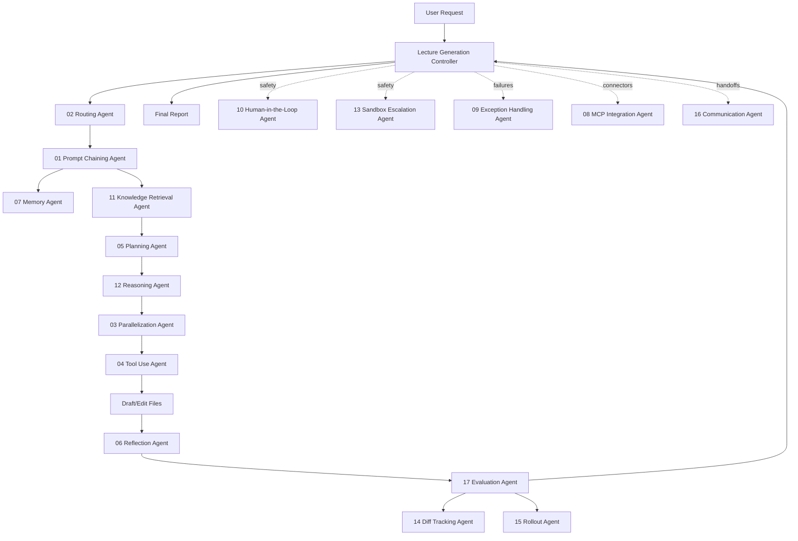

# 강의 제작 Multi-Agent System 설계

이 문서는 `docs/lecture-generation-principles.md`를 기준으로 강의를 생성하는 Codex용 agentic AI 구조를 설명한다. 실제 중앙 제어 프롬프트는 `.codex/prompts/lecture-generation-agent.md`이고, 챕터별 pattern agent는 `.codex/prompts/lecture-pattern-*.md`에 있다.

## 설계 수정

이 시스템은 단일 agent가 "강의 써줘"를 한 번에 처리하는 구조가 아니다. Codex Agentic Patterns의 챕터 구조를 기준으로 역할을 쪼개고, 중앙 controller가 각 agent의 결과를 체이닝하고 검증한다.

Codex Agentic Patterns는 prompt chaining을 "복잡한 작업을 순차적인 작은 작업으로 나누고 각 단계의 출력이 다음 단계의 입력이 되는 방식"으로 설명한다. Routing은 입력 의도와 상태에 따라 적절한 handler로 보내는 패턴이고, Complete Agent Example은 conversation manager, tool router, safety layer, error handler, persistence를 결합한 구조를 보여준다.

참고 자료:

- Codex Agentic Patterns: Home  
  https://artvandelay.github.io/codex-agentic-patterns/
- Chapter 1 - Prompt Chaining  
  https://artvandelay.github.io/codex-agentic-patterns/learning-material/01-prompt-chaining/
- Chapter 2 - Routing  
  https://artvandelay.github.io/codex-agentic-patterns/learning-material/02-routing/
- Chapter 3 - Parallelization  
  https://artvandelay.github.io/codex-agentic-patterns/learning-material/03-parallelization/
- Chapter 17 - Evaluation & Monitoring  
  https://artvandelay.github.io/codex-agentic-patterns/learning-material/20-evaluation-monitoring/
- Complete Agent Example  
  https://artvandelay.github.io/codex-agentic-patterns/learning-material/complete-agent-example/
- OpenAI Platform: Agents  
  https://platform.openai.com/docs/guides/agents
- OpenAI Platform: Agents SDK  
  https://platform.openai.com/docs/guides/agents-sdk/
- OpenAI Platform: Migrate to the Responses API  
  https://platform.openai.com/docs/guides/migrate-to-responses
- OpenAI Platform: Tools with Responses API  
  https://platform.openai.com/docs/guides/tools?api-mode=responses
- OpenAI Platform: Agent evals  
  https://platform.openai.com/docs/guides/agent-evals

Codex Agentic Patterns의 실제 페이지와 source path는 [Codex Agentic Patterns Source Map](./codex-agentic-patterns-source-map.md)을 기준으로 확인한다. `.md` raw URL은 추측하지 않는다.

## 전체 아키텍처



중앙 controller는 직접 모든 일을 하지 않는다. 각 gate에서 전문 agent를 호출하고, agent가 반환한 handoff packet을 모아 다음 단계의 입력으로 사용한다.

## 챕터별 Agent

| Chapter | Prompt | 역할 |
|---|---|---|
| 1 Prompt Chaining | `.codex/prompts/lecture-pattern-01-prompt-chaining.md` | 강의 제작을 순차 단계로 분해 |
| 2 Routing | `.codex/prompts/lecture-pattern-02-routing.md` | 요청을 full_lesson, review, research, visual 등으로 분류 |
| 3 Parallelization | `.codex/prompts/lecture-pattern-03-parallelization.md` | 독립 작업 병렬화 여부 결정 |
| 4 Tool Use | `.codex/prompts/lecture-pattern-04-tool-use.md` | 로컬 검색, 공식 문서, imagegen, shell, 검증 도구 선택 |
| 5 Planning | `.codex/prompts/lecture-pattern-05-planning.md` | 50분 교안 계획과 acceptance criteria 작성 |
| 6 Reflection | `.codex/prompts/lecture-pattern-06-reflection.md` | 초안 자기비판과 수정 요구 |
| 7 Memory Management | `.codex/prompts/lecture-pattern-07-memory.md` | `.omx/state/lecture-generation-agent.json` 상태 유지 |
| 8 MCP Integration | `.codex/prompts/lecture-pattern-08-mcp.md` | OpenAI docs, Figma, GitHub 등 connector 필요성 판단 |
| 9 Exception Handling | `.codex/prompts/lecture-pattern-09-exception.md` | 실패, retry, fallback, blocked 조건 정의 |
| 10 Human-in-the-Loop | `.codex/prompts/lecture-pattern-10-human-loop.md` | 사용자 승인이 필요한 결정만 분리 |
| 11 Knowledge Retrieval | `.codex/prompts/lecture-pattern-11-retrieval.md` | 원칙 문서, 커리큘럼, 기존 강의, 공식 문서 검색 |
| 12 Reasoning | `.codex/prompts/lecture-pattern-12-reasoning.md` | 개념 순서와 운영 판단 검토 |
| 13 Sandbox Escalation | `.codex/prompts/lecture-pattern-13-sandbox.md` | 권한, 네트워크, 파일시스템 제한 처리 |
| 14 Turn Diff Tracking | `.codex/prompts/lecture-pattern-14-diff.md` | 변경 파일과 범위 추적 |
| 15 Rollout System | `.codex/prompts/lecture-pattern-15-rollout.md` | 실행 기록, smoke test, replay note 관리 |
| 16 Inter-Agent Communication | `.codex/prompts/lecture-pattern-16-communication.md` | handoff packet schema와 merge protocol |
| 17 Evaluation & Monitoring | `.codex/prompts/lecture-pattern-17-evaluation.md` | 최종 pass/fail score와 monitoring note |

## Handoff Packet

각 pattern agent는 같은 형식으로 결과를 반환한다.

```yaml
agent:
route:
inputs_read:
outputs:
decisions:
risks:
requires_next:
pass_fail:
```

controller는 이 packet을 `.omx/state/lecture-generation-agent.json`에 누적한다. 다음 agent는 이전 packet을 입력으로 받아야 한다. 이 구조가 없으면 단순 역할 프롬프트 모음이지 agentic workflow가 아니다.

## Gate 기반 실행

1. Route Gate
   - 요청 의도를 분류한다.
   - target slot이 명확하지 않으면 `docs/plan.md`에서 추론한다.

2. Chain Gate
   - 필요한 pattern agent 순서를 확정한다.
   - 각 step의 입력과 출력 조건을 정한다.

3. Retrieval Gate
   - `docs/lecture-generation-principles.md`, `docs/lecture-tone.md`, `docs/plan.md`, 기존 lesson, glossary, 공식 문서를 읽는다.
   - 전문 실무, 평가, 발표, 비용, 보안, 운영 책임이 포함된 강의는 `docs/devops-academic-assessment-standards.md`와 공식 학술/인력 표준도 읽는다.

4. Planning Gate
   - lesson type, outline, required visuals, 실습, 검증 기준을 만든다.
   - lesson/README/assessment가 전문 실무와 연결되면 공식 표준 crosswalk를 포함한다.

5. Draft Gate
   - 계획과 retrieval 결과를 바탕으로만 파일을 작성한다.
   - 학술 근거는 장식용 링크가 아니라 학습목표, 활동, 산출물, 채점 증거에 연결한다.

6. Reflection Gate
   - 초안을 principle checklist와 academic/workforce standards 기준으로 비판하고 수정한다.

7. Evaluation Gate
   - pass/fail score를 낸다.
   - 실패하면 responsible agent로 되돌린다.

8. Rollout Gate
   - 상태 파일, diff, smoke test evidence를 남긴다.

## Evaluation 기준

최종 lesson은 다음 항목을 모두 통과해야 한다.

| 항목 | 기준 |
|---|---|
| curriculum fit | `docs/plan.md`의 주차/일차/교시 범위에 맞음 |
| source grounding | 공식 자료와 기존 강의 맥락에 근거함 |
| student-facing tone | 강사용 내부 스크립트가 없음 |
| contract tone | `docs/lecture-tone.md`의 신뢰 형성, 시간 준수, 경어, 불필요한 잡담/홍보/불평 금지, feedback 기준을 위반하지 않음 |
| 50-minute depth | 단순 목차가 아니라 실제 50분 수업 분량 |
| visual support | 각 lesson 본문에 2~3개 instructional visual block 포함 |
| practice/observation | 명령, 관찰, 판단 활동 포함 |
| failure recovery | 기대 결과와 실패 증상, 복구 방향 포함 |
| cost/security/operations | 비용, 보안, 운영 판단 포함 |
| academic/workforce standards | ABET, CS2023, NIST NICE, Bloom/formative assessment 중 관련 기준을 산출물과 평가 증거에 연결 |
| computing spine mapping | Docker, Kubernetes, AWS, Terraform, observability, networking, storage, configuration, identity/access, lifecycle 개념을 compute, memory, storage, network, process lifecycle, configuration, identity/access, observability, cost/resource boundary 중 하나 이상에 연결 |
| zero-to-run lab contract | Week 2 이후 기술 실습은 시작 상태, Linux/macOS 설치, 검증, 실행, 관찰, 실패 주입, 수정/재확인, cleanup, evidence table을 포함 |
| visual asset contract | 각 lesson 본문마다 imagegen, Mermaid, 공식 문서 이미지/다이어그램, 캡처 가이드 중 2~3개 instructional visual block을 포함하고, 각 visual의 학습 목적/읽는 순서/출처 또는 생성 방식을 명시 |
| path consistency | 참조한 local asset/file이 존재함 |
| state/diff tracking | 변경 파일과 상태 기록이 남음 |
| 90% quality gate | MIT 공대생 수준의 까다로운 학습자가 보아도 만족도 90% 이상을 기대할 수 있는 설명 깊이, 공식/학술 근거, 현업 판단, visual evidence, 실습 가능성을 갖춤 |

자세한 scoring contract는 [강의 제작 Agent Scoring Contract](./lecture-generation-scoring.md)를 따른다. 중앙 controller는 점수를 직접 채울 수 없고, Evaluation agent가 실제 파일을 읽고 증거 기반으로 채점해야 한다.

90% quality gate가 실패하면 pass가 아니다. controller는 responsible agent로 되돌리거나 Retrieval Gate까지 되돌려 공식 문서, 학교 강의자료, 공식 블로그, source pack을 다시 확인하고 재작성한다.

## 사용 예시

```text
/prompts:lecture-generation-agent
week2 day1 lesson-02를 multi-agent workflow로 생성하고 검증해줘.
```

controller는 내부적으로 다음 흐름을 수행한다.

```text
Routing -> Prompt Chaining -> Communication -> Memory -> Retrieval
-> Planning -> Reasoning -> Tool Use -> Draft
-> Reflection -> Evaluation -> Diff Tracking -> Rollout
```

병렬화가 가능한 경우에는 retrieval, visual prompt design, glossary impact scan 같은 독립 작업만 병렬화한다. draft, reflection, evaluation은 순서가 중요하므로 직렬로 실행한다.

## 현재 구현 상태

구현됨:

- 중앙 controller prompt
- 17개 chapter-based pattern agent prompt
- handoff packet schema
- state file schema
- evaluation pass criteria
- evidence-based scoring contract
- academic/workforce standards crosswalk
- sample smoke-test lesson: `week2/day1/lesson-01.md`

남은 확장:

- 각 pattern agent를 실제 `multi_agent_v1.spawn_agent`로 호출하는 운영 예시 축적
- eval 결과를 `.omx/state/lecture-generation-agent.json`에 점수 배열로 누적
- OpenAI Responses API 또는 Agents SDK 기반의 별도 실행 앱 구현
