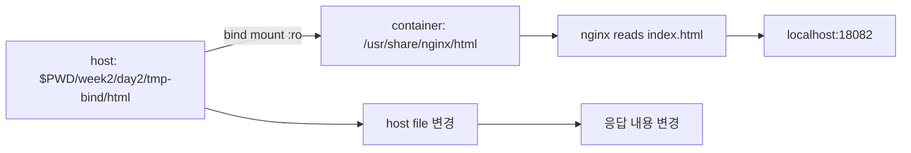
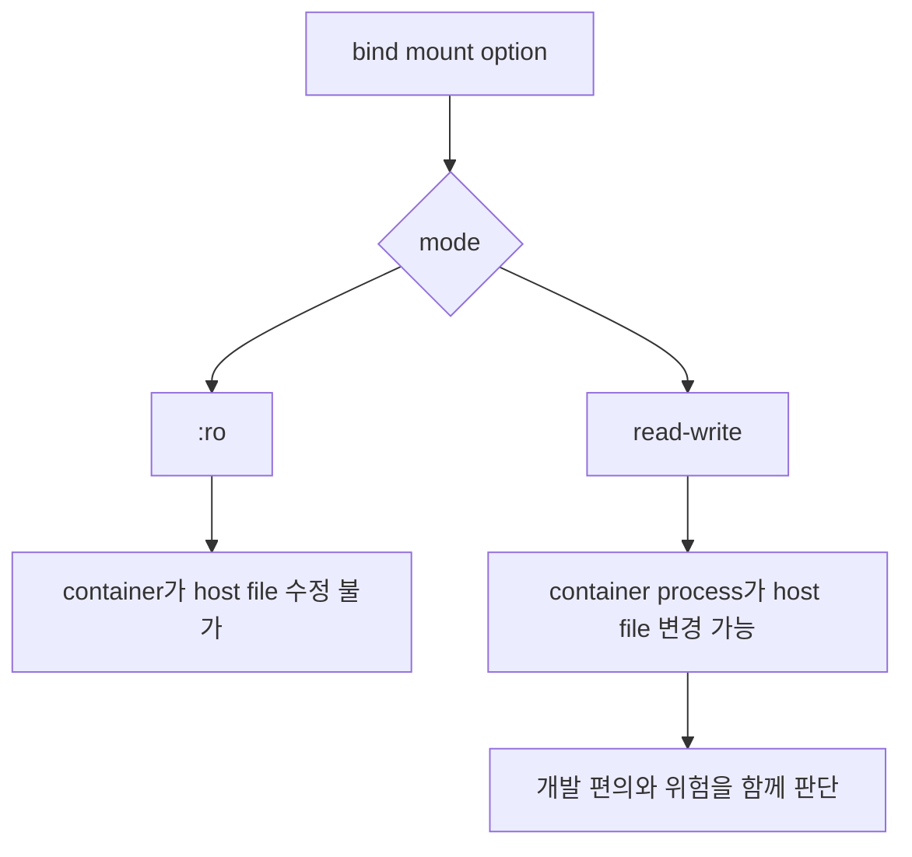

# 4교시: bind mount와 host path 주의

## 수업 목표
- bind mount와 named volume을 비교한다.
- host 파일 변경이 container 응답에 반영되는지 확인한다.
- read-only mount를 사용해 안전한 실습 기준을 만든다.

## 강의 전개
bind mount는 host filesystem을 container path에 직접 연결한다. 개발 중 HTML, config, script를 빠르게 바꿔 확인할 때 유용하지만, host path가 강하게 드러난다. macOS와 Linux의 path 차이, 권한 차이, read/write mode를 이해해야 한다.

이 교시는 설명만 듣고 지나가지 않는다. 명령은 반드시 code block으로 실행하고, 바로 이어서 검증 명령을 실행한다. 정상 출력이 다를 수 있는 부분은 전체 문자열을 외우지 않고 성공 패턴을 확인한다. 실패는 원인을 좁히는 단서다. 실패한 명령, 에러 요약, 가설, 다시 실행할 명령을 순서대로 다룬다.

## Imagegen 인포그래픽: bind mount host path


이 이미지는 host directory가 container 내부 path에 직접 연결되는 구조를 보여준다. `:ro` 표시는 container가 host file을 마음대로 바꾸지 못하게 하는 안전 경계로 읽는다.

## 시각 자료 1: bind mount 경로 연결


읽는 순서는 host 파일, container target path, nginx 응답이다. bind mount에서는 Docker가 data 위치를 숨기지 않고 host path를 그대로 container에 연결한다.

## 시각 자료 2: read-only 안전 경계


이 visual은 `:ro`가 단순 옵션이 아니라 host file 보호 경계라는 점을 보여준다. 개발 중에는 편의 때문에 read-write를 쓰더라도, 기본 실습은 read-only로 시작한다.

## 실습 명령
```bash
mkdir -p week2/day2/tmp-bind/html
printf "<h1>bind mount v1</h1>" > week2/day2/tmp-bind/html/index.html
docker run -d --name paperclip-bind-web -p 18082:80 -v "$PWD/week2/day2/tmp-bind/html:/usr/share/nginx/html:ro" nginx:alpine
```

```bash
printf "<h1>bind mount v2</h1>" > week2/day2/tmp-bind/html/index.html
```

## 검증 명령
```bash
curl -s http://localhost:18082
docker inspect paperclip-bind-web --format "{{ json .Mounts }}"
```

## 실습 확장 흐름
| 단계 | 할 일 | 기대되는 관찰 |
|---|---|---|
| 준비 | host에 `tmp-bind/html/index.html`을 만든다. | host file이 container 입력이 된다. |
| 실행 | nginx container에 host directory를 `:ro`로 mount한다. | 브라우저나 curl에서 v1 내용이 보인다. |
| 변경 | host file을 v2로 바꾼다. | container 재빌드 없이 응답이 바뀐다. |
| 실패 재현 | source path를 일부러 틀린 경로로 바꿔 본다. | 기본 nginx page 또는 예상과 다른 응답이 나올 수 있다. |
| 복구 | source path와 `$PWD`를 확인하고 다시 실행한다. | host file 내용이 다시 응답에 반영된다. |
| 확인 | `docker inspect ... .Mounts`로 source, destination, mode를 본다. | bind mount와 named volume의 차이를 설명할 수 있다. |

## 실패 드릴과 오해 교정
| 상황 | 해석 |
|---|---|
| host path가 틀림 | container는 뜨지만 expected file이 보이지 않을 수 있다. |
| :ro를 빼먹음 | container 쪽에서 host file을 수정할 위험이 생긴다. |
| Windows/mac path 문제 | Docker Desktop file sharing/path permission을 확인한다. |

## Cleanup
```bash
docker stop paperclip-bind-web || true
docker rm paperclip-bind-web || true
rm -rf week2/day2/tmp-bind
```

Cleanup은 비용과 데이터 안전을 동시에 다룬다. container를 지우는 명령과 volume/network/image를 지우는 명령은 의미가 다르다. 특히 volume 삭제는 database data 삭제일 수 있으므로 실습 volume인지 확인한 뒤 실행한다.

## 주의할 점
- Container를 삭제해도 named volume의 데이터는 남을 수 있다. 데이터를 초기화하려는 것이 아니라면 `docker volume rm`이나 `down -v`를 실행하지 않는다.
- Host port publish(`-p`)와 container 간 통신은 다른 문제다. 브라우저나 host `psql`로 접근할 때만 host port가 필요하고, 같은 Docker network 안에서는 container name과 container port를 사용한다.
- Volume target path는 image가 실제로 데이터를 쓰는 경로와 맞아야 한다. PostgreSQL은 `/var/lib/postgresql/data`와 `PGDATA` 설정을 확인하지 않으면 데이터가 남지 않거나 엉뚱한 위치에 쌓인다.
- bind mount는 host 경로를 그대로 노출한다. 개인 경로, 권한 문제, 실수로 수정한 host 파일이 container 동작에 영향을 줄 수 있다.
- Cleanup 전에는 지금 지우는 대상이 container인지, volume인지, network인지 먼저 구분한다.

## 핵심 포인트
이 실습의 핵심은 명령어 자체가 아니라 경계다. container는 실행 단위이고, volume은 data lifecycle이며, network는 통신 경계다. 학생이 `docker run` 한 줄을 볼 때 `-v`, `--network`, `-p`를 옵션 목록으로 외우면 뒤에서 Compose와 Kubernetes로 넘어갈 때 같은 혼란이 반복된다. 그래서 각 옵션을 "무엇을 container 밖으로 분리하는가"라는 질문으로 읽게 한다.

강의 중에는 성공 출력보다 실패 출력의 의미를 더 오래 다룬다. port가 열리지 않은 것은 web server 문제가 아닐 수 있고, DB 접속 실패는 password 문제가 아니라 network boundary 문제일 수 있다. host terminal, container 내부, 같은 Docker network의 client container는 모두 서로 다른 관찰 위치다. 학생이 어디에서 명령을 실행하는지 말로 먼저 설명한 뒤 CLI를 실행하게 한다.

## 운영 해석
실무에서 database container를 다룰 때 가장 위험한 실수는 cleanup을 단순 파일 정돈처럼 보는 것이다. container 삭제는 process와 container writable layer를 없애는 것이고, volume 삭제는 data를 삭제하는 것이다. network 삭제는 통신 경로를 없애는 것이다. 이 세 가지를 구분하지 않으면 실습은 성공해도 운영 사고를 배운 셈이 된다.

운영에서는 "실행됐다"보다 어떤 data가 남고 무엇이 삭제되는지가 더 중요하다. Day 2의 storage/network 판단은 Day 5 Compose에서 `volumes`와 `networks`를 읽는 기준이 된다. Compose의 YAML 항목은 갑자기 생긴 문법이 아니라 Day 2에서 손으로 실행한 storage/network 결정을 파일로 옮긴 것이다.

## 혼자 다시 따라오기
최소 성공 경로는 host file 생성, nginx 실행, curl 확인, host file 변경, curl 재확인이다. 응답이 바뀌지 않으면 `$PWD`가 repo root인지, mount source가 실제 파일을 포함하는 directory인지, container를 새로 띄울 때 기존 이름 충돌이 없는지 확인한다.

## 다음 연결
다음 교시는 storage에서 network로 넘어간다. host port 공개와 container 간 통신은 다른 문제다.
