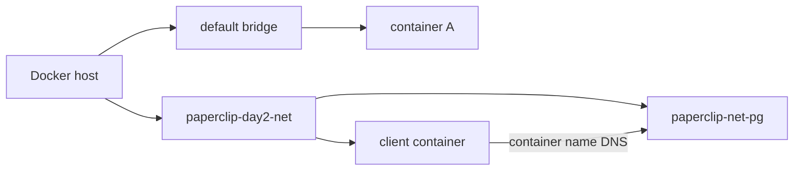
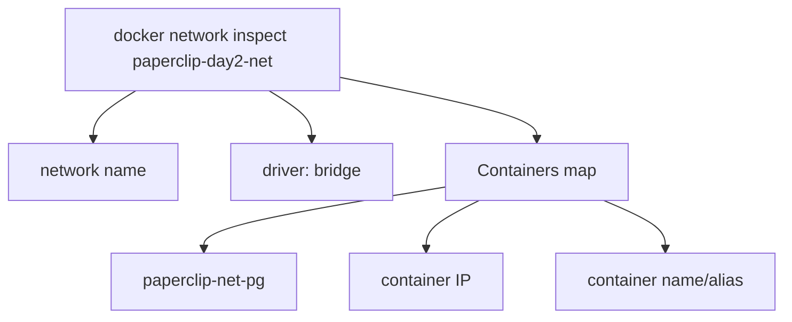

# 5교시: Docker network 기본

## 수업 목표
- default bridge와 custom bridge를 구분한다.
- network ls/inspect/connect/disconnect 명령을 사용한다.
- container가 어떤 network에 붙었는지 확인한다.

## 강의 전개
Docker network는 container들이 서로 통신하는 공간이다. host에서 접속하려면 port publish가 필요하지만, 같은 Docker network 안의 container끼리는 container name으로 통신할 수 있다. Compose를 배우기 전에 이 감각을 CLI로 먼저 잡아야 한다.

이 교시는 설명만 듣고 지나가지 않는다. 명령은 반드시 code block으로 실행하고, 바로 이어서 검증 명령을 실행한다. 정상 출력이 다를 수 있는 부분은 전체 문자열을 외우지 않고 성공 패턴을 확인한다. 실패는 원인을 좁히는 단서다. 실패한 명령, 에러 요약, 가설, 다시 실행할 명령을 순서대로 다룬다.

## Imagegen 인포그래픽: custom bridge network


이 이미지는 default bridge와 custom bridge를 나누어 보여준다. `paperclip-day2-net` 안에 DB와 client가 함께 있어야 다음 교시의 container name DNS 실습이 성립한다.

## 시각 자료 1: default bridge와 custom bridge


이 그림은 network를 container가 들어가는 통신 공간으로 보여준다. Day 2에서는 기본 bridge를 암기하는 것보다, custom bridge에 같은 실습 container를 모아 이름 기반 통신을 준비하는 것이 중요하다.

## 시각 자료 2: network inspect에서 볼 것


읽는 순서는 network 이름, driver, 붙어 있는 container다. IP 자체를 외우기보다 어떤 container가 같은 network 안에 있는지를 확인하는 데 집중한다.

## 실습 명령
```bash
docker network ls
docker network create paperclip-day2-net
docker run -d --name paperclip-net-pg --network paperclip-day2-net -e POSTGRES_PASSWORD=postgres -v paperclip-pg16-data:/var/lib/postgresql/data postgres:16
```

## 검증 명령
```bash
docker network inspect paperclip-day2-net --format "{{ json .Containers }}"
docker ps --filter name=paperclip-net-pg
```

## 실습 확장 흐름
| 단계 | 할 일 | 기대되는 관찰 |
|---|---|---|
| 준비 | 기존 network 목록을 본다. | 기본 network와 사용자 생성 network를 구분한다. |
| 실행 | `paperclip-day2-net`을 만든다. | `docker network ls`에 custom bridge가 보인다. |
| 연결 | PostgreSQL container를 custom network에 붙여 실행한다. | inspect 결과에 container가 포함된다. |
| 실패 재현 | `--network` 없이 container를 띄워 본다. | default bridge에 붙어 custom network DNS 실습이 되지 않는다. |
| 복구 | container를 지우고 `--network paperclip-day2-net`으로 다시 실행한다. | 같은 network의 client가 접근할 준비가 된다. |
| 확인 | host port가 없어도 container는 실행 중임을 본다. | 내부 통신과 host 접근을 분리한다. |

## 실패 드릴과 오해 교정
| 상황 | 해석 |
|---|---|
| network 이름 중복 | 이미 있으면 재사용하거나 삭제 후 생성한다. |
| container가 default bridge에 있음 | --network 옵션 누락을 확인한다. |
| host port가 안 보임 | 같은 network 통신 실습이므로 publish하지 않은 것이 정상일 수 있다. |

## Cleanup
```bash
docker stop paperclip-net-pg || true
docker rm paperclip-net-pg || true
# network는 다음 교시에서 재사용
```

Cleanup은 비용과 데이터 안전을 동시에 다룬다. container를 지우는 명령과 volume/network/image를 지우는 명령은 의미가 다르다. 특히 volume 삭제는 database data 삭제일 수 있으므로 실습 volume인지 확인한 뒤 실행한다.

## 주의할 점
- Container를 삭제해도 named volume의 데이터는 남을 수 있다. 데이터를 초기화하려는 것이 아니라면 `docker volume rm`이나 `down -v`를 실행하지 않는다.
- Host port publish(`-p`)와 container 간 통신은 다른 문제다. 브라우저나 host `psql`로 접근할 때만 host port가 필요하고, 같은 Docker network 안에서는 container name과 container port를 사용한다.
- Volume target path는 image가 실제로 데이터를 쓰는 경로와 맞아야 한다. PostgreSQL은 `/var/lib/postgresql/data`와 `PGDATA` 설정을 확인하지 않으면 데이터가 남지 않거나 엉뚱한 위치에 쌓인다.
- bind mount는 host 경로를 그대로 노출한다. 개인 경로, 권한 문제, 실수로 수정한 host 파일이 container 동작에 영향을 줄 수 있다.
- Cleanup 전에는 지금 지우는 대상이 container인지, volume인지, network인지 먼저 구분한다.

## 핵심 포인트
이 실습의 핵심은 명령어 자체가 아니라 경계다. container는 실행 단위이고, volume은 data lifecycle이며, network는 통신 경계다. 학생이 `docker run` 한 줄을 볼 때 `-v`, `--network`, `-p`를 옵션 목록으로 외우면 뒤에서 Compose와 Kubernetes로 넘어갈 때 같은 혼란이 반복된다. 그래서 각 옵션을 "무엇을 container 밖으로 분리하는가"라는 질문으로 읽게 한다.

강의 중에는 성공 출력보다 실패 출력의 의미를 더 오래 다룬다. port가 열리지 않은 것은 web server 문제가 아닐 수 있고, DB 접속 실패는 password 문제가 아니라 network boundary 문제일 수 있다. host terminal, container 내부, 같은 Docker network의 client container는 모두 서로 다른 관찰 위치다. 학생이 어디에서 명령을 실행하는지 말로 먼저 설명한 뒤 CLI를 실행하게 한다.

## 운영 해석
실무에서 database container를 다룰 때 가장 위험한 실수는 cleanup을 단순 파일 정돈처럼 보는 것이다. container 삭제는 process와 container writable layer를 없애는 것이고, volume 삭제는 data를 삭제하는 것이다. network 삭제는 통신 경로를 없애는 것이다. 이 세 가지를 구분하지 않으면 실습은 성공해도 운영 사고를 배운 셈이 된다.

운영에서는 "실행됐다"보다 어떤 data가 남고 무엇이 삭제되는지가 더 중요하다. Day 2의 storage/network 판단은 Day 5 Compose에서 `volumes`와 `networks`를 읽는 기준이 된다. Compose의 YAML 항목은 갑자기 생긴 문법이 아니라 Day 2에서 손으로 실행한 storage/network 결정을 파일로 옮긴 것이다.

## 혼자 다시 따라오기
최소 성공 경로는 network 생성, DB container 실행, network inspect 확인이다. inspect 결과에 container가 없으면 container를 어느 network에 붙였는지부터 확인한다. host port가 없다고 실패로 보지 말고, 이 교시는 내부 통신 준비 단계라는 점을 먼저 본다.

## 다음 연결
다음 교시는 같은 network 안에서 client container가 PostgreSQL container 이름으로 접속하는지 확인한다.
