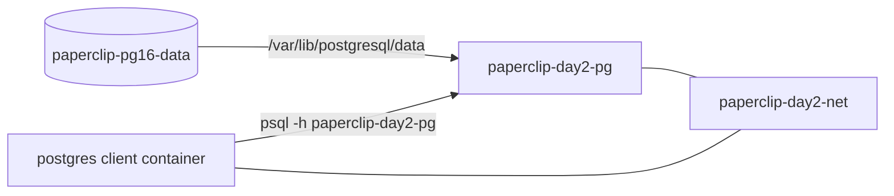

# 8교시: storage/network 통합 실험

## 수업 목표
- volume과 network를 함께 쓰는 PostgreSQL 실습을 완성한다.
- 데이터 보존과 DNS 접속을 한 번에 검증한다.
- cleanup audit을 수행한다.

## 강의 전개
Day 2 마지막 교시는 전체를 합친다. PostgreSQL container는 named volume을 사용하고 custom network에 붙는다. client container는 host port 없이 network DNS로 접속한다. container를 교체해도 data가 살아있는지 확인한 뒤 무엇을 지우고 무엇을 남길지 결정한다.

이 교시는 설명만 듣고 지나가지 않는다. 명령은 반드시 code block으로 실행하고, 바로 이어서 검증 명령을 실행한다. 정상 출력이 다를 수 있는 부분은 전체 문자열을 외우지 않고 성공 패턴을 확인한다. 실패는 원인을 좁히는 단서다. 실패한 명령, 에러 요약, 가설, 다시 실행할 명령을 순서대로 다룬다.

## Imagegen 인포그래픽: storage/network 통합 구조


이 이미지는 Day 2의 결론을 한 장으로 묶는다. PostgreSQL container는 named volume으로 data lifecycle을 분리하고, custom network로 client container와 통신한다.

## 시각 자료 1: storage와 network 통합 구조


이 그림은 Day 2의 결론이다. volume은 data lifecycle을 분리하고, network는 통신 경계를 만든다. DB container는 두 경계 위에서 실행된다.

## 시각 자료 2: 통합 실패 분석 흐름
```mermaid
flowchart TD
  Fail[SELECT 실패] --> Table{table이 있는가}
  Table -->|없음| Schema[table 생성 여부 확인]
  Table -->|있음| Mount{volume target 맞는가}
  Mount -->|아님| FixMount[/var/lib/postgresql/data로 수정]
  Mount -->|맞음| Net{client와 DB가 같은 network인가}
  Net -->|아님| FixNet[--network paperclip-day2-net]
  Net -->|맞음| Host[container name, password, readiness 확인]
```

통합 실습에서 실패하면 한 번에 모든 것을 의심하지 않는다. schema, volume mount, network, readiness 순서로 좁히면 복구가 빨라진다.

## 실습 명령
```bash
docker run -d --name paperclip-day2-pg --network paperclip-day2-net -e POSTGRES_PASSWORD=postgres -v paperclip-pg16-data:/var/lib/postgresql/data postgres:16
```

```bash
docker run --rm --network paperclip-day2-net -e PGPASSWORD=postgres postgres:16 psql -h paperclip-day2-pg -U postgres -d paperclip -c "INSERT INTO notes(body) VALUES ('day2 integrated persistence'); SELECT * FROM notes;"
```

## 검증 명령
```bash
docker stop paperclip-day2-pg
docker rm paperclip-day2-pg
docker run -d --name paperclip-day2-pg-v2 --network paperclip-day2-net -e POSTGRES_PASSWORD=postgres -v paperclip-pg16-data:/var/lib/postgresql/data postgres:16
docker run --rm --network paperclip-day2-net -e PGPASSWORD=postgres postgres:16 psql -h paperclip-day2-pg-v2 -U postgres -d paperclip -c "SELECT * FROM notes;"
```

## 실습 확장 흐름
| 단계 | 할 일 | 기대되는 관찰 |
|---|---|---|
| 준비 | volume과 network가 존재하는지 본다. | 둘 중 하나가 없으면 먼저 만든다. |
| 실행 | DB container를 volume과 network에 동시에 연결한다. | container가 실행되고 DB readiness가 준비된다. |
| 변경 | client container로 row를 insert한다. | SQL 결과에 새 row가 보인다. |
| 실패 재현 | DB container를 삭제하고 다시 만든다. | container는 바뀌지만 volume data는 남는다. |
| 복구 | 같은 volume과 network로 v2 container를 실행한다. | client가 v2 이름으로 다시 접속한다. |
| 확인 | cleanup에서 network와 volume의 삭제 의미를 구분한다. | volume 삭제는 data 삭제라는 결론을 유지한다. |

## 실패 드릴과 오해 교정
| 상황 | 해석 |
|---|---|
| SELECT가 실패 | table 생성 여부와 volume mount path를 확인한다. |
| network DNS 실패 | client와 DB가 같은 network인지 inspect한다. |
| cleanup 과잉 | volume rm은 Day 2에서 만든 database data를 지울 수 있다. |

## Cleanup
```bash
docker stop paperclip-day2-pg-v2 || true
docker rm paperclip-day2-pg-v2 || true
docker network rm paperclip-day2-net || true
# volume은 Day 5 Compose에서 재사용할 수 있으므로 기본적으로 남긴다.
# docker volume rm paperclip-pg16-data
```

Cleanup은 비용과 데이터 안전을 동시에 다룬다. container를 지우는 명령과 volume/network/image를 지우는 명령은 의미가 다르다. 특히 volume 삭제는 database data 삭제일 수 있으므로 실습 volume인지 확인한 뒤 실행한다.

## 주의할 점
- Container를 삭제해도 named volume의 데이터는 남을 수 있다. 데이터를 초기화하려는 것이 아니라면 `docker volume rm`이나 `down -v`를 실행하지 않는다.
- Host port publish(`-p`)와 container 간 통신은 다른 문제다. 브라우저나 host `psql`로 접근할 때만 host port가 필요하고, 같은 Docker network 안에서는 container name과 container port를 사용한다.
- Volume target path는 image가 실제로 데이터를 쓰는 경로와 맞아야 한다. PostgreSQL은 `/var/lib/postgresql/data`와 `PGDATA` 설정을 확인하지 않으면 데이터가 남지 않거나 엉뚱한 위치에 쌓인다.
- bind mount는 host 경로를 그대로 노출한다. 개인 경로, 권한 문제, 실수로 수정한 host 파일이 container 동작에 영향을 줄 수 있다.
- Cleanup 전에는 지금 지우는 대상이 container인지, volume인지, network인지 먼저 구분한다.

## 핵심 포인트
이 실습의 핵심은 명령어 자체가 아니라 경계다. container는 실행 단위이고, volume은 data lifecycle이며, network는 통신 경계다. 학생이 `docker run` 한 줄을 볼 때 `-v`, `--network`, `-p`를 옵션 목록으로 외우면 뒤에서 Compose와 Kubernetes로 넘어갈 때 같은 혼란이 반복된다. 그래서 각 옵션을 "무엇을 container 밖으로 분리하는가"라는 질문으로 읽게 한다.

강의 중에는 성공 출력보다 실패 출력의 의미를 더 오래 다룬다. port가 열리지 않은 것은 web server 문제가 아닐 수 있고, DB 접속 실패는 password 문제가 아니라 network boundary 문제일 수 있다. host terminal, container 내부, 같은 Docker network의 client container는 모두 서로 다른 관찰 위치다. 학생이 어디에서 명령을 실행하는지 말로 먼저 설명한 뒤 CLI를 실행하게 한다.

## 운영 해석
실무에서 database container를 다룰 때 가장 위험한 실수는 cleanup을 단순 파일 정돈처럼 보는 것이다. container 삭제는 process와 container writable layer를 없애는 것이고, volume 삭제는 data를 삭제하는 것이다. network 삭제는 통신 경로를 없애는 것이다. 이 세 가지를 구분하지 않으면 실습은 성공해도 운영 사고를 배운 셈이 된다.

운영에서는 "실행됐다"보다 어떤 data가 남고 무엇이 삭제되는지가 더 중요하다. Day 2의 storage/network 판단은 Day 5 Compose에서 `volumes`와 `networks`를 읽는 기준이 된다. Compose의 YAML 항목은 갑자기 생긴 문법이 아니라 Day 2에서 손으로 실행한 storage/network 결정을 파일로 옮긴 것이다.

## 구름 EXP 배움일기
수업 후 구름 EXP 배움일기에 오늘 공부한 내용을 남긴다. 간단한 메모 형태로 남겨도 되고, 블로그 형태로 정리해도 좋다.

- volume이 필요한 이유
- host path를 bind mount할 때 주의할 점
- container name DNS와 port publish의 차이
- cleanup에서 container, network, volume을 구분해야 하는 이유

## 혼자 다시 따라오기
최소 성공 경로는 volume 존재 확인, network 존재 확인, DB 실행, client insert, DB 교체, client select다. 실패하면 table/schema, volume target, network membership, DB readiness 순서로 확인한다. cleanup에서는 container와 network만 기본 삭제 대상으로 두고 volume은 의도적으로 남긴다.

## 다음 연결
Day 3는 image와 Dockerfile로 넘어간다. Day 2는 실행된 container의 data와 network를 다뤘고, Day 3는 그 container의 출발점인 image를 직접 만든다.
