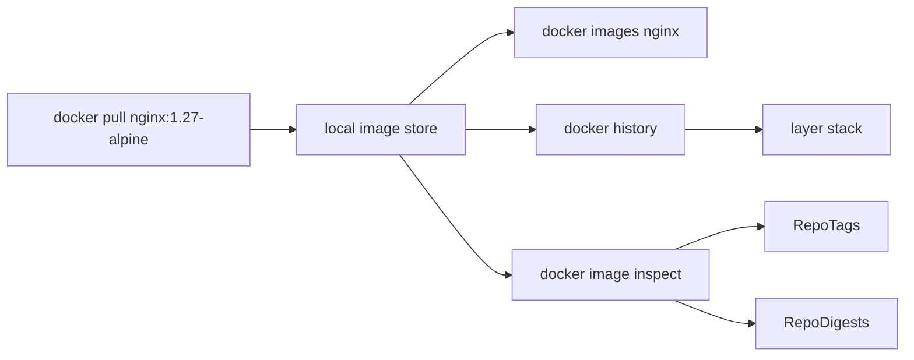
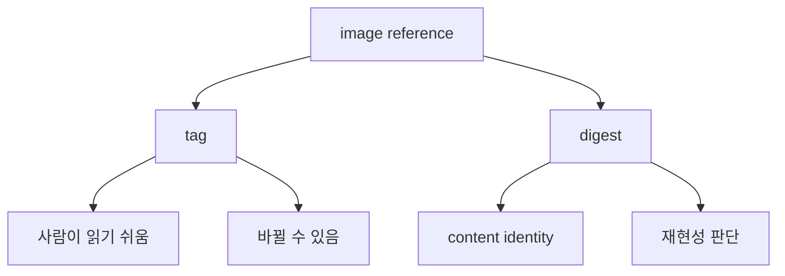

# 1교시: Day 2 요약과 image, layer, tag, digest


## 수업 목표
- Day 2의 storage/network 핵심을 10분 정도 다시 연결한다.
- pull한 image를 `images`, `history`, `inspect`로 읽는다.
- tag와 digest의 차이를 재현성 관점으로 구분한다.

## 강의 전개
Day 2에서는 container가 data와 network를 직접 소유하지 않도록 volume과 custom network를 분리했다. Day 3는 그 container의 출발점인 image를 다룬다. 지금까지는 official image를 가져와 실행했다면, 오늘은 image를 읽고, 직접 만들고, tag와 registry로 전달 가능한 artifact로 다룬다.

image는 여러 layer가 쌓인 읽기 전용 실행 재료다. tag는 사람이 붙인 이름표이고, digest는 image content에 가까운 식별자다. `nginx:1.27-alpine` 같은 tag는 기억하기 쉽지만 tag 자체가 영원히 같은 content를 보장하는 것은 아니다. 그래서 image를 운영 재료로 다룰 때는 `docker history`, `docker image inspect`, digest 확인이 필요하다.

이 교시는 명령을 실행하고 바로 관찰한다. 출력 전체를 외우지 않고 image ID, architecture, size, repo tag, repo digest처럼 의미 있는 항목을 구분한다. 실패는 원인을 좁히는 단서다. pull 실패, tag 오해, digest 누락을 각각 다른 문제로 본다.

## Imagegen 인포그래픽: image, layer, tag, digest


이 이미지는 image를 layer stack으로 보고 tag와 digest를 분리해 읽는 법을 보여준다. 오른쪽의 `docker history`와 `docker inspect`는 image를 실행하기 전에도 artifact의 구조와 식별자를 확인할 수 있음을 설명한다.

## 시각 자료 1: image 식별 흐름


이 도식은 image를 container 실행 전에도 분석할 수 있다는 점을 보여준다. `images`는 목록, `history`는 layer 생성 흔적, `inspect`는 세부 metadata를 본다.

## 시각 자료 2: tag와 digest 판단


tag는 수업과 협업에서 편리하고, digest는 같은 image를 다시 가져와야 할 때 중요하다. 둘 중 하나만 외우는 것이 아니라 목적에 따라 같이 읽는다.

## 실습 명령
```bash
docker pull nginx:1.27-alpine
docker images nginx
docker history nginx:1.27-alpine
```

## 검증 명령
```bash
docker image inspect nginx:1.27-alpine --format "{{.Id}} {{.Architecture}} {{.Size}}"
docker image inspect nginx:1.27-alpine --format "{{json .RepoTags}} {{json .RepoDigests}}"
```

## 실습 확장 흐름
| 단계 | 할 일 | 기대되는 관찰 |
|---|---|---|
| 준비 | Day 2 volume/network와 Day 3 image의 역할을 구분한다. | image는 실행 재료이고 volume/network는 실행 조건이다. |
| 실행 | `nginx:1.27-alpine`을 pull한다. | local image 목록에 nginx가 보인다. |
| 관찰 | `history`와 `inspect`를 실행한다. | layer, architecture, size, tag, digest가 보인다. |
| 실패 재현 | 존재하지 않는 tag를 pull해 본다. | manifest 관련 실패가 나온다. |
| 복구 | 공식 tag 목록 기준으로 다시 pull한다. | 올바른 tag로 image가 내려온다. |
| 확인 | tag와 digest를 분리해 말한다. | 이름표와 content 식별자를 구분한다. |

## 실패 드릴과 오해 교정
| 상황 | 해석 |
|---|---|
| pull 실패 | tag 오타, network, registry 접근 문제를 나누어 본다. |
| history에 `<missing>`이 보임 | layer 표시 방식일 수 있으며 곧바로 오류로 보지 않는다. |
| digest가 비어 보임 | pull 방식과 platform, local metadata 표시를 다시 본다. |

## Cleanup
```bash
# nginx image는 뒤 실습에서도 비교용으로 쓸 수 있으므로 기본적으로 남긴다.
# docker image rm nginx:1.27-alpine
```

## 주의할 점
- `latest`는 고정 version이 아니다. 재현이 필요한 수업/운영에서는 명시적 version tag나 digest를 함께 본다.
- `docker history`의 layer 목록은 image 내부 구조를 이해하는 단서지만, 모든 세부 파일을 보여주는 명령은 아니다.
- image를 지우는 명령은 container를 지우는 명령과 다르다. 실행 중인 container가 쓰는 image는 바로 삭제되지 않을 수 있다.
- digest는 길고 불편하지만 같은 content를 다시 가져오기 위한 중요한 식별자다.

## 핵심 포인트
Day 3의 첫 질문은 "내가 실행한 것은 정확히 어떤 artifact인가"다. Docker image는 압축 파일 하나처럼 보이지만 실제로는 layer가 쌓인 실행 재료이며, tag와 digest는 그 image를 가리키는 서로 다른 방식이다.

Day 2에서 container의 data와 network 경계를 분리했다면, Day 3에서는 container의 출발점인 image를 분해해서 읽는다. 이 흐름을 이해해야 Dockerfile build, cache, registry, push/pull이 단순 명령어가 아니라 artifact 관리 과정으로 보인다.

## 혼자 다시 따라오기
최소 성공 경로는 `docker pull`, `docker images`, `docker history`, `docker image inspect`다. pull이 실패하면 tag 철자와 공식 image tag를 먼저 확인한다. inspect 출력이 길면 `.Id`, `.Architecture`, `.Size`, `.RepoTags`, `.RepoDigests`만 먼저 본다.

## 다음 연결
다음 교시는 Dockerfile을 읽는다. image가 어떤 layer로 구성되는지 봤으니, 이제 그 layer를 만드는 규칙을 확인한다.
