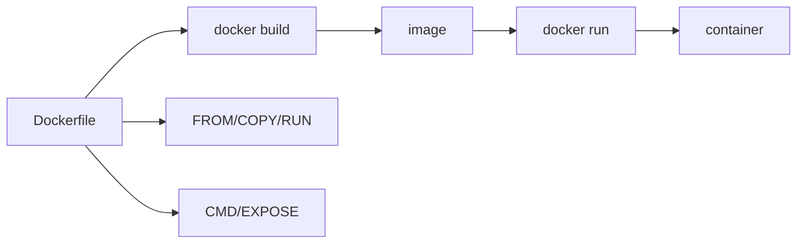
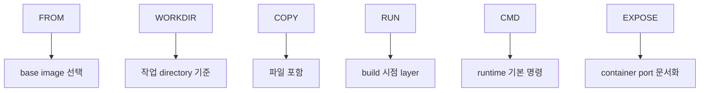

# 2교시: Dockerfile 기본 문법

## 수업 목표
- `FROM`, `WORKDIR`, `COPY`, `RUN`, `CMD`, `EXPOSE`의 역할을 구분한다.
- Dockerfile instruction이 image layer와 runtime default에 미치는 영향을 설명한다.
- `EXPOSE`와 `docker run -p`를 혼동하지 않는다.

## 강의 전개
Dockerfile은 image를 만드는 규칙이다. shell script처럼 위에서 아래로 실행되는 느낌이 있지만, 결과는 container가 아니라 image다. `FROM`은 출발 image를 고르고, `WORKDIR`은 이후 명령의 기준 directory를 잡고, `COPY`는 build context의 파일을 image 안으로 넣는다. `RUN`은 build 시점에 실행되어 layer를 만들고, `CMD`는 container 실행 시 기본 명령이 된다. `EXPOSE`는 image가 어떤 port를 사용한다는 문서화 정보에 가깝고 host port를 열어주지는 않는다.

이 교시는 Dockerfile 한 줄마다 "언제 실행되는가"와 "image에 무엇을 남기는가"를 묻는다. build 시점과 run 시점을 구분하지 못하면 `RUN`, `CMD`, `EXPOSE`, `-p`가 계속 섞인다.

## Imagegen 인포그래픽: Dockerfile instruction map


이 이미지는 Dockerfile의 각 instruction이 image 생성 규칙인지, runtime default인지, port 문서화인지 구분하게 한다. 특히 `CMD`와 `EXPOSE`는 build 결과에 포함되지만 host 접속을 직접 열지는 않는다.

## 시각 자료 1: build 시점과 run 시점


Dockerfile은 build input이다. `docker build`가 image를 만들고, `docker run`이 그 image로 container를 만든다.

## 시각 자료 2: instruction 역할


이 표식은 "어떤 instruction이 언제 의미를 갖는가"를 빠르게 확인하는 지도다.

## 실습 명령
```bash
mkdir -p week2/day3/labs/static-site
printf "<h1>day3 static app</h1>" > week2/day3/labs/static-site/index.html
cat > week2/day3/labs/static-site/Dockerfile <<'EOF'
FROM nginx:1.27-alpine
WORKDIR /usr/share/nginx/html
COPY index.html ./index.html
EXPOSE 80
CMD ["nginx", "-g", "daemon off;"]
EOF
```

## 검증 명령
```bash
sed -n '1,120p' week2/day3/labs/static-site/Dockerfile
```

## 실습 확장 흐름
| 단계 | 할 일 | 기대되는 관찰 |
|---|---|---|
| 준비 | 표준 static app directory를 만든다. | build context가 생긴다. |
| 실행 | Dockerfile을 읽는다. | instruction 순서를 볼 수 있다. |
| 관찰 | `FROM`, `COPY`, `CMD`, `EXPOSE`를 분리한다. | build 시점과 run 시점이 나뉜다. |
| 실패 재현 | `COPY missing.html`처럼 없는 파일을 가정한다. | build가 COPY 단계에서 실패한다. |
| 복구 | 실제 존재하는 `index.html`을 COPY한다. | build 가능한 Dockerfile이 된다. |
| 확인 | `EXPOSE 80`만으로 host port가 열리지 않음을 말한다. | 다음 run 실습에서 `-p`가 필요함을 연결한다. |

## 실패 드릴과 오해 교정
| 상황 | 해석 |
|---|---|
| `RUN`과 `CMD` 혼동 | `RUN`은 build 시점, `CMD`는 container 실행 기본값이다. |
| `EXPOSE` 후 브라우저 접속 기대 | host port publish가 없으면 host에서 접근할 수 없다. |
| `COPY` 실패 | source path가 build context 안에 있는지 확인한다. |

## Cleanup
```bash
# 이 교시에서는 파일을 다음 build 실습에서 사용하므로 삭제하지 않는다.
```

## 주의할 점
- `COPY . .`는 편하지만 위험하다. 불필요한 파일과 secret이 image에 들어갈 수 있다.
- `WORKDIR`이 바뀌면 상대 경로 기준도 바뀐다. 이후 `COPY`, `RUN`, `CMD`의 경로를 같이 본다.
- `CMD`는 하나만 최종 기본 명령으로 남는다. 여러 개를 쓰면 마지막 의미만 남는다고 이해한다.
- `EXPOSE`는 문서화 성격이다. host에서 접속하려면 `docker run -p host:container`가 필요하다.

## 핵심 포인트
Dockerfile은 "container를 지금 실행하는 명령 묶음"이 아니라 "image를 만드는 규칙"이다. 그래서 같은 Dockerfile로 같은 source를 build하면 다른 사람이 같은 실행 재료를 만들 수 있다.

초급자는 Dockerfile을 길게 쓰는 데 집중하기 쉽지만, 운영에서는 어떤 파일이 들어갔는지, 어떤 명령이 build 시점에 실행됐는지, runtime 기본 명령이 무엇인지가 더 중요하다.

## 혼자 다시 따라오기
최소 성공 경로는 `index.html`과 Dockerfile을 만들고 instruction을 한 줄씩 설명하는 것이다. `COPY`가 실패할 것 같으면 build를 하기 전에 source file이 build context 안에 있는지 먼저 확인한다.

## 다음 연결
다음 교시는 build context와 `.dockerignore`를 다룬다. Dockerfile의 `COPY`가 어디까지 볼 수 있는지 확인한다.
