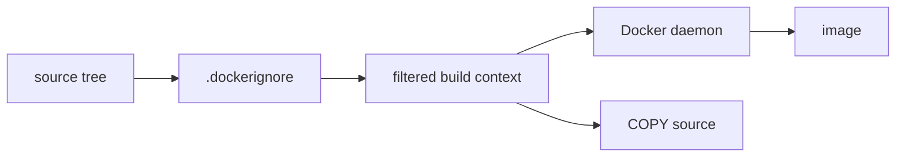
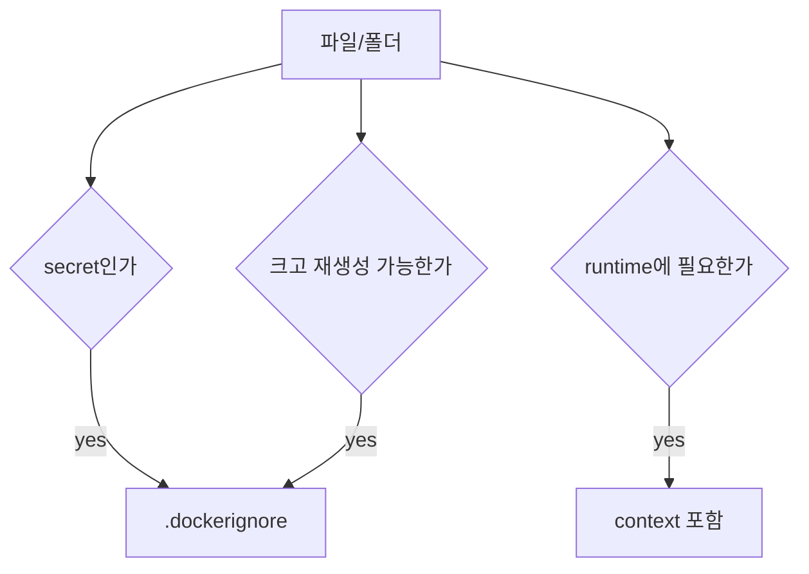

# 3교시: build context와 .dockerignore

## 수업 목표
- build context가 Docker daemon으로 전달되는 입력 경계임을 설명한다.
- `.dockerignore`로 secret, log, dependency directory, 큰 파일을 제외한다.
- `COPY`가 host 전체가 아니라 build context 안의 파일만 볼 수 있음을 확인한다.

## 강의 전개
`docker build .`에서 마지막 점은 작아 보이지만 매우 중요하다. 이 점은 현재 directory를 build context로 Docker daemon에 보내겠다는 뜻이다. context 안에 `.env`, log, 큰 dependency directory가 들어 있으면 image size와 보안 위험이 커진다.

`.dockerignore`는 보기 좋게 폴더를 정돈하는 파일이 아니라 build input boundary를 줄이는 장치다. `COPY`는 이 boundary 안에서만 source를 찾는다. 그래서 source tree, Dockerfile 위치, build command를 함께 봐야 한다.

## Imagegen 인포그래픽: build context와 .dockerignore


이 이미지는 source tree가 `.dockerignore` 필터를 지나 build context로 전달되는 흐름을 보여준다. `.env`, log, `node_modules` 같은 항목은 image 입력에서 제외되어야 한다.

## 시각 자료 1: build context 경계


`COPY`는 build context 밖의 파일을 마음대로 가져올 수 없다. 이 제한은 불편함이 아니라 재현성과 보안을 위한 경계다.

## 시각 자료 2: 제외 판단


제외 기준은 "지금 편한가"가 아니라 image에 들어가도 되는가다.

## 실습 명령
```bash
cat > week2/day3/labs/static-site/.dockerignore <<'EOF'
.git
*.log
.env
node_modules
tmp
EOF
```

```bash
printf "SHOULD_NOT_ENTER_IMAGE=true\n" > week2/day3/labs/static-site/.env
printf "debug log\n" > week2/day3/labs/static-site/app.log
```

## 검증 명령
```bash
sed -n '1,120p' week2/day3/labs/static-site/.dockerignore
find week2/day3/labs/static-site -maxdepth 1 -type f -print
```

## 실습 확장 흐름
| 단계 | 할 일 | 기대되는 관찰 |
|---|---|---|
| 준비 | static-site directory에 `.env`와 log를 만든다. | 위험한 입력 후보가 생긴다. |
| 실행 | `.dockerignore`를 만든다. | 제외 규칙이 명시된다. |
| 관찰 | build context 후보 파일을 본다. | source tree와 image 입력이 다를 수 있음을 이해한다. |
| 실패 재현 | `.dockerignore` 없이 build한다고 가정한다. | secret과 log가 context로 들어갈 위험이 생긴다. |
| 복구 | `.env`, `*.log`, dependency directory를 제외한다. | context가 작고 안전해진다. |
| 확인 | `COPY` source가 context 안에 있는지 확인한다. | 다음 build 실패를 줄인다. |

## 실패 드릴과 오해 교정
| 상황 | 해석 |
|---|---|
| `.env`가 context에 있음 | secret이 image에 들어갈 수 있으므로 제외한다. |
| `COPY ../file` 기대 | build context 밖 파일은 기본적으로 source가 아니다. |
| context가 너무 큼 | dependency, cache, log, build output을 제외한다. |

## Cleanup
```bash
# .env와 log는 위험 예시다. build 실습 전 삭제해도 된다.
rm -f week2/day3/labs/static-site/.env week2/day3/labs/static-site/app.log
```

## 주의할 점
- `.dockerignore`는 Dockerfile과 같은 build context 기준으로 해석된다.
- secret은 build가 성공하더라도 image에 들어가면 사고가 된다.
- 큰 directory는 build 속도와 image size에 영향을 준다.
- `COPY . .`를 쓸수록 `.dockerignore`의 중요도가 커진다.

## 핵심 포인트
build context는 Dockerfile이 보는 입력 세계다. 이 경계를 모르고 Dockerfile만 고치면 missing file, secret 포함, 느린 build 같은 문제가 반복된다.

`.dockerignore`는 학습 초반부터 습관화해야 한다. 나중에 registry push를 할 때 image 안에 들어간 파일은 이미 공개 범위 문제로 이어질 수 있기 때문이다.

## 혼자 다시 따라오기
최소 성공 경로는 `.dockerignore`를 만들고, 제외해야 할 파일을 3개 이상 말하는 것이다. build가 느리거나 이상하게 커지면 context에 큰 directory가 들어갔는지 먼저 확인한다.

## 다음 연결
다음 교시는 이 build context와 Dockerfile로 실제 image를 build하고 container로 실행한다.
