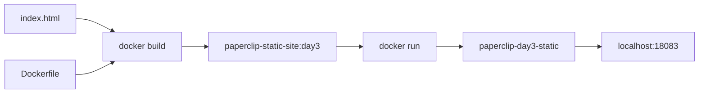
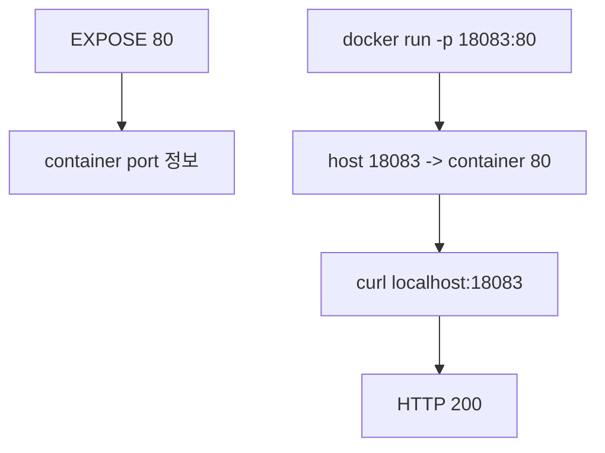

# 4교시: 표준 앱 image build/run

## 수업 목표
- 제공된 static app을 Docker image로 build한다.
- container를 실행하고 host port publish로 HTTP 응답을 확인한다.
- `EXPOSE`와 `-p`의 역할 차이를 실습으로 구분한다.

## 강의 전개
이번 교시는 Day 3의 중심 실습이다. source file과 Dockerfile을 image로 만들고, 그 image를 container로 실행한다. build가 성공했다는 것과 service가 host에서 접근 가능하다는 것은 다른 말이다. build는 image 생성이고, run은 container 실행이며, HTTP 확인은 runtime 연결 확인이다.

`EXPOSE 80`이 Dockerfile에 있어도 host의 `localhost:18083`이 자동으로 열리지 않는다. host에서 접속하려면 `docker run -p 18083:80`처럼 host port와 container port를 연결해야 한다.

## Imagegen 인포그래픽: build/run pipeline


이 이미지는 source와 Dockerfile이 `docker build`를 거쳐 image가 되고, image가 `docker run`으로 container가 되며, `-p 18083:80`을 통해 HTTP 200으로 확인되는 흐름을 보여준다.

## 시각 자료 1: build와 run 분리


build 성공은 image 생성까지다. HTTP 확인은 container 실행과 port publish가 맞아야 가능하다.

## 시각 자료 2: port publish


`EXPOSE`는 힌트이고, `-p`는 host 접근 경로다.

## 실습 명령
```bash
cd week2/day3/labs/static-site
docker build -t paperclip-static-site:day3 .
docker run -d --name paperclip-day3-static -p 18083:80 paperclip-static-site:day3
```

## 검증 명령
```bash
docker ps --filter name=paperclip-day3-static
curl -I http://localhost:18083
curl -s http://localhost:18083
```

## 실습 확장 흐름
| 단계 | 할 일 | 기대되는 관찰 |
|---|---|---|
| 준비 | Dockerfile, index.html, `.dockerignore`를 확인한다. | build input이 준비된다. |
| 실행 | `docker build`로 image를 만든다. | `paperclip-static-site:day3` tag가 생긴다. |
| 관찰 | `docker images paperclip-static-site`를 본다. | image size와 tag를 볼 수 있다. |
| 실패 재현 | `-p` 없이 container를 실행한다고 가정한다. | container는 떠도 host curl은 실패할 수 있다. |
| 복구 | `-p 18083:80`으로 다시 실행한다. | host에서 HTTP 200이 나온다. |
| 확인 | build, run, HTTP 확인을 분리해 말한다. | 어디서 실패했는지 좁힐 수 있다. |

## 실패 드릴과 오해 교정
| 상황 | 해석 |
|---|---|
| build 실패 | Dockerfile path, build context, COPY source를 본다. |
| run 실패 | container 이름 충돌, image tag 오타를 본다. |
| curl 실패 | container port와 host port mapping을 본다. |

## Cleanup
```bash
docker stop paperclip-day3-static || true
docker rm paperclip-day3-static || true
```

## 주의할 점
- 같은 container 이름을 재사용하려면 기존 container를 삭제해야 한다.
- `curl -I`는 header만 확인하고, `curl -s`는 body 내용을 확인한다.
- image tag가 틀리면 build가 성공했어도 run이 실패한다.
- host port가 이미 사용 중이면 다른 host port를 고른다.

## 핵심 포인트
Docker build/run 실습에서 가장 흔한 혼란은 build와 runtime을 한 덩어리로 보는 것이다. image가 만들어졌는지, container가 실행 중인지, host에서 접근 가능한지는 서로 다른 질문이다.

이 세 질문을 분리하면 build failure, run failure, network/port failure를 빠르게 좁힐 수 있다. Day 4의 logs/inspect/exec도 이 분리를 기반으로 이어진다.

## 혼자 다시 따라오기
최소 성공 경로는 static app directory로 이동, `docker build`, `docker run -p`, `curl -I`다. 실패하면 현재 directory, image tag, container name, port mapping 순서로 확인한다.

## 다음 연결
다음 교시는 source 변경과 Dockerfile 순서가 build cache와 layer에 어떤 영향을 주는지 본다.
