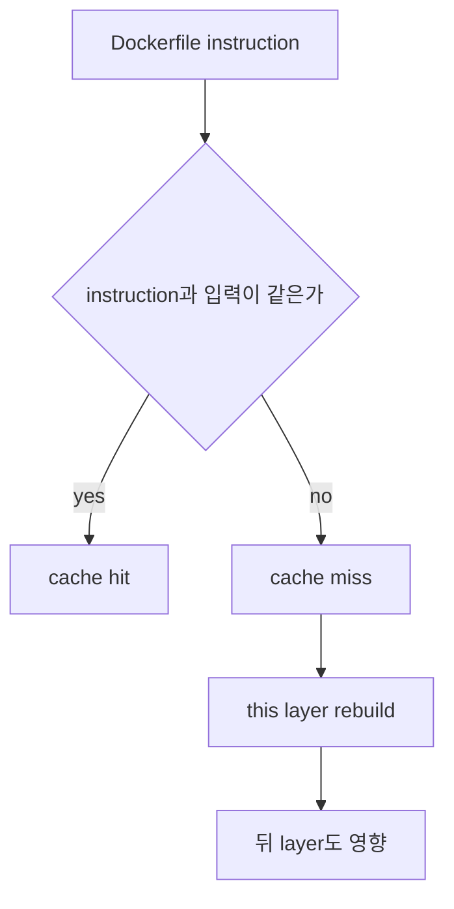
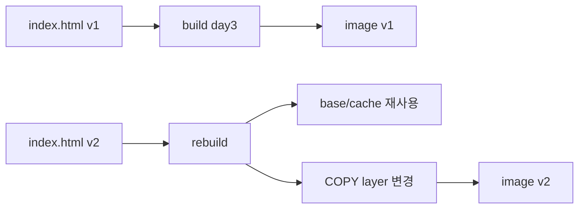

# 5교시: build cache와 layer 최적화

## 수업 목표
- build cache hit/miss를 Dockerfile instruction 순서와 연결한다.
- source 변경이 어떤 layer부터 rebuild되는지 관찰한다.
- image size와 rebuild 시간을 줄이는 기본 판단을 익힌다.

## 강의 전개
Docker build는 매번 처음부터 모든 작업을 새로 하는 것이 아니다. 이전 build와 같은 instruction, 같은 입력이면 cache를 재사용할 수 있다. 그래서 Dockerfile의 순서는 성능과 재현성에 영향을 준다.

정적 nginx 앱은 단순하지만 cache 개념을 보기 좋다. `index.html`만 바꾸면 `COPY` 이후 layer가 바뀐다. 더 복잡한 앱에서는 dependency 설치 instruction과 source copy 순서를 잘못 두면 작은 source 변경에도 dependency 설치가 계속 반복된다.

## Imagegen 인포그래픽: build cache와 layer


이 이미지는 cache hit와 cache miss가 Dockerfile instruction 순서에 따라 달라지는 모습을 보여준다. dependency를 먼저 고정하고 source를 나중에 복사하는 구조가 rebuild 범위를 줄인다.

## 시각 자료 1: cache 판단 흐름


cache miss가 난 layer 뒤쪽은 다시 만들어질 수 있다. 따라서 자주 바뀌는 source는 가능한 뒤쪽에 두는 것이 유리하다.

## 시각 자료 2: source 변경 rebuild


정적 앱에서는 HTML 변경만으로도 COPY layer가 달라진다. 이 단순한 예제로 cache hit/miss를 먼저 감각화한다.

## 실습 명령
```bash
cd week2/day3/labs/static-site
docker build -t paperclip-static-site:day3 .
printf "<h1>day3 static app v2</h1>" > index.html
docker build -t paperclip-static-site:day3-v2 .
```

## 검증 명령
```bash
docker images paperclip-static-site
docker history paperclip-static-site:day3-v2
```

## 실습 확장 흐름
| 단계 | 할 일 | 기대되는 관찰 |
|---|---|---|
| 준비 | v1 image가 있는지 확인한다. | 비교 기준이 생긴다. |
| 실행 | `index.html`을 v2로 바꾼다. | source input이 달라진다. |
| 관찰 | 다시 build한다. | 일부 step은 cache를 쓰고 일부 step은 다시 실행된다. |
| 실패 재현 | 큰 임시 파일을 context에 둔다고 가정한다. | context 전송과 build가 느려질 수 있다. |
| 복구 | `.dockerignore`로 큰 파일을 제외한다. | context가 작아진다. |
| 확인 | `history`로 layer 변화를 본다. | source 변경과 layer 변경을 연결한다. |

## 실패 드릴과 오해 교정
| 상황 | 해석 |
|---|---|
| cache가 예상과 다름 | instruction 입력, file mtime보다 content, build context를 함께 본다. |
| image size가 큼 | 불필요한 파일이 context 또는 image에 들어갔는지 본다. |
| rebuild가 느림 | dependency 설치와 source copy 순서를 의심한다. |

## Cleanup
```bash
# v1/v2 image는 다음 registry/tag 실습에서 비교할 수 있으므로 기본적으로 남긴다.
```

## 주의할 점
- cache는 마법이 아니라 instruction과 입력이 같을 때 재사용되는 build 결과다.
- Dockerfile 순서를 바꾸면 cache 재사용 범위가 달라진다.
- `.dockerignore` 없이 큰 파일을 context에 두면 build가 느려지고 image에 들어갈 위험도 커진다.
- image size 최적화는 무조건 줄이기가 아니라 필요한 runtime 파일만 남기는 판단이다.

## 핵심 포인트
build cache는 개발 속도와 CI 비용에 직접 영향을 준다. 작은 source 변경마다 dependency 설치가 반복되면 local 실습에서는 불편함으로 끝나지만, CI/CD에서는 시간과 비용 문제가 된다.

Day 3의 cache 이해는 Day 5 Compose나 이후 CI/CD에서 image build 시간을 다룰 때 계속 재사용된다.

## 혼자 다시 따라오기
최소 성공 경로는 v1 build, source 변경, v2 build, `docker history` 비교다. cache가 기대와 다르면 어떤 instruction 앞에서 입력이 바뀌었는지부터 본다.

## 다음 연결
다음 교시는 내가 만든 image와 official image가 어디에서 왔는지, registry와 provenance 관점으로 본다.
