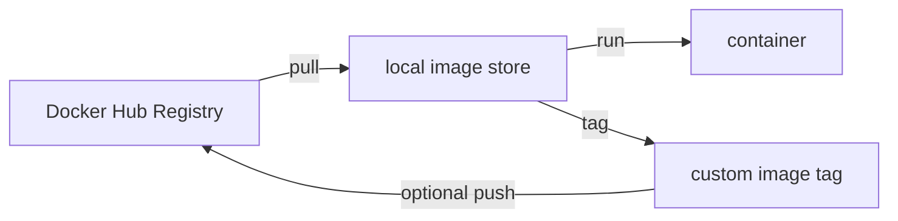
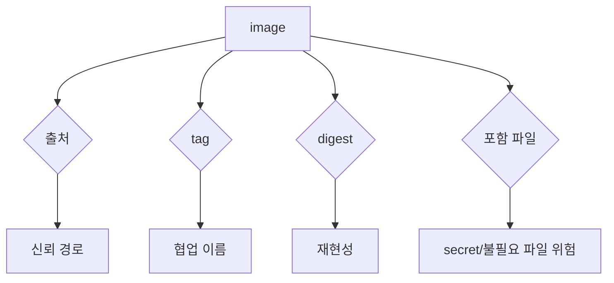

# 6교시: registry와 image provenance

## 수업 목표
- Docker Hub registry와 local image store의 차이를 구분한다.
- official image, custom image, tag, digest를 provenance 관점으로 읽는다.
- pull policy와 digest pinning이 필요한 이유를 설명한다.

## 강의 전개
registry는 image를 저장하고 배포하는 장소다. Docker Hub의 official image는 널리 쓰이지만, 그 image도 tag와 digest를 확인해야 한다. 우리가 만든 custom image는 local machine에만 있을 수도 있고, registry에 push해야 다른 machine에서 pull할 수 있다.

provenance는 "이 image가 어디서 왔고 누가 만들었고 무엇을 포함하는가"라는 질문이다. 운영에서는 image가 실행된다는 사실만으로 충분하지 않다. 출처, tag, digest, 공개 범위, secret 포함 여부가 모두 중요하다.

## Imagegen 인포그래픽: registry provenance


이 이미지는 registry, official image, custom image, tag, digest를 한 흐름으로 보여준다. image를 가져오기 전에 신뢰 경로와 content 식별자를 함께 확인해야 한다.

## 시각 자료 1: registry와 local store


pull은 registry에서 local로 가져오는 일이고, run은 local image로 container를 만드는 일이다.

## 시각 자료 2: provenance 질문


provenance는 보안만의 문제가 아니라 협업과 재현성의 문제이기도 하다.

## 실습 명령
```bash
docker images nginx
docker images paperclip-static-site
docker image inspect nginx:1.27-alpine --format "{{json .RepoTags}} {{json .RepoDigests}}"
docker image inspect paperclip-static-site:day3 --format "{{json .RepoTags}} {{.Size}}"
```

## 검증 명령
```bash
docker image inspect nginx:1.27-alpine --format "{{.Id}}"
docker image inspect paperclip-static-site:day3 --format "{{.Id}}"
```

## 실습 확장 흐름
| 단계 | 할 일 | 기대되는 관찰 |
|---|---|---|
| 준비 | official image와 custom image를 나란히 본다. | 출처가 다른 image가 local에 있다. |
| 실행 | inspect로 tag/digest/size를 본다. | official image와 custom image metadata가 다르다. |
| 관찰 | RepoTags와 RepoDigests를 분리한다. | tag와 digest의 목적이 다르다. |
| 실패 재현 | custom image를 다른 machine에서 바로 pull한다고 가정한다. | registry에 없으면 pull할 수 없다. |
| 복구 | push가 필요한 조건과 gate를 판단한다. | 다음 교시 tag/push/pull로 이어진다. |
| 확인 | provenance 질문 네 가지를 말한다. | 출처, tag, digest, 포함 파일을 구분한다. |

## 실패 드릴과 오해 교정
| 상황 | 해석 |
|---|---|
| official image라서 항상 안전하다고 봄 | tag/digest와 공식 문서 기준을 함께 본다. |
| local image를 다른 사람이 바로 쓴다고 생각 | registry push나 artifact 전달이 필요하다. |
| digest를 불필요하게 봄 | 재현 가능한 배포에서는 digest가 중요해진다. |

## Cleanup
```bash
# registry 실습 전에는 image를 남긴다.
```

## 주의할 점
- official image도 tag와 digest를 확인해야 한다.
- custom image는 local machine 안에만 있을 수 있다.
- public registry에 올릴 image는 secret과 불필요한 파일 포함 여부를 먼저 확인한다.
- tag는 협업 이름이고 digest는 content 식별자에 가깝다.

## 핵심 포인트
registry는 image를 공유하는 장소지만, 아무 image나 올리는 공간이 아니다. image는 실행 가능한 artifact이므로 source보다 더 직접적으로 운영 환경에 영향을 준다.

provenance를 확인하는 습관은 이후 Kubernetes image pull, AWS ECR, CI/CD supply chain으로 이어진다.

## 혼자 다시 따라오기
최소 성공 경로는 official image와 custom image를 `docker images`로 비교하고, inspect로 tag/digest/size를 보는 것이다. digest가 보이지 않거나 헷갈리면 official image를 다시 pull한 뒤 inspect한다.

## 다음 연결
다음 교시는 local tag를 만들고, push는 선택으로 두되 보안 gate를 먼저 통과하는 흐름을 다룬다.
