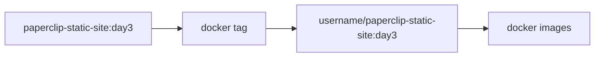
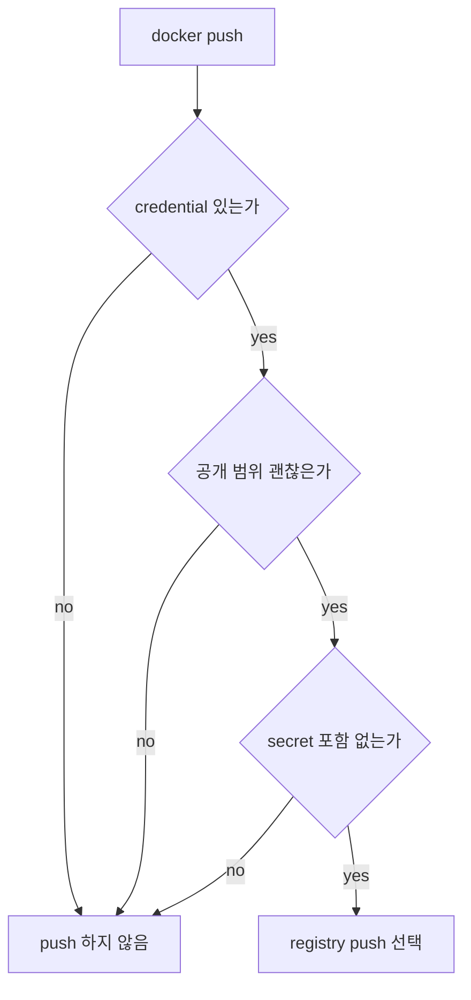

# 7교시: tag/push/pull 흐름과 보안 gate

## 수업 목표
- local image에 repository tag를 붙이는 흐름을 이해한다.
- Docker Hub push는 선택이며 credential과 public repository 위험을 먼저 확인한다.
- push/pull을 artifact 공유 흐름으로 설명한다.

## 강의 전개
`docker tag`는 image를 새로 build하는 명령이 아니라 기존 image에 다른 이름을 붙이는 명령이다. local tag는 협업과 registry push를 위한 이름 규칙이다. 하지만 push는 기본 요구가 아니다. public registry에 image를 올리면 누구나 접근할 수 있는 범위가 될 수 있고, image 안에 secret이나 불필요한 파일이 들어가면 되돌리기 어렵다.

따라서 이 교시는 push를 실습 성공 조건으로 삼지 않는다. local tag와 push gate를 먼저 이해하고, 실제 push는 필요와 credential이 있는 경우에만 선택한다.

## Imagegen 인포그래픽: tag/push/pull 보안 gate


이 이미지는 local image에 tag를 붙이고, credential/public repo/secret 포함 여부를 확인한 뒤 선택적으로 push하는 흐름을 보여준다. push는 편의 기능이 아니라 공개 범위가 생기는 행동으로 다룬다.

## 시각 자료 1: tag는 이름 추가


tag는 image content를 복사하는 것이 아니라 다른 reference를 추가하는 동작으로 이해한다.

## 시각 자료 2: push gate


push 전 gate는 수업 절차가 아니라 운영 안전 기준이다.

## 실습 명령
```bash
docker tag paperclip-static-site:day3 paperclip-static-site:day3-reviewed
docker images paperclip-static-site
```

```bash
# Docker Hub push는 선택이다. 실제 계정과 repository가 있을 때만 사용한다.
# docker tag paperclip-static-site:day3 <dockerhub-username>/paperclip-static-site:day3
# docker push <dockerhub-username>/paperclip-static-site:day3
```

## 검증 명령
```bash
docker image inspect paperclip-static-site:day3-reviewed --format "{{json .RepoTags}} {{.Id}}"
```

## 실습 확장 흐름
| 단계 | 할 일 | 기대되는 관찰 |
|---|---|---|
| 준비 | local image가 있는지 본다. | tag 대상 image가 있어야 한다. |
| 실행 | `docker tag`로 reviewed tag를 붙인다. | 같은 image ID에 tag가 추가된다. |
| 관찰 | `docker images`로 tag 목록을 본다. | tag가 이름표라는 점이 보인다. |
| 실패 재현 | 없는 image에 tag를 붙인다고 가정한다. | source image reference 오류가 난다. |
| 복구 | 정확한 local image tag를 사용한다. | 새 tag가 붙는다. |
| 확인 | push gate 세 가지를 말한다. | credential, 공개 범위, secret 포함 여부를 구분한다. |

## 실패 드릴과 오해 교정
| 상황 | 해석 |
|---|---|
| tag를 build로 오해 | tag는 기존 image reference를 추가하는 명령이다. |
| push를 필수로 오해 | push는 공유가 필요할 때만 선택한다. |
| credential을 문서에 남김 | token/password는 교안, README, screenshot에 남기지 않는다. |

## Cleanup
```bash
# reviewed tag만 지우고 원본 image는 남길 수 있다.
# docker image rm paperclip-static-site:day3-reviewed
```

## 주의할 점
- Docker Hub push는 기본 실습 요구가 아니다.
- public repository에 올린 image는 공개 범위와 삭제 정책을 먼저 생각해야 한다.
- image 안에 `.env`, token, 개인 경로, 불필요한 파일이 있으면 push하지 않는다.
- tag 이름에는 repository owner와 image name, version 의미가 드러나야 한다.

## 핵심 포인트
tag/push/pull은 "내 image를 다른 환경에서 실행 가능하게 전달하는 흐름"이다. local machine 안에서만 쓰는 image와 registry에 올리는 image는 책임 범위가 다르다.

보안 gate를 통과하지 않은 push는 실습 성공이 아니라 운영 사고가 될 수 있다. 그래서 Day 3에서는 push보다 push 전 판단을 더 중요하게 다룬다.

## 혼자 다시 따라오기
최소 성공 경로는 local image에 새 tag를 붙이고 `docker images`와 `inspect`로 같은 image ID인지 확인하는 것이다. 실제 push는 계정, repository 공개 범위, secret 포함 여부를 확인할 수 있을 때만 선택한다.

## 다음 연결
다음 교시는 build/run/push 이전 단계에서 흔히 나는 실패를 RCA 흐름으로 좁힌다.
