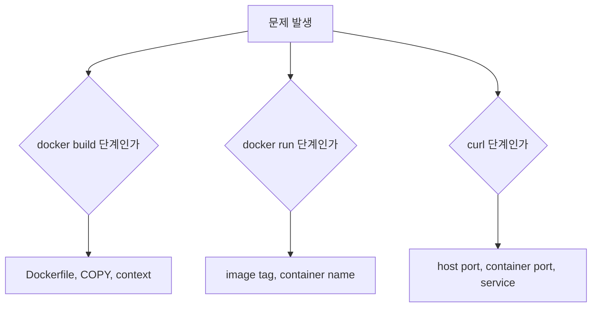
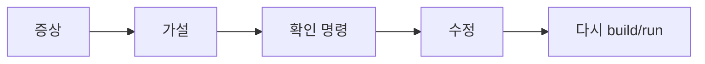

# 8교시: image build failure drill과 구름 EXP 배움일기

## 수업 목표
- missing file, wrong CMD, wrong port, bloated context를 구분한다.
- 실패를 build 단계, run 단계, HTTP 접근 단계로 나누어 좁힌다.
- 수업 후 구름 EXP 배움일기에 Day 3 핵심을 남긴다.

## 강의 전개
Day 3 마지막 교시는 일부러 실패를 만든다. Docker build/run에서 실패가 나면 초급자는 Docker 전체가 어렵다고 느끼기 쉽다. 하지만 실패 위치를 나누면 복구할 수 있다. build 실패는 Dockerfile과 context를 보고, run 실패는 image tag와 container 이름을 보고, HTTP 실패는 port publish와 service 상태를 본다.

이 교시의 목적은 모든 에러 메시지를 외우는 것이 아니라, 어떤 명령 다음에 어떤 문제가 생겼는지 좁히는 것이다. 같은 static app으로 missing file, wrong CMD, wrong port, bloated context를 짧게 비교한다.

## Imagegen 인포그래픽: build failure RCA


이 이미지는 build 실패를 네 가지 흔한 원인으로 나누어 보여준다. missing file, wrong CMD, wrong port, bloated context를 한꺼번에 의심하지 않고 첫 확인 위치를 분리한다.

## 시각 자료 1: 실패 위치 분리


실패 위치를 먼저 나누면 확인할 명령이 줄어든다.

## 시각 자료 2: RCA 흐름


RCA는 긴 문서가 아니라 증상, 가설, 확인 명령, 수정, 재시도 순서다.

## 실습 명령
```bash
cp -r week2/day3/labs/static-site week2/day3/labs/static-site-broken
rm -f week2/day3/labs/static-site-broken/index.html
cd week2/day3/labs/static-site-broken
docker build -t paperclip-static-site:broken . || true
```

```bash
cd /mnt/d/paperclip
docker run -d --name paperclip-day3-static-wrong -p 18084:8080 paperclip-static-site:day3 || true
curl -I http://localhost:18084 || true
```

## 검증 명령
```bash
docker ps -a --filter name=paperclip-day3-static
docker logs paperclip-day3-static-wrong --tail 30 || true
du -sh week2/day3/labs/static-site
```

## 실습 확장 흐름
| 단계 | 할 일 | 기대되는 관찰 |
|---|---|---|
| 준비 | 정상 build/run 경로를 떠올린다. | 비교 기준이 있다. |
| 실행 | missing file build 실패를 만든다. | COPY source 관련 실패가 나온다. |
| 관찰 | 실패가 build 단계인지 확인한다. | container 실행 전 문제다. |
| 실패 재현 | wrong port mapping으로 curl 실패를 만든다. | container와 host 연결 문제로 분리된다. |
| 복구 | 파일을 되돌리고 `-p 18083:80`으로 실행한다. | 정상 HTTP 응답으로 돌아온다. |
| 확인 | 실패 유형별 첫 확인 명령을 말한다. | build/run/HTTP 문제를 구분한다. |

## 실패 드릴과 오해 교정
| 상황 | 해석 |
|---|---|
| missing file | Dockerfile `COPY` source와 build context를 본다. |
| wrong CMD | container logs와 image CMD를 본다. |
| wrong port | `EXPOSE`, container port, host `-p`를 나누어 본다. |
| bloated context | `.dockerignore`와 context directory 크기를 본다. |

## Cleanup
```bash
docker stop paperclip-day3-static paperclip-day3-static-wrong || true
docker rm paperclip-day3-static paperclip-day3-static-wrong || true
rm -rf week2/day3/labs/static-site-broken
# 필요할 때만 image 삭제
# docker image rm paperclip-static-site:day3 paperclip-static-site:day3-v2 paperclip-static-site:day3-reviewed paperclip-static-site:broken
```

## 주의할 점
- build 실패와 runtime 실패를 섞지 않는다.
- `COPY` 실패는 Dockerfile 문법보다 context와 source path 문제일 때가 많다.
- wrong port는 app 문제가 아니라 host/container port mapping 문제일 수 있다.
- bloated context는 당장 실패하지 않아도 build 시간, image size, secret risk를 키운다.

## 핵심 포인트
Day 3의 마무리는 image를 만들 수 있다는 자신감보다, 실패를 좁힐 수 있는 기준이다. Dockerfile, build context, image tag, container name, port mapping을 분리해서 보면 대부분의 초급 build/run 문제는 복구 가능하다.

이 기준은 Day 4의 logs/inspect/exec/stats로 이어진다. Day 4에서는 같은 image를 다양한 runtime config와 장애 조건으로 실행하면서 관찰 도구를 더 깊게 사용한다.

## 구름 EXP 배움일기
수업 후 구름 EXP 배움일기에 오늘 공부한 내용을 남긴다. 간단한 메모 형태로 남겨도 되고, 블로그 형태로 정리해도 좋다.

- image, layer, tag, digest의 차이
- Dockerfile instruction 중 가장 헷갈린 것
- build context와 `.dockerignore`에서 주의할 점
- build 실패 시 먼저 볼 위치

## 혼자 다시 따라오기
최소 성공 경로는 정상 static app build/run, missing file 실패 재현, 올바른 파일 복구, port mapping 복구다. 실패가 나면 마지막으로 성공한 단계가 build인지 run인지 HTTP인지 먼저 나눈다.

## 다음 연결
Day 4는 Day 3에서 만든 image를 여러 runtime config와 failure 조건으로 실행하면서 logs, inspect, exec, stats를 사용한다.
