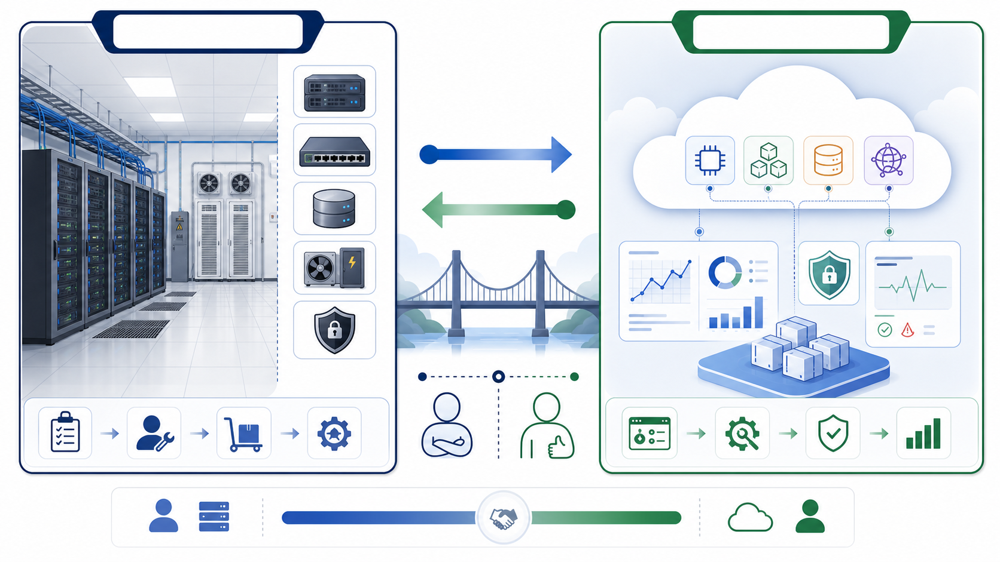

# 4세션: 데이터센터 vs 클라우드 - 운영 책임이 어디로 이동하는가

## 수업 목표
- 데이터센터와 클라우드를 "서버 위치"가 아니라 운영 책임, 비용 구조, 변경 속도, 위험 관리 방식으로 비교한다.
- 클라우드가 물리 장비를 없애는 것이 아니라, 물리 운영 일부를 서비스 제공자에게 위임하고 사용자는 설정/권한/비용/보안 책임을 갖는 모델임을 이해한다.
- Week 1의 compute, storage, network, configuration, observability 개념이 AWS와 Terraform으로 확장되는 이유를 설명한다.
- 이후 AWS 실습에서 콘솔 클릭을 외우기보다 "어떤 책임을 누가 관리하는가"를 먼저 묻는 기준을 만든다.

## 시간
16:00~17:00

## 오늘 반드시 가져갈 것
| 필수 개념 | 왜 필수인가 | 놓치면 생기는 문제 | 확인 증거 |
|---|---|---|---|
| 데이터센터 | 클라우드가 대체하거나 추상화하는 출발점이다. | AWS 서비스를 단순 메뉴 이름으로만 외운다. | 서버, 네트워크, 스토리지, 전력/냉각을 한 문장으로 설명 |
| 클라우드 | 자원을 직접 소유하지 않고 요청해서 쓰는 운영 모델이다. | "클라우드는 공짜/자동/무한" 같은 오해가 생긴다. | 사용량, 리전, 권한, 태그, 삭제 책임을 말함 |
| 공유 책임 모델 | 제공자와 사용자의 책임 경계를 나누는 기준이다. | 보안과 장애 책임을 전부 AWS 탓 또는 사용자 탓으로 잘못 돌린다. | 제공자 책임 2개, 사용자 책임 2개 작성 |
| 비용 구조 | CAPEX/OPEX 관점이 바뀐다. | 켜둔 리소스, 고정 IP, 스토리지 비용을 방치한다. | 비용 발생 리소스 예시 3개 작성 |

## 50~60분 학습 흐름
| 시간 | 활동 | 학생 산출물 |
|---|---|---|
| 16:00~16:08 | 문제 제기: 서버를 직접 운영한다는 뜻 | 데이터센터 구성요소 4개 |
| 16:08~16:20 | 데이터센터 운영 책임 | 물리/운영 책임 목록 |
| 16:20~16:32 | 클라우드 운영 모델 | 클라우드에서 남는 사용자 책임 |
| 16:32~16:42 | 데이터센터 vs 클라우드 비교 | 책임/비용/속도/위험 비교표 |
| 16:42~16:50 | AWS로 연결 | compute/storage/network/IAM/monitoring 매핑 |
| 16:50~17:00 | 다음 세션 전환 | 개인 학습 목표에 클라우드 책임 1개 반영 |

## 16:00~16:08 문제 제기: 서버를 직접 운영한다는 뜻
클라우드를 이해하려면 먼저 "클라우드가 없을 때 무엇을 직접 해야 하는가"를 떠올려야 한다. 서비스를 운영하려면 애플리케이션 코드만 있으면 끝나지 않는다. 서버를 살 장소, 전원, 냉각, 네트워크 회선, 디스크, 장애 시 교체할 부품, 방화벽, 접근 권한, 백업, 모니터링이 필요하다.

데이터센터는 이런 물리 자원과 운영 절차가 모인 환경이다. 회사가 직접 데이터센터를 운영할 수도 있고, 외부 데이터센터에 장비를 맡길 수도 있다. 어느 쪽이든 핵심은 "필요한 용량을 미리 예측하고, 장비와 공간을 준비하고, 고장과 교체를 책임진다"는 점이다.

짧은 질문:
- 서버가 느려지면 장비를 누가 추가하는가?
- 디스크가 부족하면 누가 구매하고 설치하는가?
- 네트워크가 끊기면 누가 회선과 장비를 확인하는가?
- 장애가 밤에 발생하면 누가 현장에 접근하는가?

### Visual 1: 데이터센터와 클라우드의 운영 책임 경계

읽는 순서: 왼쪽은 물리 장비, 네트워크, 스토리지, 전력/냉각, 보안을 직접 관리하는 데이터센터 관점이다. 오른쪽은 compute, storage, network, security, monitoring을 서비스로 요청하고 설정하는 클라우드 관점이다. 가운데 화살표는 장비가 사라진다는 뜻이 아니라 운영 책임의 경계가 이동한다는 뜻이다.

## 16:08~16:20 데이터센터 운영 책임
데이터센터 운영은 눈에 보이는 서버보다 넓다.

| 구성요소 | 직접 운영할 때의 책임 | 운영 리스크 |
|---|---|---|
| Compute | 서버 구매, CPU/RAM 용량 산정, 교체 | 과소 산정, 과대 구매, 노후화 |
| Storage | 디스크/스토리지 장비, 백업, 복구 | 데이터 손실, 용량 부족 |
| Network | 스위치, 라우터, 방화벽, 회선 | 병목, 단절, 보안 구멍 |
| Facility | 전력, 냉각, 랙, 물리 보안 | 정전, 과열, 현장 접근 실패 |
| Operations | 모니터링, 장애 대응, 변경 기록 | 장애 원인 불명, 인수인계 실패 |

여기서 중요한 점은 데이터센터가 나쁜 방식이라는 뜻이 아니다. 예측 가능한 대규모 워크로드, 강한 통제, 규제 요구, 특수 장비가 필요한 상황에서는 직접 운영이 합리적일 수 있다. 다만 초급자가 클라우드를 배울 때는 "클라우드가 무엇을 대신해 주는지"를 이해하기 위해 데이터센터의 책임 범위를 먼저 알아야 한다.

## 16:20~16:32 클라우드 운영 모델
클라우드는 서버를 없애는 것이 아니라, 물리 서버를 직접 다루지 않고 서비스로 요청하게 해준다. 사용자는 콘솔, CLI, API, Terraform 같은 도구로 compute, storage, network를 생성한다. 물리 장비 구매와 냉각은 제공자가 맡지만, 어떤 리전을 쓸지, 어떤 권한을 줄지, 어떤 포트를 열지, 비용을 어떻게 통제할지는 사용자의 책임으로 남는다.

| 데이터센터 질문 | 클라우드에서의 질문 |
|---|---|
| 서버를 몇 대 사야 하는가? | 어떤 instance type 또는 managed service를 선택할 것인가? |
| 디스크를 얼마나 미리 사야 하는가? | 어떤 storage class와 lifecycle 정책을 쓸 것인가? |
| 방화벽을 어떻게 구성하는가? | security group, NACL, IAM을 어떻게 제한할 것인가? |
| 장애를 어디서 확인하는가? | CloudWatch log/metric/alarm을 어디에 둘 것인가? |
| 장비를 언제 교체하는가? | resource 변경, scale, patch, destroy를 어떻게 관리할 것인가? |

## 16:32~16:42 데이터센터 vs 클라우드 비교
| 기준 | 데이터센터 | 클라우드 |
|---|---|---|
| 소유 | 장비와 공간을 직접 소유하거나 장기 계약 | 자원을 서비스로 사용 |
| 비용 | 초기 투자와 용량 예측이 큼 | 사용량 기반 비용, 방치 비용 주의 |
| 속도 | 구매, 배송, 설치 리드타임 존재 | 분 단위 생성 가능 |
| 확장 | 물리 용량 한계와 조달 시간 영향 | 빠른 확장 가능, quota와 비용 제한 존재 |
| 보안 | 물리 접근과 장비 보안까지 직접 관리 | 공유 책임 모델에 따라 설정/권한 책임이 큼 |
| 장애 대응 | 현장 장비와 운영팀 대응 필요 | 제공자 상태와 사용자 설정을 함께 확인 |
| 변경 관리 | 문서/티켓/수작업 변경이 많음 | API/Terraform으로 변경 기록 가능 |

핵심 문장:
> 클라우드는 "내 서버가 어딘가에 있다"가 아니라 "운영 책임의 일부를 서비스 제공자에게 넘기고, 남은 책임을 더 명확하게 관리하는 방식"이다.

## 16:42~16:50 AWS로 연결
Week 5에서 AWS를 볼 때는 서비스 이름보다 이 매핑을 먼저 생각한다.

| Week 1 컴퓨팅 개념 | 데이터센터 표현 | AWS에서 만나는 표현 |
|---|---|---|
| Compute | 물리 서버, VM host | EC2, ECS, Lambda |
| Storage | 디스크, NAS, 백업 장비 | EBS, S3, RDS snapshot |
| Network | 스위치, 라우터, 방화벽 | VPC, subnet, route table, security group |
| Identity/access | 출입 통제, 관리자 계정 | IAM user/role/policy |
| Observability | NOC, 로그 서버, 모니터링 | CloudWatch Logs/Metrics/Alarm |
| Handoff | 운영 문서, 변경 티켓 | README, runbook, Terraform plan |

Terraform은 여기서 한 단계 더 나간다. 콘솔에서 만든 설정은 사람 기억과 화면 캡처에 남기 쉽지만, Terraform은 "어떤 인프라를 원하는가"를 코드로 남긴다. 그래서 Week 5의 AWS와 Terraform은 분리된 주제가 아니라 같은 운영 문제의 두 표현이다.

## 16:50~17:00 다음 세션 전환
마지막 10분은 새 실습을 시작하지 않는다. 학생은 아래 문장을 개인 목표에 추가한다.

작성 프롬프트:
- 내가 클라우드를 배울 때 조심해야 할 책임 1개는 무엇인가?
- 비용, 권한, 네트워크, 삭제 중 내가 가장 헷갈릴 것 같은 영역은 무엇인가?
- AWS 실습에서 "생성했다" 말고 어떤 증거를 남겨야 하는가?

## 오해 점검
| 오해 | 바로잡기 |
|---|---|
| 클라우드는 서버가 없는 것이다. | 서버는 존재하지만 사용자가 물리 장비를 직접 다루지 않는다. |
| 클라우드는 자동으로 싸다. | 사용량 기반이라 방치하면 비용이 계속 발생한다. |
| AWS가 모든 보안을 책임진다. | 제공자와 사용자의 책임 경계가 나뉜다. |
| 콘솔에서 만들면 운영이 끝난다. | 권한, 비용, 로그, 삭제, 변경 기록까지 남겨야 한다. |

## 산출물
- 데이터센터 구성요소 4개
- 데이터센터 vs 클라우드 비교표
- 공유 책임 모델에서 제공자 책임 2개, 사용자 책임 2개
- AWS 실습에서 확인해야 할 비용/권한/삭제 책임 1개

## 평가 기준
| 기준 | 2점 evidence |
|---|---|
| 개념 비교 | 데이터센터와 클라우드를 책임/비용/속도/위험 기준으로 비교했다. |
| 공유 책임 | 제공자 책임과 사용자 책임을 구분했다. |
| AWS 연결 | Week 1 컴퓨팅 개념을 AWS 서비스 범주와 연결했다. |
| 운영 관점 | 비용, 권한, 로그, 삭제 중 하나 이상의 위험을 설명했다. |

## AI coding agent 시대 인사이트
- agent는 AWS 리소스나 Terraform 코드를 빠르게 제안할 수 있지만, 책임 경계를 모르면 위험한 기본값을 그대로 받아들이게 된다.
- 사람은 "이 리소스의 비용은 언제 발생하는가", "누가 접근 가능한가", "삭제는 어떻게 검증하는가"를 agent에게 요구해야 한다.
- 클라우드 학습의 목표는 콘솔 메뉴 암기가 아니라 운영 책임을 질문으로 바꾸는 능력이다.

## 혼자 다시 따라오기
1. 데이터센터 구성요소를 compute, storage, network, facility, operations로 나누어 적는다.
2. 각 구성요소가 AWS에서 어떤 서비스 범주로 바뀌는지 한 줄씩 연결한다.
3. "클라우드에서 사용자가 여전히 책임지는 것"을 비용, 권한, 네트워크, 삭제 중 2개 이상으로 설명한다.
4. 다음 주차 Docker와 연결해 "컨테이너는 실행 단위를 표준화하고, 클라우드는 실행 자원을 서비스로 제공한다"는 문장을 자기 말로 바꿔 쓴다.
