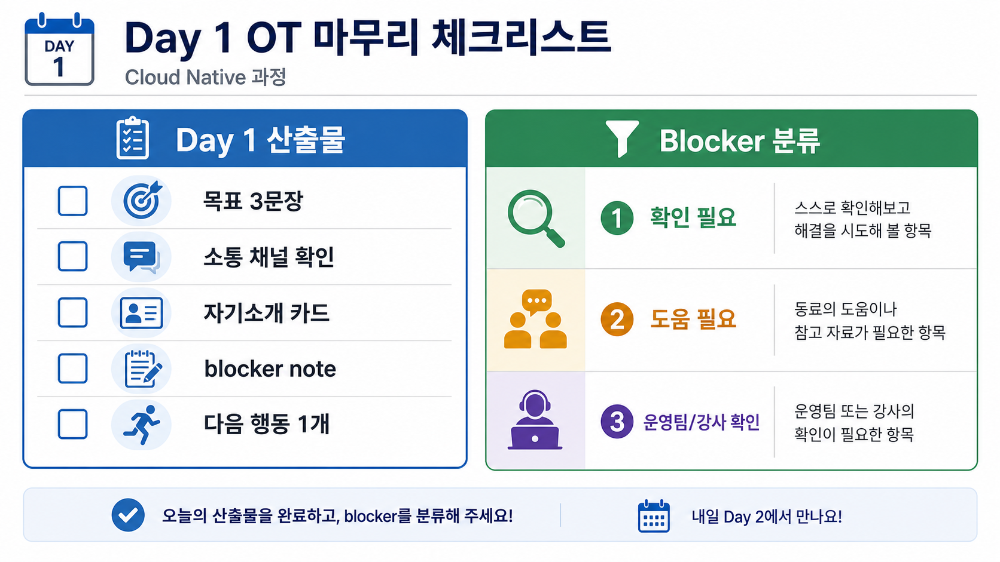
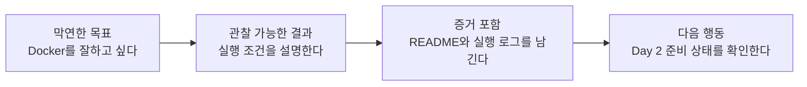

# 5세션: 학습 준비와 다음 액션

## 수업 목표
- 개인 학습 목표와 현재 blocker를 6주 학습 계획으로 정리한다.
- 다음 수업에 필요한 준비 상태를 안전한 checklist로 확인한다.
- 다음 수업 준비 상태를 판단할 수 있는 Day 1 산출물을 정리한다.
- 학생이 AI coding agent 시대의 학습 원칙을 자기 행동 checklist로 바꾼다.

## 시간
17:00~18:00

## 오늘의 초점
- 목표, blocker, 소통 경로, 다음 행동을 하나의 준비 상태로 묶는다.
- 장비/OS/네트워크/자료 위치처럼 다음 수업에 영향을 주는 조건을 확인한다.
- 민감정보 입력 없이 준비 상태를 정리하고 필요한 도움 경로를 확정한다.

## 50~60분 학습 흐름
| 시간 | 활동 | 내가 확인할 것 |
|---|---|---|
| 17:00~17:06 | Day 1 산출물 회수 기준 안내 | 목표, 로드맵, mindset, 자기소개를 하나의 준비 상태로 묶는다. |
| 17:06~17:16 | 개인 목표 3문장 다듬기 | 추상적 기대를 관찰 가능한 결과로 바꾼다. |
| 17:16~17:28 | 환경 준비 checklist 설명 | Day 2 실습 전 확인할 범위를 안전하게 확인한다. |
| 17:28~17:40 | blocker severity 분류 | 도움이 필요한 항목의 우선순위를 정한다. |
| 17:40~17:48 | AI coding agent 학습 원칙 정리 | agent 사용 기준을 개인 행동 규칙으로 전환한다. |
| 17:48~17:50 | Day 1 타임테이블 확인 | 진행 내용과 산출물을 수업 기록으로 정리한다. |
| 17:50~18:00 | Day 1 마감 정리 | 당일 산출물, 다음 행동, feedback 경로를 확인하고 정시에 종료한다. |

## 17:00~17:06 Day 1 산출물 회수 기준 안내

- 진행: Day 1 산출물 회수 기준 안내

- 초점: 목표, 로드맵, mindset, 자기소개를 하나의 준비 상태로 묶는다.

- 완료 조건: 아래 자료를 사용해 이 시간 블록의 산출물을 만든다.

### 핵심 설명
> "오늘의 마지막 목표는 무언가를 설치하는 것이 아닙니다. 내 상태를 다음 수업에서 바로 이어받을 수 있게 만드는 것입니다. 좋은 준비 상태란 '무엇을 하고 싶은지', '무엇이 막히는지', '어떤 도움을 어디에 요청할지'가 기록된 상태입니다."

> "Day 2부터는 실제 컴퓨팅 구성요소와 CLI/HTTP 기반 실습으로 들어갑니다. 오늘 정리한 목표, blocker, 소통 경로, 증거 기준이 그 실습을 안전하게 시작하는 준비물이 됩니다."

> "AI coding agent를 학습에 쓰더라도, 여러분의 목표와 blocker를 대신 정리해 주지는 않습니다. agent에게 줄 context를 사람이 먼저 만들 수 있어야 합니다."

### Visual 1: Day 1 마무리 체크리스트

이 이미지는 Day 1 종료 시점의 산출물과 blocker 분류를 한눈에 보여준다. 왼쪽은 제출 또는 기록할 것, 오른쪽은 도움이 필요한 정도를 구분하는 기준이다.

## 17:06~17:16 개인 목표 3문장 다듬기

- 진행: 개인 목표 3문장 다듬기

- 초점: 추상적 기대를 관찰 가능한 결과로 바꾼다.

- 완료 조건: 아래 자료를 사용해 이 시간 블록의 산출물을 만든다.

### 개인 액션 노트
| 항목 | 작성 가이드 |
|---|---|
| 6주 후 설명할 수 있고 싶은 것 | "Docker/Kubernetes/AWS를 안다"보다 설명 가능한 상황으로 쓴다. |
| Week 1에서 가장 먼저 안정화할 것 | CLI, 파일 경로, port, log, README, 질문 방식 중 하나를 고른다. |
| 환경 준비 blocker | 장비, OS, 권한, 네트워크, 계정 접근, 영어 문서, 시간 제약을 구분한다. |
| 질문할 채널/방식 | 공지 채널, 질문 채널, 수업 중 질문, 1:1 요청 중 선택한다. |
| 다음 수업 전 확인할 항목 | 설치가 아니라 접근 가능성, 장비 상태, 자료 위치, 시간 확보를 적는다. |
| AI agent 사용 원칙 | 실행 전 검토, secret 미입력, 공식 문서 확인, 증거 요구 중 2개 이상 적는다. |

### Day 1 타임테이블 정리
| 시간 | 내용 | 산출물 |
|---|---|---|
| 12:00~13:00 | 과정별 OT 개요: 과정 소개, 운영 방식, ZEP/소통 채널, 평가 증거 원칙 | 개인 목표 초안, blocker, 민감정보 주의 note |
| 13:00~14:00 | 점심시간 | - |
| 14:00~15:00 | 6주 커리큘럼 로드맵: Week 1 spine과 Week 2~6 기술 연결 | 6주 기대/불안 note, 약한 spine component |
| 15:00~16:00 | AI coding agent 시대의 Cloud Native/DevOps 마인드셋 특강 | mindset rewrite, AI-to-business checklist |
| 16:00~17:00 | 아이스브레이킹 및 자기소개 | 자기소개 카드, 좋은 blocker 질문 |
| 17:00~18:00 | 학습 준비와 다음 액션: 개인 목표, 환경 준비, blocker 기록 | 개인 액션 노트, severity 분류, AI 사용 원칙 |

### Visual 2: 목표 문장 개선 흐름

읽는 순서: 목표는 의욕 문장에서 증거가 남는 행동 문장으로 바뀌어야 한다.

## 17:16~17:28 환경 준비 checklist 설명

- 진행: 환경 준비 checklist 설명

- 초점: Day 2 실습 전 확인할 범위를 안전하게 확인한다.

- 완료 조건: 아래 자료를 사용해 이 시간 블록의 산출물을 만든다.

### Visual 3: blocker severity matrix
| Severity | 수업 참여 영향 | 도움 경로 | 기록 방식 |
|---|---|---|---|
| S1 | 다음 수업 참여가 어렵다 | 운영팀 즉시 확인 | 증상과 제약 |
| S2 | 참여 가능하나 지연 가능 | 질문 채널/수업 전 확인 | 시도한 일 |
| S3 | 불안 또는 개념 부족 | 동료 피드백 또는 질문 채널 | 필요한 도움 |
| None | 알려진 blocker 없음 | 다음 확인 항목 유지 | `none` |

## 17:28~17:40 blocker severity 분류

- 진행: blocker severity 분류

- 초점: 도움이 필요한 항목의 우선순위를 정한다.

- 완료 조건: 아래 자료를 사용해 이 시간 블록의 산출물을 만든다.

### 활동: 목표 3문장 다듬기
1. 오전에 작성한 개인 목표 초안을 꺼낸다.
2. 각 문장을 아래 기준으로 수정한다.

| 약한 문장 | 강한 문장 |
|---|---|
| Docker를 잘하고 싶다. | 간단한 웹 앱의 실행 조건을 Docker image/container 관점으로 설명하고 재현 증거를 남기고 싶다. |
| AWS를 배우고 싶다. | compute, storage, network, identity가 어떤 비용/보안 책임을 만드는지 설명하고 싶다. |
| 에러를 줄이고 싶다. | 에러가 발생했을 때 증상, 시도, 로그, 다음 액션을 blocker note로 남기고 싶다. |

3. 최종 목표 3문장을 개인 액션 노트에 옮긴다.

### 활동: blocker severity 분류
| Severity | 기준 | 예시 | 다음 액션 |
|---|---|---|---|
| S1 | 다음 수업 참여 자체가 어렵다. | 장비 없음, ZEP 접속 불가, 필수 계정 접근 불가 | 즉시 운영팀에 공유 |
| S2 | 실습은 가능하지만 일부 지연이 예상된다. | 권한 제한, 설치 경험 부족, 네트워크 불안정 | Day 2 시작 전 질문 준비 |
| S3 | 학습 불안이나 개념 부족이다. | 영어 문서 부담, CLI 두려움, 발표 부담 | 동료 피드백 또는 질문 채널 기록 |
| None | 현재 알려진 blocker가 없다. | - | 다음 수업 전 확인 항목만 유지 |

## 17:40~17:48 AI coding agent 학습 원칙 정리

- 진행: AI coding agent 학습 원칙 정리

- 초점: agent 사용 기준을 개인 행동 규칙으로 전환한다.

- 완료 조건: 아래 자료를 사용해 이 시간 블록의 산출물을 만든다.

### 활동: AI coding agent 사용 원칙 만들기
학생은 아래 문장을 자기 말로 완성한다.

| 문장 | 작성 |
|---|---|
| AI에게 코드를 요청하기 전에 나는 먼저 ___를 설명한다. | |
| AI가 준 명령을 실행하기 전에 나는 ___를 확인한다. | |
| AI에게 절대 입력하지 않을 정보는 ___이다. | |
| AI 결과가 성공했는지는 ___ 증거로 판단한다. | |

## 17:48~17:50 Day 1 타임테이블 확인

- 진행: Day 1 타임테이블 확인

- 초점: 진행 내용과 산출물을 수업 기록으로 정리한다.

- 완료 조건: 아래 자료를 사용해 이 시간 블록의 산출물을 만든다.

### 흔한 오해
| 오해 | 교정 |
|---|---|
| 산출물이 있으면 evidence는 나중에 채워도 된다. | evidence는 산출물의 일부다. command, path, status, log, note가 함께 있어야 평가 가능하다. |
| Week1에서 모든 기술을 깊게 익혀야 한다. | Week1은 컴퓨팅 spine과 운영 증거를 만드는 주차이며, 깊은 hands-on은 각 기술 주차에서 진행한다. |
| 막힌 내용을 숨기는 것이 좋다. | blocker를 증상, 시도한 일, 다음 조치로 기록하는 것이 현업식 진행 관리다. |

## 17:50~18:00 Day 1 마감 정리

- 진행: Day 1 마감 정리

- 초점: 당일 산출물, 다음 행동, feedback 경로를 확인하고 정시에 종료한다.

- 완료 조건: 아래 자료를 사용해 이 시간 블록의 산출물을 만든다.

### Day 1 종료 전 안내 프롬프트
- 공개 질문: "내일 바로 도움을 받아야 할 blocker가 있는가?"
- 개인 작성: 목표 3문장, blocker severity, 다음 행동 1개, AI 사용 원칙 2개를 완성한다.

### 산출물
- 개인 학습 목표 3문장 최종본
- 환경 준비 blocker note 또는 `none`
- blocker severity 분류
- AI coding agent 사용 원칙 4문장
- Day 1 상세 타임테이블

### 학술/현업 근거
- Formative assessment: 첫날 산출물은 점수 부여보다 다음 학습을 조정하기 위한 형성 평가 자료다.
- ABET-style communication: 목표, 제약, 도움 요청을 명확히 표현하는 능력을 평가한다.
- NIST NICE-style task readiness: 접근, 권한, 민감정보, blocker를 구분해 안전한 작업 준비 상태를 만든다.
- DevOps practitioner readiness: 다음 사람이 이어받을 수 있는 목표, 위험, 액션 기록이 운영 품질의 기초다.

### AI coding agent 시대 인사이트
- agent 시대의 학습자는 "정답을 받는 사람"이 아니라 "작업을 정의하고 검증하는 사람"이어야 한다.
- 개인 목표, blocker, 완료 기준은 agent prompt의 핵심 재료다.
- Day 1 산출물은 이후 README, issue, runbook, postmortem, agent task brief로 확장된다.

### 세션 체크리스트
- [ ] 모든 학생이 개인 목표 3문장을 최종화했다.
- [ ] blocker가 `S1/S2/S3/None` 중 하나로 분류됐다.
- [ ] Day 2 전 확인 항목을 정리했다.
- [ ] secret, token, MFA, 결제 정보 입력을 요구하지 않았다.

### 다음 연결
Day 2부터 컴퓨팅 구성요소와 CLI/HTTP 기반 실습으로 들어간다.

### 평가 기준
| 기준 | 2점 evidence |
|---|---|
| 50분 참여 | 시간 흐름에 맞춰 설명, 활동, 산출물 작성에 참여했다. |
| 증거 산출 | 수업에서 요구한 note, command, table, blocker 중 해당 산출물을 구체적으로 남겼다. |
| 전이 연결 | 오늘 개념이 Week2~6 기술 또는 자기 산출물과 어떻게 연결되는지 한 문장 이상 설명했다. |

### 공식/학술 근거 링크
- Google SRE Book: Postmortem Culture, https://sre.google/sre-book/postmortem-culture/ - blocker와 incident note를 학습 가능한 기록으로 바꾸는 근거다.
- GitHub Secret Scanning, https://docs.github.com/en/code-security/secret-scanning/enabling-secret-scanning-features - 공개 repository에 secret이 올라갈 때의 탐지와 보호 기준이다.
- Monash Constructive Alignment, https://www.monash.edu/learning-teaching/teachhq/Teaching-practices/learning-outcomes/how-to/constructive-alignment - 목표, 활동, 산출물, feedback 경로를 맞추는 기준이다.
