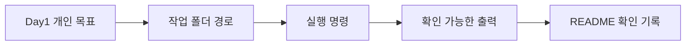

# 1교시: Day1 OT 연결 및 학습 작업공간 준비

## 수업 목표
- Day1 OT에서 정한 개인 목표와 막힘 기록을 실제 작업공간 준비로 연결한다.
- Week 1 산출물이 GitHub, README, 명령 확인 기록으로 누적된다는 점을 이해한다.
- "내 컴퓨터에서 어디에서 무엇을 실행했는가"를 경로와 기록으로 설명한다.

## 50분 흐름
| 시간 | 활동 |
|---|---|
| 0-5분 | Day1 목표와 막힘 기록을 다시 읽는다. |
| 5-15분 | 작업공간, repository, 확인 기록의 역할을 설명한다. |
| 15-30분 | 개인 작업 폴더를 만들고 현재 경로를 기록한다. |
| 30-40분 | 공개 가능한 정보와 민감정보를 구분한다. |
| 40-50분 | 확인 기록 표를 작성하고 다음 교시 준비 상태를 확인한다. |

## 0-5분 Day1 목표와 막힘 기록을 다시 읽는다.


### 상세 설명
작업공간은 단순한 폴더가 아니다. 현업에서는 장애나 배포 실패가 발생했을 때 "어떤 directory에서 어떤 명령을 실행했는가"가 중요한 재현 조건이 된다. 같은 명령도 다른 경로에서 실행하면 다른 파일을 읽거나, 다른 설정을 사용하거나, 아무 파일도 찾지 못할 수 있다.

Day1 OT에서 만든 목표는 추상적인 학습 의미였다. Day2부터는 그 의도를 실제 확인 기록으로 바꾼다. 확인 기록은 스크린샷만 의미하지 않는다. 명령, 경로, 버전, URL, status code, 오류 메시지처럼 다른 사람이 다시 확인할 수 있는 자료를 말한다.


### 시각 자료 1: 목표를 확인 기록으로 바꾸는 흐름


이 그림은 오늘 만드는 경로 기록이 나중에 서비스 상태 확인 기록으로 확장되는 흐름을 보여준다. 여러분은 먼저 "내가 어디에서 실행했는가"를 남기고, 이후 교시에서 명령 출력과 README 기록을 붙여 간다.



## 5-15분 작업공간, repository, 확인 기록의 역할을 설명한다.


### 시각 자료 2: 경로 캡처 가이드
| 캡처할 장면 | 학생 기록 포인트 |
|---|---|
| 첫 번째 `pwd` 출력 | 수업 시작 위치를 그대로 적는다. |
| `cloud-native-week1` 이동 후 `pwd` | 끝 경로가 새 폴더인지 확인한다. |
| 민감정보 점검 | 비밀번호, 토큰, 인증코드는 캡처하거나 붙여 넣지 않는다. |

## 15-30분 개인 작업 폴더를 만들고 현재 경로를 기록한다.


### 시각 자료 3: 작업공간 판단 카드
| 판단 질문 | 강한 확인 기록 | 약한 확인 기록 |
|---|---|---|
| 어디에서 실행했는가? | 전체 경로와 명령이 함께 있음 | 폴더 이름만 기억함 |
| 무엇을 남겼는가? | 출력을 README 또는 기록에 요약 | 화면을 봤다고만 적음 |
| 공개 가능한가? | 비밀값을 제외한 경로/출력 | 토큰이나 인증코드가 섞인 캡처 |


### 명령 절차
```bash
pwd
mkdir -p cloud-native-week1
cd cloud-native-week1
pwd
```


### 확인 질문
- 현재 작업 폴더의 전체 경로는 무엇인가?
- 오늘 만든 확인 기록 중 공유 가능한 것과 보호해야 할 것은 무엇인가?
- 다른 사람이 같은 폴더 구조를 만들려면 어떤 명령이 필요한가?

## 30-40분 공개 가능한 정보와 민감정보를 구분한다.


### 다음 주차 매핑
컨테이너 실행 환경의 작업 디렉터리, Kubernetes manifest의 mount 경로, Terraform module 경로는 모두 "어디에서 실행되는가"라는 질문으로 돌아온다. 오늘 기록한 경로 확인 기록이 그 기본 언어다.


### 예상 결과
- 첫 번째 `pwd`는 현재 위치를 보여준다.
- `mkdir -p cloud-native-week1`은 폴더가 없으면 만들고, 이미 있으면 오류 없이 지나간다.
- 두 번째 `pwd`는 끝이 `cloud-native-week1`인 경로를 보여야 한다.


### 흔한 오해
| 오해 | 교정 |
|---|---|
| 폴더 이름은 아무래도 상관없다. | 이름은 자유지만 수업 확인 기록에서는 같은 이름을 쓰면 재현성이 좋아진다. |
| 스크린샷만 있으면 충분하다. | 명령과 출력을 함께 기록해야 나중에 검색, 비교, 복구가 쉽다. |
| 막힘 기록은 실패 기록이라 감점이다. | 막힘 기록은 운영에서 중요한 상태 보고다. 단, 증상과 시도한 확인을 같이 써야 한다. |

## 40-50분 확인 기록 표를 작성하고 다음 교시 준비 상태를 확인한다.


### 실습 확인 기록
| 항목 | 기록 |
|---|---|
| Day1 개인 목표 | |
| 현재 막힘 기록 | |
| 작업 폴더 경로 | |
| 보호해야 할 정보 | 비밀번호, 토큰, MFA 코드, 인증 코드 |


### 학술 근거와 DevOps 관점
ABET식 문제 해결 역량은 문제를 바로 고치는 능력보다 먼저 상황을 정확히 정의하는 능력을 요구한다. DevOps 현업에서도 "안 됩니다"보다 "어느 경로에서 어떤 명령을 실행했고 어떤 출력이 나왔습니다"가 훨씬 좋은 보고다. 이 습관이 incident report, runbook, RCA의 출발점이다.


### 평가 기준
| 기준 | 2점 확인 기록 |
|---|---|
| 50분 참여 | 시간 흐름에 맞춰 설명, 활동, 산출물 작성에 참여했다. |
| 증거 산출 | 수업에서 요구한 기록, 명령, 표, 막힘 기록 중 해당 산출물을 구체적으로 남겼다. |
| 전이 연결 | 오늘 개념이 Week2~5 기술 또는 자기 산출물과 어떻게 연결되는지 한 문장 이상 설명했다. |


### 공식/학술 근거 링크
- OSTEP: Operating Systems: Three Easy Pieces, https://pages.cs.wisc.edu/~remzi/OSTEP/ - process, memory, filesystem, persistence를 운영체제 abstraction으로 설명하는 기준이다.
- CS:APP, https://csapp.cs.cmu.edu/ - 프로그램 실행과 메모리/스토리지/네트워크가 시스템 기초로 연결되는 근거다.
- MIT Missing Semester, https://missing.csail.mit.edu/ - shell, 경로, debugging을 실무형 컴퓨팅 문해력으로 다루는 대학 강의다.
