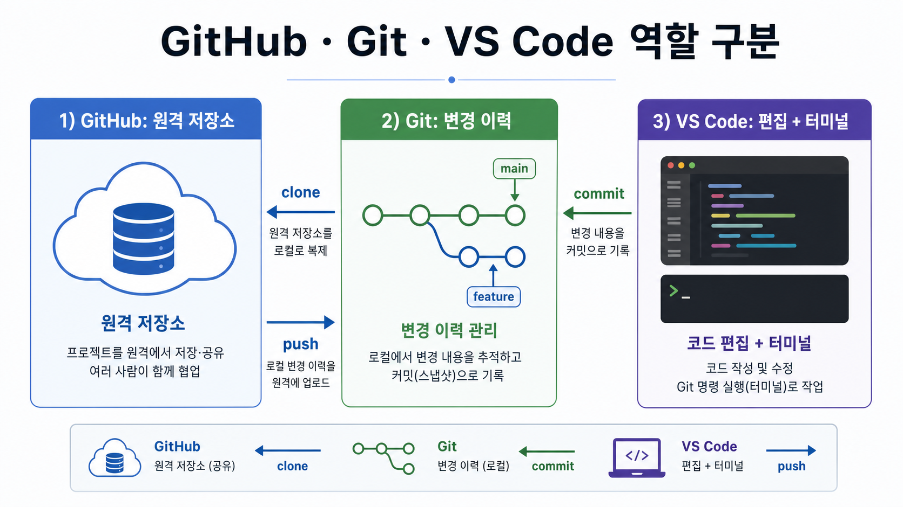
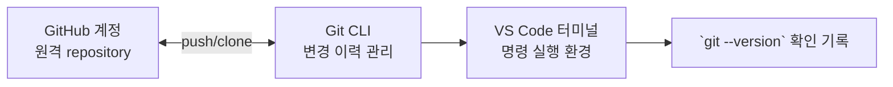

# 2교시: GitHub 계정, Git 설치, VS Code 확인

## 수업 목표
- GitHub 계정, Git 설치, VS Code 터미널 상태를 확인한다.
- 계정/인증 정보와 공개 가능한 확인 기록을 구분한다.
- 설치 확인을 "버전 출력"과 "터미널에서 실행 가능"으로 판단한다.

## 50분 흐름
| 시간 | 활동 |
|---|---|
| 0-5분 | 작업 폴더 경로 점검 |
| 5-15분 | Git, GitHub, VS Code의 역할 구분 |
| 15-30분 | 버전 확인과 VS Code 터미널 확인 |
| 30-40분 | 계정 보안, MFA, 토큰 비공개 기준 정리 |
| 40-50분 | 막힘 기록 분류와 다음 실습 준비 |

## 0-5분 작업 폴더 경로 점검


### 상세 설명
Git은 내 컴퓨터에서 변경 이력을 관리하는 도구이고, GitHub는 repository를 원격에서 공유하고 협업하는 서비스다. VS Code는 코드를 편집하고 터미널을 함께 사용할 수 있는 작업 환경이다. 세 도구는 같은 것이 아니다. GitHub 계정이 있어도 Git이 설치되어 있지 않을 수 있고, Git이 설치되어 있어도 VS Code 터미널에서 명령을 찾지 못할 수 있다.

설치 확인은 "설치한 것 같다"가 아니라 명령 출력으로 판단한다. `git --version`이 나오면 현재 shell에서 Git 실행 파일을 찾았다는 뜻이다. 반대로 command not found가 나오면 설치가 안 되었거나 PATH에 등록되지 않은 상태다.


### 시각 자료 1: 세 도구의 역할 구분


이 이미지는 세 도구를 설치 목록이 아니라 협업 시스템의 서로 다른 책임으로 구분하게 한다. 학생에게 먼저 `clone`, `commit`, `push` 화살표를 읽게 한 뒤, 각 명령이 어느 경계를 넘는지 확인한다.



## 5-15분 Git, GitHub, VS Code의 역할 구분


### 공식 참고
- GitHub account: https://docs.github.com/en/get-started/start-your-journey/creating-an-account-on-github
- Git install: https://git-scm.com/book/en/v2/Getting-Started-Installing-Git
- VS Code docs: https://code.visualstudio.com/docs
- macOS/Linux 설치 가이드: [필수 소프트웨어 설치 가이드](../../docs/software-installation-guide.md)

처음 설치하는 학생은 공식 문서를 모두 읽으려 하기보다 설치 가이드의 순서대로 `git --version`, VS Code 터미널의 `pwd`, `python3 --version`, `curl --version`을 먼저 확인한다. 실패하면 "어떤 도구가 안 되는지"를 분리해서 기록한다.


### 시각 자료 2: 설치 확인 화면 가이드
| 화면/출력 | 확인할 뜻 | README에 남길 것 |
|---|---|---|
| GitHub 로그인 화면 | 계정 접근 가능 | 계정명은 공개 가능하지만 토큰은 기록하지 않는다. |
| `git --version` | 현재 터미널에서 Git 실행 가능 | 버전 문자열 |
| VS Code 터미널의 `pwd` | 편집기 안 터미널 사용 가능 | 작업 경로 또는 막힘 기록 |

## 15-30분 버전 확인과 VS Code 터미널 확인


### 시각 자료 3: 실패 장면 분류
| 실패 장면 | 먼저 의심할 원인 | 학생용 기록 문장 |
|---|---|---|
| `git: command not found` | Git 미설치 또는 PATH 문제 | "Git 명령을 shell이 찾지 못함" |
| `code --version` 실패 | VS Code CLI 미등록 | "GUI 터미널에서 대체 확인함" |
| 인증 팝업 반복 | credential/토큰/권한 문제 | "비밀값은 기록하지 않고 증상만 기록함" |


### 명령 절차
```bash
git --version
pwd
code --version
```

`code --version`이 실패하면 VS Code GUI에서 `Terminal > New Terminal`을 열고 다음을 실행한다.

```bash
pwd
git --version
```

### 챌린저 판단 기준
| 상황 | 진행 가능 여부 | 다음 행동 |
|---|---|---|
| `git --version` 성공, VS Code 터미널에서 `pwd` 성공 | 진행 가능 | repository 실습으로 이동 |
| `code --version`만 실패 | 진행 가능 | VS Code GUI 터미널을 사용하고 막힘 기록에 기록 |
| `git --version` 실패 | 설치 확인 필요 | 설치 가이드의 Git 절차 수행 |
| GitHub 로그인은 되지만 push 실패 | 인증 확인 필요 | 토큰 값 없이 에러 메시지만 기록 |


### 확인 질문
- Git과 GitHub의 차이를 한 문장으로 설명할 수 있는가?
- Git 설치 확인 기록은 무엇인가?
- VS Code가 준비되지 않았을 때 막힘 기록을 어떻게 기록해야 하는가?

## 30-40분 계정 보안, MFA, 토큰 비공개 기준 정리


### 다음 주차 매핑
Docker, Kubernetes, AWS CLI, Terraform도 모두 같은 방식으로 확인한다. `tool --version`, 현재 경로, 인증 상태, 비밀값 비공개 기준은 이후 모든 주차의 공통 준비 절차다.


### 예상 결과
- `git --version`은 `git version 2.x.x` 형태의 문자열을 출력한다.
- `pwd`는 현재 작업 경로를 출력한다.
- `code --version`은 VS Code CLI가 PATH에 있을 때만 성공한다. 실패해도 VS Code 내부 터미널에서 `pwd`와 `git --version`이 되면 수업 진행은 가능하다.


### 흔한 오해
| 오해 | 교정 |
|---|---|
| GitHub에 로그인했으니 Git도 설치된 것이다. | GitHub는 웹 서비스이고 Git은 로컬 CLI 도구다. |
| `code --version` 실패는 VS Code 미설치와 같다. | CLI 등록만 안 된 상태일 수 있다. GUI 터미널에서 확인한다. |
| 토큰을 README에 붙이면 인증 문제가 해결된다. | 토큰은 비밀값이다. 공개 repository에 절대 남기지 않는다. |

## 40-50분 막힘 기록 분류와 다음 실습 준비


### 실습 확인 기록
| 단계 | 명령 또는 확인 | 확인 기록 |
|---|---|---|
| Git 확인 | `git --version` | |
| 현재 위치 | `pwd` | |
| VS Code 터미널 | `pwd` 또는 막힘 기록 | |
| 계정 보안 | MFA/토큰 비공개 확인 | |


### 학술 근거와 DevOps 관점
NIST NICE류 실무 역량은 도구 설치 자체보다 시스템 상태 식별을 강조한다. 현업에서는 "제 노트북에서는 됩니다"라는 말이 충분하지 않다. 어떤 shell에서 어떤 버전이 실행되는지 기록해야 팀원이 같은 문제를 재현할 수 있다.


### 평가 기준
| 기준 | 2점 확인 기록 |
|---|---|
| 50분 참여 | 시간 흐름에 맞춰 설명, 활동, 산출물 작성에 참여했다. |
| 증거 산출 | 수업에서 요구한 기록, 명령, 표, 막힘 기록 중 해당 산출물을 구체적으로 남겼다. |
| 전이 연결 | 오늘 개념이 Week2~5 기술 또는 자기 산출물과 어떻게 연결되는지 한 문장 이상 설명했다. |
