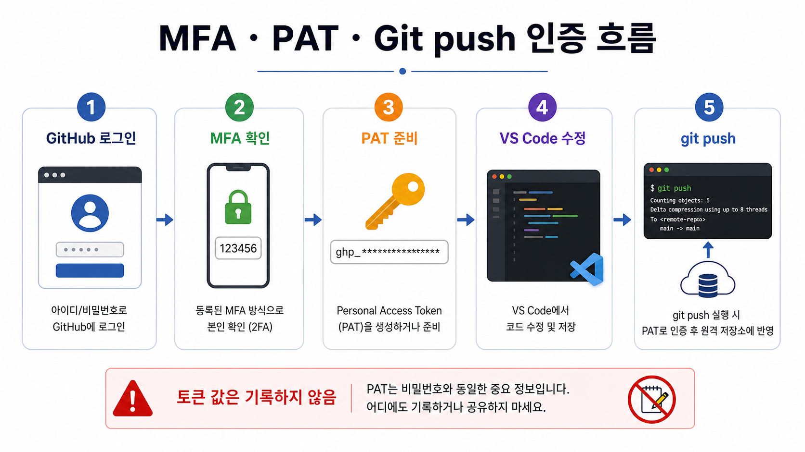
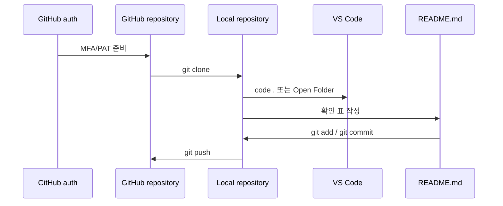
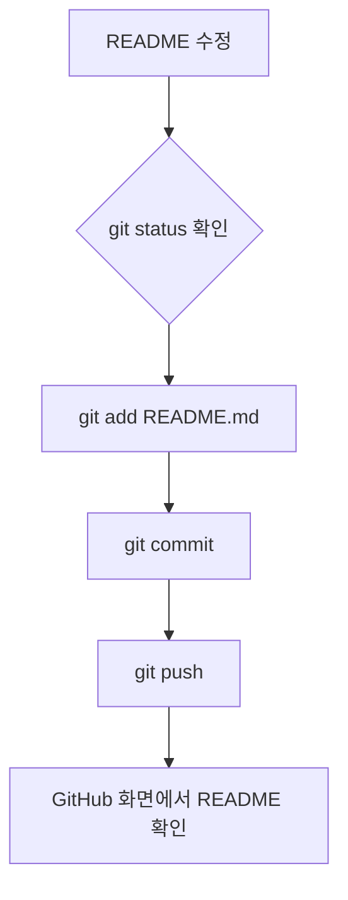

# 3교시: Git/GitHub/VS Code 기본 실습 - clone, MFA/PAT, commit, push

## 수업 목표
- GitHub repository를 만들고 clone, commit, push 흐름을 수행한다.
- clone한 repository를 VS Code에서 열고 README를 수정한다.
- GitHub MFA와 personal access token(PAT) 설정 흐름을 이해한다.
- 토큰, MFA 코드, 복구 코드를 기록하지 않는 보안 기준을 적용한다.
- README를 첫 handoff/확인 기록 문서로 작성한다.

## 50분 흐름
| 시간 | 활동 |
|---|---|
| 0-5분 | Git/VS Code 준비 상태 점검 |
| 5-15분 | repository, commit, remote, 인증 흐름 설명 |
| 15-28분 | repository 생성, clone, VS Code 열기, README 작성 |
| 28-40분 | MFA 확인, PAT 생성 기준, commit/push |
| 40-50분 | 실패 증상과 인증 막힘 기록 정리 |

## 0-5분 Git/VS Code 준비 상태 점검
- 완료 조건: Git CLI와 VS Code 터미널 준비 상태를 말할 수 있다.

### 준비 확인
```bash
git --version
pwd
```

VS Code CLI가 등록되어 있으면 아래 명령도 확인한다.

```bash
code --version
```

`code --version`이 실패해도 수업 진행은 가능하다. VS Code GUI에서 `File > Open Folder` 또는 `Terminal > New Terminal`을 사용할 수 있으면 된다.

### 시각 자료 1: clone부터 push까지


이 이미지는 Git 작업 실패를 “Git이 어렵다”로 뭉개지 않고 계정 로그인, MFA, PAT, 로컬 변경, push의 단계별 문제로 분리하게 한다. 토큰 값은 수업 산출물에 기록하지 않고, 생성 여부와 push 결과만 확인 기록으로 남긴다.



## 5-15분 repository, commit, remote, 인증 흐름 설명
- 완료 조건: 학생이 GitHub 비밀번호, MFA, PAT, credential manager의 차이를 구분한다.

Git commit은 단순 저장이 아니라 "어떤 변경을 어떤 이유로 남겼는가"를 기록하는 단위다. GitHub repository는 그 기록을 다른 사람과 공유하는 원격 장소다. README는 repository에 들어온 사람이 가장 먼저 읽는 실행 설명서이자 확인 기록 목차다.

MFA는 GitHub 계정 로그인을 보호하는 장치다. PAT는 HTTPS push나 API 접근에서 비밀번호 대신 쓰는 제한된 access token이다. 수업에서 확인할 것은 설정 상태와 막힘 기록이지, 토큰 값 자체가 아니다.

### 공식 참고
- Creating a repository: https://docs.github.com/en/repositories/creating-and-managing-repositories/creating-a-new-repository
- About README files: https://docs.github.com/en/repositories/managing-your-repositorys-settings-and-features/customizing-your-repository/about-readmes
- Configuring two-factor authentication: https://docs.github.com/en/authentication/securing-your-account-with-two-factor-authentication-2fa/configuring-two-factor-authentication
- Managing personal access tokens: https://docs.github.com/en/authentication/keeping-your-account-and-data-secure/managing-your-personal-access-tokens

### 시각 자료 2: Git 단계별 확인 기록 표
| 단계 | 보이는 확인 기록 | 운영 의미 |
|---|---|---|
| MFA 확인 | GitHub 로그인 후 2FA challenge 통과 | 계정 보호 기준을 충족했다. |
| PAT 준비 | 토큰 값이 아니라 설정 여부와 만료일만 기록 | HTTPS push 인증 수단을 준비했다. |
| clone 직후 | repository 폴더 생성 | 원격 기준을 로컬로 가져왔다. |
| VS Code 열기 | Explorer에 repository 파일 표시 | 수정할 작업공간을 확인했다. |
| commit 직후 | commit hash 출력 | 변경 이유가 로컬 이력에 남았다. |
| push 직후 | GitHub README 표시 | 팀원이 같은 확인 기록을 볼 수 있다. |

## 15-28분 repository 생성, clone, VS Code 열기, README 작성
- 완료 조건: repository 폴더가 로컬에 있고, VS Code에서 README를 수정한다.

GitHub 웹에서 새 repository를 만든 뒤 `<YOUR_REPOSITORY_URL>`을 자신의 주소로 바꿔 실행한다.

```bash
git clone <YOUR_REPOSITORY_URL>
cd <YOUR_REPOSITORY_NAME>
git status
```

VS Code CLI가 등록되어 있으면 repository 폴더를 바로 연다.

```bash
code .
```

`code .`가 실패하면 VS Code GUI에서 `File > Open Folder`를 선택하고 clone한 repository 폴더를 연다.

README에 다음 표를 작성한다. 토큰, 비밀번호, MFA 코드, 복구 코드는 쓰지 않는다.

| 확인 항목 | 값 |
|---|---|
| git 버전 | |
| repository URL | |
| working directory | |
| VS Code open method | `code .` 또는 `Open Folder` |
| MFA 상태 | 활성화/막힘 |
| PAT 상태 | 준비됨/막힘, 값 기록 금지 |

### 시각 자료 3: README 변경 흐름


## 28-40분 MFA 확인, PAT 생성 기준, commit/push
- 완료 조건: push 성공 또는 인증 막힘 기록을 안전하게 기록한다.

### MFA 설정 기준
GitHub 웹에서 push 권한과 계정 보호를 다룰 때 MFA는 선택 장식이 아니라 기본 보안 조건이다. 수업에서는 MFA 비밀값, 복구 코드, 인증 앱 화면을 공유하지 않는다.

1. GitHub 우측 상단 profile menu에서 `Settings`로 이동한다.
2. `Password and authentication`에서 Two-factor authentication 설정 상태를 확인한다.
3. 가능한 경우 TOTP authenticator app을 우선 사용한다.
4. 복구 코드는 개인이 안전하게 보관하고 README, 채팅, 화면 캡처에 남기지 않는다.

### PAT 생성 기준
HTTPS로 `git push`가 인증을 요구할 때는 GitHub 비밀번호를 쓰지 않고 PAT 또는 credential manager 흐름을 사용한다. GitHub 공식 문서는 command line/API 인증에서 personal access token을 비밀번호 대신 사용할 수 있다고 설명한다.

수업용 fine-grained PAT 권장값:

| 설정 | 권장값 |
|---|---|
| Token type | Fine-grained token |
| Expiration | 수업 기간에 맞춘 짧은 만료일 |
| Repository access | Only select repositories |
| Selected repository | 오늘 만든 repository |
| Repository permissions | Contents: Read and write, Metadata: Read-only |
| 기록 금지 | 토큰 값, 복구 코드, MFA 코드 |

생성 절차:
1. GitHub `Settings > Developer settings > Personal access tokens > Fine-grained tokens`로 이동한다.
2. `Generate new token`을 선택한다.
3. token name, expiration, repository access, permission을 위 표처럼 최소 범위로 지정한다.
4. 생성된 토큰 값은 한 번만 보인다. 복사해서 credential prompt에만 사용하고 README에 붙이지 않는다.
5. 토큰을 잃어버리면 재확인하지 않고 폐기 후 새로 만든다.

README를 저장한 뒤 VS Code 터미널에서 실행한다.

```bash
git status
git add README.md
git commit -m "Add week 1 확인 표"
git push
```

`git push`에서 username/비밀번호를 묻는 경우:
- username에는 GitHub username을 입력한다.
- 비밀번호 자리에는 GitHub 비밀번호가 아니라 PAT를 입력한다.
- Git Credential Manager 또는 browser login이 뜨면 공식 인증 흐름을 따른다.
- 토큰 값은 터미널 출력, README, 스크린샷, 채팅에 남기지 않는다.

## 40-50분 실패 증상과 인증 막힘 기록 정리
- 완료 조건: GitHub README 표시됨 여부와 인증 막힘 기록을 확인 기록으로 남긴다.

### 실패 증상 분류
| 증상 | 먼저 확인할 것 | 기록 금지 |
|---|---|---|
| Authentication failed | PAT permission/expiration, credential cache | 토큰 값 |
| 403 | repository permission, selected repository scope | 토큰 값 |
| Repository not found | repository URL, owner/name typo | 토큰 값 |
| credential prompt 반복 | credential manager cache, wrong token | 토큰 값 |

### 실습 확인 기록
| 확인 항목 | 값 |
|---|---|
| repository URL | |
| 첫 commit 메시지 | |
| `git status` push 후 | |
| GitHub README 표시됨 | 예/아니오 |
| MFA 상태 | 활성화/막힘 |
| PAT 상태 | 준비됨/막힘, 값 기록 금지 |
| 인증 막힘 기록 | 없음 또는 증상만 기록 |

### 흔한 오해
| 오해 | 교정 |
|---|---|
| commit은 push와 같다. | commit은 로컬 기록이고 push는 원격 전송이다. |
| README는 마지막에 쓰는 문서다. | README는 실행 조건과 확인 기록을 계속 누적하는 문서다. |
| MFA를 켜면 push도 자동으로 된다. | MFA는 웹 로그인 보호이고, HTTPS push에는 PAT 또는 credential manager 인증이 별도로 필요할 수 있다. |
| PAT는 GitHub 비밀번호와 같다. | PAT는 범위와 만료가 있는 access token이다. 값은 비밀번호처럼 보호하고 필요 최소 권한으로 만든다. |
| 인증 오류는 Git 문제다. | 토큰 권한, credential manager, repository 권한, URL 오타 문제일 수 있다. 증상을 기록한다. |

### 학술 근거와 DevOps 관점
소프트웨어 공학에서 형상 관리는 변경 통제의 핵심이다. DevOps 현업에서는 배포 가능한 변경을 commit, pull request, release로 추적한다. 여기에 인증과 권한 관리가 붙으면 "누가 어떤 권한으로 어떤 변경을 원격에 보냈는가"까지 운영 확인 기록이 된다. 작은 README commit이라도 "변경을 설명하고 보호된 계정으로 공유한다"는 협업의 기본 단위다.

### 다음 주차 매핑
컨테이너 실행 환경 정의, Kubernetes manifest, Terraform file도 모두 Git에 남는다. commit message와 README 확인 기록은 나중에 배포 변경과 장애 원인을 추적하는 최소 단서가 된다.

### 평가 기준
| 기준 | 2점 확인 기록 |
|---|---|
| Git/GitHub/VS Code 연결 | repository를 clone하고 VS Code에서 열어 README를 수정했다. |
| 인증 준비 | MFA/PAT 상태를 토큰 값 없이 기록했다. |
| commit/push | README 변경을 commit하고 push하거나, 실패 증상을 비밀값 없이 기록했다. |
| 보안 책임 | 토큰, MFA 코드, 복구 코드를 README, 스크린샷, 채팅에 남기지 않았다. |
