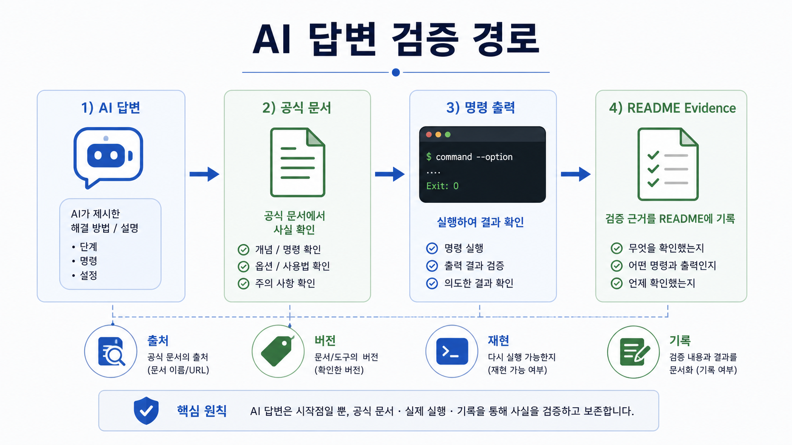
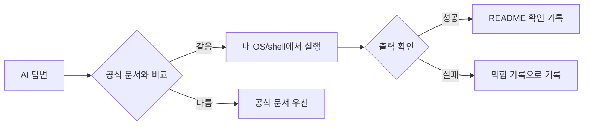

# 4교시: 공식 문서 읽기와 AI 답변 검증

## 수업 목표
- 공식 문서에서 버전, 사전 조건, install 경로, warning을 찾는다.
- AI 답변을 공식 문서와 실행 증거로 검증하는 기준을 만든다.
- "그럴듯한 설명"과 "재현 가능한 절차"를 구분한다.

## 50분 흐름
| 시간 | 활동 |
|---|---|
| 0-5분 | GitHub README 확인 기록 점검 |
| 5-15분 | 공식 문서가 기준이 되는 이유 설명 |
| 15-30분 | Git/GitHub/VS Code 문서 중 하나를 읽고 표 작성 |
| 30-40분 | AI 답변 검증 체크리스트 적용 |
| 40-50분 | 문서의 사전 조건과 warning 공유 |

## 0-5분 GitHub README 확인 기록 점검

### 상세 설명
AI 답변과 블로그 글은 빠른 출발점이 될 수 있지만, 현재 버전과 내 환경에 맞는다는 보장은 없다. 공식 문서는 도구 제작자가 유지하는 기준 문서이며, 버전, 사전 조건, warning, deprecation을 확인할 수 있는 곳이다.

현업에서 문서를 읽는 목적은 모든 문장을 외우는 것이 아니다. 실행 전에 반드시 알아야 하는 전제 조건을 찾는 것이다. 예를 들어 설치 문서는 OS별 차이를 설명하고, GitHub 문서는 계정과 인증의 보안 조건을 설명하며, HTTP 문서는 request/response의 기본 구조를 설명한다.

### 시각 자료 1: AI 답변 검증 경로

이 이미지는 AI 답변을 최종 답으로 취급하지 않고 공식 문서, 로컬 명령 출력, README 확인 기록으로 좁혀 검증하는 절차를 보여준다. Day2에서는 이 흐름을 Git/GitHub/VS Code 수준에 한정한다.

## 5-15분 공식 문서가 기준이 되는 이유 설명

### 시각 자료 2: 공식 문서 읽기 위치
| 문서에서 찾을 위치 | 확인 질문 | 기록 예시 |
|---|---|---|
| 사전 조건 | 실행 전에 필요한 조건은 무엇인가? | OS, 계정, 설치 도구 |
| 주의 사항 | 실수하면 위험한 부분은 무엇인가? | 비밀값 노출, 비용 발생 |
| 명령 section | 실제로 따라 할 명령은 무엇인가? | 명령과 출력 요약 |

## 15-30분 Git/GitHub/VS Code 문서 중 하나를 읽고 표 작성

### 시각 자료 3: AI 답변 캡처/기록 기준
| 캡처/기록 대상 | 확인 기록으로 인정되는 조건 |
|---|---|
| 공식 문서 URL | 읽은 section이나 keyword가 함께 있어야 한다. |
| AI 답변 일부 | 공식 문서와 실행 결과로 확인한 부분만 사용한다. |
| 오류 메시지 | 토큰, email, private URL은 가리고 증상만 남긴다. |

### 활동 절차
Git, GitHub README, VS Code 문서 중 하나를 고른다. 문서에서 다음 항목을 찾아 기록한다.

| 항목 | 기록 |
|---|---|
| 문서 제목 | |
| URL | |
| 대상 OS/버전 | |
| 사전 조건 | |
| 주의 사항 | |
| 내가 실행한 명령 | |
| 실행 결과 | |

AI 답변을 받은 경우 다음 표로 검증한다.

| 검증 질문 | 확인 기록 |
|---|---|
| 공식 문서와 같은가? | URL/section |
| 명령을 실제 실행했는가? | 명령/출력 |
| 내 OS와 shell에 맞는가? | OS/shell |
| 비밀값이나 토큰 노출을 요구하는가? | 예/아니오 |
| 비용이나 외부 서비스를 만들게 하는가? | 예/아니오 |

### 확인 질문
- 오늘 읽은 공식 문서의 사전 조건은 무엇인가?
- AI 답변에서 실행으로 검증한 부분과 검증하지 못한 부분은 무엇인가?
- 주의 사항을 무시하면 어떤 운영 문제가 생길 수 있는가?

## 30-40분 AI 답변 검증 체크리스트 적용

### 다음 주차 매핑
Docker, Kubernetes, AWS, Terraform은 모두 공식 문서가 방대하다. 오늘의 읽기 방식은 이후 Docker 실행 문서, Kubernetes manifest, AWS IAM, Terraform provider 문서를 읽을 때 그대로 사용한다.

### 예상 결과
- 공식 문서 URL과 읽은 section이 기록된다.
- AI 답변에서 확인되지 않은 부분은 "미검증"으로 남긴다.
- 실행하지 않은 명령은 확인 기록으로 쓰지 않는다.

### 흔한 오해
| 오해 | 교정 |
|---|---|
| 공식 문서는 챌린저에게 너무 어렵다. | 전체를 읽지 말고 사전 조건, 버전, warning, 명령부터 찾는다. |
| AI가 알려준 명령은 검증하지 않아도 된다. | 내 환경에서 실행 결과가 나와야 확인 기록이다. |
| 블로그가 최신이면 공식 문서보다 낫다. | 공식 문서와 충돌하면 공식 문서를 우선한다. |

## 40-50분 문서의 사전 조건과 warning 공유

### 실습 확인 기록
| 확인 항목 | 값 |
|---|---|
| 공식 문서 URL | |
| 확인한 키워드 | |
| 실행한 명령 | |
| AI 답변 채택/거절 이유 | |

### 학술 근거와 DevOps 관점
Bloom의 evaluate 단계는 정보를 비교하고 근거로 판단하는 능력을 요구한다. DevOps에서는 자동화 도구가 빠르게 바뀌므로 기억보다 검증 절차가 더 오래 간다. 공식 문서, 실행 결과, 보안 기준을 함께 보는 습관이 production 사고를 줄인다.

### 평가 기준
| 기준 | 2점 확인 기록 |
|---|---|
| 50분 참여 | 시간 흐름에 맞춰 설명, 활동, 산출물 작성에 참여했다. |
| 증거 산출 | 수업에서 요구한 기록, 명령, 표, 막힘 기록 중 해당 산출물을 구체적으로 남겼다. |
| 전이 연결 | 오늘 개념이 Week2~5 기술 또는 자기 산출물과 어떻게 연결되는지 한 문장 이상 설명했다. |

### 공식/학술 근거 링크
- RFC 9110: HTTP Semantics, https://datatracker.ietf.org/doc/html/rfc9110 - HTTP method, status code, resource를 판단하는 공식 표준이다.
- MDN HTTP Overview, https://developer.mozilla.org/en-US/docs/Web/HTTP/Guides/Overview - request/response 흐름을 챌린저에게 설명하는 공식 웹 문서다.
- Stanford CS144, https://stanford.edu/class/cs144/ - 네트워크 통신, reliability, routing을 컴퓨팅 기초로 연결하는 대학 강의다.
