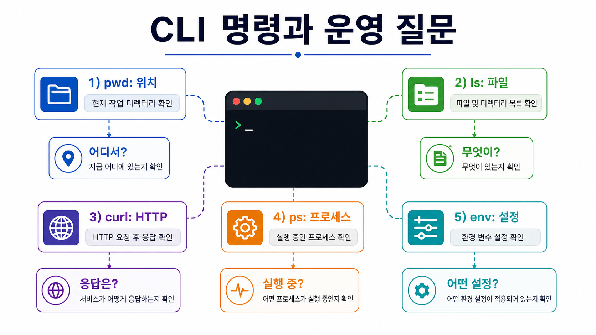
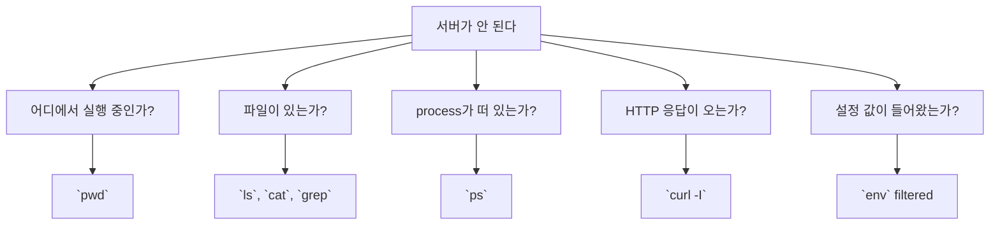

# 5교시: Linux/CLI 기본 - pwd, ls, cd, cat, grep, curl, ps, kill, env

## 수업 목표
- 기본 CLI 명령을 서비스 상태 확인 목적과 연결한다.
- 명령 암기가 아니라 어떤 상태를 확인하는 명령인지 설명한다.
- command output을 README evidence로 요약한다.

## 50분 흐름
| Time | Activity |
|---|---|
| 0-5분 | 공식 문서 읽기 evidence 확인 |
| 5-15분 | CLI를 운영 관찰 도구로 설명 |
| 15-35분 | 명령 실행, 결과 관찰, 표 작성 |
| 35-45분 | 실패 메시지와 권한/경로 문제 구분 |
| 45-50분 | 다음 교시 process 개념으로 연결 |

## 0-5분 공식 문서 읽기 evidence 확인

- 진행: 공식 문서 읽기 evidence 확인

- 완료 조건: 아래 자료를 사용해 이 시간 블록의 산출물을 만든다.


### 상세 설명
CLI는 "검은 화면"이 아니라 시스템 상태를 직접 묻는 인터페이스다. `pwd`는 내가 어디에 있는지, `ls`는 어떤 파일이 있는지, `cat`은 파일 내용이 무엇인지, `grep`은 증거 문자열이 어디에 있는지 확인한다. `curl`은 HTTP 응답을 확인하고, `ps`는 실행 중인 process를 확인한다. `env`는 실행 환경에 들어온 설정 값을 보여준다.

좋은 운영자는 명령 이름보다 질문을 먼저 생각한다. "서버가 안 된다"는 질문을 "파일이 있는가", "process가 떠 있는가", "port로 응답하는가", "config가 들어왔는가"로 나누면 CLI 명령이 자연스럽게 선택된다.


### Visual 1: 운영 질문에서 CLI 선택하기


이 이미지는 명령어 암기가 아니라 운영 질문에서 관찰 도구를 고르는 훈련을 만든다. 강사는 `pwd`, `ls`, `curl`, `ps`, `env`가 각각 어떤 종류의 evidence를 주는지 짧게 연결한다.



## 5-15분 CLI를 운영 관찰 도구로 설명

- 진행: CLI를 운영 관찰 도구로 설명

- 완료 조건: 아래 자료를 사용해 이 시간 블록의 산출물을 만든다.


### Visual 2: CLI 관찰 화면
| 관찰 화면 | evidence로 남길 최소 내용 |
|---|---|
| `cat cli-evidence.txt` | `status=ok`, `port=8000`이 보였는지 |
| `grep port cli-evidence.txt` | 검색된 한 줄 |
| `curl -I https://example.com` | status line과 대표 header |

## 15-35분 명령 실행, 결과 관찰, 표 작성

- 진행: 명령 실행, 결과 관찰, 표 작성

- 완료 조건: 아래 자료를 사용해 이 시간 블록의 산출물을 만든다.


### Visual 3: 안전한 CLI 기록 기준
| 주의 표시 | 학생 행동 |
|---|---|
| `env` 출력에 token/key가 보임 | 전체 복사하지 말고 key 이름만 기록한다. |
| `ps` 출력이 길게 나옴 | 오늘 실행한 shell/process 중심으로 요약한다. |
| `kill` 대상이 불명확함 | 종료하지 않고 `kill -l` 개념 확인만 한다. |


### 명령 매핑
| Command | 확인하는 것 | 운영 질문 |
|---|---|---|
| `pwd` | 현재 path | 어디에서 실행 중인가? |
| `ls` | file/storage 상태 | 필요한 파일이 있는가? |
| `cd` | 작업 위치 변경 | 올바른 directory로 이동했는가? |
| `cat` | file content | 파일 내용이 기대와 같은가? |
| `grep` | text evidence 검색 | 로그/문서에 단서가 있는가? |
| `curl` | HTTP response | 네트워크 요청에 응답하는가? |
| `ps` | process | 실행 중인 program이 있는가? |
| `kill` | process lifecycle | 종료해야 할 process는 무엇인가? |
| `env` | environment | 어떤 설정이 들어왔는가? |


### 명령 절차
```bash
pwd
ls
printf 'status=ok\nport=8000\n' > cli-evidence.txt
cat cli-evidence.txt
grep port cli-evidence.txt
env | grep -E 'SHELL|HOME|PATH'
ps
curl -I https://example.com
```

`kill`은 실제 대상 process를 이해한 뒤 사용한다. 오늘은 다음처럼 도움말 또는 개념만 확인한다.

```bash
kill -l
```

## 35-45분 실패 메시지와 권한/경로 문제 구분

- 진행: 실패 메시지와 권한/경로 문제 구분

- 완료 조건: 아래 자료를 사용해 이 시간 블록의 산출물을 만든다.


### 확인 질문
- 파일 존재 여부를 확인하는 명령은 무엇인가?
- HTTP 응답을 확인할 때 브라우저 대신 `curl`을 쓰는 이유는 무엇인가?
- `ps`와 `env`가 각각 보여주는 상태는 무엇인가?


### 다음 주차 매핑
이후 주차의 container 상태 조회, cluster 상태 조회, cloud identity 확인, infrastructure 변경 검토도 모두 CLI로 시스템 상태를 묻는 확장판이다.


### 예상 결과
- `cat cli-evidence.txt`는 `status=ok`, `port=8000`을 출력한다.
- `grep port cli-evidence.txt`는 `port=8000` 줄만 출력한다.
- `curl -I https://example.com`은 HTTP header와 status line을 출력한다.
- `env | grep ...`은 secret 값이 아니라 일반 환경 키 일부만 보여야 한다.


### 흔한 오해
| 오해 | 교정 |
|---|---|
| CLI 명령은 외우는 과목이다. | 운영 질문에 맞는 관찰 도구로 선택한다. |
| `kill`은 오류를 고치는 명령이다. | process 종료 명령이다. 원인을 이해하지 못하면 증거를 잃을 수 있다. |
| `env` 출력은 전부 README에 붙여도 된다. | token, key, credential이 섞일 수 있으므로 필요한 key 이름만 기록한다. |

## 45-50분 다음 교시 process 개념으로 연결

- 진행: 다음 교시 process 개념으로 연결

- 완료 조건: 아래 자료를 사용해 이 시간 블록의 산출물을 만든다.


### 실습 Evidence
| Command | 확인한 상태 | 결과 요약 |
|---|---|---|
| `pwd` | path | |
| `ls` | files | |
| `cat cli-evidence.txt` | file content | |
| `grep port cli-evidence.txt` | text search | |
| `curl -I https://example.com` | HTTP response | |
| `ps` | process | |
| `env` filtered | config keys | |


### 학술 근거와 현업 DevOps insight
운영 자동화는 수동 관찰 절차를 코드로 바꾸는 일에서 시작한다. CLI evidence를 읽지 못하면 CI log, container log, Kubernetes event도 읽기 어렵다. 오늘의 명령은 이후 자동화 스크립트와 health check의 원형이다.


### 평가 기준
| 기준 | 2점 evidence |
|---|---|
| 50분 참여 | 시간 흐름에 맞춰 설명, 활동, 산출물 작성에 참여했다. |
| 증거 산출 | 수업에서 요구한 note, command, table, blocker 중 해당 산출물을 구체적으로 남겼다. |
| 전이 연결 | 오늘 개념이 Week2~6 기술 또는 자기 산출물과 어떻게 연결되는지 한 문장 이상 설명했다. |


### 공식/학술 근거 링크
- RFC 9110: HTTP Semantics, https://datatracker.ietf.org/doc/html/rfc9110 - HTTP status와 resource 확인을 evidence로 쓰는 공식 기준이다.
- MDN HTTP Overview, https://developer.mozilla.org/en-US/docs/Web/HTTP/Guides/Overview - browser와 local server 관찰을 request/response 흐름으로 설명하는 기준이다.
- Google SRE Book: Introduction, https://sre.google/sre-book/introduction/ - 상태 확인, monitoring, emergency response가 운영 준비에 포함되는 근거다.
