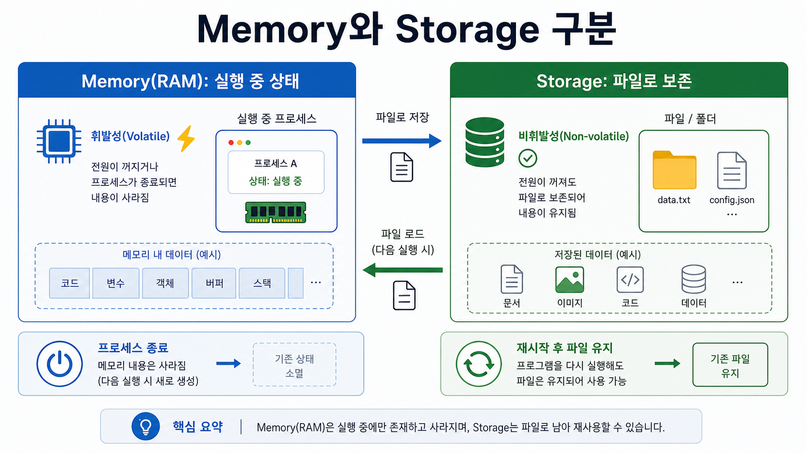
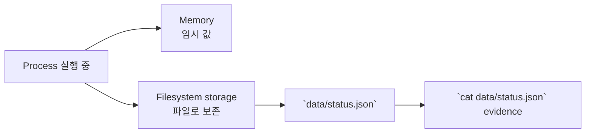

# 7교시: Memory와 storage - RAM, filesystem, path, persistence, permission

## 수업 목표
- memory와 storage의 차이를 설명한다.
- file path, directory, permission이 서비스 실행에 미치는 영향을 설명한다.
- Docker volume, Kubernetes Volume, AWS S3/EBS/RDS의 기초가 storage 개념임을 연결한다.

## 50분 흐름
| Time | Activity |
|---|---|
| 0-5분 | process/exit code evidence 확인 |
| 5-15분 | memory와 storage 차이 설명 |
| 15-30분 | file 생성, 읽기, path 확인 |
| 30-40분 | permission과 persistence 실패 사례 정리 |
| 40-50분 | volume/object/database storage preview |

## 0-5분 process/exit code evidence 확인

- 진행: process/exit code evidence 확인

- 완료 조건: 아래 자료를 사용해 이 시간 블록의 산출물을 만든다.


### 상세 설명
Memory는 process가 실행 중에 빠르게 사용하는 임시 공간이고, storage는 파일이나 데이터를 더 오래 보관하는 공간이다. 컴퓨터를 껐다 켜도 남아야 하는 것은 storage에 있어야 한다. 서비스 운영에서 이 차이는 중요하다. process가 재시작될 때 memory의 값은 사라질 수 있지만, log file, uploaded file, database data는 보존되어야 할 수 있다.

Path는 storage의 위치를 가리키는 주소다. 같은 파일 이름도 어느 directory에서 실행하느냐에 따라 찾을 수도 있고 못 찾을 수도 있다. Permission은 누가 읽고 쓸 수 있는지를 정한다. 권한 실패는 application logic 버그처럼 보일 수 있지만, evidence는 보통 "Permission denied"와 같은 메시지로 드러난다.


### Visual 1: memory와 storage 구분


이 이미지는 실행 중 상태와 파일로 보존되는 상태를 분리해서 보게 한다. 이후 Docker volume, Kubernetes volume, AWS storage를 설명할 때 같은 기준으로 다시 매핑할 수 있다.



## 5-15분 memory와 storage 차이 설명

- 진행: memory와 storage 차이 설명

- 완료 조건: 아래 자료를 사용해 이 시간 블록의 산출물을 만든다.


### Visual 2: 데이터 위치와 보존성
| 데이터 위치 | 재시작 후 기대 | 오늘의 evidence |
|---|---|---|
| process memory | 사라질 수 있다. | 개념 note |
| `data/status.json` 파일 | 파일을 지우지 않으면 남는다. | `ls -la data`, `cat` |
| Git에 추가된 파일 | 다른 컴퓨터로 공유 가능하다. | `git status`에서 추적 여부 확인 |

## 15-30분 file 생성, 읽기, path 확인

- 진행: file 생성, 읽기, path 확인

- 완료 조건: 아래 자료를 사용해 이 시간 블록의 산출물을 만든다.


### Visual 3: storage 캡처 가이드
| 캡처할 장면 | 확인할 부분 |
|---|---|
| `ls -la data` | 권한, 소유자, 크기, 수정 시간 |
| `cat data/status.json` | 저장된 JSON 내용 |
| 현재 `pwd` | 상대 path가 어느 위치 기준인지 |


### 명령 절차
```bash
pwd
mkdir -p week1-lab/data
cd week1-lab
printf '{"status":"ok"}\n' > data/status.json
ls -la
ls -la data
cat data/status.json
```


### 확인 질문
- `data/status.json`은 memory인가 storage인가?
- 경로가 틀리면 서비스는 어떤 증상을 보일 수 있는가?
- 파일 권한 문제는 application bug와 어떻게 다르게 관찰되는가?

## 30-40분 permission과 persistence 실패 사례 정리

- 진행: permission과 persistence 실패 사례 정리

- 완료 조건: 아래 자료를 사용해 이 시간 블록의 산출물을 만든다.


### 다음 주차 매핑
Docker volume은 container lifecycle과 data lifecycle을 분리한다. Kubernetes Volume과 PersistentVolume은 Pod 재시작과 storage 보존을 분리한다. AWS S3, EBS, RDS는 storage 성격이 서로 다르며 Terraform은 그 선택을 코드로 고정한다.


### 예상 결과
- `data/status.json` 파일이 생성된다.
- `cat data/status.json`은 `{"status":"ok"}`를 출력한다.
- `ls -la data`는 파일 권한, 소유자, 크기, 수정 시간을 보여준다.


### 의사결정 표
| 증상 | 먼저 확인할 것 | 관련 명령 |
|---|---|---|
| 파일을 못 찾음 | 현재 path와 file path | `pwd`, `ls` |
| 읽기 실패 | permission | `ls -la` |
| 재시작 후 데이터 사라짐 | memory에만 저장했는지 | README/data note |
| 다른 컴퓨터에서 실행 실패 | 필요한 data file 누락 | `git status`, `ls` |

## 40-50분 volume/object/database storage preview

- 진행: volume/object/database storage preview

- 완료 조건: 아래 자료를 사용해 이 시간 블록의 산출물을 만든다.


### 흔한 오해
| 오해 | 교정 |
|---|---|
| JSON 파일을 만들었으니 memory에 저장한 것이다. | 파일은 storage에 저장된다. process 내부 변수는 memory다. |
| path 문제는 초보 실수라 운영과 관계없다. | production 장애에서도 잘못된 mount path와 working directory는 흔한 원인이다. |
| permission은 보안 수업에서만 중요하다. | 실행 가능 여부, log 작성, 업로드 저장에 직접 영향을 준다. |


### 실습 Evidence
| Evidence | Value |
|---|---|
| project path | |
| data file path | |
| `ls -la data` summary | |
| file content | |


### 학술 근거와 DevOps insight
시스템 교육에서 volatile memory와 persistent storage 구분은 기본이다. DevOps 현업에서는 container 재시작, node 교체, 배포 rollback 때 데이터가 어디에 저장되는지 모르면 장애를 키운다. "데이터가 process 안에 있는가, filesystem에 있는가, 외부 저장소에 있는가"를 계속 질문해야 한다.


### 평가 기준
| 기준 | 2점 evidence |
|---|---|
| 50분 참여 | 시간 흐름에 맞춰 설명, 활동, 산출물 작성에 참여했다. |
| 증거 산출 | 수업에서 요구한 note, command, table, blocker 중 해당 산출물을 구체적으로 남겼다. |
| 전이 연결 | 오늘 개념이 Week2~6 기술 또는 자기 산출물과 어떻게 연결되는지 한 문장 이상 설명했다. |


### 공식/학술 근거 링크
- Google SRE Book: Introduction, https://sre.google/sre-book/introduction/ - monitoring, emergency response, change management가 운영 책임에 포함되는 근거다.
- Google SRE Book: Postmortem Culture, https://sre.google/sre-book/postmortem-culture/ - 로그와 timeline을 blame이 아니라 학습 evidence로 다루는 기준이다.
- MIT Missing Semester, https://missing.csail.mit.edu/ - debugging과 shell 기록을 실무형 학습 증거로 연결한다.
