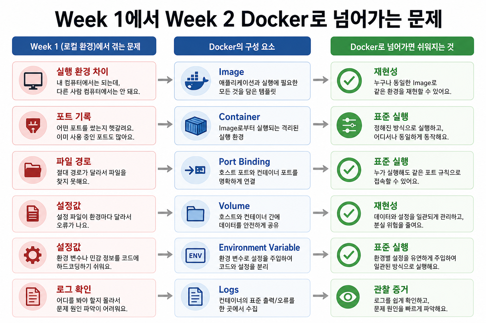
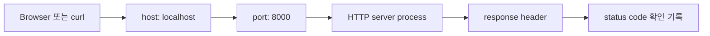

# 8교시: Network/HTTP 기본 - localhost, IP, DNS, TCP, port, request/response, status code

## 수업 목표
- localhost, IP, DNS, TCP, port를 구분한다.
- HTTP request와 response의 기본 구조를 설명한다.
- "process가 실행 중"과 "네트워크로 접근 가능"이 다를 수 있음을 설명한다.

## 50분 흐름
| 시간 | 활동 |
|---|---|
| 0-5분 | memory/storage 확인 기록 점검 |
| 5-15분 | 주소, port, protocol의 역할 설명 |
| 15-30분 | HTTP header와 status code 관찰 |
| 30-40분 | 200/404/500 의미와 오해 정리 |
| 40-50분 | Day3 로컬 정적 서버 실행 준비 |

## 0-5분 memory/storage 확인 기록 점검


### 상세 설명
Network는 process와 process가 서로 통신하게 해주는 연결 구조다. IP는 host를 찾는 주소이고, DNS는 사람이 읽기 쉬운 이름을 IP로 바꾸는 체계다. Port는 같은 host 안에서 어떤 process로 연결할지 구분하는 입구다. Protocol은 대화 규칙이며, HTTP는 web에서 request와 response를 주고받는 대표적인 protocol이다.

`localhost`는 내 컴퓨터 자신을 가리키는 이름이다. Day3에서 `python3 -m http.server 8000`을 실행하면 내 컴퓨터의 8000번 port로 HTTP 요청을 받는 process가 생긴다. 이때 process가 떠 있어도 firewall, port 충돌, 잘못된 URL 때문에 접근이 실패할 수 있다.


### 시각 자료 1: process에서 HTTP response까지


이 그림은 로컬 process, port, HTTP 확인이 나중에 Docker port publishing과 Kubernetes Service로 확장되는 방향을 보여준다. 오늘은 `curl -I`로 status line을 읽는 연습에 집중한다.



## 5-15분 주소, port, protocol의 역할 설명


### 공식 참고
- MDN HTTP Overview: https://developer.mozilla.org/en-US/docs/Web/HTTP/Guides/Overview


### 핵심 개념
| 개념 | 질문 |
|---|---|
| localhost | 내 컴퓨터 자신을 가리키는 주소인가? |
| IP | 어떤 host로 갈 것인가? |
| DNS | 이름을 주소로 바꿀 수 있는가? |
| TCP | 연결 기반 전송이 가능한가? |
| Port | 어떤 process 입구로 갈 것인가? |
| Protocol | 어떤 규칙으로 대화할 것인가? |
| status code | 요청 결과를 어떻게 분류하는가? |


### 시각 자료 2: URL 구성요소 읽기
| URL 조각 | 의미 | Day3에서 확인할 예 |
|---|---|---|
| `http` | 대화 protocol | HTTP 요청 |
| `localhost` | 내 컴퓨터 host | 로컬 서버 |
| `8000` | process로 들어가는 port | `python3 -m http.server 8000` |
| `/index.html` | 요청 경로 | 파일 존재 여부 |

## 15-30분 HTTP header와 status code 관찰


### 시각 자료 3: HTTP 상태 분류
| 상태 | 초급 해석 | 먼저 볼 곳 |
|---|---|---|
| 200 | 요청한 resource를 받음 | 파일 내용과 화면 |
| 404 | 경로 또는 파일을 찾지 못함 | URL 경로, 파일 위치 |
| 500 | 서버 내부 처리 실패 | server log, 실행 오류 |


### 명령 절차
```bash
curl -I https://example.com
curl -I https://example.com/no-such-page
```

Day3 예고로 URL 구조를 분해한다.

http://localhost:8000/index.html
protocol: http
host: localhost
port: 8000
경로: /index.html


### 확인 질문
- `localhost:8000`에서 `8000`은 무엇을 의미하는가?
- 200, 404, 500은 각각 어떤 종류의 단서인가?
- Docker port binding, Kubernetes Service, AWS security group은 어떤 network 개념과 연결되는가?

## 30-40분 200/404/500 의미와 오해 정리


### 다음 주차 매핑
Docker의 port publishing, Kubernetes Service/Ingress, AWS security group/ALB, Terraform security group rule은 모두 오늘 배운 host, port, protocol, 상태 개념 위에 올라간다. Day3는 이 개념으로 로컬 정적 서버를 실행한다.


### 예상 결과
- 첫 번째 `curl -I`은 보통 `HTTP/1.1 200 OK` 또는 HTTP/2의 200 상태를 보여준다.
- 없는 경로 요청은 서버 설정에 따라 404 또는 다른 redirect/상태가 나올 수 있다. 핵심은 status line을 읽는 것이다.
- `curl -I`은 body가 아니라 header 중심으로 응답 상태를 확인한다.


### 흔한 오해
| 오해 | 교정 |
|---|---|
| process가 있으면 반드시 접속된다. | port listening, firewall, URL, protocol이 맞아야 한다. |
| 404는 서버가 죽었다는 뜻이다. | 서버는 응답했지만 해당 경로의 resource가 없다는 뜻이다. |
| 브라우저 확인만으로 충분하다. | `curl`은 header/status를 더 명확히 확인 기록으로 남긴다. |

## 40-50분 Day3 로컬 정적 서버 실행 준비


### 실습 확인 기록
| 질문 | 내 답 |
|---|---|
| 브라우저와 curl은 어떤 차이가 있는가? | |
| 오늘 확인한 HTTP status는 무엇인가? | |
| Day3에서 열 port는 무엇인가? | |


### 학술 근거와 DevOps 관점
네트워크 문제 분석은 계층을 나누는 사고에서 시작한다. host를 찾지 못하는 문제, port가 닫힌 문제, HTTP 상태가 실패인 문제는 서로 다르다. 현업에서 "접속이 안 된다"는 보고는 URL, 상태, port, process 확인 기록이 있어야 빠르게 처리된다.


### 평가 기준
| 기준 | 2점 확인 기록 |
|---|---|
| 50분 참여 | 시간 흐름에 맞춰 설명, 활동, 산출물 작성에 참여했다. |
| 증거 산출 | 수업에서 요구한 기록, 명령, 표, 막힘 기록 중 해당 산출물을 구체적으로 남겼다. |
| 전이 연결 | 오늘 개념이 Week2~5 기술 또는 자기 산출물과 어떻게 연결되는지 한 문장 이상 설명했다. |
