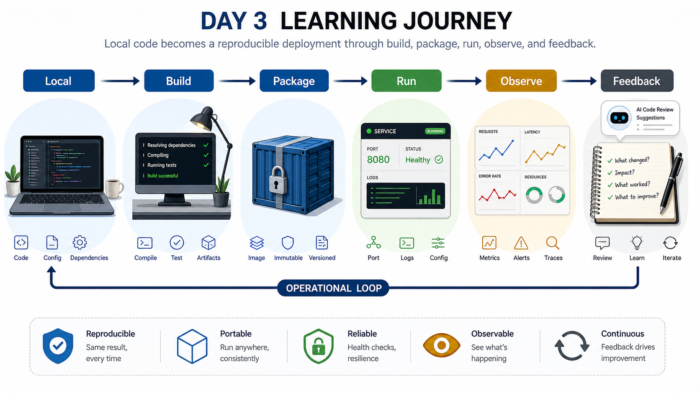

# Week 1 Day 3: 배포, 실행 환경 표준화, 프로젝트 구조 이해

## Overview
3일차는 "내 컴퓨터에서 실행되는 프로그램"을 "다른 사람이 같은 방식으로 실행할 수 있는 서비스"로 바꾸는 과정을 다룬다. 배포는 단순히 파일을 복사하거나 서버를 켜는 일이 아니다. 어떤 코드가 어떤 환경에서 어떤 설정으로 실행되며, 누가 어떤 증거로 정상 동작을 판단할 수 있는지 정리하는 운영 절차다.

오늘은 Docker를 깊게 배우기 전, Docker가 왜 필요한지 납득할 수 있는 문제를 먼저 만든다. 로컬 실행 환경 차이, 의존성 충돌, 빌드 산출물, 실행 명령, 로그, README를 하나의 흐름으로 연결한다. 또한 웹 애플리케이션, 데이터베이스, 캐시, 로드 밸런서, 관찰 도구가 어떤 역할을 맡는지 3-tier 아키텍처로 정리한 뒤 AI Coding Tool 실습으로 이어간다.

## Learning Goals
- 배포를 개발, 빌드, 패키징, 실행, 모니터링, 피드백이 이어지는 운영 사이클로 설명한다.
- 개발자가 보는 인프라와 인프라/DevOps 엔지니어가 보는 인프라의 차이를 구분한다.
- 재현 가능한 실행 환경이 왜 Docker, 스크립트, IaC로 이어지는지 설명한다.
- 웹 애플리케이션, 데이터베이스, 캐시, 로드 밸런서, 관찰 도구를 3-tier 아키텍처 안에서 설명한다.
- AI Coding Tool을 개념 학습, 질문 설계, 에러 메시지 기반 디버깅, 결과 검증에 활용한다.
- AI Coding Tool로 만든 코드와 답변을 실행 조건, 파일 구조, 더미 데이터, README, 보안 관점에서 점검한다.
- 무료 범위의 싱글 프론트엔드 앱을 만들고, 데이터베이스와 외부 API는 더미 JSON으로 대체한다.
- 미니 웹 애플리케이션의 실행 방법과 장애 관찰 기록을 남긴다.

## Lesson Index
- 1교시: 배포란 무엇인가? - 내 컴퓨터에서만 되는 프로그램과 서비스의 차이
- 2교시: 배포 사이클 - 개발, 빌드, 테스트, 패키징, 배포, 모니터링, 피드백
- 3교시: 개발자가 보는 인프라 vs 인프라 엔지니어가 보는 인프라
- 4교시: 재현 가능한 인프라의 필요성 - 문서, 스크립트, IaC의 출발점
- 5교시: Docker가 필요한 이유 - 실행 환경 차이와 의존성 충돌
- 6교시: 프로젝트 구성요소와 3-tier 아키텍처
- 7교시: AI Coding Tool 학습/실습 준비 - 개념 학습, 질문 설계, 디버깅 보조, 책임 있는 사용
- 8교시: AI Coding Tool 실습 - 무료 범위의 싱글 프론트엔드 앱 챌린지와 운영성 점검

## Official References
- Docker Docs: Dockerfile reference
  https://docs.docker.com/reference/dockerfile/
- AWS Architecture Blog: Modular architecture for a three-tier application
  https://aws.amazon.com/blogs/architecture/modular-architecture-for-a-three-tier-application/
- AWS Prescriptive Guidance: Build a three-tier architecture on AWS
  https://docs.aws.amazon.com/prescriptive-guidance/latest/patterns/build-a-three-tier-architecture-on-aws.html
- AWS Docs: What is Elastic Load Balancing?
  https://docs.aws.amazon.com/elasticloadbalancing/latest/userguide/what-is-load-balancing.html
- AWS Docs: What is Amazon RDS?
  https://docs.aws.amazon.com/AmazonRDS/latest/UserGuide/Welcome.html
- GitHub Docs: About READMEs
  https://docs.github.com/en/repositories/managing-your-repositorys-settings-and-features/customizing-your-repository/about-readmes
- GitHub Docs: GitHub Copilot documentation
  https://docs.github.com/en/copilot
- Anthropic Docs: Claude Code subagents
  https://docs.anthropic.com/en/docs/claude-code/sub-agents
- Anthropic Docs: Claude Code skills
  https://docs.anthropic.com/en/docs/claude-code/skills
- The Twelve-Factor App: Build, release, run
  https://12factor.net/build-release-run

## Today's Key Terms
- Deployment: 변경한 소프트웨어를 사용 가능한 환경에 반영하는 절차
- Build: 소스 코드를 실행 가능한 산출물로 만드는 과정
- Artifact: 빌드 결과로 만들어지는 배포 대상
- Runtime: 프로그램이 실제로 실행되는 환경
- Packaging: 실행에 필요한 파일, 설정, 의존성을 묶는 과정
- Reproducibility: 같은 입력과 절차로 같은 결과를 다시 만드는 성질
- Docker Image: 실행 환경과 애플리케이션을 묶은 읽기 전용 실행 재료
- Container: image를 바탕으로 실행 중인 프로세스
- IaC: 인프라 구성을 코드로 기록하고 재현하는 방식
- Prompt: AI 도구에 전달하는 작업 요청 문장
- Persona: AI 답변의 관점과 역할을 정하는 설정
- Agent: 특정 목적을 수행하도록 역할과 절차를 묶은 작업 단위
- Skill: 반복 작업 절차와 기준을 재사용하기 위한 지침 묶음
- Dummy JSON: 데이터베이스나 외부 API 없이 화면 데이터를 표현하기 위한 로컬 JSON 파일

자세한 용어 정리는 [Week 1 Glossary](../glossary.md)를 참고한다.

## Setup And Permissions
오늘은 로컬 실습을 중심으로 진행한다. Docker Desktop 설치는 2주 1일차에 천천히 진행한다. 1주 3일차에는 설치 절차로 시간을 쓰지 않고, 프로젝트를 구성하는 컴포넌트와 운영 관찰 지점을 먼저 이해한다.

필요한 준비:
- GitHub 로그인 가능
- VS Code 또는 선호 편집기 실행 가능
- 터미널에서 `git`, `python3`, `curl` 사용 가능
- AI Coding Tool 계정 또는 사용 가능한 웹/CLI 도구

## Required Files And Assets
- `lesson-01.md`: 배포의 의미
- `lesson-02.md`: 배포 사이클
- `lesson-03.md`: 인프라 관점 차이
- `lesson-04.md`: 재현 가능한 인프라
- `lesson-05.md`: Docker가 필요한 이유
- `lesson-06.md`: 프로젝트 구성요소와 3-tier 아키텍처
- `lesson-07.md`: AI Coding Tool 준비
- `lesson-08.md`: 무료 범위 싱글 프론트엔드 앱 챌린지
- `mini-deploy-lab/`: 배포와 README 실습용 미니 앱
- `assets/`: 교안용 시각 자료

## Deliverables
- 3-tier 아키텍처 구성요소 분류표
- 미니 앱 Architecture Note 초안
- AI 개념 학습 사다리와 크로스체크 기록
- 에러 메시지 기반 디버깅 요청 예시
- HTML/CSS/JavaScript와 더미 JSON으로 만든 싱글 프론트엔드 앱
- 미니 웹 앱 실행 화면 또는 정적 서버 `curl` 결과
- README에 실행 방법, 포트, 더미 JSON 수정 방법, 제외한 기능, known issue 정리
- AI 도구 사용 기록과 생성 코드 운영성 점검표

## End-Of-Day Checklist
- 배포가 단순 복사가 아니라 검증 가능한 운영 절차임을 설명할 수 있다.
- 실행 환경 차이가 장애로 이어지는 이유를 예로 들 수 있다.
- Docker image와 container의 차이를 2주차 전에 예비 개념으로 설명할 수 있다.
- 3-tier 아키텍처에서 웹, 애플리케이션, 데이터 계층의 책임을 구분할 수 있다.
- 데이터베이스, 캐시, 로드 밸런서, 오브젝트 스토리지가 필요한 조건을 예로 설명할 수 있다.
- AI에게 개념 설명을 수준별로 요청하고 공식 문서/강사/전문가/팀과 크로스체크할 수 있다.
- 에러 메시지와 실행 조건을 정리해 AI에게 빠르게 원인 분석을 요청할 수 있다.
- AI가 만든 코드를 실행 조건, 더미 데이터, 보안, README 관점에서 검토할 수 있다.
- 유료 API, 데이터베이스, 백엔드 구현이 필요한 아이디어를 1주차 범위에 맞게 축소할 수 있다.
- 다른 사람이 같은 프로젝트를 실행할 수 있도록 README를 작성할 수 있다.
