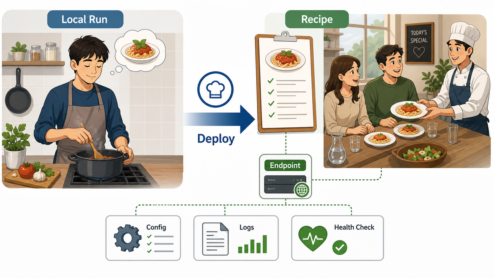
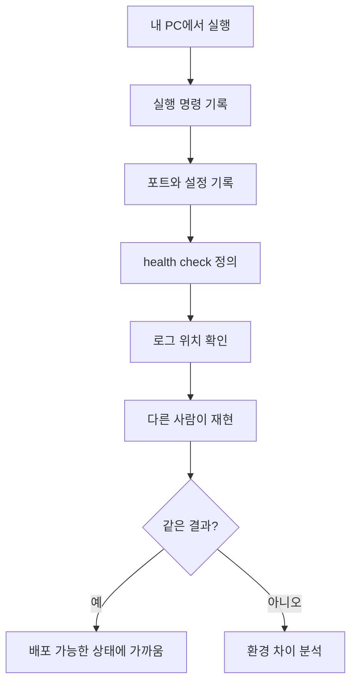

# 1교시: 배포란 무엇인가? - 내 컴퓨터에서만 되는 프로그램과 서비스의 차이

## 수업 목표
- 배포를 "프로그램을 다른 사람이 사용할 수 있는 상태로 만드는 운영 절차"로 설명한다.
- 로컬 실행과 서비스 운영의 차이를 실행 위치, 접근 경로, 설정, 로그, 책임 범위로 구분한다.
- 배포가 실패했을 때 확인해야 할 최소 증거를 정의한다.
- 오늘 사용할 `mini-deploy-lab` 앱의 실행 조건을 문서화한다.

## 시작 질문
어떤 학생의 노트북에서는 웹 앱이 잘 실행되는데, 옆 사람의 노트북에서는 실행되지 않는다. 두 사람 모두 "같은 코드"라고 말한다. 정말 같은 조건일까? 배포 관점에서는 코드가 같다는 말만으로는 부족하다. Python 버전, 실행 위치, 포트, 환경변수, 파일 경로, 권한, 네트워크 접근 방법, 로그 위치가 함께 같아야 한다.

## 공식 참고 자료
- The Twelve-Factor App: Build, release, run  
  https://12factor.net/build-release-run
- GitHub Docs: About READMEs  
  https://docs.github.com/en/repositories/managing-your-repositorys-settings-and-features/customizing-your-repository/about-readmes
- Python Docs: `http.server`  
  https://docs.python.org/3/library/http.server.html

## 핵심 개념
| 용어 | 뜻 | 운영 관점 |
|---|---|---|
| Local Run | 내 컴퓨터에서 직접 실행하는 상태 | 개인 환경에 강하게 의존한다 |
| Deployment | 사용 가능한 환경에 변경을 반영하는 절차 | 실행, 검증, 복구, 기록이 포함된다 |
| Release | 배포 가능한 버전 또는 변경 묶음 | 어떤 코드와 설정인지 추적 가능해야 한다 |
| Runtime | 프로그램이 실제로 실행되는 환경 | 버전, OS, 권한, 네트워크가 영향을 준다 |
| Service Endpoint | 사용자가 접근하는 주소 | URL, port, protocol이 명확해야 한다 |

배포를 처음 배울 때 가장 흔한 오해는 "서버에 올리면 배포"라고 생각하는 것이다. 실제로는 파일을 옮기는 것보다, 옮긴 뒤 같은 방식으로 실행되고 관찰되고 복구될 수 있는지가 더 중요하다. 배포는 개발 행위와 운영 행위가 만나는 경계다. 코드가 좋더라도 실행 조건이 문서화되어 있지 않으면 팀이 운영할 수 없다.

## 쉬운 비유
배포는 집에서 만든 음식을 친구에게 대접하는 일과 비슷하다. 내가 집에서 먹을 때는 냄비 위치, 불 세기, 간 맞추는 감각을 기억으로 처리할 수 있다. 하지만 다른 사람이 같은 음식을 만들려면 재료 목록, 조리 순서, 온도, 시간, 완성 기준이 필요하다.

로컬 실행은 "내가 내 주방에서 요리하는 상태"이고, 배포는 "다른 주방에서도 같은 음식을 만들 수 있도록 레시피와 검증 기준을 제공하는 상태"다. 이 비유의 한계는 실제 배포에는 네트워크, 보안, 비용, 장애 대응이 함께 들어간다는 점이다. 그래도 핵심은 같다. 개인 기억에 의존하던 실행을 팀이 재현 가능한 절차로 바꾸는 것이 배포다.

## 인포그래픽
오늘의 전체 흐름은 로컬 코드가 빌드, 패키징, 실행, 피드백을 거쳐 운영 가능한 형태로 바뀌는 과정이다.


아래 인포그래픽은 "내 주방에서만 되는 요리"를 "다른 사람도 따라 할 수 있는 레시피"로 바꾸는 비유를 배포 개념에 연결한다.



## 로컬 실행과 배포의 차이
| 비교 항목 | 로컬 실행 | 배포된 서비스 |
|---|---|---|
| 사용자 | 주로 개발자 본인 | 다른 사용자 또는 팀 |
| 실행 조건 | 개인 PC 상태에 의존 | 문서, 스크립트, 이미지로 고정해야 함 |
| 접근 방식 | `localhost` | 공유 가능한 URL, IP, domain, load balancer |
| 설정 | 직접 수정한 `.env` | 환경별 설정 관리 필요 |
| 로그 | 터미널에서 잠깐 확인 | 저장, 검색, 보관, 알림 필요 |
| 실패 대응 | 실행자 기억에 의존 | runbook과 rollback 기준 필요 |

## 실습 1: 배포 가능성 체크리스트 만들기
`mini-deploy-lab` 앱으로 이동한다.

```bash
cd week1/day3/mini-deploy-lab
cat README.md
cat .env.example
```

확인할 것:
- 실행 명령이 있는가?
- 기본 포트가 적혀 있는가?
- 상태 확인 URL이 있는가?
- 로그 위치가 적혀 있는가?
- 포트를 바꿀 방법이 있는가?

이 체크리스트는 나중에 Dockerfile, Kubernetes manifest, AWS 배포 문서를 볼 때도 그대로 사용된다. 도구가 달라져도 "실행 조건이 명확한가"라는 질문은 바뀌지 않는다.

## 실습 2: 로컬 앱 실행과 서비스 조건 확인
실습용 `.env`를 만들고 앱을 실행한다.

```bash
cp .env.example .env
python3 app.py
```

다른 터미널에서 확인한다.

```bash
curl http://localhost:8020/
curl http://localhost:8020/health
curl http://localhost:8020/config
tail -n 20 logs/app.log
```

기대 결과:
- `/health`는 `healthy`를 반환한다.
- `/config`는 `PORT=8020`, `LOG_FILE=logs/app.log`를 보여준다.
- `logs/app.log`에는 `server starting`, `home requested`, `health requested`, `config requested`가 남는다.

## 관찰 포인트
배포 가능성을 판단할 때는 "브라우저가 열렸다"보다 더 구체적인 증거가 필요하다.

| 증거 | 왜 필요한가 |
|---|---|
| 실행 명령 | 다른 사람이 같은 절차를 반복할 수 있다 |
| health check | 서비스가 살아 있는지 자동으로 확인할 수 있다 |
| config 출력 | 실제 반영된 설정을 확인할 수 있다 |
| log 파일 | 장애가 난 뒤에도 증거를 남길 수 있다 |
| port | 접속 실패와 포트 충돌을 구분할 수 있다 |

## Mermaid: 로컬 실행에서 배포 조건으로


## 실습 기록 양식
```markdown
# Deployment Readiness Note

## 앱 이름
- 

## 실행 명령
- 

## 접근 URL
- 

## 설정 파일
- 

## 로그 위치
- 

## 정상 확인 증거
- health:
- config:
- log:

## 아직 배포하기 어려운 이유
- 
```

## DevOps 원칙 연결
- 비용 절감: 배포 조건이 불명확하면 문제 해결에 사람이 오래 붙어야 하고, 그 시간이 비용이 된다.
- 개발/배포 효율성: 실행 방법이 문서화되면 새 팀원과 다른 환경에서도 빠르게 재현할 수 있다.
- 관리 효율성: health check와 로그 위치가 명확하면 장애 대응이 개인 기억에 의존하지 않는다.

## 확인 질문
- "내 PC에서 된다"는 말이 배포 가능성을 증명하지 못하는 이유는 무엇인가?
- 배포 문서에 포트와 로그 위치가 빠지면 어떤 문제가 생기는가?
- health check는 사용자를 위한 기능인가, 운영자를 위한 기능인가?

## 마무리 정리
배포는 코드를 옮기는 이벤트가 아니라 실행 조건을 팀이 재현 가능한 형태로 만드는 과정이다. 다음 교시에서는 이 과정을 개발, 빌드, 테스트, 패키징, 배포, 모니터링, 피드백이라는 사이클로 나누어 본다.
