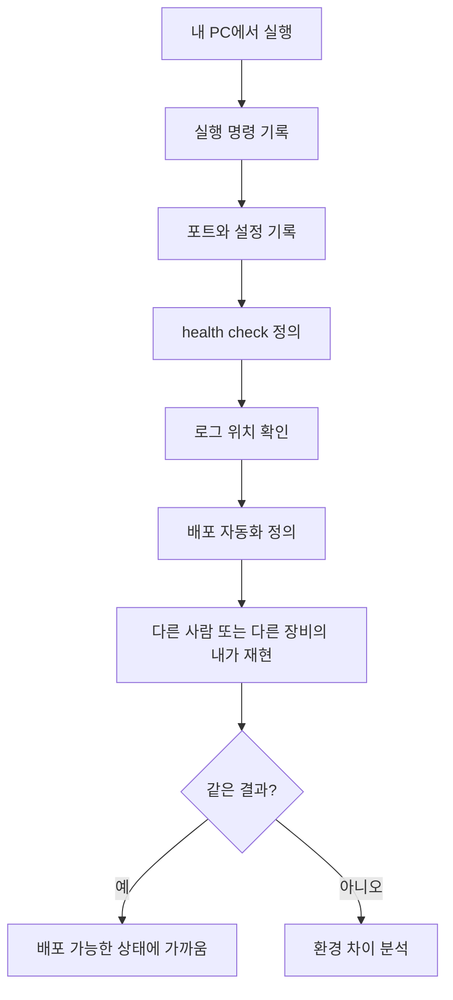

# 1교시: 배포란 무엇인가? - 내 컴퓨터에서만 되는 프로그램과 서비스의 차이

## 수업 목표
- 배포를 "프로그램을 다른 사람이 사용할 수 있는 상태로 만드는 운영 절차"로 설명한다.
- 로컬 실행과 서비스 운영의 차이를 실행 위치, 접근 경로, 설정, 로그, 책임 범위로 구분한다.
- 1인 개발자라도 장비와 장소가 바뀌면 재현 가능한 실행 조건이 필요하다는 점을 설명한다.
- 배포가 실패했을 때 확인해야 할 최소 증거를 정의한다.
- 오늘 사용할 `mini-deploy-lab` 앱의 실행 조건을 문서화한다.

## 시작 질문
어떤 학생의 노트북에서는 웹 앱이 잘 실행되는데, 옆 사람의 노트북에서는 실행되지 않는다. 두 사람 모두 "같은 코드"라고 말한다. 정말 같은 조건일까? 배포 관점에서는 코드가 같다는 말만으로는 부족하다. Python 버전, 실행 위치, 포트, 환경변수, 파일 경로, 권한, 네트워크 접근 방법, 로그 위치가 함께 같아야 한다.

이 문제는 팀으로 일할 때만 생기지 않는다. 1인 개발자라도 평소 쓰는 데스크톱에는 개발환경이 모두 갖춰져 있지만, 휴가 중 들고 간 노트북에는 Python 버전, Docker, 환경변수, SSH key, `.env` 파일, 실행 로그 폴더가 없을 수 있다. 휴일이나 출장 중 긴급 수정이 필요한데 "내 메인 PC에서만 실행되는 프로젝트"라면 코드를 알고 있어도 빠르게 대응하기 어렵다.

운영 가능한 프로젝트는 미래의 나도 실행할 수 있어야 한다. 급한 상황에서는 코드를 조금 수정하고 push하는 것만으로 배포 파이프라인이나 실행 환경이 같은 방식으로 반영될 수 있어야 한다. 이를 위해서는 코드뿐 아니라 실행 조건, 설정 예시, 검증 명령, 로그 위치, rollback 기준이 저장소에 남아 있어야 한다.

## 공식 참고 자료
- The Twelve-Factor App: Build, release, run  
  https://12factor.net/build-release-run
- AWS Well-Architected DevOps Guidance: Automate the entire deployment process
  https://docs.aws.amazon.com/wellarchitected/latest/devops-guidance/dl.cd.4-automate-the-entire-deployment-process.html
- AWS CodePipeline User Guide: Continuous delivery and continuous integration
  https://docs.aws.amazon.com/codepipeline/latest/userguide/concepts-continuous-delivery-integration.html
- GitHub Docs: Understanding GitHub Actions
  https://docs.github.com/en/actions/learn-github-actions/understanding-github-actions
- Google Cloud DORA: Accelerate State of DevOps
  https://cloud.google.com/resources/state-of-devops
- GitHub Docs: About READMEs  
  https://docs.github.com/en/repositories/managing-your-repositorys-settings-and-features/customizing-your-repository/about-readmes
- Python Docs: `http.server`  
  https://docs.python.org/3/library/http.server.html

## 핵심 개념
| 용어 | 뜻 | 운영 관점 |
|---|---|---|
| Local Run | 내 컴퓨터에서 직접 실행하는 상태 | 개인 환경에 강하게 의존한다 |
| Deployment | 사용 가능한 환경에 변경을 반영하는 절차 | 실행, 검증, 복구, 기록이 포함된다 |
| Deployment Automation | 빌드, 테스트, 배포 검증을 자동 절차로 실행하는 방식 | 사람 대기 시간과 반복 실수를 줄인다 |
| Release | 배포 가능한 버전 또는 변경 묶음 | 어떤 코드와 설정인지 추적 가능해야 한다 |
| Runtime | 프로그램이 실제로 실행되는 환경 | 버전, OS, 권한, 네트워크가 영향을 준다 |
| Service Endpoint | 사용자가 접근하는 주소 | URL, port, protocol이 명확해야 한다 |

배포를 처음 배울 때 가장 흔한 오해는 "서버에 올리면 배포"라고 생각하는 것이다. 실제로는 파일을 옮기는 것보다, 옮긴 뒤 같은 방식으로 실행되고 관찰되고 복구될 수 있는지가 더 중요하다. 배포는 개발 행위와 운영 행위가 만나는 경계다. 코드가 좋더라도 실행 조건이 문서화되어 있지 않으면 팀이 운영할 수 없다.

여기서 "팀"은 반드시 여러 사람만 의미하지 않는다. 오늘의 내가 만든 프로젝트를 한 달 뒤의 내가 다시 실행할 수도 있고, 집의 데스크톱이 아니라 외부의 노트북에서 수정해야 할 수도 있다. 배포 가능성은 협업의 문제이면서 동시에 개인의 지속 가능한 운영 능력 문제다.

## 쉬운 비유
배포는 집에서 만든 음식을 친구에게 대접하는 일과 비슷하다. 내가 집에서 먹을 때는 냄비 위치, 불 세기, 간 맞추는 감각을 기억으로 처리할 수 있다. 하지만 다른 사람이 같은 음식을 만들려면 재료 목록, 조리 순서, 온도, 시간, 완성 기준이 필요하다.

로컬 실행은 "내가 내 주방에서 요리하는 상태"이고, 배포는 "다른 주방에서도 같은 음식을 만들 수 있도록 레시피와 검증 기준을 제공하는 상태"다. 여기서 다른 주방은 친구의 주방일 수도 있지만, 여행 중 잠시 빌린 숙소의 주방일 수도 있다. 즉 다른 사람뿐 아니라 다른 장비의 나도 배포의 대상이다.

이 비유의 한계는 실제 배포에는 네트워크, 보안, 비용, 장애 대응이 함께 들어간다는 점이다. 그래도 핵심은 같다. 개인 기억에 의존하던 실행을 재현 가능한 절차로 바꾸는 것이 배포다.

## 인포그래픽
오늘의 전체 흐름은 로컬 코드가 빌드, 패키징, 실행, 피드백을 거쳐 운영 가능한 형태로 바뀌는 과정이다.


아래 인포그래픽은 "내 주방에서만 되는 요리"를 "다른 사람도 따라 할 수 있는 레시피"로 바꾸는 비유를 배포 개념에 연결한다.


## 로컬 실행과 배포의 차이
| 비교 항목 | 로컬 실행 | 배포된 서비스 |
|---|---|---|
| 사용자 | 주로 개발자 본인 | 다른 사용자 또는 팀 |
| 실행 조건 | 개인 PC 상태에 의존 | 문서, 스크립트, 이미지로 고정해야 함 |
| 접근 방식 | `localhost` | 공유 가능한 URL, IP, domain, load balancer |
| 설정 | 직접 수정한 `.env` | 환경별 설정 관리 필요 |
| 로그 | 터미널에서 잠깐 확인 | 저장, 검색, 보관, 알림 필요 |
| 실패 대응 | 실행자 기억에 의존 | runbook과 rollback 기준 필요 |

## 1인 개발자에게도 배포 가능성이 필요한 상황
| 상황 | 문제가 되는 이유 | 저장소에 있어야 할 것 |
|---|---|---|
| 휴가 중 긴급 수정 | 메인 개발 PC에 접근하지 못할 수 있다 | 실행 명령, `.env.example`, 검증 명령 |
| 출장 중 노트북 사용 | 노트북에 런타임과 도구가 없을 수 있다 | 설치 버전, Dockerfile 또는 준비 절차 |
| 휴일 장애 대응 | 기억에 의존하면 복구 시간이 길어진다 | runbook, 로그 위치, health check |
| PC 교체 또는 고장 | 개발환경을 처음부터 재구성해야 한다 | README, dependency 목록, secret 주입 방식 |
| 빠른 hotfix push | 코드만 수정해도 실행환경이 일관되어야 한다 | build/deploy 기준, branch와 push 절차 |

이 관점에서 좋은 저장소는 단순히 코드 보관함이 아니다. 긴급 상황에서 다른 장비로 열어도 최소한 "무엇을 설치하고, 어떤 설정을 만들고, 어떤 명령으로 검증할지"를 알려주는 운영 패키지다.

## 배포 자동화가 중요한 이유
배포가 수동 절차에 묶이면 담당자와 시간표가 병목이 된다. 특정 배포 담당자가 있어야만 개발환경, 스테이징 환경, 운영환경에 반영할 수 있다면 개발자는 기능을 완성하고도 검증을 기다리게 된다. 이 대기 시간은 단순한 불편함이 아니라 lead time을 늘리고, 피드백을 늦추며, 장애 수정 속도를 떨어뜨린다.

공식 자료들도 같은 방향을 말한다. AWS Well-Architected DevOps Guidance는 전체 배포 프로세스를 자동화하는 것이 사람 실수 위험을 줄이고, 배포 일관성을 만들며, 전달 과정을 빠르게 한다고 설명한다. AWS CodePipeline 문서는 continuous delivery를 release process가 자동화되는 방법론으로 설명하고, CodePipeline을 build, test, deployment 자동화 서비스로 제시한다. GitHub Actions 문서는 repository 안에서 build, test, deployment pipeline을 자동화할 수 있다고 설명한다. Google Cloud DORA 연구도 deployment automation, continuous testing, observability 같은 technical capabilities가 delivery performance와 연결된다고 본다.

배포 자동화의 핵심 효과는 "버튼 하나로 멋지게 배포한다"가 아니다. 더 중요한 효과는 개발자가 개발환경과 스테이징 환경에 자주, 작게, 같은 방식으로 배포할 수 있다는 점이다. 운영환경에는 승인 단계가 필요할 수 있지만, 개발/스테이징 환경까지 모든 배포가 특정 담당자에게 묶여 있으면 팀의 학습 속도가 느려진다. 개발자는 변경 결과를 늦게 확인하고, QA는 오래된 버전을 보며, 인프라 담당자는 반복 배포 요청을 처리하느라 더 중요한 자동화와 안정화 작업을 미루게 된다.

자동화된 배포는 다음 질문에 답해야 한다.

| 질문 | 자동화가 제공해야 할 답 |
|---|---|
| 어떤 코드가 배포되는가? | commit SHA, branch, tag |
| 어떤 검증을 통과했는가? | build, test, lint, health check |
| 어느 환경에 반영되는가? | dev, staging, production |
| 누가 실행했는가? | workflow 실행자 또는 trigger |
| 실패하면 어디서 멈추는가? | 실패한 stage와 log |
| 운영환경은 어떻게 보호되는가? | approval gate, rollback, 권한 제한 |

## 자동화 전후의 배포 시간 차이
수동 배포는 실제 명령 실행 시간보다 대기 시간이 더 큰 경우가 많다. 담당자를 찾고, 접속 권한을 확인하고, 명령을 복사해 실행하고, 결과를 캡처해 공유하는 시간이 누적된다. 자동화된 pipeline은 같은 절차를 표준화된 runner에서 반복한다. 그래서 배포 시간이 "담당자가 가능한 시간"에서 "pipeline이 완료되는 시간"으로 바뀐다.

교육용 예시:

| 단계 | 수동 배포 | 자동화 배포 |
|---|---:|---:|
| 담당자 확인 | 10분 | 0분 |
| 서버 접속/환경 확인 | 10분 | 0분 |
| build/test 실행 | 10분 | 5분 |
| 파일 복사/재시작 | 10분 | 3분 |
| health check/로그 확인 | 10분 | 2분 |
| 결과 공유 | 10분 | 0~1분 |
| 합계 | 약 60분 | 약 10~11분 |

이 숫자는 교육용 가정값이다. 실제 시간은 시스템 크기, 테스트 수, 승인 절차, 배포 전략에 따라 달라진다. 중요한 것은 자동화가 배포 명령 자체만 줄이는 것이 아니라 대기, 전달, 확인, 공유에 들어가는 시간을 줄인다는 점이다.

## 환경별 셀프서비스 배포
모든 환경에 같은 권한 정책을 적용하면 안 된다. 운영환경은 승인, 감사, rollback 기준이 필요하다. 하지만 개발환경과 스테이징 환경은 개발자가 안전한 범위 안에서 직접 배포하고 검증할 수 있어야 피드백 속도가 올라간다.

| 환경 | 자동화 수준 | 권장 통제 |
|---|---|---|
| Development | push 또는 수동 workflow로 빠르게 배포 | 낮은 권한, 테스트 데이터 |
| Staging | main merge 또는 release candidate 배포 | 운영과 비슷한 설정, 승인 선택 |
| Production | 승인된 release만 배포 | approval gate, rollback, 감사 로그 |

이 구조에서 인프라/DevOps 엔지니어의 역할은 매번 대신 배포하는 사람이 아니라, 개발자가 안전하게 배포할 수 있는 길을 만드는 사람에 가깝다. pipeline, 권한, secret 주입, 로그, 알림, rollback 기준을 만들어두면 개발자는 기다리지 않고 검증할 수 있고, 운영환경은 필요한 통제를 유지할 수 있다.

## 실습 1: 배포 가능성 체크리스트 만들기
`mini-deploy-lab` 앱으로 이동한다.

```bash
cd week1/day3/mini-deploy-lab
cat README.md
cat .env.example
```

확인할 것:
- 실행 명령이 있는가?
- 기본 포트가 적혀 있는가?
- 상태 확인 URL이 있는가?
- 로그 위치가 적혀 있는가?
- 포트를 바꿀 방법이 있는가?
- 새 노트북에서 처음 clone해도 따라할 수 있는가?
- 코드만 push했을 때 어떤 절차로 검증할 수 있는가?

이 체크리스트는 나중에 Dockerfile, Kubernetes manifest, AWS 배포 문서를 볼 때도 그대로 사용된다. 도구가 달라져도 "실행 조건이 명확한가"라는 질문은 바뀌지 않는다.

## 실습 2: 로컬 앱 실행과 서비스 조건 확인
실습용 `.env`를 만들고 앱을 실행한다.

```bash
cp .env.example .env
python3 app.py
```

다른 터미널에서 확인한다.

```bash
curl http://localhost:8020/
curl http://localhost:8020/health
curl http://localhost:8020/config
tail -n 20 logs/app.log
```

기대 결과:
- `/health`는 `healthy`를 반환한다.
- `/config`는 `PORT=8020`, `LOG_FILE=logs/app.log`를 보여준다.
- `logs/app.log`에는 `server starting`, `home requested`, `health requested`, `config requested`가 남는다.

## 관찰 포인트
배포 가능성을 판단할 때는 "브라우저가 열렸다"보다 더 구체적인 증거가 필요하다.

| 증거 | 왜 필요한가 |
|---|---|
| 실행 명령 | 다른 사람이 같은 절차를 반복할 수 있다 |
| health check | 서비스가 살아 있는지 자동으로 확인할 수 있다 |
| config 출력 | 실제 반영된 설정을 확인할 수 있다 |
| log 파일 | 장애가 난 뒤에도 증거를 남길 수 있다 |
| port | 접속 실패와 포트 충돌을 구분할 수 있다 |
| `.env.example` | 실제 secret 없이 필요한 설정 목록을 공유한다 |
| dependency 기준 | 새 장비에서 무엇을 설치해야 하는지 알 수 있다 |
| push 후 검증 절차 | 긴급 수정이 실제로 반영됐는지 확인한다 |
| deployment pipeline | 담당자 없이 같은 절차로 dev/staging에 반영한다 |
| approval gate | production 배포를 보호하면서 자동화 이점을 유지한다 |

## Mermaid: 로컬 실행에서 배포 조건으로


## 긴급 대응 관점의 배포 조건
긴급 대응 상황에서는 완벽한 개발환경보다 "최소 수정과 검증이 가능한 상태"가 중요하다. 예를 들어 휴가 중 결제 문구 오탈자를 고쳐야 한다면, 노트북에서 전체 시스템을 완벽히 재현하지 못하더라도 저장소를 clone하고, README를 따라 최소 실행을 확인하고, 수정 후 push하고, health check나 로그로 반영 여부를 확인할 수 있어야 한다.

이를 위해 저장소는 다음 질문에 답해야 한다.

| 질문 | 문서 또는 파일 |
|---|---|
| 새 장비에서 무엇부터 해야 하는가? | README의 setup 절차 |
| 어떤 버전이 필요한가? | runtime version, Dockerfile |
| 실제 secret 없이 설정 목록을 알 수 있는가? | `.env.example` |
| 실행됐는지 어떻게 확인하는가? | `/health`, `curl` 명령 |
| 문제가 나면 어디를 보는가? | log 위치, troubleshooting note |
| 수정 후 무엇을 push해야 하는가? | Git branch/commit/push 절차 |
| push 후 어떤 자동 절차가 실행되는가? | CI/CD workflow, deployment pipeline |

## 실습 기록 양식
```markdown
# Deployment Readiness Note

## 앱 이름
- 

## 실행 명령
- 

## 접근 URL
- 

## 설정 파일
- 

## 로그 위치
- 

## 정상 확인 증거
- health:
- config:
- log:

## 아직 배포하기 어려운 이유
- 

## 긴급 대응 가능성
- 새 노트북에서 clone 후 실행 가능한가:
- code만 수정해서 push해도 반영 가능한 구조인가:
- push 후 확인할 명령:
- 자동 배포가 있다면 실행되는 workflow:
- 자동 배포가 없다면 수동으로 필요한 단계:
```

## DevOps 원칙 연결
- 비용 절감: 배포 조건이 불명확하면 문제 해결에 사람이 오래 붙어야 하고, 그 시간이 비용이 된다.
- 개발/배포 효율성: 실행 방법과 배포가 자동화되면 새 팀원뿐 아니라 다른 장비를 쓰는 나도 빠르게 재현하고, 개발/스테이징 환경에 기다림 없이 반영할 수 있다.
- 관리 효율성: health check와 로그 위치가 명확하면 장애 대응이 개인 기억에 의존하지 않는다.

## 확인 질문
- "내 PC에서 된다"는 말이 배포 가능성을 증명하지 못하는 이유는 무엇인가?
- 1인 개발자에게도 README와 `.env.example`이 필요한 이유는 무엇인가?
- 휴가 중 긴급 수정이 필요한 상황에서 code만 push해도 대응 가능하려면 어떤 조건이 필요할까?
- 배포 담당자가 한 명뿐이면 개발환경과 스테이징 환경의 피드백 속도에 어떤 문제가 생기는가?
- 운영환경 배포 자동화에 approval gate가 필요한 이유는 무엇인가?
- 배포 문서에 포트와 로그 위치가 빠지면 어떤 문제가 생기는가?
- health check는 사용자를 위한 기능인가, 운영자를 위한 기능인가?

## 마무리 정리
배포는 코드를 옮기는 이벤트가 아니라 실행 조건을 재현 가능한 형태로 만드는 과정이다. 이 재현성은 팀 협업뿐 아니라 1인 개발자의 긴급 대응 능력에도 직접 연결된다. 다음 교시에서는 이 과정을 개발, 빌드, 테스트, 패키징, 배포, 모니터링, 피드백이라는 사이클로 나누어 본다.
