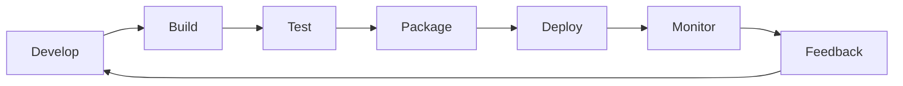

# 2교시: 배포 사이클 - 개발, 빌드, 테스트, 패키징, 배포, 모니터링, 피드백

## 수업 목표
- 배포 사이클의 각 단계를 설명하고, 단계별 산출물과 실패 지점을 구분한다.
- build, release, run의 분리를 이해한다.
- 작은 로컬 앱에서도 테스트, 패키징, 검증, 피드백이 왜 필요한지 확인한다.
- 배포 실패를 "어느 단계의 실패인가"로 분류한다.

## 공식 참고 자료
- The Twelve-Factor App: Build, release, run  
  https://12factor.net/build-release-run
- GitHub Docs: About continuous integration  
  https://docs.github.com/en/actions/about-github-actions/understanding-github-actions
- Docker Docs: Dockerfile reference  
  https://docs.docker.com/reference/dockerfile/

## 핵심 개념
| 단계 | 질문 | 산출물 | 흔한 실패 |
|---|---|---|---|
| Develop | 무엇을 바꿨는가? | source code | 코드 누락, 브랜치 혼동 |
| Build | 실행 가능한 형태가 되었는가? | artifact | 의존성 오류, 문법 오류 |
| Test | 기대 동작을 만족하는가? | test result | 테스트 누락, 환경 의존 |
| Package | 실행 조건을 묶었는가? | image, archive, script | 파일 누락, 버전 불일치 |
| Deploy | 대상 환경에 반영했는가? | running service | 포트, 권한, 네트워크 오류 |
| Monitor | 정상인지 관찰하는가? | logs, metrics, alerts | 증거 부족 |
| Feedback | 다음 개선으로 이어지는가? | issue, runbook, fix | 같은 장애 반복 |

배포 사이클은 직선이 아니라 반복 루프다. 한 번 배포하고 끝나는 것이 아니라, 관찰한 결과를 다시 개발과 운영 개선으로 되돌린다. DevOps에서 배포 효율성을 말할 때 중요한 것은 "많이 배포했다"가 아니라 "작고 검증 가능한 변경을 빠르게 반영하고, 문제가 나면 빠르게 되돌리거나 수정할 수 있는가"다.

## 쉬운 비유
배포 사이클은 항공기 이륙 절차와 비슷하다. 비행기를 만들었다고 바로 승객을 태우지 않는다. 정비 기록, 연료, 활주로, 관제 승인, 이륙 후 계기 확인이 모두 필요하다. 개발은 비행기를 준비하는 일이고, 배포는 이륙시키는 일이며, 모니터링은 비행 중 계기를 보는 일이다.

비유의 한계는 소프트웨어는 항공기보다 훨씬 자주 변경된다는 점이다. 그래서 배포 사이클은 반복 가능하고 자동화 가능해야 한다.

## 인포그래픽
아래 인포그래픽은 항공기 이륙 전 점검 비유를 배포 사이클에 연결한다. 배포는 한 번의 버튼 클릭이 아니라 단계별 확인과 피드백 루프다.


## Mermaid: 배포 사이클


## 실습 1: 현재 앱의 배포 단계 분류
`mini-deploy-lab`에서 아래 명령을 실행한다.

```bash
cd week1/day3/mini-deploy-lab
python3 -m py_compile app.py
cp .env.example .env
python3 app.py
```

다른 터미널:

```bash
curl http://localhost:8020/health
curl http://localhost:8020/config
tail -n 20 logs/app.log
```

분류:
- `python3 -m py_compile app.py`: build 이전의 문법 검증에 가깝다.
- `cp .env.example .env`: release/run에 필요한 설정 준비다.
- `python3 app.py`: run 단계다.
- `curl /health`: deploy 이후 정상성 검증이다.
- `tail logs/app.log`: monitor 단계다.

## 실습 2: 실패를 단계별로 만들기
문법 오류를 직접 만들지는 않는다. 대신 설정 오류와 접근 오류를 통해 run/deploy/monitor 단계의 차이를 본다.

잘못된 포트를 설정한다.

```bash
sed -i 's/PORT=8020/PORT=abc/' .env
python3 app.py
```

기대 결과:

```text
Invalid PORT: abc. PORT must be a number.
```

이 실패는 네트워크 문제가 아니라 run 단계 이전의 설정 검증 실패다.

복구:

```bash
sed -i 's/PORT=abc/PORT=8020/' .env
python3 app.py
```

다른 터미널에서 잘못된 경로를 요청한다.

```bash
curl -i http://localhost:8020/not-found
tail -n 20 logs/app.log
```

이 실패는 앱 실행 실패가 아니라 요청 경로 오류다. status code와 로그를 함께 봐야 단계가 구분된다.

## 단계별 장애 분류표
| 증상 | 가능한 단계 | 확인 명령 | 다음 조치 |
|---|---|---|---|
| 문법 오류 | Build | `python3 -m py_compile app.py` | 코드 수정 |
| `Invalid PORT` | Run config | `cat .env` | 설정값 수정 |
| 접속 거부 | Deploy/run | `ss -ltnp`, 서버 터미널 | 서버 실행 여부 확인 |
| 404 | Application route | `curl -i`, log | URL 또는 라우트 확인 |
| 응답은 되지만 느림 | Monitor | log, duration, metrics | 병목 가설 수립 |

## 실습 기록 양식
```markdown
# Deployment Cycle Note

## 변경 또는 실행한 것
- 

## 어느 단계인가
- develop / build / test / package / deploy / monitor / feedback

## 확인한 증거
- 명령:
- 결과:
- 로그:

## 실패했다면 단계 분류
- 

## 다음 조치
- 
```

## DevOps 원칙 연결
- 비용 절감: 실패 단계를 빠르게 분류하면 불필요한 재설치나 서버 증설을 줄인다.
- 개발/배포 효율성: build/test/package를 분리하면 배포 전 문제를 더 빨리 찾는다.
- 관리 효율성: monitor와 feedback이 있어야 같은 장애가 지식으로 축적된다.

## 확인 질문
- build 실패와 deploy 실패를 구분해야 하는 이유는 무엇인가?
- health check는 배포 사이클 중 어느 단계에 가까운가?
- 로그를 보지 않으면 404와 서버 미실행을 어떻게 혼동할 수 있는가?

## 마무리 정리
배포 사이클은 이후 Docker, Kubernetes, AWS, Terraform을 관통하는 뼈대다. Dockerfile은 package를 표준화하고, Kubernetes는 deploy/run/monitor를 구조화하며, Terraform은 배포 대상 인프라를 재현 가능하게 만든다.
