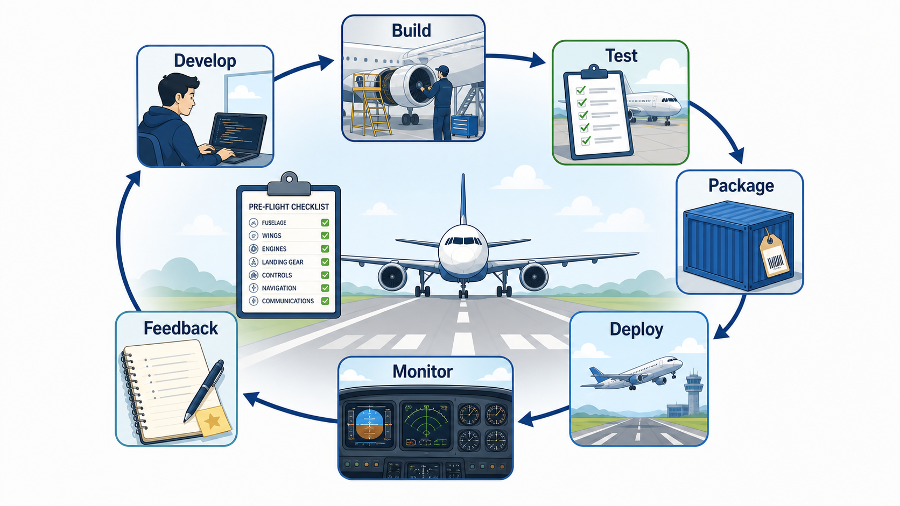
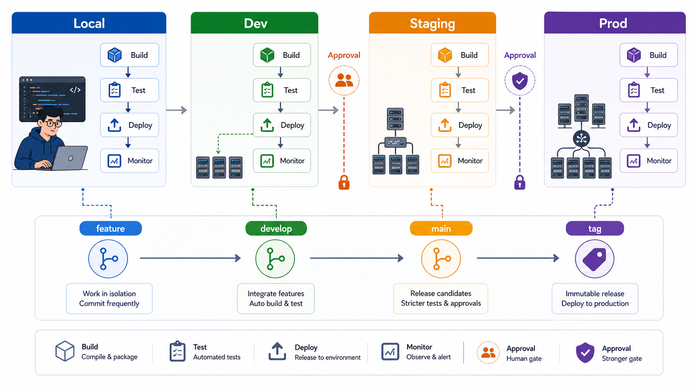
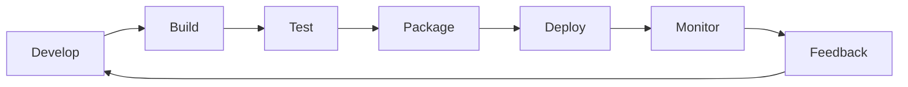
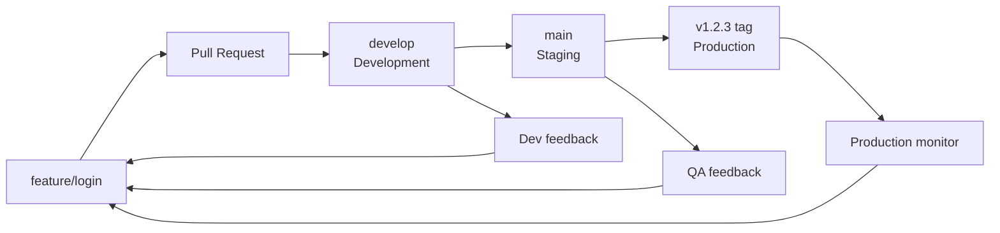

# 2교시: 배포 사이클 - 개발, 빌드, 테스트, 패키징, 배포, 모니터링, 피드백

## 수업 목표
- 배포 사이클의 각 단계를 설명하고, 단계별 산출물과 실패 지점을 구분한다.
- build, release, run의 분리를 이해한다.
- local, development, staging, production 환경마다 배포 사이클이 따로 돈다는 점을 이해한다.
- branch 전략이 환경별 배포와 어떻게 연결되는지 설명한다.
- 작은 로컬 앱에서도 테스트, 패키징, 검증, 피드백이 왜 필요한지 확인한다.
- 배포 실패를 "어느 단계의 실패인가"로 분류한다.

## 공식 참고 자료
- The Twelve-Factor App: Build, release, run  
  https://12factor.net/build-release-run
- GitHub Docs: About continuous integration  
  https://docs.github.com/en/actions/about-github-actions/understanding-github-actions
- GitHub Docs: GitHub flow
  https://docs.github.com/en/get-started/using-github/github-flow
- GitHub Docs: Managing environments for deployment
  https://docs.github.com/en/actions/deployment/targeting-different-environments/managing-environments-for-deployment
- Docker Docs: Dockerfile reference  
  https://docs.docker.com/reference/dockerfile/

## 핵심 개념
| 단계 | 질문 | 산출물 | 흔한 실패 |
|---|---|---|---|
| Develop | 무엇을 바꿨는가? | source code | 코드 누락, 브랜치 혼동 |
| Build | 실행 가능한 형태가 되었는가? | artifact | 의존성 오류, 문법 오류 |
| Test | 기대 동작을 만족하는가? | test result | 테스트 누락, 환경 의존 |
| Package | 실행 조건을 묶었는가? | image, archive, script | 파일 누락, 버전 불일치 |
| Deploy | 대상 환경에 반영했는가? | running service | 포트, 권한, 네트워크 오류 |
| Monitor | 정상인지 관찰하는가? | logs, metrics, alerts | 증거 부족 |
| Feedback | 다음 개선으로 이어지는가? | issue, runbook, fix | 같은 장애 반복 |

배포 사이클은 직선이 아니라 반복 루프다. 한 번 배포하고 끝나는 것이 아니라, 관찰한 결과를 다시 개발과 운영 개선으로 되돌린다. DevOps에서 배포 효율성을 말할 때 중요한 것은 "많이 배포했다"가 아니라 "작고 검증 가능한 변경을 빠르게 반영하고, 문제가 나면 빠르게 되돌리거나 수정할 수 있는가"다.

현업에서 이 사이클은 하나만 존재하지 않는다. 보통 local, development, staging, production처럼 여러 환경이 있고, 각 환경마다 build, test, deploy, monitor 기준이 다르다. 처음 회사에 가면 "dev에는 올렸나요?", "staging 검증 끝났나요?", "production 배포 승인 받았나요?" 같은 말을 듣게 된다. 이 말을 이해하려면 배포 사이클이 환경별로 반복된다는 점을 먼저 알아야 한다.

local은 내 컴퓨터에서 빠르게 확인하는 환경이다. development는 여러 개발자의 변경이 모여 통합되는 환경이다. staging은 운영과 최대한 비슷하게 만들어 최종 검증을 하는 환경이다. production은 실제 사용자가 접근하는 운영 환경이다. 같은 코드라도 어느 환경에 올라갔는지에 따라 데이터, 권한, 비용, 장애 영향이 완전히 달라진다.

## 쉬운 비유
배포 사이클은 항공기 이륙 절차와 비슷하다. 비행기를 만들었다고 바로 승객을 태우지 않는다. 정비 기록, 연료, 활주로, 관제 승인, 이륙 후 계기 확인이 모두 필요하다. 개발은 비행기를 준비하는 일이고, 배포는 이륙시키는 일이며, 모니터링은 비행 중 계기를 보는 일이다.

비유의 한계는 소프트웨어는 항공기보다 훨씬 자주 변경된다는 점이다. 그래서 배포 사이클은 반복 가능하고 자동화 가능해야 한다.

## 인포그래픽
아래 인포그래픽은 항공기 이륙 전 점검 비유를 배포 사이클에 연결한다. 배포는 한 번의 버튼 클릭이 아니라 단계별 확인과 피드백 루프다.



아래 인포그래픽은 branch 전략과 local, dev, staging, production 환경이 어떻게 연결되는지 보여준다. 환경이 늘어나면 같은 배포 사이클이 여러 층에서 반복되고, production에 가까울수록 검증과 승인 기준이 강해진다.



## Mermaid: 배포 사이클


## 환경별 배포 사이클
| 환경 | 목적 | 일반적인 trigger | 검증 수준 | 실패 영향 |
|---|---|---|---|---|
| Local | 개인 개발과 빠른 확인 | 직접 실행 | 문법, 단위 실행, curl | 개인 작업 지연 |
| Development | 여러 변경 통합 | feature branch push, develop merge | 기본 테스트, smoke test | 개발팀 전체 지연 |
| Staging | 운영 전 최종 검증 | main/release branch merge | 운영 유사 설정, QA, 회귀 확인 | 배포 일정 지연 |
| Production | 실제 사용자 서비스 | tag, release, 승인된 workflow | 승인, health check, rollback 기준 | 사용자 영향, 비용/신뢰도 영향 |

환경이 많아지는 이유는 복잡하게 만들기 위해서가 아니다. 실패의 영향을 단계적으로 줄이기 위해서다. local에서 잡을 수 있는 문제는 local에서 잡고, development에서 통합 문제를 잡고, staging에서 운영 유사 조건 문제를 잡은 뒤 production에 반영한다. 이 구조를 이해하지 못하면 "왜 같은 앱을 여러 번 배포하지?"라고 느낄 수 있다. 실제로는 같은 앱을 여러 번 배포하는 것이 아니라, 위험을 낮추기 위해 서로 다른 검증 문을 통과시키는 것이다.

## Branch 전략과 환경 연결
branch 전략은 코드 변경이 어느 환경까지 갈 수 있는지를 정하는 교통 규칙이다. 회사마다 전략은 다르지만 초급자는 다음 구조를 먼저 이해하면 된다.

| Branch 또는 Tag | 연결되는 환경 | 역할 | 주의 |
|---|---|---|---|
| `feature/*` | local, 임시 dev | 기능 개발과 실험 | 오래 방치하면 충돌 증가 |
| `develop` | development | 여러 기능 통합 | 자주 깨질 수 있어 빠른 복구 필요 |
| `main` | staging 또는 production 후보 | 안정 기준 branch | 보호 규칙과 리뷰 필요 |
| `release/*` | staging | 배포 후보 안정화 | bug fix 범위 관리 필요 |
| `v1.2.3` tag | production | 배포된 버전 표시 | rollback 기준이 됨 |

GitHub flow는 branch를 만들고, commit하고, pull request를 열고, 리뷰와 검증 후 merge하는 흐름을 강조한다. 여기에 배포 환경을 연결하면 "feature branch는 개발 중인 변경", "main은 검증된 변경", "tag는 운영에 배포한 특정 버전"처럼 의미가 생긴다.

## Mermaid: Branch와 환경 흐름


## 기초 프로젝트와 심화 프로젝트에서의 적용
기초 프로젝트에서는 모든 환경을 실제 클라우드로 만들 필요는 없다. 하지만 이름과 역할은 미리 정해두는 것이 좋다.

| 프로젝트 수준 | 추천 환경 | 목표 |
|---|---|---|
| 기초 프로젝트 | local + development | 실행 방법, README, health check, 로그 확인 |
| 심화 프로젝트 | local + development + staging | 배포 후보 검증, branch 보호, 자동화 경험 |
| 포트폴리오 수준 | local + development + staging + production | 운영 URL, 배포 이력, rollback 설명 |

학생 프로젝트에서도 `local`만 생각하면 발표 직전에 문제가 생긴다. 발표용 노트북, 팀원 PC, Docker 환경, 클라우드 환경이 모두 조금씩 다르기 때문이다. 3일차부터 환경 이름을 익혀두면 2주차 Docker, 4주차 Kubernetes, 5주차 AWS, 6주차 Terraform에서 같은 개념을 반복해서 볼 때 덜 낯설다.

## 실습 1: 현재 앱의 배포 단계 분류
`mini-deploy-lab`에서 아래 명령을 실행한다.

```bash
cd week1/day3/mini-deploy-lab
python3 -m py_compile app.py
cp .env.example .env
python3 app.py
```

다른 터미널:

```bash
curl http://localhost:8020/health
curl http://localhost:8020/config
tail -n 20 logs/app.log
```

분류:
- `python3 -m py_compile app.py`: build 이전의 문법 검증에 가깝다.
- `cp .env.example .env`: release/run에 필요한 설정 준비다.
- `python3 app.py`: run 단계다.
- `curl /health`: deploy 이후 정상성 검증이다.
- `tail logs/app.log`: monitor 단계다.

환경 관점 분류:
- 지금 실행한 것은 `local` 환경 배포 사이클이다.
- 같은 앱을 팀 공용 서버에 올리면 `development` 환경 배포가 된다.
- 발표 전 운영과 비슷한 설정으로 검증하면 `staging` 환경에 가깝다.
- 실제 사용자가 접근하는 URL에 반영하면 `production` 환경이다.

## 실습 2: 실패를 단계별로 만들기
문법 오류를 직접 만들지는 않는다. 대신 설정 오류와 접근 오류를 통해 run/deploy/monitor 단계의 차이를 본다.

잘못된 포트를 설정한다.

```bash
sed -i 's/PORT=8020/PORT=abc/' .env
python3 app.py
```

기대 결과:

```text
Invalid PORT: abc. PORT must be a number.
```

이 실패는 네트워크 문제가 아니라 run 단계 이전의 설정 검증 실패다.

복구:

```bash
sed -i 's/PORT=abc/PORT=8020/' .env
python3 app.py
```

다른 터미널에서 잘못된 경로를 요청한다.

```bash
curl -i http://localhost:8020/not-found
tail -n 20 logs/app.log
```

이 실패는 앱 실행 실패가 아니라 요청 경로 오류다. status code와 로그를 함께 봐야 단계가 구분된다.

## 단계별 장애 분류표
| 증상 | 가능한 단계 | 확인 명령 | 다음 조치 |
|---|---|---|---|
| 문법 오류 | Build | `python3 -m py_compile app.py` | 코드 수정 |
| `Invalid PORT` | Run config | `cat .env` | 설정값 수정 |
| 접속 거부 | Deploy/run | `ss -ltnp`, 서버 터미널 | 서버 실행 여부 확인 |
| 404 | Application route | `curl -i`, log | URL 또는 라우트 확인 |
| 응답은 되지만 느림 | Monitor | log, duration, metrics | 병목 가설 수립 |

## 환경별 장애 분류표
| 증상 | 환경 질문 | 가능한 원인 | 다음 조치 |
|---|---|---|---|
| 내 PC만 정상 | local과 dev 차이 | 런타임/환경변수 차이 | README, `.env.example`, Docker 검토 |
| dev는 정상, staging 실패 | 운영 유사 설정 차이 | 권한, URL, 외부 의존성 | staging config와 secret 확인 |
| staging 정상, production 실패 | 운영 데이터/트래픽 차이 | 권한, scale, 네트워크, 승인 누락 | rollback, production log 확인 |
| 특정 branch만 실패 | branch 전략 문제 | 오래된 branch, merge conflict | rebase/merge, PR 검증 |
| tag 배포 후 문제 | release 추적 문제 | 잘못된 버전 배포 | 이전 tag rollback |

## 실습 기록 양식
```markdown
# Deployment Cycle Note

## 변경 또는 실행한 것
- 

## 어느 단계인가
- develop / build / test / package / deploy / monitor / feedback

## 어느 환경인가
- local / development / staging / production

## 어떤 branch 또는 tag인가
-

## 확인한 증거
- 명령:
- 결과:
- 로그:

## 실패했다면 단계 분류
- 

## 다음 조치
- 
```

## DevOps 원칙 연결
- 비용 절감: 실패 단계를 빠르게 분류하면 불필요한 재설치나 서버 증설을 줄인다.
- 개발/배포 효율성: build/test/package와 환경별 배포 기준을 분리하면 dev/staging에서 빠르게 검증하고 production 위험을 줄인다.
- 관리 효율성: monitor와 feedback이 있어야 같은 장애가 지식으로 축적된다.

## 확인 질문
- build 실패와 deploy 실패를 구분해야 하는 이유는 무엇인가?
- local, development, staging, production은 각각 무엇을 검증하기 위한 환경인가?
- feature branch와 main branch를 같은 방식으로 배포하면 어떤 위험이 있는가?
- tag가 production rollback 기준이 될 수 있는 이유는 무엇인가?
- health check는 배포 사이클 중 어느 단계에 가까운가?
- 로그를 보지 않으면 404와 서버 미실행을 어떻게 혼동할 수 있는가?

## 마무리 정리
배포 사이클은 이후 Docker, Kubernetes, AWS, Terraform을 관통하는 뼈대다. 여기에 환경과 branch 전략이 붙으면 실제 회사의 배포 흐름이 된다. Dockerfile은 package를 표준화하고, Kubernetes는 deploy/run/monitor를 구조화하며, Terraform은 환경별 인프라를 재현 가능하게 만든다.
