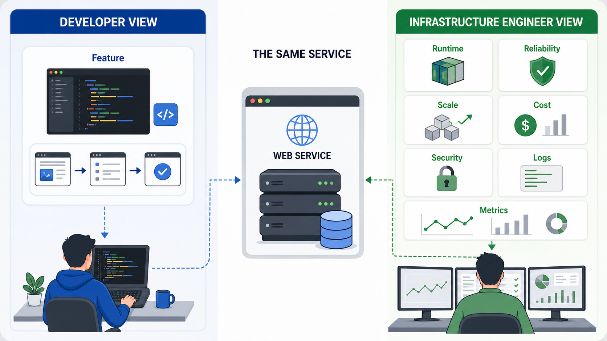
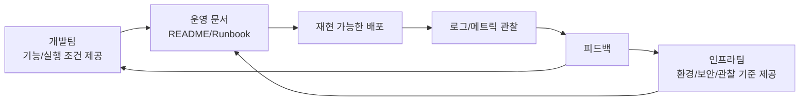

# 3교시: 개발자가 보는 인프라 vs 인프라 엔지니어가 보는 인프라

## 수업 목표
- 같은 시스템을 개발자와 인프라 엔지니어가 다르게 바라보는 이유를 설명한다.
- 안정성, 확장성, 비용, 보안, 관찰 가능성을 인프라 관점의 핵심 질문으로 정리한다.
- 개발팀에 요청해야 할 정보와 인프라팀이 제공해야 할 정보를 구분한다.
- 미니 앱을 기준으로 운영 인수 체크리스트를 작성한다.

## 공식 참고 자료
- AWS Well-Architected Framework  
  https://docs.aws.amazon.com/wellarchitected/latest/framework/welcome.html
- Google SRE Book: Monitoring Distributed Systems  
  https://sre.google/sre-book/monitoring-distributed-systems/
- GitHub Docs: About READMEs  
  https://docs.github.com/en/repositories/managing-your-repositorys-settings-and-features/customizing-your-repository/about-readmes

## 핵심 개념
| 관점 | 개발자가 주로 묻는 질문 | 인프라/DevOps 엔지니어가 추가로 묻는 질문 |
|---|---|---|
| 기능 | 기능이 요구사항대로 동작하는가? | 기능이 실패했을 때 어디서 증거를 찾는가? |
| 실행 | 내 로컬에서 실행되는가? | 다른 환경에서도 같은 방식으로 실행되는가? |
| 설정 | 어떤 값이 필요한가? | 환경별 설정을 어떻게 분리하고 보호하는가? |
| 성능 | 응답이 충분히 빠른가? | 느려졌을 때 어떤 지표로 판단하는가? |
| 보안 | 인증/권한 코드가 있는가? | secret, network exposure, 최소 권한이 지켜지는가? |
| 비용 | 기능 구현 비용은 어느 정도인가? | 실행 자원, 로그 저장, 트래픽 비용은 어떻게 커지는가? |

개발자 관점이 틀렸다는 뜻이 아니다. 개발자는 주로 기능과 도메인 규칙을 책임진다. 인프라 엔지니어는 그 기능이 반복 가능하게 실행되고, 장애가 났을 때 관찰 가능하며, 비용과 보안 리스크가 통제되는지를 본다. 협업이 잘 되려면 두 관점이 서로를 대체하는 것이 아니라 연결되어야 한다.

## 쉬운 비유
개발자가 건물 내부의 가게를 설계한다면, 인프라 엔지니어는 전기, 수도, 출입구, 소방 설비, CCTV, 유지비를 함께 본다. 가게 인테리어가 훌륭해도 전기가 자주 끊기거나 출입구가 하나뿐이면 운영하기 어렵다.

이 비유의 한계는 소프트웨어에서는 가게 구조가 하루에도 여러 번 바뀔 수 있다는 점이다. 그래서 인프라 관점에서는 변경을 안전하게 반복하는 능력이 중요하다.

## 인포그래픽
아래 인포그래픽은 같은 서비스를 개발자 관점과 인프라 엔지니어 관점으로 나누어 보여준다. 두 관점은 경쟁 관계가 아니라 운영 가능한 서비스를 만들기 위해 함께 필요한 관점이다.



## 인프라 운영 질문 5가지
1. 안정성: 프로세스가 죽으면 어떻게 알 수 있는가?
2. 확장성: 요청이 늘어나면 어떤 자원이 먼저 부족해지는가?
3. 비용: 켜져 있는 동안 어떤 비용이 계속 발생하는가?
4. 보안: 어떤 포트와 secret이 외부에 노출되는가?
5. 관찰 가능성: 실패 지점과 최근 변경을 어떤 증거로 설명할 수 있는가?

## 실습: 운영 인수 체크리스트 작성
`mini-deploy-lab`을 실행한 뒤 운영 인수 관점으로 점검한다.

```bash
cd week1/day3/mini-deploy-lab
cp .env.example .env
python3 app.py
```

다른 터미널:

```bash
curl http://localhost:8020/health
curl http://localhost:8020/config
curl -i http://localhost:8020/not-found
tail -n 20 logs/app.log
```

체크리스트:

| 항목 | 확인 방법 | 결과 |
|---|---|---|
| 실행 명령 | README | |
| 기본 포트 | `.env.example`, `/config` | |
| 로그 위치 | `.env.example`, `tail logs/app.log` | |
| 정상 확인 | `/health` | |
| 실패 확인 | `/not-found` | |
| 설정 변경 | `PORT` 변경 후 재기동 | |
| 보안 주의 | secret 없음 확인 | |

## 개발팀에 요청할 정보
운영 가능한 서비스를 만들려면 다음 정보를 개발팀에 요청할 수 있어야 한다.

- 실행 명령과 필요한 런타임 버전
- 필수 환경변수와 기본값
- 외부 의존성 목록
- health check endpoint
- 로그 형식과 주요 에러 메시지
- 정상 종료와 비정상 종료 시나리오
- 예상 트래픽과 성능 기준
- 민감 정보가 포함되는 위치

## 인프라팀이 제공할 정보
반대로 인프라/DevOps 엔지니어는 개발팀에 다음 정보를 제공해야 한다.

- 배포 대상 환경과 네트워크 접근 방식
- 사용할 포트와 도메인
- 로그 수집 방식과 보관 기간
- secret 주입 방식
- 리소스 제한과 비용 기준
- 배포/롤백 절차
- 장애 발생 시 연락과 기록 방식

## Mermaid: 협업 정보 흐름


## DevOps 원칙 연결
- 비용 절감: 예상 트래픽과 리소스 기준 없이 배포하면 과한 스펙을 선택하기 쉽다.
- 개발/배포 효율성: 필요한 정보를 표준화하면 배포 대기와 질문 왕복이 줄어든다.
- 관리 효율성: 운영 인수 체크리스트는 개인 감각을 팀의 반복 가능한 절차로 바꾼다.

## 확인 질문
- 개발자가 기능 완료라고 말해도 인프라 관점에서 아직 부족할 수 있는 정보는 무엇인가?
- health check와 로그 형식은 왜 개발팀과 미리 합의해야 하는가?
- 비용은 개발이 끝난 뒤 따로 보는 주제인가, 설계 중 함께 봐야 하는 주제인가?

## 마무리 정리
인프라 엔지니어의 역할은 개발자의 일을 대신하는 것이 아니라, 서비스가 반복 가능하고 안전하게 실행되도록 조건을 명확히 하는 것이다. 다음 교시에서는 이 조건을 문서와 스크립트, 그리고 IaC 개념으로 확장한다.
