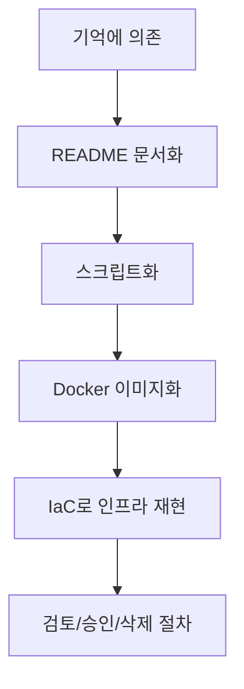

# 4교시: 재현 가능한 인프라의 필요성 - 문서, 스크립트, IaC의 출발점

## 수업 목표
- 재현 가능성이 왜 운영의 핵심 품질인지 설명한다.
- README, 실행 스크립트, Dockerfile, Terraform 같은 도구가 같은 문제를 다른 수준에서 해결한다는 점을 이해한다.
- 수동 절차의 위험과 자동화의 장단점을 구분한다.
- 미니 앱 실행 절차를 재현성 관점으로 개선한다.

## 공식 참고 자료
- The Twelve-Factor App: Build, release, run  
  https://12factor.net/build-release-run
- Docker Docs: Dockerfile reference  
  https://docs.docker.com/reference/dockerfile/
- HashiCorp Terraform Documentation  
  https://developer.hashicorp.com/terraform/docs
- GitHub Docs: About READMEs  
  https://docs.github.com/en/repositories/managing-your-repositorys-settings-and-features/customizing-your-repository/about-readmes

## 핵심 개념
| 수준 | 예시 | 해결하는 문제 | 한계 |
|---|---|---|---|
| 기억 | "내가 이렇게 했던 것 같음" | 빠르게 시도 가능 | 재현 불가 |
| 문서 | README, runbook | 사람이 따라할 수 있음 | 누락/오타 가능 |
| 스크립트 | `run.sh`, Makefile | 반복 실행 가능 | 환경 차이는 남음 |
| 패키징 | Dockerfile, image | 실행 환경 고정 | 이미지 관리 필요 |
| IaC | Terraform, CloudFormation | 인프라까지 재현 | 상태 관리와 비용 리스크 |

재현 가능성은 "똑같이 만들 수 있다"는 뜻이다. 운영에서 재현 가능성이 중요한 이유는 장애 분석, 신규 환경 구축, 롤백, 보안 감사, 비용 검토가 모두 현재 상태를 다시 설명할 수 있어야 가능하기 때문이다.

## 쉬운 비유
재현 가능한 인프라는 실험실의 실험 절차와 비슷하다. 결과만 적어두면 다른 사람이 검증할 수 없다. 재료, 장비, 온도, 시간, 순서가 있어야 같은 실험을 반복할 수 있다. README는 실험 노트이고, 스크립트는 일부 절차를 자동으로 수행하는 장비이며, IaC는 실험실 장비 배치까지 코드로 기록하는 방식에 가깝다.

비유의 한계는 실제 인프라는 실행할 때 비용이 발생하고 외부 서비스 상태에 영향을 받는다는 점이다. 그래서 재현 가능성에는 삭제와 정리 절차도 포함되어야 한다.

## 인포그래픽
아래 인포그래픽은 기억에 의존하는 실행이 README, 스크립트, 이미지, IaC로 성숙해지는 흐름을 실험 절차 비유와 연결한다.


## 실습 1: 수동 절차를 재현성 기준으로 평가
아래 절차를 실행한다.

```bash
cd week1/day3/mini-deploy-lab
cp .env.example .env
python3 app.py
```

다른 터미널:

```bash
curl http://localhost:8020/health
tail -n 20 logs/app.log
```

평가:
- 명령 순서가 README에 있는가?
- `.env` 생성이 누락되면 어떤 오류가 나는가?
- 실행 중인 프로세스 종료 방법이 있는가?
- 포트를 바꾸면 확인 URL도 같이 바뀌는가?
- 로그 파일이 Git에 올라가지 않도록 제외되어 있는가?

## 실습 2: 재현성 보강 기록 작성
README를 바로 수정하지 않고, 먼저 보강해야 할 항목을 기록한다.

```markdown
# Reproducibility Review

## 실행 전 준비
- 

## 실행 명령
- 

## 정상 확인
- 

## 종료 방법
- 

## 설정 변경 방법
- 

## 장애 확인
- 

## Git에 올리면 안 되는 파일
- 
```

이 기록은 2주차 Dockerfile을 작성할 때 그대로 재사용된다. Dockerfile은 "내가 어떤 명령을 쳤는가"를 이미지 빌드 절차로 옮기는 문서이기 때문이다.

## 수동, 문서, 스크립트, IaC 비교
| 방식 | 적합한 상황 | 위험 |
|---|---|---|
| 수동 실행 | 학습, 빠른 확인 | 사람마다 결과가 달라짐 |
| 문서화 | 팀 공유, 신규 합류 | 문서와 실제가 어긋남 |
| 스크립트 | 반복 명령 실행 | 예외 처리가 부족하면 실패 원인 숨김 |
| Dockerfile | 실행 환경 표준화 | 이미지 빌드와 보안 관리 필요 |
| Terraform | 클라우드 리소스 재현 | 잘못 적용하면 비용/운영 영향 큼 |

## Mermaid: 재현성 성숙도


## 의사결정 기준
| 질문 | 문서로 충분 | 스크립트 필요 | IaC 필요 |
|---|---|---|---|
| 한두 번만 실행하는가? | 예 | 아니오 | 아니오 |
| 여러 학생/팀원이 반복하는가? | 부족 | 예 | 상황에 따라 |
| 클라우드 리소스를 생성하는가? | 부족 | 부족 | 예 |
| 비용이나 보안 영향이 큰가? | 부족 | 부족 | 예 |
| 리뷰와 변경 이력이 필요한가? | 부분적 | 부분적 | 예 |

## DevOps 원칙 연결
- 비용 절감: 재현 가능한 삭제 절차가 없으면 사용하지 않는 리소스가 남아 비용이 발생한다.
- 개발/배포 효율성: 반복 절차를 문서와 스크립트로 옮기면 배포 준비 시간이 줄어든다.
- 관리 효율성: IaC는 누가 무엇을 언제 바꿨는지 리뷰할 수 있게 한다.

## 확인 질문
- README와 스크립트는 각각 어떤 한계를 갖는가?
- Dockerfile은 왜 단순 설치 명령 모음이 아니라 실행 환경 문서인가?
- IaC가 편리해도 위험할 수 있는 이유는 무엇인가?

## 마무리 정리
재현 가능성은 Docker와 Terraform을 배우기 위한 전제다. 다음 교시에서는 바로 Docker가 왜 등장했는지, 로컬 환경 차이와 의존성 충돌이 어떤 운영 문제를 만드는지 확인한다.
