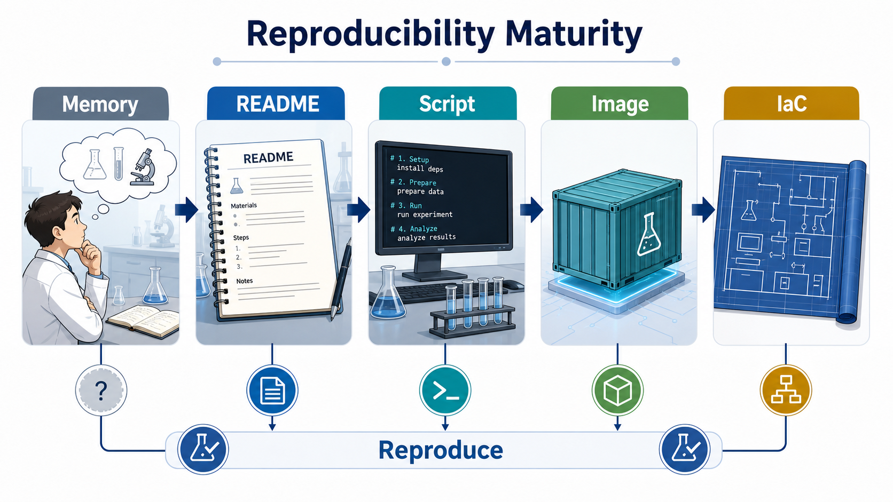
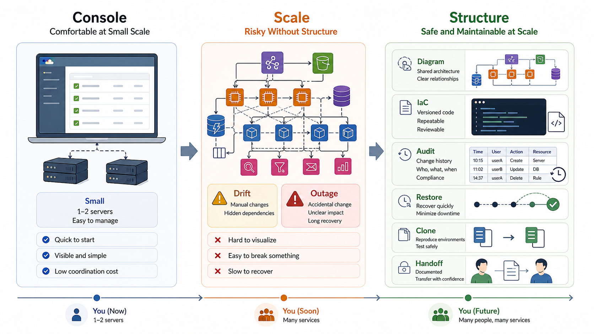
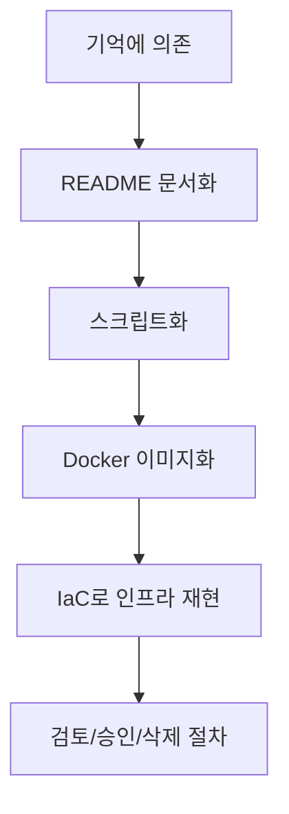

# 4교시: 재현 가능한 인프라의 필요성 - 문서, 스크립트, IaC의 출발점

## 수업 목표
- 재현 가능성이 왜 운영의 핵심 품질인지 설명한다.
- README, 실행 스크립트, Dockerfile, Terraform 같은 도구가 같은 문제를 다른 수준에서 해결한다는 점을 이해한다.
- 수동 절차의 위험과 자동화의 장단점을 구분한다.
- AWS, Azure, GCP 같은 웹 콘솔이 편리해도 규모가 커지면 콘솔만으로 운영하기 어려운 이유를 설명한다.
- 도식화, 복원 가능성, 환경 복제, 감사 증적이 인프라 운영에서 왜 필요한지 이해한다.
- 미니 앱 실행 절차를 재현성 관점으로 개선한다.

## 공식 참고 자료
- The Twelve-Factor App: Build, release, run  
  https://12factor.net/build-release-run
- Docker Docs: Dockerfile reference  
  https://docs.docker.com/reference/dockerfile/
- HashiCorp Terraform Documentation  
  https://developer.hashicorp.com/terraform/docs
- AWS Well-Architected Framework: Use automation when obtaining or scaling resources
  https://docs.aws.amazon.com/wellarchitected/latest/framework/rel_adapt_to_changes_autoscale_adapt.html
- AWS CloudTrail User Guide: What is AWS CloudTrail?
  https://docs.aws.amazon.com/awscloudtrail/latest/userguide/cloudtrail-user-guide.html
- Microsoft Learn: ARM template overview
  https://learn.microsoft.com/en-us/azure/azure-resource-manager/templates/overview
- Google Cloud Documentation: Infrastructure as Code in Google Cloud
  https://docs.cloud.google.com/docs/terraform/iac-overview
- GitHub Docs: About READMEs  
  https://docs.github.com/en/repositories/managing-your-repositorys-settings-and-features/customizing-your-repository/about-readmes

## 핵심 개념
| 수준 | 예시 | 해결하는 문제 | 한계 |
|---|---|---|---|
| 기억 | "내가 이렇게 했던 것 같음" | 빠르게 시도 가능 | 재현 불가 |
| 문서 | README, runbook | 사람이 따라할 수 있음 | 누락/오타 가능 |
| 스크립트 | `run.sh`, Makefile | 반복 실행 가능 | 환경 차이는 남음 |
| 패키징 | Dockerfile, image | 실행 환경 고정 | 이미지 관리 필요 |
| IaC | Terraform, CloudFormation | 인프라까지 재현 | 상태 관리와 비용 리스크 |

재현 가능성은 "똑같이 만들 수 있다"는 뜻이다. 운영에서 재현 가능성이 중요한 이유는 장애 분석, 신규 환경 구축, 롤백, 보안 감사, 비용 검토가 모두 현재 상태를 다시 설명할 수 있어야 가능하기 때문이다.

AWS, Azure, GCP의 웹 콘솔은 매우 잘 만들어져 있다. 처음 클라우드를 배울 때는 콘솔이 가장 직관적이다. 서버 1~2대, 단순한 네트워크, 작은 데이터베이스 정도는 콘솔에서 직접 만들고 테스트해도 큰 문제가 없을 수 있다. 화면으로 현재 상태를 확인하기 쉽고, 버튼과 폼이 잘 정리되어 있어 초급자가 리소스 개념을 잡기에도 좋다.

문제는 인프라가 커질 때 시작된다. VPC, subnet, route table, security group, load balancer, Auto Scaling, database, cache, IAM, monitoring, backup이 함께 얽히면 콘솔 화면만으로 전체 구조를 머릿속에 유지하기 어렵다. 누군가가 콘솔에서 의도치 않게 security group, target group, IAM policy, database option을 바꾸면 서비스가 멈출 수 있다. 변경 이력과 의도가 코드로 남지 않으면 "누가, 언제, 왜 바꿨는가"를 추적하기 어렵다.

공식 문서도 이 방향을 뒷받침한다. AWS Well-Architected Framework는 인프라와 리소스를 코드로 정의하고 자동화해 일관성과 반복성을 높이고 수동 작업 위험을 줄이는 방향을 권장한다. AWS CloudTrail은 AWS Management Console, CLI, SDK, API에서 발생한 계정 활동을 event로 기록해 감사와 컴플라이언스에 사용한다. Microsoft는 ARM template을 Azure 리소스를 위한 Infrastructure as Code 방식으로 설명하고, Google Cloud도 IaC를 GUI나 명령형 스크립트 대신 코드로 인프라를 프로비저닝하고 관리하는 방식으로 설명한다.

## 쉬운 비유
재현 가능한 인프라는 실험실의 실험 절차와 비슷하다. 결과만 적어두면 다른 사람이 검증할 수 없다. 재료, 장비, 온도, 시간, 순서가 있어야 같은 실험을 반복할 수 있다. README는 실험 노트이고, 스크립트는 일부 절차를 자동으로 수행하는 장비이며, IaC는 실험실 장비 배치까지 코드로 기록하는 방식에 가깝다.

비유의 한계는 실제 인프라는 실행할 때 비용이 발생하고 외부 서비스 상태에 영향을 받는다는 점이다. 그래서 재현 가능성에는 삭제와 정리 절차도 포함되어야 한다.

## 인포그래픽
아래 인포그래픽은 기억에 의존하는 실행이 README, 스크립트, 이미지, IaC로 성숙해지는 흐름을 실험 절차 비유와 연결한다.



아래 인포그래픽은 작은 규모에서는 콘솔 운영이 편하지만, 구조가 커질수록 drift, 실수, 장애, 감사 누락이 발생하기 쉬워지고, 도식화와 IaC, 감사 로그, 복원/복제 절차가 필요해지는 흐름을 보여준다.



## 웹 콘솔 운영의 장점과 한계
| 상황 | 콘솔이 좋은 이유 | 한계 |
|---|---|---|
| 학습 초기 | 화면으로 리소스 관계를 확인하기 쉽다 | 반복 생성과 변경 추적이 어렵다 |
| 서버 1~2대 | 빠르게 만들고 테스트할 수 있다 | 실수해도 바로 티가 나지 않을 수 있다 |
| 간단한 아키텍처 | 버튼과 폼으로 구성 가능하다 | 문서와 실제 설정이 어긋나기 쉽다 |
| 긴급 확인 | 현재 상태를 빠르게 볼 수 있다 | 변경을 콘솔에서 바로 하면 이력 관리가 약해질 수 있다 |
| 대규모 운영 | 일부 상태 확인에는 유용하다 | 전체 구조, 의존성, drift 파악이 어렵다 |

콘솔을 쓰지 말자는 뜻이 아니다. 콘솔은 확인과 학습에 매우 좋다. 다만 콘솔만으로 운영하는 구조는 규모가 커질수록 위험하다. 콘솔은 "현재 화면"을 보여주지만, 팀이 합의한 목표 구조, 변경 이유, 리뷰 이력, 복구 절차, 환경 복제 방법까지 자동으로 보장하지 않는다.

## 인프라가 커질수록 필요한 것
| 필요한 것 | 이유 | 예시 |
|---|---|---|
| 도식화 | 전체 구조와 의존성을 빠르게 이해한다 | network diagram, service map |
| IaC | 언제든 같은 구조를 다시 만든다 | Terraform, CloudFormation, ARM template |
| 감사 로그 | 누가 무엇을 바꿨는지 추적한다 | CloudTrail, activity log |
| 환경 복제 | dev/staging/prod 차이를 줄인다 | parameter, workspace, module |
| 복원 절차 | 장애나 실수 후 되돌린다 | rollback, backup restore |
| 변경 리뷰 | 위험한 변경을 사전에 막는다 | pull request, plan review |
| 운영 문서 | 담당자 부재 시 대체자가 대응한다 | runbook, architecture note |

특히 보안 인증과 감사 대응에서는 "잘 운영하고 있습니다"라는 말만으로 부족하다. 어떤 변경이 있었고, 누가 승인했으며, 어떤 보안 설정이 적용되어 있고, 장애 시 어떤 절차로 복구할 수 있는지 증거가 필요하다. ISMS 같은 보안 인증에서도 접근 통제, 변경 관리, 운영 기록, 장애 대응 절차를 설명하고 입증해야 한다. 인프라 문서와 IaC, 감사 로그는 그 증거의 기반이 된다.

## 인프라 변경이 더 보수적이어야 하는 이유
애플리케이션 버그는 특정 기능의 오류로 끝나는 경우가 많다. 물론 결제나 인증처럼 심각한 기능도 있지만, 많은 경우에는 한 화면, 한 API, 한 기능의 문제로 좁혀진다. 반면 인프라 변경은 한 번의 실수로 서비스 전체가 멈추거나 데이터가 손상될 수 있다.

| 실수 | 가능한 결과 |
|---|---|
| security group에서 필요한 inbound rule 삭제 | 전체 서비스 접속 불가 |
| route table 또는 NAT 설정 변경 | 외부 API 호출 실패 |
| load balancer target group 오설정 | 정상 서버가 있어도 트래픽 미전달 |
| database 삭제 또는 snapshot 누락 | 데이터 손실과 복구 불가 |
| IAM 권한 과다/과소 부여 | 보안 사고 또는 배포 실패 |
| autoscaling 설정 오류 | 과도한 비용 또는 트래픽 처리 실패 |

그래서 인프라 엔지니어는 개발보다 보수적인 변경 절차를 갖는 경우가 많다. 느리게 일하기 위해서가 아니라, 실수의 blast radius가 크기 때문이다. 구조화된 문서와 IaC는 속도를 늦추는 장치가 아니라, 위험한 변경을 더 안전하게 빠르게 하기 위한 장치다.

## 담당자 부재와 긴급 대체자 대응
인프라 담당자가 휴가, 퇴사, 장애 대응 중 부재인 상황에서도 누군가는 긴급 작업을 해야 할 수 있다. 이때 콘솔 화면을 하나씩 눌러가며 추측하면 위험하다. 대체자가 볼 수 있는 구조도, IaC 코드, 변경 이력, runbook, rollback 절차가 있어야 한다.

대체자가 필요한 정보:
- 전체 아키텍처 도식
- 환경별 차이점
- 핵심 리소스 이름과 역할
- 변경 전 확인할 지표
- 변경 명령 또는 IaC 적용 절차
- 적용 후 health check
- 실패 시 rollback 절차
- 감사와 보고에 남길 기록

이 정보가 있으면 담당자가 없어도 최소한의 안전장치를 가지고 대응할 수 있다. 반대로 이 정보가 없으면 가장 위험한 순간에 가장 많은 추측을 하게 된다.

## 실습 1: 수동 절차를 재현성 기준으로 평가
아래 절차를 실행한다.

```bash
cd week1/day3/mini-deploy-lab
cp .env.example .env
python3 app.py
```

다른 터미널:

```bash
curl http://localhost:8020/health
tail -n 20 logs/app.log
```

평가:
- 명령 순서가 README에 있는가?
- `.env` 생성이 누락되면 어떤 오류가 나는가?
- 실행 중인 프로세스 종료 방법이 있는가?
- 포트를 바꾸면 확인 URL도 같이 바뀌는가?
- 로그 파일이 Git에 올라가지 않도록 제외되어 있는가?

## 실습 2: 재현성 보강 기록 작성
README를 바로 수정하지 않고, 먼저 보강해야 할 항목을 기록한다.

```markdown
# Reproducibility Review

## 실행 전 준비
- 

## 실행 명령
- 

## 정상 확인
- 

## 종료 방법
- 

## 설정 변경 방법
- 

## 장애 확인
- 

## Git에 올리면 안 되는 파일
- 
```

이 기록은 2주차 Dockerfile을 작성할 때 그대로 재사용된다. Dockerfile은 "내가 어떤 명령을 쳤는가"를 이미지 빌드 절차로 옮기는 문서이기 때문이다.

## 수동, 문서, 스크립트, IaC 비교
| 방식 | 적합한 상황 | 위험 |
|---|---|---|
| 수동 실행 | 학습, 빠른 확인 | 사람마다 결과가 달라짐 |
| 문서화 | 팀 공유, 신규 합류 | 문서와 실제가 어긋남 |
| 스크립트 | 반복 명령 실행 | 예외 처리가 부족하면 실패 원인 숨김 |
| Dockerfile | 실행 환경 표준화 | 이미지 빌드와 보안 관리 필요 |
| Terraform | 클라우드 리소스 재현 | 잘못 적용하면 비용/운영 영향 큼 |

## 콘솔, 문서, IaC의 역할 분리
| 도구 | 주 역할 | 주의 |
|---|---|---|
| Web Console | 현재 상태 확인, 학습, 긴급 조회 | 직접 변경은 drift와 감사 누락 위험 |
| Architecture Diagram | 전체 구조 이해, 의사소통 | 실제 설정과 동기화 필요 |
| README/Runbook | 사람의 실행 절차와 판단 기준 | 오래되면 위험 |
| IaC | 목표 인프라 구조 정의와 재현 | state, 권한, 비용 영향 관리 필요 |
| Audit Log | 변경 추적과 보안 증적 | 로그 보관과 검색 기준 필요 |

## Mermaid: 재현성 성숙도


## 의사결정 기준
| 질문 | 문서로 충분 | 스크립트 필요 | IaC 필요 |
|---|---|---|---|
| 한두 번만 실행하는가? | 예 | 아니오 | 아니오 |
| 여러 학생/팀원이 반복하는가? | 부족 | 예 | 상황에 따라 |
| 클라우드 리소스를 생성하는가? | 부족 | 부족 | 예 |
| 비용이나 보안 영향이 큰가? | 부족 | 부족 | 예 |
| 리뷰와 변경 이력이 필요한가? | 부분적 | 부분적 | 예 |
| 환경을 복제해야 하는가? | 부족 | 부족 | 예 |
| 보안 인증 증적이 필요한가? | 부족 | 부분적 | 예 |
| 담당자 부재 시 대체자가 작업해야 하는가? | 부족 | 부분적 | 예 |

## 인프라 문서화 체크리스트
```markdown
# Infrastructure Documentation Checklist

## 구조 이해
- 아키텍처 다이어그램:
- 주요 리소스 목록:
- 환경별 차이:

## 재현과 복원
- IaC 위치:
- 적용 명령:
- rollback 절차:
- backup/snapshot 위치:

## 변경 통제
- 리뷰 방식:
- 승인자:
- 변경 이력:
- 감사 로그 위치:

## 운영 확인
- health check:
- 로그:
- 메트릭:
- 알림:

## 대체자 대응
- 긴급 연락:
- 작업 전 확인할 것:
- 작업 후 보고할 것:
```

## DevOps 원칙 연결
- 비용 절감: 재현 가능한 삭제 절차가 없으면 사용하지 않는 리소스가 남아 비용이 발생한다.
- 개발/배포 효율성: 반복 절차를 문서와 스크립트로 옮기면 배포 준비 시간이 줄어든다.
- 관리 효율성: 도식화, IaC, 감사 로그는 누가 무엇을 언제 바꿨는지 리뷰하고, 담당자 부재 시에도 구조를 이해하게 한다.

## 확인 질문
- README와 스크립트는 각각 어떤 한계를 갖는가?
- Dockerfile은 왜 단순 설치 명령 모음이 아니라 실행 환경 문서인가?
- IaC가 편리해도 위험할 수 있는 이유는 무엇인가?
- 클라우드 콘솔이 편리한데도 IaC와 도식화가 필요한 이유는 무엇인가?
- 인프라 변경이 애플리케이션 기능 수정보다 더 보수적으로 다뤄지는 이유는 무엇인가?
- 보안 인증이나 감사에서 인프라 문서와 변경 이력이 왜 중요한가?

## 마무리 정리
재현 가능성은 Docker와 Terraform을 배우기 위한 전제다. 콘솔은 좋은 도구지만, 규모가 커진 인프라를 콘솔 기억만으로 운영할 수는 없다. 구조를 도식화하고, 코드로 재현하고, 변경 이력을 남기고, 대체자가 이해할 수 있게 문서화해야 한다. 다음 교시에서는 바로 Docker가 왜 등장했는지, 로컬 환경 차이와 의존성 충돌이 어떤 운영 문제를 만드는지 확인한다.
