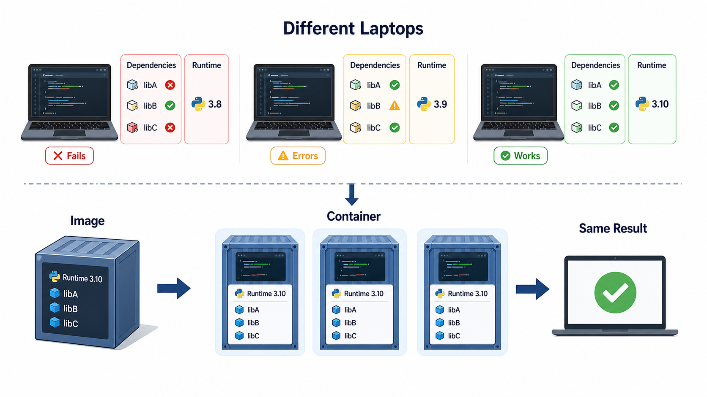
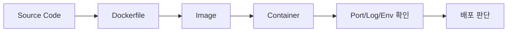

# 5교시: Docker가 필요한 이유 - 로컬 환경 차이, 의존성 충돌, 실행 환경 표준화

## 수업 목표
- Docker를 명령어가 아니라 실행 환경 표준화 문제의 해결책으로 이해한다.
- image와 container의 차이를 2주차 진입 전 예비 개념으로 설명한다.
- 로컬 환경 차이, 의존성 충돌, 포트 충돌, 설정 누락이 배포 실패로 이어지는 과정을 설명한다.
- Docker가 해결하는 것과 해결하지 않는 것을 구분한다.

## 공식 참고 자료
- Docker Docs: What is Docker?  
  https://docs.docker.com/get-started/docker-overview/
- Docker Docs: Docker concepts  
  https://docs.docker.com/get-started/docker-concepts/the-basics/what-is-a-container/
- Docker Docs: Dockerfile reference  
  https://docs.docker.com/reference/dockerfile/

## 핵심 개념
| 용어 | 뜻 | 오늘의 수준 |
|---|---|---|
| Docker | 애플리케이션 실행 환경을 image와 container로 표준화하는 도구 | 왜 필요한지 이해 |
| Image | 실행에 필요한 파일과 설정을 묶은 읽기 전용 재료 | 2주차에 직접 빌드 |
| Container | image를 바탕으로 실행 중인 프로세스 | 2주차에 생명주기 실습 |
| Dependency | 실행에 필요한 라이브러리, 런타임, 파일 | 버전 차이가 장애 원인 |
| Port Binding | 컨테이너 내부 포트와 호스트 포트를 연결 | 2주차 핵심 실습 |

Docker는 "가벼운 가상머신"이라는 설명만으로는 부족하다. 인프라 관점에서 Docker의 핵심은 실행 환경을 포장하고, 같은 포장 단위를 여러 환경에서 실행할 수 있게 만드는 것이다. 내 노트북의 Python 버전, 설치된 라이브러리, 경로, 권한이 다르면 같은 코드도 다르게 동작한다. Docker는 이런 차이를 줄이기 위해 애플리케이션과 실행 조건을 image라는 단위로 묶는다.

## 쉬운 비유
Docker image는 밀키트에 가깝다. 레시피만 전달하면 사람마다 재료와 조리 도구가 달라 결과가 흔들린다. 밀키트는 필요한 재료와 순서를 한 상자에 담아 결과 차이를 줄인다. container는 그 밀키트를 실제로 열어 조리하고 있는 상태다.

비유의 한계는 Docker image가 음식처럼 한 번 쓰고 끝나는 것이 아니라 버전 관리, 보안 스캔, 배포, 롤백의 대상이 된다는 점이다. 그리고 Docker가 모든 문제를 해결하지 않는다. 잘못된 코드, 잘못된 설정, 노출된 secret, 과도한 비용은 Docker를 써도 여전히 문제다.

## 인포그래픽
아래 인포그래픽은 서로 다른 노트북과 의존성 차이가 실행 결과를 흔드는 문제를 Docker image와 container 개념으로 정리한다.



## Docker가 줄이는 문제
| 문제 | Docker 전 | Docker 후 |
|---|---|---|
| 런타임 버전 | PC마다 Python/Node 버전이 다름 | image 안에 기준 런타임을 고정 |
| 의존성 | 설치 여부가 사람마다 다름 | 빌드 과정에서 의존성을 명시 |
| 실행 명령 | README를 잘못 따라칠 수 있음 | image 실행 명령으로 표준화 |
| 배포 단위 | 파일 묶음이 불명확 | image tag로 배포 단위 관리 |
| 롤백 | 이전 상태 재현이 어려움 | 이전 image tag로 되돌릴 수 있음 |

## Docker가 해결하지 않는 문제
| 문제 | 이유 |
|---|---|
| 애플리케이션 버그 | Docker는 코드를 자동으로 고치지 않는다 |
| 잘못된 환경변수 | image가 있어도 실행 시 설정을 잘못 주입할 수 있다 |
| secret 노출 | Dockerfile이나 image에 secret을 넣으면 더 위험해질 수 있다 |
| 관찰 가능성 부족 | 로그와 메트릭을 남기지 않으면 container도 블랙박스가 된다 |
| 비용 낭비 | container를 많이 띄우면 자원과 로그 비용도 늘어난다 |

## 실습: Docker가 필요한 문제를 로컬에서 먼저 관찰
`mini-deploy-lab`은 Docker 없이 실행된다. 하지만 실행 조건이 이미 여러 개 있다.

```bash
cd week1/day3/mini-deploy-lab
cat .env.example
python3 -m py_compile app.py
cp .env.example .env
python3 app.py
```

다른 터미널:

```bash
curl http://localhost:8020/config
tail -n 20 logs/app.log
```

질문:
- Python이 설치되어 있지 않으면 어떻게 되는가?
- `.env`가 없으면 어떤 기본값으로 실행되는가?
- `PORT=abc`이면 어떤 오류가 나는가?
- 로그 폴더를 Git에 올리면 어떤 문제가 생기는가?

이 질문들이 바로 Dockerfile, `.dockerignore`, environment variable, volume, log collection으로 이어진다.

## Mermaid: Docker가 들어오는 위치


## 2주차 예고: 같은 앱을 Docker로 옮기면 생기는 질문
| 오늘의 질문 | 2주차 Docker 질문 |
|---|---|
| `python3 app.py`를 어디서 실행하는가? | container 안에서 어떤 command가 실행되는가? |
| `PORT=8020`은 어디에 있는가? | `docker run -e PORT=...`로 주입할 것인가? |
| 로그는 어디에 남는가? | stdout으로 볼 것인가, volume에 남길 것인가? |
| 포트 충돌은 어떻게 해결하는가? | host port와 container port를 어떻게 매핑할 것인가? |
| 다른 사람이 같은 환경을 만들 수 있는가? | image tag를 공유할 것인가? |

## DevOps 원칙 연결
- 비용 절감: 실행 환경 차이로 발생하는 반복 장애와 온보딩 시간을 줄인다.
- 개발/배포 효율성: 배포 단위를 image로 표준화하면 환경 준비 시간이 줄어든다.
- 관리 효율성: image tag와 실행 명령이 있으면 배포와 롤백을 추적하기 쉽다.

## 확인 질문
- Docker image와 container는 각각 무엇에 대응되는가?
- Docker를 쓰면 `.env`와 secret 관리 문제가 자동으로 사라지는가?
- Docker가 필요한 이유를 "내 PC에서는 되는데요" 문제와 연결해 설명해보자.

## 마무리 정리
Docker는 다음 주에 본격적으로 다룬다. 오늘은 Docker가 갑자기 등장한 도구가 아니라, 배포와 재현성 문제를 해결하기 위해 필요한 다음 단계라는 점을 이해하는 것이 목표다.
