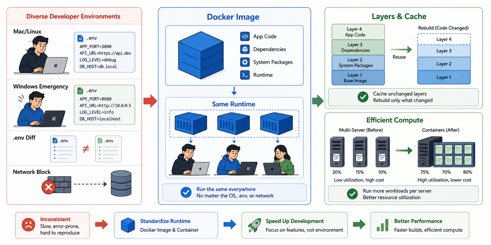
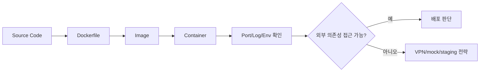

# 5교시: Docker가 필요한 이유 - 로컬 환경 차이, 의존성 충돌, 실행 환경 표준화

## 수업 목표
- Docker를 명령어가 아니라 실행 환경 표준화 문제의 해결책으로 이해한다.
- image와 container의 차이를 2주차 진입 전 예비 개념으로 설명한다.
- 로컬 환경 차이, 의존성 충돌, 포트 충돌, 설정 누락이 배포 실패로 이어지는 과정을 설명한다.
- macOS/Linux 중심 개발 환경과 긴급 Windows 환경처럼 장비와 OS가 달라져도 개발 속도를 멈추지 않아야 하는 이유를 이해한다.
- Docker layer와 build cache가 빌드 속도 개선에 기여하는 방식을 예비 개념으로 설명한다.
- Docker가 컴퓨팅 자원 분산과 비용 절감에 연결될 수 있는 이유를 설명한다.
- Docker가 해결하는 것과 해결하지 않는 것을 구분한다.

## 공식 참고 자료
- Docker Docs: What is Docker?  
  https://docs.docker.com/get-started/docker-overview/
- Docker Docs: Docker concepts  
  https://docs.docker.com/get-started/docker-concepts/the-basics/what-is-a-container/
- Docker Docs: Dockerfile reference  
  https://docs.docker.com/reference/dockerfile/
- Docker Docs: Optimize cache usage in builds
  https://docs.docker.com/build/cache/optimize/
- Docker Docs: Multi-stage builds
  https://docs.docker.com/build/building/multi-stage/
- Docker Docs: Docker overview
  https://docs.docker.com/get-started/docker-overview/

## 핵심 개념
| 용어 | 뜻 | 오늘의 수준 |
|---|---|---|
| Docker | 애플리케이션 실행 환경을 image와 container로 표준화하는 도구 | 왜 필요한지 이해 |
| Image | 실행에 필요한 파일과 설정을 묶은 읽기 전용 재료 | 2주차에 직접 빌드 |
| Container | image를 바탕으로 실행 중인 프로세스 | 2주차에 생명주기 실습 |
| Dependency | 실행에 필요한 라이브러리, 런타임, 파일 | 버전 차이가 장애 원인 |
| Port Binding | 컨테이너 내부 포트와 호스트 포트를 연결 | 2주차 핵심 실습 |
| Layer | image를 구성하는 변경 단위 | 빌드 cache와 속도 개선의 기반 |
| Build Cache | 이전에 만든 layer를 재사용하는 기능 | 바뀐 부분만 다시 빌드해 시간을 줄임 |

Docker는 "가벼운 가상머신"이라는 설명만으로는 부족하다. 인프라 관점에서 Docker의 핵심은 실행 환경을 포장하고, 같은 포장 단위를 여러 환경에서 실행할 수 있게 만드는 것이다. 내 노트북의 Python 버전, 설치된 라이브러리, 경로, 권한이 다르면 같은 코드도 다르게 동작한다. Docker는 이런 차이를 줄이기 위해 애플리케이션과 실행 조건을 image라는 단위로 묶는다.

요즘 많은 IT 회사는 macOS 기반 개발 환경을 사용한다. 인프라 엔지니어와 백엔드 개발자도 Linux와 가까운 환경에서 일하는 경우가 많다. 하지만 현실에서는 항상 같은 장비에서 일하지 않는다. 휴가 중 급한 장애 대응을 해야 할 수도 있고, 외부 일정 중 Windows 노트북밖에 없을 수도 있으며, 새로 받은 장비에는 아직 개발환경이 없을 수도 있다. 이때 "그 장비에는 안 됩니다"라는 이유로 개발과 장애 대응이 멈추면 안 된다.

AI Coding Tool의 확산으로 코드 작성 속도는 크게 빨라지고 있다. 개발자가 기능 초안을 만들고 수정하는 시간은 줄어드는데, 환경 문제 때문에 실행이 안 되거나 다른 사람 PC에서만 오류가 나면 전체 속도는 다시 느려진다. 개발 속도가 빨라질수록 환경 표준화의 가치는 더 커진다. 빠르게 만든 코드를 빠르게 실행하고, 빠르게 검증하고, 문제가 나면 빠르게 원인을 좁혀야 하기 때문이다.

물론 Docker가 모든 외부 조건을 해결하지는 못한다. 회사 VPN이 없어서 database에 접근할 수 없거나, 보안 정책 때문에 특정 내부 API가 막혀 있다면 Docker만으로 해결되지 않는다. 그런 문제는 네트워크, 권한, mock, test data, staging endpoint 같은 별도 전략으로 풀어야 한다. 다만 로컬에서 애플리케이션 runtime, dependency, 실행 명령, 포트, 로그 확인 방식을 맞추는 데 Docker는 매우 좋은 대안이 된다.

## 쉬운 비유
Docker image는 밀키트에 가깝다. 레시피만 전달하면 사람마다 재료와 조리 도구가 달라 결과가 흔들린다. 밀키트는 필요한 재료와 순서를 한 상자에 담아 결과 차이를 줄인다. container는 그 밀키트를 실제로 열어 조리하고 있는 상태다.

비유의 한계는 Docker image가 음식처럼 한 번 쓰고 끝나는 것이 아니라 버전 관리, 보안 스캔, 배포, 롤백의 대상이 된다는 점이다. 그리고 Docker가 모든 문제를 해결하지 않는다. 잘못된 코드, 잘못된 설정, 노출된 secret, 과도한 비용은 Docker를 써도 여전히 문제다.

## 인포그래픽
아래 인포그래픽은 서로 다른 노트북과 의존성 차이가 실행 결과를 흔드는 문제를 Docker image와 container 개념으로 정리한다.


아래 인포그래픽은 macOS/Linux 개발 환경, 긴급 Windows 장비, `.env` 차이, 네트워크 제약처럼 개발 속도를 멈추는 요인과 Docker image, layer, build cache가 제공하는 해결 방향을 연결한다.



## Docker가 줄이는 문제
| 문제 | Docker 전 | Docker 후 |
|---|---|---|
| 런타임 버전 | PC마다 Python/Node 버전이 다름 | image 안에 기준 런타임을 고정 |
| 의존성 | 설치 여부가 사람마다 다름 | 빌드 과정에서 의존성을 명시 |
| OS 차이 | macOS/Linux/Windows에서 명령과 경로가 달라짐 | container 내부 실행 환경을 통일 |
| `.env` 차이 | Git에 없는 설정이 사람마다 달라짐 | 필요한 변수 목록과 주입 방식을 표준화 |
| 긴급 장비 변경 | 새 장비 세팅에 시간이 오래 걸림 | image 실행으로 준비 시간을 줄임 |
| 실행 명령 | README를 잘못 따라칠 수 있음 | image 실행 명령으로 표준화 |
| 배포 단위 | 파일 묶음이 불명확 | image tag로 배포 단위 관리 |
| 롤백 | 이전 상태 재현이 어려움 | 이전 image tag로 되돌릴 수 있음 |

## Docker가 개발 속도를 지키는 방식
환경 문제는 단순히 "불편하다"로 끝나지 않는다. 한 개발자가 실행이 안 되어 하루를 쓰고, 다른 개발자가 같은 문제를 재현하지 못하고, 인프라 담당자가 원인을 확인하느라 시간을 쓰면 팀 전체 개발 속도가 줄어든다. AI 도구로 코드 생산성이 올라갈수록 이런 환경 문제는 더 비싼 병목이 된다.

| 병목 | Docker 없이 발생하는 일 | Docker로 기대하는 개선 |
|---|---|---|
| 새 장비 세팅 | 런타임, dependency, 경로를 하나씩 설치 | image pull/build 후 동일한 실행 환경 |
| 긴급 hotfix | 로컬 환경이 없어 수정 후 검증 지연 | container로 최소 실행 검증 |
| 팀원 간 재현 | "내 PC에서는 됨" 반복 | 같은 image와 command로 재현 |
| AI 생성 코드 검증 | 빠르게 만든 코드가 환경 문제로 멈춤 | 표준 runtime에서 즉시 실행 확인 |
| 온보딩 | 설치 문서가 길고 실패 지점이 많음 | Dockerfile/Compose로 실행 절차 축소 |

Docker의 목표는 개발자를 멈추지 않게 하는 것이다. 기능을 만들고, 실행하고, 오류를 보고, 수정하고, 다시 실행하는 루프가 빨라져야 한다. 로컬 환경 표준화는 개발자 편의를 넘어서 비즈니스 속도와 연결된다.

## 네트워크와 외부 의존성은 별도 전략이 필요하다
Docker가 runtime과 dependency를 맞춰도 외부 network는 여전히 다를 수 있다. 예를 들어 회사 내부 database, VPN 뒤의 API, 특정 cloud VPC 내부 endpoint는 개인 노트북에서 접근하지 못할 수 있다. 이 경우 Docker가 실패한 것이 아니라 접근 조건이 다른 것이다.

| 문제 | Docker로 해결 가능한가 | 별도 전략 |
|---|---|---|
| Python/Node 버전 차이 | 가능 | image에 runtime 고정 |
| 라이브러리 설치 누락 | 가능 | Dockerfile에 dependency 명시 |
| `.env` 값 누락 | 부분 가능 | `.env.example`, secret 관리 |
| 내부 DB 접근 불가 | 불가능 또는 제한적 | VPN, bastion, mock DB, staging DB |
| 외부 API rate limit | 불가능 | mock, contract test, test key |
| OS 파일 경로 차이 | 상당 부분 가능 | container path 표준화 |

중요한 것은 원인을 구분하는 능력이다. Docker가 해결할 수 있는 환경 차이와, 네트워크/권한/데이터 접근 문제를 분리해서 봐야 한다.

## Docker layer와 build cache
Docker image는 여러 layer로 구성된다. Docker Docs는 build cache를 활용하면 변경되지 않은 layer를 다시 빌드하지 않고 재사용할 수 있다고 설명한다. 이 구조 덕분에 모든 파일을 매번 처음부터 다시 설치하고 빌드하지 않아도 된다.

예를 들어 Dockerfile에서 dependency 설치 단계와 애플리케이션 코드 복사 단계를 잘 나누면, 코드 한 줄을 바꿨을 때 모든 dependency를 다시 설치하지 않을 수 있다. 반대로 Dockerfile을 잘못 작성하면 작은 코드 변경에도 무거운 설치 단계가 반복되어 빌드가 느려진다.

단순 예시:

```dockerfile
FROM python:3.12-slim
WORKDIR /app
COPY requirements.txt .
RUN pip install -r requirements.txt
COPY . .
CMD ["python", "app.py"]
```

이 구조에서는 `requirements.txt`가 바뀌지 않으면 dependency 설치 layer를 재사용할 수 있다. 2주차에 직접 확인할 내용이지만, 오늘은 "Docker는 실행 환경을 맞출 뿐 아니라 layer/cache를 통해 빌드 속도에도 영향을 준다"는 점만 기억하면 된다.

## 컴퓨팅 분산과 비용 관점
Docker container는 하나의 서버 안에서도 여러 프로세스를 분리해 실행할 수 있고, 여러 서버로 나누어 실행하기도 쉽다. 이 특성은 Kubernetes, ECS, Nomad 같은 orchestration 도구와 만나면 컴퓨팅 자원을 더 효율적으로 분산하는 기반이 된다.

비용 절감은 단순히 container가 항상 싸다는 뜻이 아니다. 중요한 것은 필요한 만큼 실행하고, 작은 단위로 배치하고, 사용량에 따라 늘리거나 줄일 수 있는 구조를 만들기 쉬워진다는 점이다. 같은 서버에 여러 서비스를 무작정 섞어 설치하면 충돌과 장애 전파가 커진다. container 단위로 분리하면 자원 사용량을 관찰하고, 서비스별로 scale 조정하고, 불필요한 인스턴스를 줄이는 판단이 쉬워진다.

| 비용/자원 관점 | Docker가 주는 기반 |
|---|---|
| 서비스별 자원 관찰 | container 단위 CPU/Memory 확인 |
| 작은 단위 배포 | 전체 서버가 아니라 service/container 단위 변경 |
| 빠른 scale out/in | orchestration과 결합해 replica 조정 |
| 낭비 확인 | idle container, 과한 image, 불필요한 log 식별 |
| 빌드 시간 절감 | layer/cache로 반복 빌드 시간 감소 |

## Docker가 해결하지 않는 문제
| 문제 | 이유 |
|---|---|
| 애플리케이션 버그 | Docker는 코드를 자동으로 고치지 않는다 |
| 잘못된 환경변수 | image가 있어도 실행 시 설정을 잘못 주입할 수 있다 |
| secret 노출 | Dockerfile이나 image에 secret을 넣으면 더 위험해질 수 있다 |
| 관찰 가능성 부족 | 로그와 메트릭을 남기지 않으면 container도 블랙박스가 된다 |
| 비용 낭비 | container를 많이 띄우면 자원과 로그 비용도 늘어난다 |
| 네트워크 접근 제한 | VPN, firewall, VPC, DB 권한 문제는 별도 설계가 필요하다 |

## 실습: Docker가 필요한 문제를 로컬에서 먼저 관찰
`mini-deploy-lab`은 Docker 없이 실행된다. 하지만 실행 조건이 이미 여러 개 있다.

```bash
cd week1/day3/mini-deploy-lab
cat .env.example
python3 -m py_compile app.py
cp .env.example .env
python3 app.py
```

다른 터미널:

```bash
curl http://localhost:8020/config
tail -n 20 logs/app.log
```

질문:
- Python이 설치되어 있지 않으면 어떻게 되는가?
- `.env`가 없으면 어떤 기본값으로 실행되는가?
- `PORT=abc`이면 어떤 오류가 나는가?
- 로그 폴더를 Git에 올리면 어떤 문제가 생기는가?
- 다른 장비에서 같은 명령이 실패하면 runtime 문제인가, 설정 문제인가, 네트워크 문제인가?
- 내부 DB가 안 붙는다면 Docker가 해결할 문제인가, 접근 전략을 따로 세울 문제인가?

이 질문들이 바로 Dockerfile, `.dockerignore`, environment variable, volume, log collection으로 이어진다.

## Mermaid: Docker가 들어오는 위치


## 2주차 예고: 같은 앱을 Docker로 옮기면 생기는 질문
| 오늘의 질문 | 2주차 Docker 질문 |
|---|---|
| `python3 app.py`를 어디서 실행하는가? | container 안에서 어떤 command가 실행되는가? |
| `PORT=8020`은 어디에 있는가? | `docker run -e PORT=...`로 주입할 것인가? |
| 로그는 어디에 남는가? | stdout으로 볼 것인가, volume에 남길 것인가? |
| 포트 충돌은 어떻게 해결하는가? | host port와 container port를 어떻게 매핑할 것인가? |
| 다른 사람이 같은 환경을 만들 수 있는가? | image tag를 공유할 것인가? |
| 빌드가 느리면 어디를 볼 것인가? | Dockerfile layer와 build cache를 어떻게 구성할 것인가? |
| 내부 DB가 없으면 어떻게 검증할 것인가? | Compose, mock, staging DB, network 접근을 어떻게 설계할 것인가? |

## DevOps 원칙 연결
- 비용 절감: 실행 환경 차이로 발생하는 반복 장애와 온보딩 시간을 줄이고, container 단위 자원 관찰과 scale 조정의 기반을 만든다.
- 개발/배포 효율성: 배포 단위를 image로 표준화하면 환경 준비 시간이 줄어들고, layer/cache를 잘 쓰면 반복 빌드 시간도 줄일 수 있다.
- 관리 효율성: image tag와 실행 명령이 있으면 배포와 롤백을 추적하기 쉽다.

## 확인 질문
- Docker image와 container는 각각 무엇에 대응되는가?
- Docker를 쓰면 `.env`와 secret 관리 문제가 자동으로 사라지는가?
- Docker가 필요한 이유를 "내 PC에서는 되는데요" 문제와 연결해 설명해보자.
- AI로 개발 속도가 빨라질수록 환경 표준화가 더 중요해지는 이유는 무엇인가?
- Docker가 해결할 수 있는 환경 문제와 해결할 수 없는 네트워크 문제를 구분해보자.
- Docker layer와 build cache가 빌드 속도에 영향을 주는 이유는 무엇인가?

## 마무리 정리
Docker는 다음 주에 본격적으로 다룬다. 오늘은 Docker가 갑자기 등장한 도구가 아니라, 개발 속도를 멈추는 환경 차이와 배포 재현성 문제를 해결하기 위해 필요한 다음 단계라는 점을 이해하는 것이 목표다. Docker는 runtime 표준화, image 기반 배포, layer/cache 기반 빌드 최적화, container 단위 자원 분산의 출발점이다.
