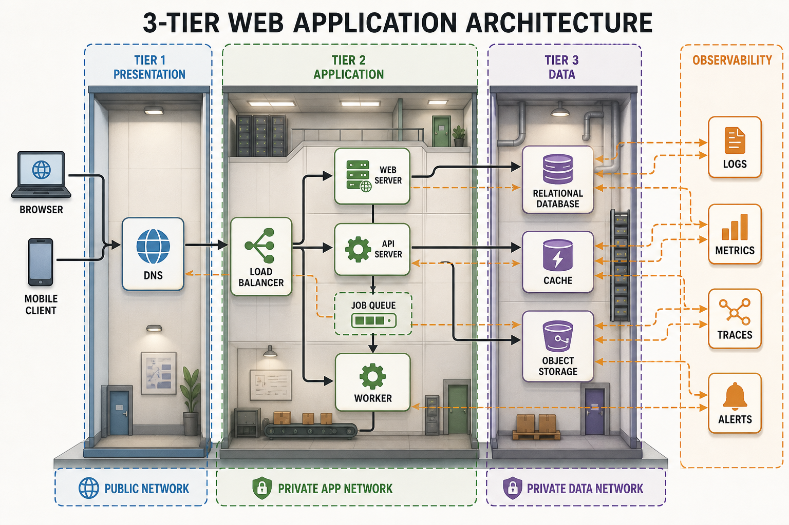
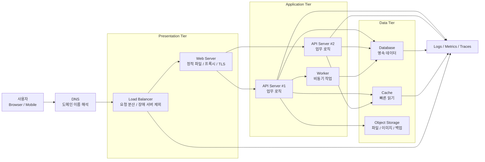

# 6교시: 프로젝트 구성요소와 3-tier 아키텍처 - 웹 앱, 데이터베이스, 캐시, ALB를 한 장의 지도로 보기

## 수업 목표
- 웹 서비스가 단일 프로그램이 아니라 여러 컴포넌트가 역할을 나누어 동작하는 구조임을 이해한다.
- 3-tier 아키텍처의 Presentation, Application, Data 계층을 구분하고 각 계층의 책임을 설명한다.
- 웹 애플리케이션, 데이터베이스, 캐시, 로드 밸런서, 로그/메트릭이 어떤 문제를 해결하는지 연결한다.
- AI Coding Tool로 코드를 만들기 전에 어떤 구성요소가 필요한지 먼저 질문하는 습관을 만든다.
- 2주차 Docker, 4주차 Kubernetes, 5~6주차 AWS/IaC가 결국 이 구성요소들을 더 안정적으로 실행하고 관리하기 위한 기술임을 이해한다.

## 공식 참고 자료
- AWS Architecture Center: Modular architecture for a three-tier application
  https://aws.amazon.com/blogs/architecture/modular-architecture-for-a-three-tier-application/
- AWS Prescriptive Guidance: Build a three-tier architecture on AWS
  https://docs.aws.amazon.com/prescriptive-guidance/latest/patterns/build-a-three-tier-architecture-on-aws.html
- AWS Docs: What is Elastic Load Balancing?
  https://docs.aws.amazon.com/elasticloadbalancing/latest/userguide/what-is-load-balancing.html
- AWS Docs: What is Amazon RDS?
  https://docs.aws.amazon.com/AmazonRDS/latest/UserGuide/Welcome.html
- AWS Docs: What is Amazon ElastiCache?
  https://docs.aws.amazon.com/AmazonElastiCache/latest/dg/WhatIs.html
- AWS Docs: What is Amazon S3?
  https://docs.aws.amazon.com/AmazonS3/latest/userguide/Welcome.html
- MDN Web Docs: An overview of HTTP
  https://developer.mozilla.org/en-US/docs/Web/HTTP/Guides/Overview

## 핵심 개념
| 용어 | 뜻 | 오늘의 관찰 포인트 |
|---|---|---|
| Client | 브라우저, 모바일 앱처럼 사용자가 직접 만지는 프로그램 | 요청을 어디로 보내는가 |
| DNS | 사람이 읽는 도메인 이름을 접속 가능한 주소로 바꾸는 체계 | 사용자가 어떤 입구로 들어오는가 |
| Load Balancer | 들어온 요청을 여러 서버 중 적절한 곳으로 분산하는 입구 | 서버 한 대가 죽어도 계속 받을 수 있는가 |
| Web Server | 정적 파일 전달, 프록시, TLS 종료, 기본 라우팅을 담당하는 서버 | 요청을 애플리케이션으로 넘기는가 |
| Application Server | 비즈니스 로직, API, 인증, 데이터 처리 흐름을 실행하는 서버 | 어떤 기능이 느리거나 실패하는가 |
| Database | 영속적으로 보관해야 하는 데이터를 저장하는 계층 | 데이터 정합성과 백업이 가능한가 |
| Cache | 자주 읽는 값을 빠르게 다시 제공하는 임시 저장소 | 속도 개선과 데이터 신선도 균형이 맞는가 |
| Object Storage | 이미지, 첨부파일, 백업 파일 같은 객체를 저장하는 공간 | 앱 서버 디스크에 파일을 묶어두지 않는가 |
| Observability | 로그, 메트릭, 트레이스로 시스템 상태를 설명하는 능력 | 장애 원인을 증거로 찾을 수 있는가 |

3-tier 아키텍처는 서비스를 세 개의 큰 책임으로 나누어 보는 기본 지도다. Presentation tier는 사용자가 보는 화면과 접속 입구를 담당한다. Application tier는 요청을 해석하고 업무 로직을 처리한다. Data tier는 저장해야 할 데이터를 안전하게 보관한다. 실제 회사 시스템은 여기에 캐시, 큐, 검색엔진, 오브젝트 스토리지, 모니터링 시스템, 인증 시스템이 붙으면서 더 복잡해진다.

## 쉬운 비유: 건물 평면도와 운영 동선
서비스를 하나의 큰 건물이라고 보면 이해하기 쉽다. 사용자는 건물 정문으로 들어오고, 안내 데스크는 어느 창구로 보낼지 결정한다. 업무 창구는 실제 요청을 처리하고, 금고나 문서 보관실은 중요한 데이터를 보관한다. 자주 찾는 서류는 창구 옆 임시 선반에 두면 빨리 꺼낼 수 있지만, 선반에 있는 문서가 최신인지 확인하는 규칙이 필요하다.

이 비유에서 정문과 안내 데스크는 DNS와 로드 밸런서에 가깝다. 업무 창구는 애플리케이션 서버다. 금고는 데이터베이스고, 임시 선반은 캐시다. CCTV와 업무 일지는 로그, 메트릭, 트레이스다. 인프라 엔지니어는 건물 전체의 동선, 병목, 보안 구역, 비상 상황을 보는 사람이다. 개발자가 한 창구의 기능을 고치는 동안, 인프라/DevOps 엔지니어는 그 창구가 건물 전체 동선과 비용 구조에 어떤 영향을 주는지 함께 본다.

## 인포그래픽
아래 인포그래픽은 일반적인 웹 서비스 구성요소를 3-tier 관점으로 정리한 그림이다.



## 3-tier 아키텍처의 기본 구조


이 그림에서 중요한 점은 모든 요청이 데이터베이스로 바로 가지 않는다는 것이다. 사용자는 먼저 도메인을 통해 접속하고, 입구는 로드 밸런서가 맡는다. 로드 밸런서는 살아 있는 서버로 요청을 넘긴다. 애플리케이션 서버는 필요한 경우 데이터베이스, 캐시, 오브젝트 스토리지와 통신한다. 관찰 가능성 도구는 이 모든 지점에서 신호를 모아야 한다.

## 구성요소별 역할과 제약
| 구성요소 | 해결하는 문제 | 흔한 제약 | 관찰해야 할 신호 |
|---|---|---|---|
| DNS | 사용자가 기억하기 쉬운 이름으로 접속 | TTL 때문에 변경이 즉시 반영되지 않을 수 있음 | 어떤 주소로 해석되는지 |
| Load Balancer | 트래픽 분산, 장애 서버 제외 | health check 기준이 틀리면 정상 서버도 제외될 수 있음 | 요청 수, 4xx/5xx, target health |
| Web Server | 정적 파일 제공, 프록시, TLS 처리 | 설정 하나로 전체 접속이 막힐 수 있음 | access log, error log, TLS 오류 |
| Application Server | API와 업무 로직 실행 | CPU, 메모리, DB 연결 수, 외부 API 지연에 영향 | latency, error rate, app log |
| Database | 영속 데이터 저장 | 스키마 변경, 락, 연결 수, 백업/복구 비용 | slow query, connection, storage |
| Cache | 반복 읽기 속도 개선 | 캐시 무효화 실패 시 오래된 데이터 제공 | hit ratio, memory, eviction |
| Object Storage | 파일을 앱 서버 밖에 저장 | 권한 설정 실수 시 공개 노출 위험 | access log, 403, storage size |
| Logs/Metrics/Traces | 장애 원인 추적 | 너무 적으면 안 보이고 너무 많으면 비용 증가 | 핵심 지표, 보존 기간, 알림 |

인프라 관점에서 제약은 단순한 불편함이 아니다. 로드 밸런서 health check 경로가 잘못되면 정상 서버가 모두 장애로 판단될 수 있다. 데이터베이스 연결 수를 무제한으로 열면 순간 트래픽 때 DB가 먼저 무너질 수 있다. 캐시는 빠르지만 데이터 정합성을 흔들 수 있다. 오브젝트 스토리지는 파일 저장을 쉽게 만들지만 권한을 잘못 설정하면 보안 사고가 된다.

## AI 코딩으로 넘어가기 전 필요한 질문
AI Coding Tool은 빠르게 코드를 만들어 주지만, 질문이 흐리면 구조도 흐려진다. “게시판 만들어줘”라고만 요청하면 저장소, 인증, 로그, 포트, 실행 방법, 데이터 보존 방식이 빠질 수 있다. 반대로 처음부터 대규모 아키텍처를 요구하면 아직 필요 없는 구성요소가 붙어 복잡도와 비용이 증가한다.

AI에게 코드를 요청하기 전에 다음을 먼저 정리한다.

| 질문 | 예시 답변 | 인프라 관점 의미 |
|---|---|---|
| 사용자는 무엇을 요청하는가 | 글 목록 조회, 글 등록, 상태 확인 | API와 화면의 범위가 정해진다 |
| 데이터가 남아야 하는가 | 재시작 후에도 글이 남아야 한다 | DB 또는 파일 저장이 필요하다 |
| 파일을 다루는가 | 이미지 업로드가 있다 | Object Storage 후보가 생긴다 |
| 반복 조회가 많은가 | 인기 목록을 자주 본다 | Cache 후보가 생긴다 |
| 한 대로 충분한가 | POC는 한 대, 운영은 여러 대 | Load Balancer와 scale-out 판단 기준이 된다 |
| 장애를 어떻게 알 것인가 | `/health`, 로그, 응답 시간 | Observability 설계가 필요하다 |

오늘 만드는 첫 AI 코딩 결과물은 모든 컴포넌트를 실제로 구현할 필요가 없다. 오히려 중요한 것은 “지금은 무엇을 만들고, 무엇은 다음 단계로 남기는가”를 설명하는 것이다. 예를 들어 1주차 미니 앱은 브라우저, 애플리케이션 서버, 로그 정도로 시작할 수 있다. 데이터베이스, 캐시, 로드 밸런서는 2~5주차에 실습 수준을 높이면서 붙인다.

## 실습 1: 샘플 서비스 구성요소 분류
다음 요구사항을 읽고 어떤 구성요소가 필요한지 분류한다.

```text
작은 교육 플랫폼을 만든다.
학생은 강의 목록을 보고, 수강 신청을 하고, 자신의 신청 내역을 확인한다.
관리자는 강의 제목과 설명을 수정한다.
강의 소개 이미지를 업로드할 수 있다.
처음에는 내부 POC로 20명만 사용하지만, 나중에는 1,000명 이상이 동시에 접속할 수 있다.
```

분류 예시:

| 요구사항 | 필요한 구성요소 | 이유 |
|---|---|---|
| 강의 목록 조회 | Application Server, Database | 목록 데이터를 조회해야 한다 |
| 수강 신청 | Application Server, Database | 신청 기록이 남아야 한다 |
| 관리자 수정 | 인증, 권한, Database | 아무나 수정하면 안 된다 |
| 소개 이미지 업로드 | Object Storage | 앱 서버 디스크에 파일을 묶어두면 확장과 복구가 어렵다 |
| 1,000명 동시 접속 | Load Balancer, 여러 App Server, Cache 후보 | 한 대 서버의 한계를 넘을 수 있다 |
| 장애 원인 확인 | Logs, Metrics, Traces | 느린 지점과 실패 지점을 찾아야 한다 |

## 실습 2: 3-tier 아키텍처 노트 작성
아래 양식을 사용해 자신이 만들고 싶은 미니 앱의 구성요소를 정리한다. 구현 전에 지도를 먼저 그리는 연습이다.

```markdown
# Architecture Note

## 서비스 이름
-

## 사용자가 하는 일
- 

## Presentation Tier
- Client:
- DNS/Domain:
- Load Balancer 필요 여부:

## Application Tier
- 주요 API 또는 기능:
- 실행 프로세스:
- 로그로 남겨야 할 이벤트:
- health check 후보:

## Data Tier
- 영속 데이터 필요 여부:
- Database 후보:
- Cache 후보:
- 파일 저장 후보:

## 아직 만들지 않을 것
- 

## 운영 관찰 포인트
- 응답 시간:
- 오류율:
- 로그:
- 비용이 늘어날 수 있는 부분:
```

이 노트는 정답을 맞히는 문서가 아니다. 요구사항을 인프라 언어로 번역하는 문서다. 같은 앱이라도 POC, 사내 도구, 대규모 공개 서비스에 따라 필요한 구성요소가 달라진다.

## 실습 3: `mini-deploy-lab`을 3-tier로 해석하기
1주차 미니 앱은 완성된 3-tier 시스템이 아니다. 그래도 인프라 관점으로 분류할 수 있다.

| 항목 | 현재 상태 | 나중에 확장될 수 있는 방향 |
|---|---|---|
| Client | 브라우저 또는 `curl` | 실제 프론트엔드, 모바일 앱 |
| DNS | `localhost` 또는 로컬 IP | 실제 도메인, Route 53 같은 DNS 서비스 |
| Load Balancer | 없음 | ALB, NGINX, Kubernetes Ingress |
| Application Server | Python 로컬 서버 | 컨테이너, 여러 replica, ECS/EKS |
| Database | 없음 또는 파일 기반 | RDS, PostgreSQL, MySQL |
| Cache | 없음 | Redis, ElastiCache |
| Object Storage | 없음 | S3 |
| Observability | 터미널 로그 중심 | CloudWatch, Grafana, Prometheus |

이 해석을 먼저 해두면 2주차 Docker에서 “왜 컨테이너가 필요한가”, 4주차 Kubernetes에서 “왜 여러 서버로 나누어야 하는가”, 5주차 AWS에서 “왜 ALB, RDS, ElastiCache, S3 같은 서비스 이름이 등장하는가”가 자연스럽게 이어진다.

## DevOps 원칙 연결
- 비용 절감: 모든 컴포넌트를 처음부터 붙이면 비용과 관리 부담이 증가한다. 필요한 계층을 요구사항과 트래픽 단계에 맞게 선택해야 한다.
- 개발/배포 효율성: 구성요소의 책임이 분리되어 있으면 개발자는 기능을 수정하고, 인프라 엔지니어는 실행 조건과 배포 경로를 표준화하기 쉽다.
- 관리 효율성: 장애가 났을 때 “웹 문제인지, 앱 문제인지, DB 문제인지, 캐시 문제인지”를 나누어 볼 수 있어야 복구 시간이 줄어든다.

## 확인 질문
- 3-tier 아키텍처에서 Presentation, Application, Data tier는 각각 무엇을 책임지는가?
- 로드 밸런서가 없는 구조에서 서버 한 대가 장애 나면 어떤 일이 생기는가?
- 캐시는 왜 빠르지만 위험할 수도 있는가?
- AI에게 앱 생성을 요청하기 전에 구성요소를 먼저 정리해야 하는 이유는 무엇인가?
- POC 수준과 운영 수준에서 필요한 구성요소가 달라지는 이유는 무엇인가?

## 마무리 정리
오늘 6교시는 Docker 설치 시간이 아니다. 프로젝트를 구성하는 방의 이름과 역할을 먼저 익히는 시간이다. Docker는 다음 주에 이 방들을 같은 방식으로 실행하기 위한 포장과 실행 기술로 등장한다. Kubernetes는 여러 방을 여러 서버에 배치하고 유지하는 운영 체계로 등장한다. AWS는 이 방들을 직접 만들지 않고 관리형 서비스로 빌려 쓰는 선택지로 등장한다. IaC는 그 선택지를 콘솔 클릭이 아니라 재현 가능한 코드로 기록하는 방식으로 등장한다.
