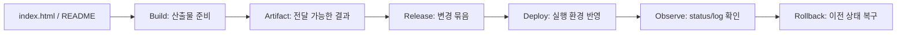

# 6교시: 관찰 가능성과 배포 preview - logs/status evidence, build, artifact, release, deploy, rollback

## 수업 목표
- log, status, metric, trace의 역할을 구분한다.
- 배포 관련 기본 용어를 Week 1 수준으로 구분한다.
- 변경 전달에는 evidence가 필요하다는 점을 이해한다.

## 50분 흐름
| Time | Activity |
|---|---|
| 0-5분 | RCA record 확인 |
| 5-15분 | observability signal과 deployment 용어 설명 |
| 15-30분 | local server log/status evidence 수집 |
| 30-40분 | artifact/release/deploy/rollback preview |
| 40-50분 | AI 검증 원칙으로 연결 |

## 0-5분 RCA record 확인

- 진행: RCA record 확인

- 완료 조건: 아래 자료를 사용해 이 시간 블록의 산출물을 만든다.


### 상세 설명
관찰 가능성은 시스템 내부 상태를 외부 evidence로 추론할 수 있게 하는 능력이다. Week 1에서는 전문 도구를 쓰지 않고 log와 HTTP status만 사용한다. log는 사건 기록이고, status는 요청 결과를 분류하는 신호다. metric은 수치화된 상태, trace는 요청이 여러 구성요소를 지나가는 경로를 뜻하지만 오늘은 개념 preview로만 다룬다.

배포 용어도 미리 구분한다. Build는 실행 가능한 산출물을 준비하는 과정, artifact는 전달 가능한 결과물, release는 사용자에게 의미 있는 변경 묶음, deploy는 실행 환경에 반영하는 행위, rollback은 이전 상태로 되돌리는 조치다. 오늘은 배포하지 않고, 이 용어가 local evidence와 어떻게 연결되는지만 본다.


### Visual 1: Observability evidence chain


오늘의 관찰 가능성은 전문 도구가 아니라 `curl` status와 server log에서 시작한다. 같은 요청에 대해 "사용자가 본 결과"와 "서버가 남긴 기록"을 나란히 남기는 것이 핵심이다.

## 5-15분 observability signal과 deployment 용어 설명

- 진행: observability signal과 deployment 용어 설명

- 완료 조건: 아래 자료를 사용해 이 시간 블록의 산출물을 만든다.


### Visual 2: 배포 preview 단어 지도


Day3에서는 실제 배포를 하지 않는다. 다만 local evidence를 통해 나중에 deploy 전후에 무엇을 비교해야 하는지 미리 익힌다.

## 15-30분 local server log/status evidence 수집

- 진행: local server log/status evidence 수집

- 완료 조건: 아래 자료를 사용해 이 시간 블록의 산출물을 만든다.


### 관찰 signal
| Signal | Week 1 level | Later week |
|---|---|---|
| Log | request/error text | Docker/K8s/CloudWatch logs |
| Status | HTTP 200/404/500 | health check/readiness |
| Metric | count/latency concept | CloudWatch/Prometheus |
| Trace | request path concept | distributed tracing |


### 배포 preview 용어
| Term | Week 1 meaning |
|---|---|
| Build | 실행 가능한 산출물을 준비 |
| Artifact | 전달 가능한 결과물 |
| Release | 사용 가능한 변경 묶음 |
| Deploy | 실행 환경에 반영 |
| Rollback | 이전 상태로 되돌림 |

## 30-40분 artifact/release/deploy/rollback preview

- 진행: artifact/release/deploy/rollback preview

- 완료 조건: 아래 자료를 사용해 이 시간 블록의 산출물을 만든다.


### 명령 절차
```bash
curl -I http://localhost:8000
curl -I http://localhost:8000/no-such-file.html
```

서버 terminal에서 두 요청의 log를 비교한다.


### 확인 질문
- 오늘의 artifact는 무엇이라고 볼 수 있는가?
- 200과 404를 metric으로 바꾼다면 무엇을 셀 수 있는가?
- rollback 판단에는 어떤 evidence가 필요할까?


### 예상 결과
- 정상 URL은 200 계열 status를 보여야 한다.
- 없는 URL은 404 status를 보여야 한다.
- server log는 두 요청 path와 status 차이를 보여준다.


### 흔한 오해
| 오해 | 교정 |
|---|---|
| log가 있으면 관찰 가능성이 완성된다. | 필요한 질문에 답할 수 있는 log/status/metric/trace가 있어야 한다. |
| deploy는 build와 같은 말이다. | build는 산출물 준비, deploy는 실행 환경 반영이다. |
| rollback은 실패 인정이라 나쁘다. | rollback은 사용자 영향을 줄이는 정상 운영 전략이다. |

## 40-50분 AI 검증 원칙으로 연결

- 진행: AI 검증 원칙으로 연결

- 완료 조건: 아래 자료를 사용해 이 시간 블록의 산출물을 만든다.


### 다음 주차 매핑
Docker image는 artifact가 되고, Kubernetes rollout은 deploy/rollback을 제공한다. AWS CloudWatch는 log/metric을 모으고, Terraform은 배포 대상 infrastructure 변경을 plan/apply evidence로 남긴다.


### 실습 Evidence
| Evidence | Value |
|---|---|
| successful status | |
| failed status | |
| log comparison | |
| artifact candidate | `index.html` and README instructions |
| rollback idea | previous known-good file/content |


### 학술 근거와 DevOps insight
Google SRE는 monitoring을 symptoms와 causes를 구분해 보는 활동으로 설명한다. DevOps 현업에서는 배포 전후 status와 log evidence가 없으면 변경이 좋아졌는지 나빠졌는지 판단할 수 없다. 오늘의 단순 log 비교는 배포 관찰의 최소 형태다.


### 평가 기준
| 기준 | 2점 evidence |
|---|---|
| 50분 참여 | 시간 흐름에 맞춰 설명, 활동, 산출물 작성에 참여했다. |
| 증거 산출 | 수업에서 요구한 note, command, table, blocker 중 해당 산출물을 구체적으로 남겼다. |
| 전이 연결 | 오늘 개념이 Week2~6 기술 또는 자기 산출물과 어떻게 연결되는지 한 문장 이상 설명했다. |


### 공식/학술 근거 링크
- Google Cloud DevOps guidance, https://docs.cloud.google.com/architecture/devops - delivery evidence와 operational performance를 연결하는 기준이다.
- Google SRE Book: Introduction, https://sre.google/sre-book/introduction/ - monitoring과 change management가 운영 readiness에 포함되는 근거다.
- Pro Git: About Version Control, https://git-scm.com/book/en/v2/Getting-Started-About-Version-Control - 배포 전후 변경 이력과 증거를 남기는 이유다.
