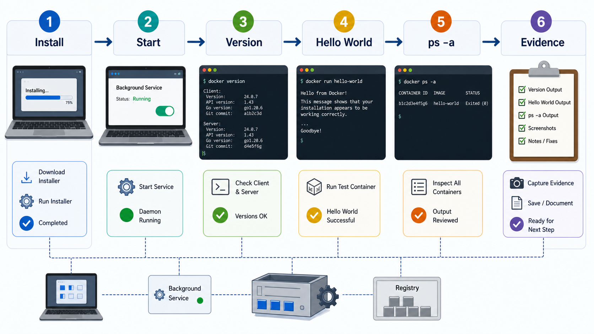
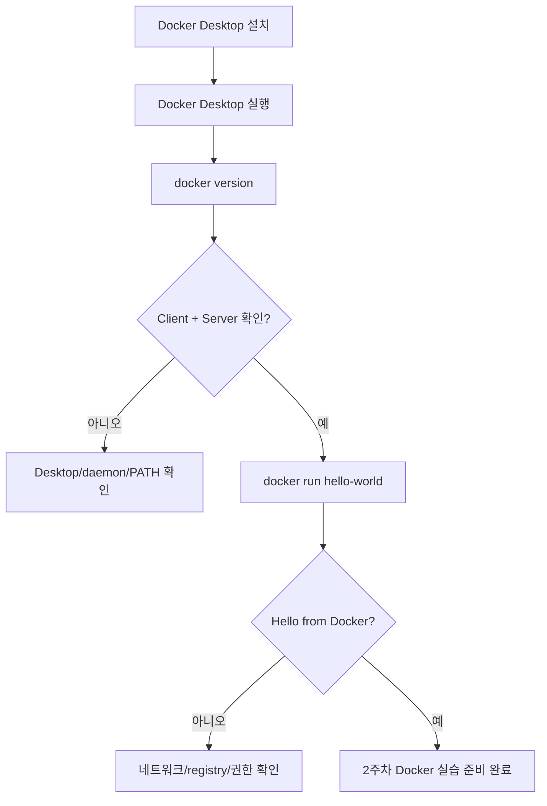

# 6교시: Docker Desktop 설치 및 동작 확인 - 설치, 로그인, version, hello-world

## 수업 목표
- Docker Desktop 설치가 필요한 이유와 설치 후 검증 기준을 이해한다.
- `docker version`과 `docker run hello-world` 결과를 읽고 문제 지점을 구분한다.
- Docker Desktop 실행 실패, daemon 미실행, 권한 문제, 가상화 문제를 증상별로 정리한다.
- 설치가 완료되지 않은 경우에도 장애 분석 기록을 남긴다.

## 공식 참고 자료
- Docker Docs: Docker Desktop  
  https://docs.docker.com/desktop/
- Docker Docs: Install Docker Desktop  
  https://docs.docker.com/desktop/setup/install/
- Docker Docs: `docker version`  
  https://docs.docker.com/reference/cli/docker/version/
- Docker Docs: Run Docker Hub images  
  https://docs.docker.com/get-started/docker-concepts/running-containers/run-docker-hub-images/

## 핵심 개념
| 용어 | 뜻 | 확인 방법 |
|---|---|---|
| Docker Client | 사용자가 실행하는 `docker` 명령 | `docker version`의 Client |
| Docker Daemon | container를 실제로 관리하는 백그라운드 서비스 | `docker version`의 Server |
| Docker Desktop | 로컬 PC에서 Docker daemon과 UI를 제공하는 제품 | 앱 실행 상태 |
| Docker Hub | image를 내려받는 공개 registry | `hello-world` image pull |
| hello-world | Docker 동작 확인용 공식 image | `docker run hello-world` |

`docker version`에서 Client만 보이고 Server가 보이지 않으면 명령어 프로그램은 설치되어 있지만 Docker daemon이 실행되지 않는 상태일 수 있다. `docker run hello-world`는 단순한 인사 문구가 아니라 image pull, container create, container run, output 확인까지 한 번에 검증하는 작은 통합 테스트다.

## 인포그래픽
아래 인포그래픽은 Docker Desktop 설치 후 `docker version`, `docker run hello-world`, `docker ps -a`로 이어지는 검증 흐름을 보여준다.



## 설치 전 확인
운영체제별 설치 절차는 공식 문서 기준으로 확인한다. 교육장 PC나 회사 PC는 관리자 권한, 가상화 설정, 보안 정책 때문에 설치가 막힐 수 있다. 설치 실패 자체를 부끄러워할 필요는 없다. 중요한 것은 실패 메시지를 남기고 어느 단계에서 막혔는지 분류하는 것이다.

확인할 것:
- 운영체제와 버전
- 관리자 권한 여부
- Docker Desktop 실행 가능 여부
- WSL/가상화 요구사항 충족 여부
- 로그인 필요 여부
- 네트워크에서 Docker Hub 접근 가능 여부

## 실습 1: 설치 상태 확인
터미널에서 확인한다.

```bash
docker version
```

성공 기준:
- Client 정보가 보인다.
- Server 정보가 보인다.
- 에러 없이 Docker Engine API version이 표시된다.

실패 예시와 해석:

| 증상 | 가능한 원인 | 다음 확인 |
|---|---|---|
| `docker: command not found` | Docker CLI 미설치 또는 PATH 문제 | Docker Desktop 설치, 터미널 재시작 |
| Cannot connect to Docker daemon | Desktop/daemon 미실행 | Docker Desktop 실행 상태 |
| permission denied | 권한 또는 그룹 문제 | 공식 문서의 권한 설정 확인 |
| WSL/virtualization 관련 오류 | 가상화 기능 문제 | BIOS/WSL 설정 또는 보충 시간 처리 |

## 실습 2: hello-world 실행

```bash
docker run hello-world
```

이 명령이 하는 일:
1. 로컬에 `hello-world` image가 있는지 확인한다.
2. 없으면 Docker Hub에서 image를 내려받는다.
3. image로 container를 만든다.
4. container를 실행한다.
5. 메시지를 출력하고 종료한다.

확인할 문장:

```text
Hello from Docker!
```

이 문장이 보이면 최소한 image pull과 container 실행까지 성공한 것이다. 단, 이것은 Docker의 모든 기능이 정상이라는 뜻은 아니다. 포트 바인딩, 볼륨, 네트워크, Dockerfile build는 2주차에서 별도로 검증한다.

## 실습 3: 실행 흔적 확인

```bash
docker ps
docker ps -a
```

해석:
- `docker ps`는 실행 중인 container를 보여준다.
- `hello-world`는 바로 종료되므로 `docker ps`에는 보이지 않을 수 있다.
- `docker ps -a`에는 종료된 container가 보일 수 있다.

## 장애 기록 양식
설치가 실패한 학생은 성공한 학생과 같은 산출물을 만들 수 없다. 대신 다음 기록을 남긴다.

```markdown
# Docker Setup Troubleshooting Note

## 환경
- OS:
- Docker Desktop 설치 여부:
- 관리자 권한 여부:

## 실행한 명령
- 

## 오류 메시지 원문
- 

## 어느 단계에서 실패했는가
- 설치 / 실행 / version / hello-world / Docker Hub 접근

## 다음 확인할 것
- 
```

## Mermaid: Docker 설치 검증 흐름


## DevOps 원칙 연결
- 비용 절감: 설치 문제를 초기에 분류하면 본 수업 시간을 반복 오류 처리에 덜 사용한다.
- 개발/배포 효율성: Docker가 준비되어야 2주차 image build/run 실습이 막히지 않는다.
- 관리 효율성: 설치 실패 기록은 보충 실습 대상과 원인을 빠르게 분류한다.

## 확인 질문
- `docker version`에서 Client와 Server는 각각 무엇을 의미하는가?
- `hello-world`가 성공해도 아직 검증하지 않은 Docker 기능은 무엇인가?
- 설치 실패 기록에 오류 메시지 원문을 남겨야 하는 이유는 무엇인가?

## 마무리 정리
Docker 설치는 목표가 아니라 2주차 실습을 위한 전제 조건이다. 오늘은 성공 여부보다 증거를 남기는 것이 중요하다. 성공한 학생은 2주차 준비가 된 것이고, 실패한 학생은 7~8교시 또는 보충 시간에 해결할 대상을 명확히 한 것이다.
