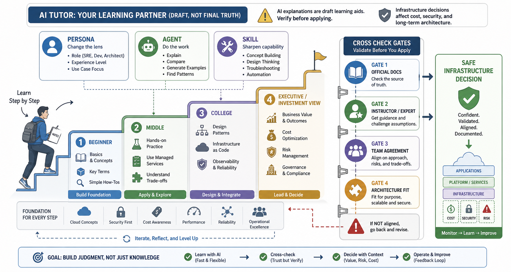

# 7교시: AI Coding Tool 학습/실습 준비 - 개념 학습, 질문 설계, 디버깅 보조, 책임 있는 사용

## 수업 목표
- AI Coding Tool을 코드 생성기가 아니라 학습과 초안 작성 보조 도구로 이해한다.
- 계정 생성, 로그인, 기본 실행 확인을 천천히 진행한다.
- 페르소나, Agent, Skill, 단계별 설명 요청을 활용해 흔들리는 개념을 학습한다.
- 에러 메시지와 실행 조건을 정리해 AI에게 원인 분석을 요청하는 디버깅 방식을 익힌다.
- AI가 만든 결과물을 실행, 보안, 로그, README 관점에서 검토해야 하는 이유를 설명한다.
- 프롬프트와 결과를 프로젝트 기록으로 남기는 기준을 정한다.

## 공식 참고 자료
- GitHub Docs: GitHub Copilot documentation
  https://docs.github.com/en/copilot
- GitHub Docs: About READMEs
  https://docs.github.com/en/repositories/managing-your-repositorys-settings-and-features/customizing-your-repository/about-readmes
- OpenAI Docs: Prompt engineering
  https://platform.openai.com/docs
- Anthropic Docs: Prompt engineering overview
  https://docs.anthropic.com/en/docs/build-with-claude/prompt-engineering/overview
- Anthropic Docs: Claude Code subagents
  https://docs.anthropic.com/en/docs/claude-code/sub-agents
- Anthropic Docs: Claude Code skills
  https://docs.anthropic.com/en/docs/claude-code/skills

## 핵심 개념
| 용어 | 뜻 | 주의 |
|---|---|---|
| AI Coding Tool | 코드 작성, 설명, 수정, 탐색을 돕는 도구 | 결과 검증 책임은 사용자에게 있다 |
| Prompt | AI에게 전달하는 작업 요청 | 요구사항, 제약, 검증 기준이 필요 |
| Persona | AI가 어떤 관점으로 답할지 정하는 역할 설정 | 관점은 도움일 뿐 사실 검증을 대신하지 못함 |
| Agent | 특정 목적을 수행하도록 역할, 도구, 절차를 묶은 작업 단위 | 권한과 범위를 제한해야 함 |
| Skill | 반복 작업에 필요한 지침, 절차, 예시를 묶어 재사용하는 단위 | 최신 공식 문서와 충돌하지 않는지 확인 |
| Generated Code | AI가 만든 코드 | 실행과 리뷰가 필요 |
| Trust Boundary | 신뢰할 수 있는 영역과 없는 영역의 경계 | secret, 인증, 외부 입력 주의 |
| Review | 결과를 사람이 검토하는 과정 | 보안, 비용, 운영성을 확인 |
| Cross Check | 다른 근거로 답을 다시 확인하는 과정 | 공식 문서, 강사, 전문가, 팀 합의로 확인 |

AI 도구는 빠르게 초안을 만들 수 있지만, 운영 책임을 대신지지 않는다. 특히 인프라/DevOps 관점에서는 "코드가 돌아간다"보다 "어떤 포트로 실행되는가", "로그는 어디 남는가", "secret이 노출되지 않는가", "다른 사람이 실행할 수 있는가", "공식 문서와 충돌하지 않는가"를 봐야 한다.

## 쉬운 비유
AI Coding Tool은 빠른 신입 조수와 비슷하다. 일을 빨리 시작하게 도와주지만, 최종 검수 없이 고객에게 넘길 수는 없다. 조수가 작성한 문서에 잘못된 금액이나 주소가 들어갈 수 있듯이, AI가 만든 코드에도 잘못된 의존성, 보안 문제, 실행 누락이 들어갈 수 있다.

비유의 한계는 AI 도구가 단순 사람이 아니라 대량의 패턴을 바탕으로 답한다는 점이다. 그럴듯한 답이 항상 맞는 답은 아니다. 그래서 공식 문서와 실제 실행 검증이 필수다.

## 인포그래픽
아래 인포그래픽은 AI가 만든 초안을 공식 문서, 실행 검증, 보안 확인, README, 로그 기준으로 검토하는 흐름을 보여준다.


아래 인포그래픽은 개념 학습에 AI를 사용할 때의 단계적 질문과 검증 흐름을 보여준다.



## 계정/설치 확인 체크리스트
사용 가능한 도구는 교육 환경과 계정 상태에 따라 다를 수 있다. 특정 도구 하나에 의존하지 않고, 사용 가능한 도구를 선택해 기본 동작을 확인한다.

| 항목 | 확인 내용 | 기록 |
|---|---|---|
| 계정 | 로그인 가능 | |
| 요금/제한 | 무료/유료/사용량 제한 확인 | |
| 실행 방식 | 웹, IDE extension, CLI 중 무엇인가 | |
| 프로젝트 접근 | 로컬 파일을 읽는가, 붙여넣기 기반인가 | |
| 보안 | secret을 입력하지 않도록 주의 | |
| 결과 검증 | 실행 명령과 테스트 가능 여부 | |

## 개념이 흔들릴 때 AI를 쓰는 방법
처음 보는 개념은 한 번에 정확히 이해하기 어렵다. 이때 AI는 빠른 개인 튜터처럼 사용할 수 있다. 같은 주제를 여러 수준으로 바꾸어 설명하게 하면 개념의 뼈대, 세부 구조, 의사결정 관점을 차례대로 잡을 수 있다.

예시 흐름:

```text
로드 밸런서가 무엇인지 초등학생도 이해할 수 있게 설명해줘.
같은 내용을 중학생 수준으로 다시 설명해줘.
같은 내용을 컴퓨터공학 대학생이 이해할 수 있게 설명해줘.
같은 내용을 스타트업 대표가 비용과 투자 판단을 위해 알아야 하는 관점으로 설명해줘.
마지막으로 인프라 엔지니어가 운영 중 확인해야 할 지표와 장애 사례를 정리해줘.
```

이 방식은 개념을 넓게 이해하는 데 도움이 된다. 다만 유명인의 학습 사례처럼 소개되는 이야기라도 강의 자료에서는 절대 원칙으로 받아들이지 않는다. 중요한 것은 특정 인물이 아니라 학습 전략이다. 쉬운 설명에서 시작해 점점 전문적인 설명으로 올라가고, 마지막에는 내 역할에 맞는 의사결정 정보로 바꾸는 방식이 효과적이다.

AI 설명은 초안이다. AI의 설명이 매끄럽다고 해서 바로 아키텍처에 반영하면 안 된다. 팀원들과 이해가 맞지 않거나, 회사의 현재 아키텍처와 맞지 않거나, 공식 문서의 제약과 충돌할 수 있다. 인프라는 개발 코드보다 되돌리기 어렵다. 네트워크, 데이터베이스, 권한, 비용 구조는 한 번 잘못 잡으면 작은 수정이 아니라 전체 구조 변경으로 이어질 수 있다. 같은 요구사항도 아키텍처 선택에 따라 무료 수준으로 끝날 수도 있고, 월 수천만 원에서 수십억 원 규모의 비용 구조가 될 수도 있다.

## 페르소나, Agent, Skill 활용 기준
AI에게 같은 질문을 해도 어떤 관점을 주느냐에 따라 답의 품질이 달라진다. 페르소나, Agent, Skill은 이 관점을 고정하고 반복 품질을 높이기 위한 도구로 이해한다.

| 기능 | 쓰는 상황 | 좋은 요청 예시 | 주의 |
|---|---|---|---|
| Persona | 같은 개념을 역할별로 이해할 때 | "너는 주니어 인프라 엔지니어를 가르치는 강사 관점으로 설명해줘." | 역할 설정이 사실 검증을 대신하지 않는다 |
| Agent | 반복되는 목적 작업을 맡길 때 | "로그 분석 Agent로서 에러 원인 후보를 우선순위로 정리해줘." | 파일 수정, 명령 실행 권한은 신중히 준다 |
| Skill | 정해진 절차를 반복할 때 | "공식 문서 확인, 제약 정리, 실습 체크리스트 순서로 답해줘." | 오래된 절차는 최신 문서와 충돌할 수 있다 |
| 인터뷰 방식 | 내가 요구사항을 잘 설명하기 어려울 때 | "내가 답할 수 있게 한 번에 하나씩 질문해서 요구사항을 정리해줘." | 질문에 답한 내용이 팀 합의가 된 것은 아니다 |

질문은 짧아야 좋은 것이 아니다. 필요한 조건이 많다면 장황해도 괜찮다. 운영 환경, 제약, 현재 상태, 원하는 결과, 하면 안 되는 일을 함께 줘야 답이 좋아진다. 질문을 잘 못하겠다면 AI에게 먼저 인터뷰를 요청한다. AI가 질문하고, 학생이 답하고, 마지막에 AI가 요구사항을 정리하게 하면 막연한 생각이 훨씬 빠르게 구조화된다.

## AI 답변을 적용하기 전 크로스체크
AI 답변이 좋은 설명처럼 보일수록 더 조심해야 한다. 설명이 자연스럽다는 것과 실제 환경에 맞다는 것은 다르다.

적용 전 확인 순서:
1. 공식 문서에서 같은 기능, 같은 버전, 같은 제약을 확인한다.
2. 강사 또는 주변 전문가에게 핵심 판단을 확인한다.
3. 팀의 현재 아키텍처, 비용 기준, 보안 기준과 맞는지 확인한다.
4. POC에서 작게 검증하고, 운영 반영은 별도 승인 절차로 다룬다.
5. 결정 이유와 대안을 README, Architecture Note, 이슈 문서에 남긴다.

특히 인프라 변경은 "해보니 아니면 되돌리면 된다"로 접근하기 어렵다. 데이터베이스를 바꾸거나 네트워크 구조를 바꾸거나 권한 체계를 바꾸는 일은 서비스 중단, 데이터 손실, 보안 사고, 비용 폭증으로 이어질 수 있다. AI는 판단을 도와줄 수 있지만 최종 판단은 공식 근거와 팀 합의 위에서 내려야 한다.

## 좋은 프롬프트의 조건
좋은 프롬프트는 "웹 앱 만들어줘"가 아니라 운영 조건을 포함한다.

부족한 요청:

```text
간단한 웹 앱 만들어줘.
```

개선된 요청:

```text
Python 표준 라이브러리만 사용해서 로컬에서 실행 가능한 작은 웹 앱을 만들어줘.
포트는 .env의 PORT로 바꿀 수 있어야 하고, /health endpoint와 logs/app.log 파일 로그가 있어야 해.
README에는 실행 방법, curl 확인 방법, 포트 변경 방법, 404 확인 방법을 포함해줘.
secret이나 외부 API는 사용하지 마.
```

이 요청은 개발 요구사항과 운영 요구사항을 함께 담고 있다. AI 도구가 만든 결과를 평가하기 쉬워지고, 빠진 항목도 명확해진다.

## 디버깅할 때 AI를 빠르게 쓰는 방법
디버깅에서 AI에게 "프로젝트 전체를 실행해서 고쳐줘"라고 맡기면 시간이 오래 걸리고 토큰도 많이 쓴다. 프로젝트 파일을 많이 읽고, 명령을 반복 실행하고, 실패 원인을 추측하면서 비용이 커질 수 있다. 반대로 사람이 먼저 증거를 모아 에러 메시지, 실행 명령, 환경, 최근 변경점만 전달하면 AI는 훨씬 빠르게 원인 후보를 좁힐 수 있다.

좋지 않은 요청:

```text
이 프로젝트 오류 나는데 알아서 고쳐줘.
```

좋은 요청:

```text
아래 명령을 실행했을 때 오류가 발생했어.

실행 명령:
python3 app.py

환경:
- OS: Ubuntu WSL
- Python: 3.12
- 실행 경로: week1/day3/mini-deploy-lab
- 포트: 8000

오류 메시지:
OSError: [Errno 98] Address already in use

최근 변경:
- .env에서 PORT를 8000으로 설정함
- 이전에 같은 앱을 한 번 실행한 적 있음

원인 후보를 우선순위로 정리하고, 내가 직접 확인할 명령과 수정 방법을 제안해줘.
프로젝트 파일을 대규모로 바꾸는 방법보다 먼저 확인 가능한 방법부터 알려줘.
```

이 방식이 더 빠른 이유:
- AI가 전체 파일을 추측하지 않고 핵심 증거에서 시작한다.
- 프로그램 재실행, 의존성 설치, 대량 파일 읽기 같은 불필요한 작업이 줄어든다.
- 토큰 사용량이 줄어들어 응답 속도와 반복 실험 속도가 좋아진다.
- 원인 후보가 명확해져 사람이 직접 검증하기 쉽다.
- 운영 환경에서 AI에게 과도한 실행 권한을 주지 않아도 된다.

디버깅 요청에는 원문 에러를 반드시 포함한다. 에러 메시지를 요약해서 "포트 문제 같아요"라고만 쓰면 중요한 단서가 사라질 수 있다. 원문, 실행 명령, 현재 경로, OS, 런타임 버전, 최근 변경점, 기대한 결과, 실제 결과를 함께 준다.

## 실습 1: 도구 로그인과 기본 응답 확인
사용 가능한 AI 도구에서 아래 요청을 입력한다.

```text
내가 Cloud Native 수업을 듣는 학생이라고 가정하고, 배포 가능한 웹 앱 README에 반드시 들어가야 할 항목 7가지를 설명해줘.
```

결과에서 확인할 것:
- 실행 명령이 포함되는가?
- 필요한 런타임/버전이 포함되는가?
- 환경변수와 포트가 포함되는가?
- 로그와 health check가 포함되는가?
- 장애 발생 시 확인할 방법이 포함되는가?

## 실습 2: 개념 학습 사다리 만들기
아래 주제 중 하나를 골라 AI에게 단계별 설명을 요청한다.

주제 후보:
- 로드 밸런서
- 캐시
- 데이터베이스 연결 수
- 로그와 메트릭의 차이
- 3-tier 아키텍처
- Docker image와 container의 차이

요청 예시:

```text
캐시가 무엇인지 쉬운 비유로 먼저 설명해줘.
그다음 중학생 수준, 대학생 수준, 인프라 엔지니어 운영 관점, 비용 최적화 관점으로 나누어 설명해줘.
각 수준마다 오해하기 쉬운 점도 하나씩 포함해줘.
마지막에는 공식 문서로 확인해야 할 키워드 5개를 정리해줘.
```

결과에서 확인할 것:
- 쉬운 설명과 전문 설명이 서로 모순되지 않는가?
- 운영 지표, 장애 사례, 비용 관점이 포함되는가?
- 공식 문서로 확인할 키워드가 구체적인가?
- 바로 적용하기 전에 강사나 팀과 확인해야 할 판단이 있는가?

## 실습 3: 에러 메시지 기반 디버깅 요청 작성
아래 예시 오류를 보고 AI에게 보낼 디버깅 요청을 작성한다.

```text
curl http://localhost:8000/health
curl: (7) Failed to connect to localhost port 8000 after 0 ms: Connection refused
```

요청에는 다음 항목이 들어가야 한다.
- 실행한 명령
- 기대한 결과
- 실제 에러 메시지 원문
- OS와 런타임
- 앱 실행 여부
- 포트 설정
- 최근 변경점
- AI에게 요구할 답변 형식

좋은 답변 형식 예시:

```text
가능한 원인을 가능성 높은 순서로 정리해줘.
각 원인마다 내가 확인할 명령, 정상일 때 결과, 비정상일 때 다음 조치를 표로 정리해줘.
파일 수정은 마지막 단계로 제안해줘.
```

## 실습 4: AI 답변 검토표 작성

```markdown
# AI Tool Check Note

## 사용한 도구
-

## 사용한 방식
- 개념 설명 / 코드 생성 / 디버깅 / 문서 작성 / 기타:

## 요청한 작업
-

## 결과 요약
-

## 그대로 믿으면 안 되는 부분
-

## 공식 문서 또는 실행으로 확인할 부분
-

## 강사, 전문가, 팀과 확인할 부분
-

## 내 프로젝트에 반영할 항목
-
```

## 운영상 금지 사항
- 실제 password, token, access key를 AI 도구에 입력하지 않는다.
- 회사/개인 비공개 코드를 권한 없이 외부 도구에 붙여넣지 않는다.
- AI가 제안한 설치 명령을 공식 문서 확인 없이 관리자 권한으로 실행하지 않는다.
- 라이선스나 출처가 불분명한 코드를 그대로 제출하지 않는다.
- 실행하지 않은 코드를 "동작한다"고 기록하지 않는다.
- AI가 제안한 인프라 구조를 팀 합의나 공식 근거 없이 바로 적용하지 않는다.
- 에러 원문 없이 추측만으로 대규모 수정을 요청하지 않는다.

## DevOps 원칙 연결
- 비용 절감: AI로 초안을 빠르게 만들 수 있지만, 검증 없는 코드는 장애와 재작업 비용을 만든다.
- 개발/배포 효율성: 운영 조건이 포함된 프롬프트는 실행 가능한 결과에 더 가까워진다.
- 개발/배포 효율성: 디버깅 때 에러 원문과 실행 조건을 먼저 전달하면 AI가 전체 프로젝트를 반복 실행하지 않아도 되어 응답 속도와 개발 흐름이 좋아진다.
- 관리 효율성: 프롬프트와 검토 기록은 나중에 왜 그런 구조가 되었는지 설명하는 근거가 된다.
- 관리 효율성: Agent와 Skill은 반복 작업을 표준화하지만, 권한과 범위를 제한해야 팀 운영 기준과 충돌하지 않는다.

## 확인 질문
- AI가 만든 코드의 책임은 누구에게 있는가?
- 좋은 프롬프트에 포트, 로그, README 조건을 넣어야 하는 이유는 무엇인가?
- secret을 AI 도구에 넣으면 어떤 문제가 생길 수 있는가?
- 개념 학습에서 쉬운 설명과 전문가 관점을 단계적으로 요청하면 어떤 장점이 있는가?
- AI에게 프로젝트 전체 실행을 맡기기보다 에러 메시지와 실행 조건을 먼저 전달하면 왜 빠른가?
- AI 답변을 인프라 아키텍처에 반영하기 전 무엇을 크로스체크해야 하는가?

## 마무리 정리
AI 도구는 생산성을 높일 수 있지만, 운영 책임을 자동으로 해결하지 않는다. 개념이 흔들릴 때는 단계별 설명과 페르소나를 활용해 이해를 넓히고, 디버깅할 때는 에러 원문과 실행 조건을 정리해 원인 분석을 요청한다. 하지만 인프라 판단은 공식 문서, 강사 또는 전문가, 팀 합의로 반드시 크로스체크한다. 다음 교시에서는 AI 도구로 작은 웹 앱을 만들고, 생성된 코드를 인프라 엔지니어 관점에서 읽어본다.
