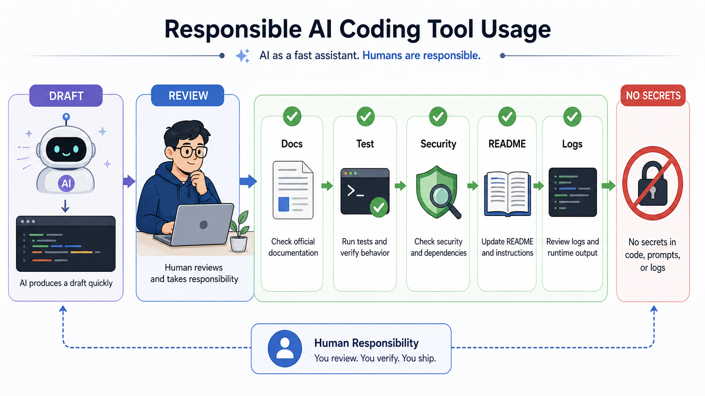

# 7교시: AI Coding Tool 계정/설치 준비 - 도구 로그인, 기본 실행, 책임 있는 사용 기준

## 수업 목표
- AI Coding Tool을 코드 생성기가 아니라 학습과 초안 작성 보조 도구로 이해한다.
- 계정 생성, 로그인, 기본 실행 확인을 천천히 진행한다.
- AI가 만든 결과물을 실행, 보안, 로그, README 관점에서 검토해야 하는 이유를 설명한다.
- 프롬프트와 결과를 프로젝트 기록으로 남기는 기준을 정한다.

## 공식 참고 자료
- GitHub Docs: GitHub Copilot documentation  
  https://docs.github.com/en/copilot
- GitHub Docs: About READMEs  
  https://docs.github.com/en/repositories/managing-your-repositorys-settings-and-features/customizing-your-repository/about-readmes
- OpenAI Docs  
  https://platform.openai.com/docs

## 핵심 개념
| 용어 | 뜻 | 주의 |
|---|---|---|
| AI Coding Tool | 코드 작성, 설명, 수정, 탐색을 돕는 도구 | 결과 검증 책임은 사용자에게 있다 |
| Prompt | AI에게 전달하는 작업 요청 | 요구사항, 제약, 검증 기준이 필요 |
| Generated Code | AI가 만든 코드 | 실행과 리뷰가 필요 |
| Trust Boundary | 신뢰할 수 있는 영역과 없는 영역의 경계 | secret, 인증, 외부 입력 주의 |
| Review | 결과를 사람이 검토하는 과정 | 보안, 비용, 운영성을 확인 |

AI 도구는 빠르게 초안을 만들 수 있지만, 운영 책임을 대신지지 않는다. 특히 인프라/DevOps 관점에서는 "코드가 돌아간다"보다 "어떤 포트로 실행되는가", "로그는 어디 남는가", "secret이 노출되지 않는가", "다른 사람이 실행할 수 있는가", "공식 문서와 충돌하지 않는가"를 봐야 한다.

## 쉬운 비유
AI Coding Tool은 빠른 신입 조수와 비슷하다. 일을 빨리 시작하게 도와주지만, 최종 검수 없이 고객에게 넘길 수는 없다. 조수가 작성한 문서에 잘못된 금액이나 주소가 들어갈 수 있듯이, AI가 만든 코드에도 잘못된 의존성, 보안 문제, 실행 누락이 들어갈 수 있다.

비유의 한계는 AI 도구가 단순 사람이 아니라 대량의 패턴을 바탕으로 답한다는 점이다. 그럴듯한 답이 항상 맞는 답은 아니다. 그래서 공식 문서와 실제 실행 검증이 필수다.

## 인포그래픽
아래 인포그래픽은 AI가 만든 초안을 공식 문서, 실행 검증, 보안 확인, README, 로그 기준으로 검토하는 흐름을 보여준다.



## 계정/설치 확인 체크리스트
사용 가능한 도구는 교육 환경과 계정 상태에 따라 다를 수 있다. 특정 도구 하나에 의존하지 않고, 사용 가능한 도구를 선택해 기본 동작을 확인한다.

| 항목 | 확인 내용 | 기록 |
|---|---|---|
| 계정 | 로그인 가능 | |
| 요금/제한 | 무료/유료/사용량 제한 확인 | |
| 실행 방식 | 웹, IDE extension, CLI 중 무엇인가 | |
| 프로젝트 접근 | 로컬 파일을 읽는가, 붙여넣기 기반인가 | |
| 보안 | secret을 입력하지 않도록 주의 | |
| 결과 검증 | 실행 명령과 테스트 가능 여부 | |

## 좋은 프롬프트의 조건
좋은 프롬프트는 "웹 앱 만들어줘"가 아니라 운영 조건을 포함한다.

부족한 요청:

```text
간단한 웹 앱 만들어줘.
```

개선된 요청:

```text
Python 표준 라이브러리만 사용해서 로컬에서 실행 가능한 작은 웹 앱을 만들어줘.
포트는 .env의 PORT로 바꿀 수 있어야 하고, /health endpoint와 logs/app.log 파일 로그가 있어야 해.
README에는 실행 방법, curl 확인 방법, 포트 변경 방법, 404 확인 방법을 포함해줘.
secret이나 외부 API는 사용하지 마.
```

이 요청은 개발 요구사항과 운영 요구사항을 함께 담고 있다. AI 도구가 만든 결과를 평가하기 쉬워지고, 빠진 항목도 명확해진다.

## 실습 1: 도구 로그인과 기본 응답 확인
사용 가능한 AI 도구에서 아래 요청을 입력한다.

```text
내가 Cloud Native 수업을 듣는 학생이라고 가정하고, 배포 가능한 웹 앱 README에 반드시 들어가야 할 항목 7가지를 설명해줘.
```

결과에서 확인할 것:
- 실행 명령이 포함되는가?
- 필요한 런타임/버전이 포함되는가?
- 환경변수와 포트가 포함되는가?
- 로그와 health check가 포함되는가?
- 장애 발생 시 확인할 방법이 포함되는가?

## 실습 2: AI 답변 검토표 작성

```markdown
# AI Tool Check Note

## 사용한 도구
- 

## 요청한 작업
- 

## 결과 요약
- 

## 그대로 믿으면 안 되는 부분
- 

## 공식 문서 또는 실행으로 확인할 부분
- 

## 내 프로젝트에 반영할 항목
- 
```

## 운영상 금지 사항
- 실제 password, token, access key를 AI 도구에 입력하지 않는다.
- 회사/개인 비공개 코드를 권한 없이 외부 도구에 붙여넣지 않는다.
- AI가 제안한 설치 명령을 공식 문서 확인 없이 관리자 권한으로 실행하지 않는다.
- 라이선스나 출처가 불분명한 코드를 그대로 제출하지 않는다.
- 실행하지 않은 코드를 "동작한다"고 기록하지 않는다.

## DevOps 원칙 연결
- 비용 절감: AI로 초안을 빠르게 만들 수 있지만, 검증 없는 코드는 장애와 재작업 비용을 만든다.
- 개발/배포 효율성: 운영 조건이 포함된 프롬프트는 실행 가능한 결과에 더 가까워진다.
- 관리 효율성: 프롬프트와 검토 기록은 나중에 왜 그런 구조가 되었는지 설명하는 근거가 된다.

## 확인 질문
- AI가 만든 코드의 책임은 누구에게 있는가?
- 좋은 프롬프트에 포트, 로그, README 조건을 넣어야 하는 이유는 무엇인가?
- secret을 AI 도구에 넣으면 어떤 문제가 생길 수 있는가?

## 마무리 정리
AI 도구는 생산성을 높일 수 있지만, 운영 책임을 자동으로 해결하지 않는다. 다음 교시에서는 AI 도구로 작은 웹 앱을 만들고, 생성된 코드를 인프라 엔지니어 관점에서 읽어본다.
