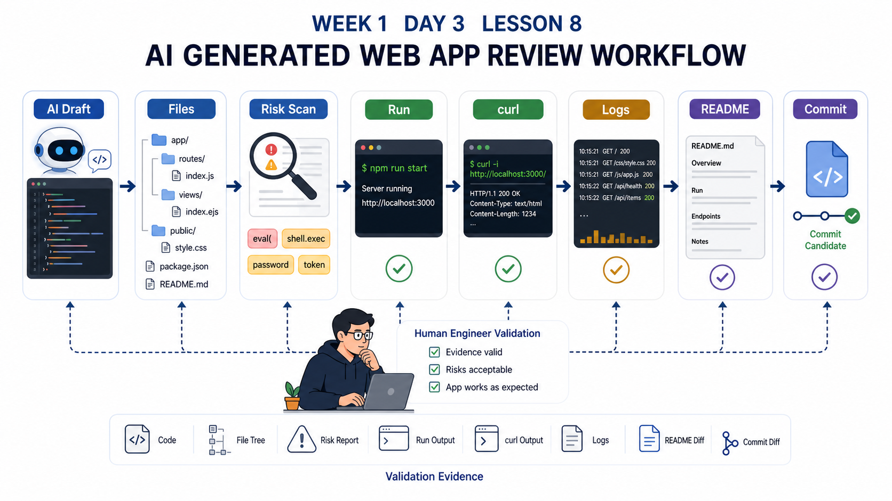
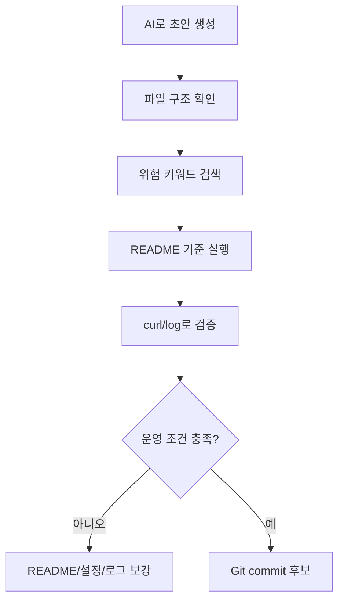

# 8교시: AI Coding Tool 실습 - 간단한 웹 애플리케이션 제작 요청과 코드 구조 읽기

## 수업 목표
- AI Coding Tool로 작은 웹 애플리케이션 초안을 만들고 실행한다.
- 생성된 코드의 파일 구조, 실행 명령, 포트, 로그, 환경변수, README를 점검한다.
- "동작하는 코드"와 "운영 가능한 코드"의 차이를 설명한다.
- 미니 챌린지 후보로 발전시킬 수 있는 개선 항목을 기록한다.

## 공식 참고 자료
- GitHub Docs: About READMEs  
  https://docs.github.com/en/repositories/managing-your-repositorys-settings-and-features/customizing-your-repository/about-readmes
- GitHub Docs: GitHub Copilot documentation  
  https://docs.github.com/en/copilot
- The Twelve-Factor App: Config  
  https://12factor.net/config
- Docker Docs: Dockerfile reference  
  https://docs.docker.com/reference/dockerfile/

## 핵심 개념
| 항목 | 확인 질문 |
|---|---|
| File Structure | 어떤 파일이 실행 파일이고, 어떤 파일이 설정/문서인가? |
| Runtime | 어떤 언어와 버전이 필요한가? |
| Start Command | 어떤 명령으로 실행하는가? |
| Port | 어디로 접속하는가? 변경 가능한가? |
| Config | 환경별로 바뀌는 값이 코드와 분리되어 있는가? |
| Log | 요청과 오류를 확인할 수 있는가? |
| README | 다른 사람이 실행할 수 있는가? |
| Risk | secret, 외부 API, 과한 dependency가 있는가? |

## 실습 전 기준
오늘은 완성도 높은 서비스를 만드는 시간이 아니다. 목표는 AI가 만든 결과물을 운영 관점으로 읽는 것이다. 기능이 단순해도 괜찮다. 대신 실행 조건, 관찰 가능성, 문서화가 빠지면 안 된다.

## 인포그래픽
아래 인포그래픽은 AI 생성 코드가 배포 후보가 되기 전 거쳐야 하는 파일 구조 확인, 위험 키워드 검색, 로컬 실행, 로그 확인, README 보강 흐름을 보여준다.



## 추천 프롬프트
아래 문장을 AI 도구에 입력한다. 그대로 복사해도 되지만, 본인이 만들고 싶은 주제로 앱 이름과 기능을 바꿔도 된다.

```text
Python 표준 라이브러리만 사용해서 로컬에서 실행 가능한 작은 웹 앱을 만들어줘.
주제는 "나의 학습 체크리스트"로 해줘.
요구사항:
- / 는 앱 이름과 사용 가능한 endpoint를 JSON으로 보여줘.
- /health 는 {"status":"healthy"}를 반환해줘.
- /config 는 APP_NAME, APP_MODE, PORT, LOG_FILE 설정을 보여줘.
- /items 는 샘플 체크리스트 3개를 JSON으로 보여줘.
- 없는 경로는 404 JSON을 반환해줘.
- .env에서 PORT와 APP_MODE를 읽게 해줘.
- logs/app.log 파일에 JSON 로그를 남겨줘.
- README에는 설치 없이 실행하는 방법, curl 확인 명령, 포트 변경 방법, 로그 확인 방법, 종료 방법을 써줘.
제약:
- 외부 패키지는 사용하지 마.
- secret, password, 외부 API는 사용하지 마.
- 학생이 macOS/Linux 터미널에서 따라 할 수 있게 해줘.
```

## 실습 1: 생성 결과 파일 구조 확인
AI가 만든 파일을 새 폴더에 저장한다. 예시는 `my-ai-app`이다.

```bash
mkdir -p my-ai-app
cd my-ai-app
```

저장 후 확인한다.

```bash
ls -la
find . -maxdepth 2 -type f | sort
```

확인할 것:
- 실행 파일이 무엇인가?
- `.env.example` 또는 설정 예시가 있는가?
- README가 있는가?
- 로그 폴더가 Git에 올라가지 않도록 처리되어 있는가?

## 실습 2: 실행 전 리뷰
실행하기 전에 코드를 읽는다. AI가 만든 코드는 바로 실행하기보다 위험한 명령, 외부 호출, secret 하드코딩이 없는지 확인한다.

```bash
grep -R "password\\|token\\|secret\\|api_key" .
grep -R "pip install\\|curl .*sh\\|sudo" .
```

해석:
- 아무것도 나오지 않으면 위험 키워드는 일단 보이지 않는 것이다.
- 결과가 나오면 맥락을 읽고 실제 secret인지, 단순 설명인지 확인한다.
- `sudo`, 외부 shell script 실행, 불필요한 dependency 설치가 있으면 공식 문서 확인 전 실행하지 않는다.

## 실습 3: 실행과 검증
AI가 만든 README 기준으로 실행한다. 표준 형태라면 다음과 비슷하다.

```bash
cp .env.example .env
python3 app.py
```

다른 터미널에서 확인한다.

```bash
curl http://localhost:8000/
curl http://localhost:8000/health
curl http://localhost:8000/config
curl http://localhost:8000/items
curl -i http://localhost:8000/not-found
tail -n 20 logs/app.log
```

만약 포트가 다르면 README와 `.env`의 값을 기준으로 바꾼다. 중요한 것은 문서, 설정, 실제 실행 결과가 서로 일치하는지 확인하는 것이다.

## 실습 4: 운영성 점검표
| 점검 항목 | 통과 기준 | 결과 |
|---|---|---|
| 실행 명령 | README만 보고 실행 가능 | |
| 포트 | 기본값과 변경 방법이 명확 | |
| health check | `/health`가 있음 | |
| config | 실제 설정 확인 가능 | |
| log | 요청과 오류가 기록됨 | |
| 404 | 실패 요청도 JSON/log로 확인 | |
| secret | 실제 secret이 없음 | |
| dependency | 외부 패키지 사용 여부 명확 | |
| 종료 | `Ctrl+C`로 종료 가능 | |

## 실습 5: README 보강
AI가 만든 README가 부족하면 아래 항목을 추가한다.

```markdown
## 실행 환경
- Python:
- OS:

## 실행
- 

## 확인
- 

## 설정
- PORT:
- APP_MODE:

## 로그
- 위치:
- 확인 명령:

## 알려진 문제
- 

## 장애 분석 기록
- 
```

## 생성 코드에 대한 판단 기준
| 상황 | 판단 |
|---|---|
| 기능은 되지만 README가 없음 | 배포 가능한 상태가 아님 |
| README는 있지만 실행이 안 됨 | 문서와 실제가 불일치 |
| 로그가 없음 | 장애 분석이 어려움 |
| 포트가 코드에 고정됨 | 환경별 실행이 불편 |
| 외부 패키지가 많음 | 설치 실패 가능성과 보안 검토 필요 |
| secret이 코드에 있음 | 즉시 수정 필요 |

## Mermaid: AI 생성 코드 검토 흐름


## DevOps 원칙 연결
- 비용 절감: 검증 없이 생성 코드를 확장하면 나중에 수정 비용이 커진다.
- 개발/배포 효율성: AI는 초안 속도를 높이지만, 운영성 체크리스트가 있어야 배포 가능한 결과에 가까워진다.
- 관리 효율성: README, 로그, 설정 분리는 프로젝트가 개인 실험에서 팀 자산으로 넘어가는 기준이다.

## 확인 질문
- AI가 만든 코드가 실행되면 바로 배포 가능한가?
- README와 실제 실행 결과가 다를 때 어느 쪽을 고쳐야 하는가?
- 생성 코드에서 가장 먼저 확인할 보안 리스크는 무엇인가?

## 마무리 정리
3일차의 결론은 "배포 가능한 코드"는 기능 코드만으로 완성되지 않는다는 것이다. 실행 조건, 설정, 로그, 검증 명령, README가 함께 있어야 다른 사람이 재현할 수 있다. 2주차 Docker는 이 실행 조건을 image와 container로 표준화하는 과정이다.
