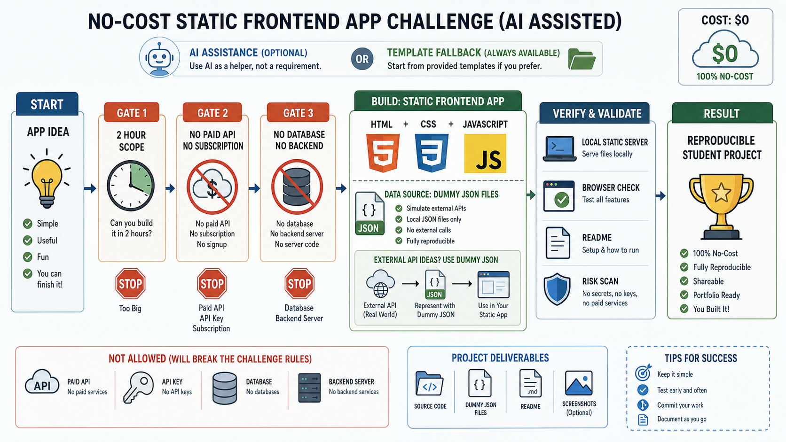
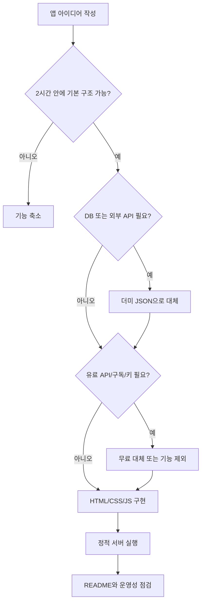

# 8교시: AI Coding Tool 실습 - 무료 범위의 싱글 프론트엔드 앱 챌린지와 운영성 점검

## 수업 목표
- 유료 AI 구독, 로컬 LLM, 유료 API, 데이터베이스 없이도 실습 가능한 작은 웹 애플리케이션을 만든다.
- HTML, CSS, JavaScript, 더미 JSON만으로 싱글 프론트엔드 애플리케이션의 기본 기능 구조를 만든다.
- AI를 사용할 수 있으면 초안 생성에 활용하고, 사용할 수 없으면 강사 제공 샘플 또는 템플릿으로 동일한 실습을 진행한다.
- 생성된 코드의 파일 구조, 실행 명령, 정적 데이터, README, 위험 요소를 점검한다.
- "기능이 보이는 앱"과 "다른 사람이 재현 가능한 앱"의 차이를 설명한다.

## 공식 참고 자료
- GitHub Docs: About READMEs
  https://docs.github.com/en/repositories/managing-your-repositorys-settings-and-features/customizing-your-repository/about-readmes
- GitHub Docs: GitHub Copilot documentation
  https://docs.github.com/en/copilot
- MDN Web Docs: HTML basics
  https://developer.mozilla.org/en-US/docs/Learn/Getting_started_with_the_web/HTML_basics
- MDN Web Docs: JavaScript basics
  https://developer.mozilla.org/en-US/docs/Learn/Getting_started_with_the_web/JavaScript_basics
- MDN Web Docs: Fetch API
  https://developer.mozilla.org/en-US/docs/Web/API/Fetch_API
- MDN Web Docs: Using data attributes
  https://developer.mozilla.org/en-US/docs/Learn/HTML/Howto/Use_data_attributes

## 실습 범위 제한
이번 챌린지는 무료 수준에서 모든 학생이 따라올 수 있도록 의도적으로 범위를 제한한다. 좋은 실습은 큰 기능을 많이 붙이는 것이 아니라, 같은 조건에서 실행하고 검증할 수 있는 작은 결과물을 만드는 것이다.

| 항목 | 이번 챌린지 기준 |
|---|---|
| AI 도구 | 무료로 접근 가능한 도구 또는 기존에 사용 가능한 계정만 사용 |
| 유료 구독 | 요구하지 않음 |
| 로컬 LLM/Ollama | 필수 아님, 선택 심화에서도 수업 흐름을 방해하지 않는 경우만 허용 |
| 데이터베이스 | 사용하지 않음 |
| 백엔드 서버 | 직접 구현하지 않음 |
| 외부 API | 사용하지 않음 |
| 비용 청구 API | 사용하지 않음 |
| 데이터 | `data/*.json` 같은 더미 JSON에서 읽음 |
| 앱 구조 | HTML/CSS/JavaScript로 구성한 싱글 프론트엔드 앱 |
| 기본 기능 구현 시간 | 최대 2시간 수준으로 제한 |

예외적으로 본인이 이미 승인받은 API, 무료 quota 안에서 비용이 청구되지 않는 API를 사용할 수는 있다. 그러나 1주차 공통 산출물은 외부 API 없이도 동작해야 한다. 외부 API가 꼭 필요한 아이디어라면 이번 수업에서는 더미 JSON으로 대체한다.

## 핵심 개념
| 항목 | 확인 질문 |
|---|---|
| Static Frontend App | HTML/CSS/JS만으로 화면과 기본 상호작용이 동작하는가? |
| Dummy JSON | 외부 API나 DB 대신 로컬 JSON 데이터로 표현했는가? |
| Scope Control | 2시간 안에 기본 기능 구조를 만들 수 있는 범위인가? |
| No Cost | 비용 청구 가능성이 있는 API, SaaS, 유료 AI 전제가 없는가? |
| File Structure | 어떤 파일이 화면, 스타일, 로직, 데이터, 문서인가? |
| Runtime | 정적 파일을 확인하기 위한 최소 실행 방식이 문서화되어 있는가? |
| README | 다른 학생이 같은 방식으로 실행하고 확인할 수 있는가? |
| Risk | secret, 외부 API key, 과한 dependency, 불필요한 backend가 없는가? |

## 쉬운 비유: 전시용 모형과 실제 건물
이번 실습은 실제 대형 서비스를 짓는 시간이 아니라 전시용 모형을 만드는 시간에 가깝다. 건물 모형에는 실제 수도관이나 전기 배선이 모두 들어가지 않는다. 대신 방의 위치, 동선, 문, 창문, 사용자가 보는 흐름을 빠르게 확인할 수 있다.

더미 JSON은 전시용 모형 안에 놓인 가짜 상품이나 샘플 문서와 같다. 실제 데이터베이스는 아니지만 사용자가 어떤 데이터를 보게 될지, 화면이 데이터를 어떻게 표현할지 확인할 수 있다. 이 방식은 비용이 들지 않고, 외부 API 장애에 영향을 받지 않으며, 모든 학생이 같은 조건에서 실습할 수 있게 해준다.

## 인포그래픽
아래 인포그래픽은 이번 챌린지의 범위 제한을 보여준다. 앱 아이디어는 2시간 안에 만들 수 있는 정적 프론트엔드 구조로 줄이고, 비용이 청구될 수 있는 API, 데이터베이스, 백엔드 서버는 제외한다. 데이터는 더미 JSON으로 표현하고, 정적 서버 실행과 README 검증까지 완료한다.



## 권장 앱 주제
다음 주제는 모두 데이터베이스와 외부 API 없이 만들 수 있다.

| 주제 | 더미 JSON 예시 | 기본 기능 |
|---|---|---|
| 나의 학습 체크리스트 | 할 일, 완료 여부, 우선순위 | 목록 보기, 필터, 완료 표시 |
| 교육 과정 카드 목록 | 강의명, 주차, 난이도, 태그 | 카드 목록, 태그 필터 |
| 장애 대응 미니 런북 | 증상, 확인 명령, 조치 | 검색, 카테고리 필터 |
| 포트/프로세스 치트시트 | 명령어, 설명, 예시 | 키워드 검색, 상세 보기 |
| 클라우드 서비스 비교표 | 서비스명, 역할, 비용 주의점 | 표 보기, 계층별 필터 |

이번 시간에는 로그인, 결제, 실시간 채팅, 데이터베이스 저장, 관리자 페이지, 외부 API 연동 같은 기능을 만들지 않는다. 아이디어가 커지면 기본 구조만 남기고 나머지는 README의 "나중에 확장할 것"으로 분리한다.

## 추천 프롬프트
AI 도구를 사용할 수 있는 학생은 아래 요청을 사용한다. 특정 유료 도구나 구독을 전제로 하지 않는다.

```text
HTML, CSS, JavaScript만 사용해서 로컬에서 실행 가능한 싱글 프론트엔드 앱을 만들어줘.
주제는 "나의 학습 체크리스트"로 해줘.

반드시 지킬 제약:
- 데이터베이스를 사용하지 마.
- 백엔드 서버 코드를 만들지 마.
- 외부 API를 호출하지 마.
- 유료 API, API key, secret, token이 필요한 기능을 넣지 마.
- 외부 패키지 설치 없이 동작하게 해줘.
- 기본 기능 구조는 2시간 안에 만들 수 있는 수준으로 제한해줘.
- 데이터는 data/items.json 파일에서 읽는 더미 JSON으로 구성해줘.

필요한 파일:
- index.html
- styles.css
- app.js
- data/items.json
- README.md

기능:
- 체크리스트 항목 목록을 보여줘.
- 카테고리 또는 상태로 필터할 수 있게 해줘.
- 검색어로 항목을 좁힐 수 있게 해줘.
- 항목을 클릭하면 상세 설명을 보여줘.
- 데이터가 비어 있거나 JSON 로딩에 실패했을 때 사용자에게 메시지를 보여줘.

README에는 다음을 포함해줘:
- 이 앱이 비용 청구 없이 동작한다는 설명
- 실행 방법
- python3 -m http.server 8000 으로 정적 서버를 띄우는 방법
- 브라우저 접속 주소
- 파일 구조
- 더미 JSON을 수정해 데이터를 바꾸는 방법
- 이번 버전에서 일부러 제외한 기능
```

AI를 사용할 수 없는 학생은 강사가 제공한 샘플 코드 또는 기본 템플릿을 사용한다. 평가 기준은 AI 사용 여부가 아니라 범위 제한, 실행 가능성, README, 검증 기록이다.

## 실습 1: 프로젝트 폴더와 파일 구조 만들기
새 폴더를 만든다. 예시는 `my-static-app`이다.

```bash
mkdir -p my-static-app/data
cd my-static-app
```

최소 파일 구조:

```text
my-static-app/
  index.html
  styles.css
  app.js
  data/
    items.json
  README.md
```

파일을 저장한 뒤 확인한다.

```bash
find . -maxdepth 3 -type f | sort
```

확인할 것:
- 화면 파일은 `index.html`인가?
- 스타일은 `styles.css`로 분리되어 있는가?
- 동작 로직은 `app.js`로 분리되어 있는가?
- 데이터는 `data/items.json`으로 분리되어 있는가?
- README가 있는가?

## 실습 2: 더미 JSON 데이터 설계
데이터베이스나 외부 API에서 가져와야 할 데이터는 더미 JSON으로 대체한다.

예시:

```json
[
  {
    "id": 1,
    "title": "localhost와 port 개념 복습",
    "category": "network",
    "status": "todo",
    "priority": "high",
    "description": "브라우저와 curl로 로컬 서버에 접속하는 흐름을 설명한다."
  },
  {
    "id": 2,
    "title": "README 실행 명령 정리",
    "category": "documentation",
    "status": "doing",
    "priority": "medium",
    "description": "다른 사람이 앱을 실행할 수 있도록 명령과 확인 방법을 작성한다."
  },
  {
    "id": 3,
    "title": "오류 메시지 기반 디버깅 요청 작성",
    "category": "troubleshooting",
    "status": "done",
    "priority": "medium",
    "description": "AI에게 전체 프로젝트를 맡기기보다 에러 원문과 실행 조건을 전달한다."
  }
]
```

좋은 더미 데이터는 실제 API 응답처럼 보이지만 비용과 권한이 필요하지 않는다. 필드명은 너무 복잡하게 만들지 않는다. 1주차 수준에서는 `id`, `title`, `category`, `status`, `description` 정도면 충분하다.

## 실습 3: 실행과 확인
`fetch()`로 JSON 파일을 읽는 앱은 브라우저에서 파일을 직접 여는 방식보다 정적 서버로 확인하는 것이 안전하다. 백엔드 애플리케이션을 만드는 것이 아니라, 정적 파일을 브라우저가 정상적으로 읽도록 간단한 파일 서버를 띄우는 것이다.

```bash
python3 -m http.server 8000
```

브라우저에서 접속한다.

```text
http://localhost:8000
```

터미널에서 응답도 확인한다.

```bash
curl -I http://localhost:8000/
curl http://localhost:8000/data/items.json
```

확인할 것:
- 브라우저에서 화면이 보이는가?
- JSON 데이터가 화면에 표시되는가?
- 검색 또는 필터가 동작하는가?
- JSON 파일을 수정하면 화면 데이터도 바뀌는가?
- 외부 API 요청 없이 동작하는가?

## 실습 4: 실행 전 위험 키워드 확인
AI가 만든 코드는 바로 실행하기보다 위험한 명령, 외부 호출, secret 하드코딩이 없는지 확인한다.

```bash
grep -R "password\\|token\\|secret\\|api_key" .
grep -R "fetch(.*http\\|axios\\|supabase\\|firebase\\|openai\\|stripe" .
grep -R "npm install\\|pip install\\|curl .*sh\\|sudo" .
```

해석:
- 아무것도 나오지 않으면 위험 키워드는 일단 보이지 않는 것이다.
- 결과가 나오면 맥락을 읽고 실제 secret인지, 단순 설명인지 확인한다.
- `fetch("https://...")` 형태가 나오면 외부 API 호출인지 확인한다.
- `supabase`, `firebase`, `openai`, `stripe` 같은 단어가 나오면 이번 실습 범위를 벗어났는지 확인한다.
- 설치 명령이 필요하다면 이번 챌린지 범위가 과해졌을 가능성이 높다.

## 실습 5: 범위 조정 기록
아이디어가 커졌다면 이번 시간에는 줄인다. 줄이는 것도 실무 능력이다.

| 원래 아이디어 | 이번 시간 대체 방식 |
|---|---|
| 실제 날씨 API로 날씨 앱 만들기 | `data/weather.json` 더미 데이터로 화면 구성 |
| 로그인 사용자별 대시보드 | 로그인 없이 샘플 사용자 3명을 JSON으로 제공 |
| 게시글 작성 후 DB 저장 | 작성 기능 제외, JSON 목록 조회와 필터만 구현 |
| 결제 내역 분석 | 결제 API 제외, 샘플 결제 JSON으로 표와 필터 구현 |
| 실시간 알림 | 정적 알림 목록 JSON으로 표시 |

README에 다음 항목을 남긴다.

```markdown
## 이번 버전에서 제외한 기능
- 데이터베이스 저장:
- 외부 API 연동:
- 로그인:
- 결제 또는 유료 기능:

## 제외한 이유
- 1주차 챌린지는 무료 범위와 2시간 구현 범위를 지키기 위해 싱글 프론트엔드 앱으로 제한했다.

## 나중에 확장한다면
- 실제 API:
- 데이터베이스:
- 백엔드:
- 인증:
```

## 실습 6: 운영성 점검표
| 점검 항목 | 통과 기준 | 결과 |
|---|---|---|
| 무료 범위 | 유료 구독, 유료 API, 비용 청구 서비스가 필수 아님 | |
| 싱글 앱 | HTML/CSS/JS와 더미 JSON 중심 | |
| DB 미사용 | 데이터베이스 설치나 계정이 필요 없음 | |
| 외부 API 미사용 | 네트워크가 막혀도 기본 화면 확인 가능 | |
| 실행 명령 | README만 보고 실행 가능 | |
| 파일 구조 | 화면, 스타일, 로직, 데이터, 문서가 구분됨 | |
| 더미 데이터 | JSON을 수정해 표시 데이터를 바꿀 수 있음 | |
| 오류 처리 | JSON 로딩 실패나 빈 데이터 메시지가 있음 | |
| 보안 | secret, token, API key가 없음 | |
| 범위 기록 | 제외한 기능과 이유가 README에 있음 | |

## 생성 코드에 대한 판단 기준
| 상황 | 판단 |
|---|---|
| AI가 데이터베이스를 만들자고 함 | 이번 챌린지 범위 초과 |
| AI가 외부 API key를 요구함 | 이번 챌린지 범위 초과 |
| AI가 유료 API나 결제 서비스를 제안함 | 이번 챌린지 범위 초과 |
| AI가 백엔드 서버 코드를 생성함 | 이번 시간에는 정적 프론트엔드로 축소 |
| 기능은 많지만 README가 없음 | 재현 가능한 산출물이 아님 |
| JSON 파일 없이 화면에 하드코딩만 있음 | 데이터 구조 학습이 부족함 |
| 외부 패키지가 많음 | 설치 실패 가능성과 보안 검토 필요 |
| secret이 코드에 있음 | 즉시 수정 필요 |

## Mermaid: 무료 범위 챌린지 판단 흐름


## DevOps 원칙 연결
- 비용 절감: 유료 API, 데이터베이스, 외부 서비스를 1주차부터 붙이면 비용과 계정 문제가 학습을 방해한다. 더미 JSON으로 비용 없는 검증을 먼저 한다.
- 개발/배포 효율성: 작은 범위의 싱글 앱은 빠르게 만들고 빠르게 검증할 수 있다. 구현 범위를 제한하면 AI 결과도 검토하기 쉬워진다.
- 관리 효율성: 파일 구조, 데이터 구조, 실행 방법, 제외한 기능을 문서화하면 다음 주차 Docker 실습으로 넘길 준비가 된다.

## 확인 질문
- 이번 챌린지에서 데이터베이스를 사용하지 않는 이유는 무엇인가?
- 외부 API가 꼭 필요한 아이디어를 어떻게 더미 JSON으로 바꿀 수 있는가?
- 유료 AI 구독이나 로컬 LLM을 필수로 두지 않아야 하는 이유는 무엇인가?
- 백엔드 없이 프론트엔드 안에서 해결할 수 있도록 범위를 줄이면 어떤 장점이 있는가?
- 2시간 안에 만들 수 없는 기능은 README에 어떻게 기록해야 하는가?

## 마무리 정리
8교시의 목표는 화려한 서비스를 만드는 것이 아니다. 무료 범위에서, 모든 학생이 같은 조건으로, 실행 가능한 작은 프론트엔드 앱을 만들고 검증하는 것이다. 데이터베이스와 외부 API는 더미 JSON으로 대체한다. 백엔드는 만들지 않는다. 2주차 Docker에서는 이 산출물을 정적 파일 또는 간단한 서비스로 어떻게 실행 단위화할지 이어서 다룬다.
