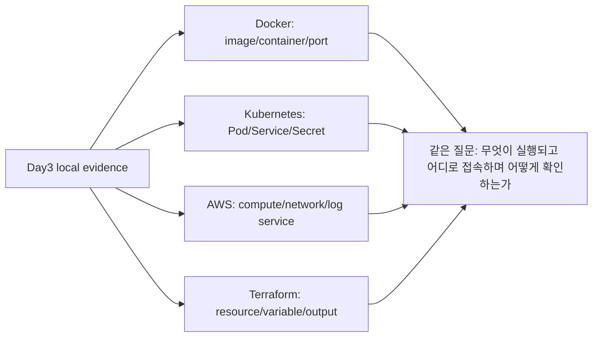

# 8교시: 컴퓨팅 spine 매핑 노트

## 수업 목표
- Day2~3에서 관찰한 process, file, port, HTTP, log를 Docker/Kubernetes/AWS/Terraform preview에 연결한다.
- 이후 기술 용어가 같은 구성요소의 다른 추상화임을 설명한다.
- Week 1 후반 미니앱 구현 전에 운영 spine을 고정한다.

## 50분 흐름
| Time | Activity |
|---|---|
| 0-5분 | AI verification note 확인 |
| 5-15분 | spine mapping의 목적 설명 |
| 15-30분 | Day2~3 evidence를 표에 매핑 |
| 30-40분 | 각 기술에서 바뀌는 이름과 유지되는 질문 정리 |
| 40-50분 | Day4 구현 시작 전 체크리스트 작성 |

## 0-5분 AI verification note 확인

- 진행: AI verification note 확인

- 완료 조건: 아래 자료를 사용해 이 시간 블록의 산출물을 만든다.


### 상세 설명
새로운 도구를 배울 때 가장 큰 어려움은 이름이 바뀌면 개념도 완전히 새롭다고 느끼는 것이다. 하지만 Docker, Kubernetes, AWS, Terraform은 모두 compute, memory, storage, network, config, log를 다른 수준에서 다룬다. spine mapping은 같은 질문을 유지하게 해준다.

예를 들어 Day3의 `python3 -m http.server 8000`은 process와 port를 만든다. Docker에서는 container process와 port binding으로, Kubernetes에서는 Pod와 Service로, AWS에서는 compute service와 security group/Load Balancer로, Terraform에서는 resource와 rule로 표현된다. 질문은 같다. 무엇이 실행되는가, 어디에 파일이 있는가, 어떤 port로 들어오는가, 어떤 log로 확인하는가.


### Visual 1: Computing spine overview


그림의 핵심은 도구 이름이 아니라 반복되는 질문이다. compute, storage, network, config, log를 어디에서 어떻게 표현하는지만 바뀐다.

## 5-15분 spine mapping의 목적 설명

- 진행: spine mapping의 목적 설명

- 완료 조건: 아래 자료를 사용해 이 시간 블록의 산출물을 만든다.


### Visual 2: Local evidence에서 플랫폼 언어로


Day4 구현 전에 이 매핑을 먼저 고정한다. 구현을 넓히기보다 이미 관찰한 evidence를 여러 플랫폼의 말로 번역하는 것이 오늘의 목표다.

## 15-30분 Day2~3 evidence를 표에 매핑

- 진행: Day2~3 evidence를 표에 매핑

- 완료 조건: 아래 자료를 사용해 이 시간 블록의 산출물을 만든다.


### 매핑 활동
| Week 1 evidence | Docker | Kubernetes | AWS | Terraform |
|---|---|---|---|---|
| process | container main process | Pod/container | EC2/ECS/Lambda | compute resource |
| command | `CMD`/`ENTRYPOINT` | container command/args | user data/task config | resource arguments |
| file path | image filesystem/volume | ConfigMap/Volume | S3/EBS/EFS/RDS | storage resource |
| port | port publishing | Service/Ingress | security group/ALB | SG rule/listener |
| HTTP status | container health check | readiness/liveness | target health | validation output |
| log | container log 조회 | events/logs | CloudWatch | output/drift evidence |
| config | env/env file | ConfigMap | Parameter Store | variables |
| secret | secret mount/env | Secret | Secrets Manager/IAM | sensitive variables |


### 명령 절차
Day2~3에서 이미 실행한 명령을 새로 늘리지 않고, README와 evidence table에서 다음 값을 다시 찾아 표에 옮긴다.

```bash
pwd
python3 --version
curl -I http://localhost:8000
env | grep -E 'SHELL|HOME|PATH'
```

서버가 이미 종료된 상태라면 `curl`은 실패할 수 있다. 이 경우 새 기능을 만들지 말고 "server stopped"를 evidence로 기록하거나, Day3 1교시 절차대로 정적 서버만 다시 실행한다.

## 30-40분 각 기술에서 바뀌는 이름과 유지되는 질문 정리

- 진행: 각 기술에서 바뀌는 이름과 유지되는 질문 정리

- 완료 조건: 아래 자료를 사용해 이 시간 블록의 산출물을 만든다.


### 명령 회고
오늘까지 사용한 evidence 명령을 다시 분류한다.

| Command | Spine component |
|---|---|
| `pwd` | path/storage |
| `ls -la` | file/permission |
| `python3 -m http.server 8000` | process/command/port |
| `curl -I` | HTTP/status/network |
| `env` filtered | config |
| server terminal log | log/observability |


### 확인 질문
- Day3 local server의 process는 Docker에서 무엇으로 표현될까?
- `PORT` config와 API token secret은 Kubernetes에서 어떻게 다르게 다룰까?
- HTTP 404 evidence는 AWS ALB 뒤에서도 어떤 식으로 추적해야 할까?


### 예상 결과
- `pwd`는 repository 또는 실습 directory path를 보여준다.
- `python3 --version`은 runtime evidence가 된다.
- `curl -I`은 서버 실행 상태에 따라 200 status 또는 connection failure를 보여준다.
- filtered `env`는 config key 관찰 예시가 되며 secret value를 포함하지 않아야 한다.
- 완성된 spine table은 Week 1 evidence를 Docker/Kubernetes/AWS/Terraform 용어로 한 줄씩 번역한다.


### 흔한 오해
| 오해 | 교정 |
|---|---|
| Docker부터 배워야 클라우드가 이해된다. | local process/file/port/log를 알아야 Docker도 이해된다. |
| Terraform은 코딩 도구라 오늘 내용과 무관하다. | Terraform은 오늘의 실행 조건과 infrastructure 선택을 코드로 고정한다. |
| Kubernetes는 완전히 새로운 세계다. | 이름은 바뀌지만 process, port, config, secret 질문은 유지된다. |

## 40-50분 Day4 구현 시작 전 체크리스트 작성

- 진행: Day4 구현 시작 전 체크리스트 작성

- 완료 조건: 아래 자료를 사용해 이 시간 블록의 산출물을 만든다.


### 다음 주차 매핑
Day4부터 미니앱 범위를 정하고 구현을 시작한다. 구현을 시작하기 전 Day2~3 evidence가 준비되어 있어야 한다: repository, README, 실행 조건, HTTP check, log, RCA, AI 검증표, spine mapping.


### 실습 Evidence
| Evidence | Value |
|---|---|
| completed mapping table | |
| 가장 약한 개념 1개 | |
| Day4 시작 전 확인할 blocker | |
| 구현 보류 항목 | mini app implementation deferred to Day4 |


### 학술 근거와 DevOps insight
개념 매핑은 전이 학습을 돕는다. 한 환경에서 배운 관찰 질문을 다른 환경으로 옮길 수 있으면 도구 변화에 덜 흔들린다. 현업 DevOps 엔지니어는 특정 명령만 아는 사람이 아니라 실행 조건, 변경 조건, 실패 조건을 여러 플랫폼 언어로 번역할 수 있는 사람이다.


### 평가 기준
| 기준 | 2점 evidence |
|---|---|
| 50분 참여 | 시간 흐름에 맞춰 설명, 활동, 산출물 작성에 참여했다. |
| 증거 산출 | 수업에서 요구한 note, command, table, blocker 중 해당 산출물을 구체적으로 남겼다. |
| 전이 연결 | 오늘 개념이 Week2~6 기술 또는 자기 산출물과 어떻게 연결되는지 한 문장 이상 설명했다. |


### 공식/학술 근거 링크
- CMU Eberly Center: Bloom's Taxonomy, https://www.cmu.edu/teaching/designteach/design/bloomsTaxonomy.html - Day3 마감 점검을 이해, 적용, 분석 수준으로 구분하는 기준이다.
- Monash Constructive Alignment, https://www.monash.edu/learning-teaching/teachhq/Teaching-practices/learning-outcomes/how-to/constructive-alignment - 산출물, 활동, 평가 evidence를 맞추는 기준이다.
- MIT Missing Semester, https://missing.csail.mit.edu/ - shell, Git, debugging evidence가 Day4 구현 준비의 선행 역량인 근거다.
