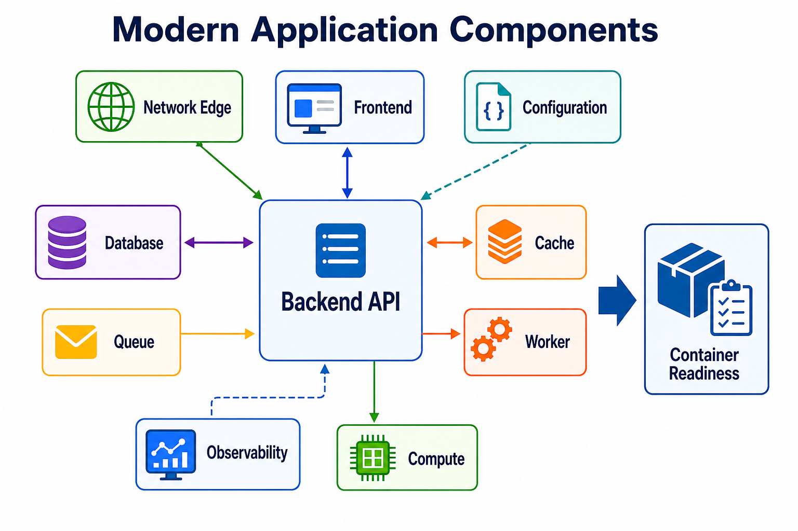

# 1주차 4일차: 국내 IT 기업 사례로 보는 현대 애플리케이션 구성요소

## Day Goal
Day4는 Docker에 들어가기 전, 현대 애플리케이션이 단순한 코드 하나가 아니라 여러 실행 조건의 조합이라는 것을 이해하는 날이다. 학생들은 국내 IT 기업 사례를 통해 프론트엔드, 백엔드, 데이터베이스, 캐시, 큐, 네트워크, 설정, 관찰 가능성, 고성능 컴퓨팅이 왜 필요한지 살펴본다.

학생에게 보여줄 숨은 제목:

```text
내가 가고 싶은 회사의 서비스는 코드 하나로 돌아가지 않는다.
```

## 운영 원칙
- 회사 사례는 동기부여와 맥락 제공을 위한 것이다. 회사 소개 수업으로 흐르지 않는다.
- 교시별 회사는 중복하지 않는다.
- 공식 기술블로그, 공식 홈페이지, 회사가 직접 운영하는 채널을 우선 사용한다.
- 회사 로고나 서비스 아이콘은 imagegen으로 만들지 않는다. 필요하면 공식 브랜드 자료나 라이선스가 명확한 아이콘만 사용한다.
- imagegen은 상표가 없는 중립적인 교육용 아키텍처 이미지에만 사용한다.
- 각 교시는 하나의 질문으로 고정한다: "비즈니스에서 무엇이 늘어나고, 그에 따라 어떤 시스템 유지 노력이 늘어나는가?"
- Docker는 본수업이 아니라 결론으로만 연결한다. Docker 명령 실습은 Week2에서 시작한다.
- Day4의 7~8교시는 면담이 아니라 수업 흐름에 사용한다. 첫 1:1 면담과 회복 수업은 Day6로 이동한다.

## Lesson Index
| 교시 | 구성요소 | 회사 사례 | 학생 질문 | 산출물 |
|---|---|---|---|---|
| 1교시 | 전체 애플리케이션 지도 | 쿠팡 | 상품, 가격, 재고, 이미지, 배송 데이터가 함께 늘어나면 무슨 일이 생길까? | component map |
| 2교시 | 프론트엔드 플랫폼 | 토스 | 화면 하나 바꾸는 일이 왜 개발 생산성 문제가 될까? | frontend dependency note |
| 3교시 | 백엔드와 서비스 경계 | 당근 | 인증/결제 같은 공통 시스템이 장애 나면 어떤 서비스가 같이 흔들릴까? | service boundary note |
| 4교시 | 데이터베이스와 저장소 | 네이버 | 검색과 대규모 데이터 서빙은 왜 별도 저장 구조가 필요할까? | data responsibility map |
| 5교시 | 메시지 스트리밍과 비동기 이벤트 | 카카오 | 모든 서비스가 서로 직접 호출하면 왜 위험할까? | event flow sketch |
| 6교시 | 실시간 주문/배달 이벤트 | 우아한형제들 | 주문/배달 이벤트가 몰릴 때 재처리와 관찰은 어떻게 할까? | queue/retry note |
| 7교시 | 이벤트성 폭주 트래픽 | 여기어때 | 선착순 쿠폰/예약 이벤트에서 동시에 요청이 몰리면 어떻게 버틸까? | burst traffic risk note |
| 8교시 | AI 플랫폼과 고성능 컴퓨팅 | 카카오페이 | AI 개발에는 왜 GPU, 오케스트레이션, 표준 환경이 필요할까? | Docker 필요성 요약 |

## 교시별 핵심

### 1교시: 쿠팡 - 전체 애플리케이션 지도
- 구성요소: 상품, 가격, 재고, 이미지, 주문, 배송, 서빙 계층
- 비즈니스 증가: 상품 수, 판매자 수, 사용자 수, 배송 약속 증가
- 운영 부담: 데이터 소유권, 지연시간, 트래픽 피크, 배포 조율
- Docker 연결: 작은 앱도 실행 조건이 여러 개라면, 실제 커머스 시스템은 실행 경계를 더 명확히 해야 한다.

### 2교시: 토스 - 프론트엔드 플랫폼
- 구성요소: UI, 라우팅, 공통 컴포넌트, 빌드 도구, 개발자 경험
- 비즈니스 증가: 금융 상품, 실험, 출시 주기 증가
- 운영 부담: 런타임 버전, 패키지, 빌드 속도, 미리보기 환경
- Docker 연결: 프론트엔드도 버전과 빌드 조건이 다르면 같은 화면이 다르게 동작한다.

### 3교시: 당근 - 백엔드와 서비스 경계
- 구성요소: API, 인증, 결제, 권한, 서비스 계약
- 비즈니스 증가: 지역 서비스, 결제, 공통 사용자 기능 증가
- 운영 부담: 장애 영향 범위, 배포 독립성, API 계약 관리
- Docker 연결: 각 서비스는 실행 명령, 포트, 설정, 의존성, 헬스체크가 필요하다.

### 4교시: 네이버 - 데이터베이스와 저장소
- 구성요소: 데이터 저장, 색인, 검색, 서빙, 백업, 마이그레이션
- 비즈니스 증가: 문서 수, 검색량, 데이터 변경량 증가
- 운영 부담: 저장 비용, 읽기 지연, 데이터 최신성, 장애 복구
- Docker 연결: DB는 설치 프로그램이 아니라 버전, 포트, 데이터 경로, 생명주기를 가진 실행 조건이다.

### 5교시: 카카오 - 메시지 스트리밍과 비동기 이벤트
- 구성요소: producer, topic/queue, consumer, retry, lag monitoring
- 비즈니스 증가: 서비스 수, 이벤트 수, 소비자 수 증가
- 운영 부담: 직접 호출 결합도, 장애 전파, 재처리, 모니터링
- Docker 연결: 큐와 브로커는 API/worker와 함께 실행되어야 하는 별도 의존성이다.

### 6교시: 우아한형제들 - 실시간 주문/배달 이벤트
- 구성요소: 주문 이벤트, 배달 상태, worker, retry, 로그
- 비즈니스 증가: 주문량, 지역, 캠페인, 배달 상태 변경 증가
- 운영 부담: 실시간성, 재시도, 중복 처리, 장애 추적
- Docker 연결: API, queue, worker, logs를 함께 재현할 수 있어야 한다.

### 7교시: 여기어때 - 폭주 트래픽과 이벤트 처리
- 구성요소: Redis, Kafka, 선착순 처리, rate control, dashboard
- 비즈니스 증가: 쿠폰, 예약, 이벤트 참여자 증가
- 운영 부담: 초 단위 피크, 공정성, oversell 방지, 대시보드
- Docker 연결: 반복 테스트를 위해 쉽게 만들고 지울 수 있는 로컬 환경이 필요하다.

### 8교시: 카카오페이 - AI 플랫폼과 고성능 컴퓨팅
- 구성요소: GPU, Kubeflow, 모델, 데이터셋, 스케줄러, 자원 할당
- 비즈니스 증가: AI 기능, 모델 실험, 추론 요구 증가
- 운영 부담: GPU 비용, 자원 부족, 표준 개발 환경, 실험 관리
- Docker 연결: AI/HPC도 결국 이미지, 런타임, 의존성, 설정, 자원 제한이 필요하다.

## 학생 산출물
```text
내 현대 애플리케이션 구성요소 지도

1. 화면: 사용자는 무엇을 보는가?
2. 백엔드: 요청은 누가 처리하는가?
3. 데이터: 상태는 어디에 남는가?
4. 캐시: 무엇을 빠르게 보여줘야 하는가?
5. 큐: 나중에 처리해도 되는 일은 무엇인가?
6. 네트워크: 어떤 포트와 URL이 필요한가?
7. 설정: 환경마다 달라지는 값은 무엇인가?
8. 컴퓨트: CPU, 메모리, GPU, 디스크 중 무엇이 중요한가?
9. 관찰 가능성: 로그, 상태, 오류는 어디서 보는가?
10. Docker 압력: 모두가 수동 설치하면 무엇이 가장 귀찮거나 위험한가?
```

## 수업 중 체크포인트
| 체크포인트 | 최소 확인 |
|---|---|
| 회사-구성요소 연결 | 회사, 구성요소, 비즈니스 증가 요인 1개 |
| challenge note | 비용, 신뢰성, 속도, 복잡도 중 1개 |
| local mapping | command, port, data path, config, dependency 중 1개 |
| Docker 필요성 | 수동 설치가 고통스러운 이유 1개 |
| Day6 mentoring flag | 따라오기 어려운 학생을 Day6로 태깅 |

## 이미지 자산 계획
생성 이미지는 중립적인 아키텍처 다이어그램으로만 사용한다. 회사 로고, 서비스 아이콘, 상표형 마크는 넣지 않는다.

대표 생성 이미지:



| Asset | 목적 | 방향 |
|---|---|---|
| `lesson-01-commerce-component-map.png` | 커머스 구성요소 | 상품, 가격, 재고, 주문, 배송, 캐시, 로그 |
| `lesson-01-commerce-architecture.png` | 커머스 서비스 아키텍처 모델 | edge, domain service, data, queue, observability |
| `lesson-01-commerce-optimization.png` | 커머스 최적화 포인트 | CDN, cache, consistency, async, AI 추천 |
| `lesson-02-frontend-ai-workflow.png` | 프론트엔드와 AI 보조 개발 | UI, 공통 컴포넌트, 빌드, 미리보기, AI 검증 |
| `lesson-02-frontend-architecture.png` | 프론트엔드 플랫폼 아키텍처 모델 | monorepo, design system, build, preview |
| `lesson-02-frontend-optimization.png` | 프론트엔드 최적화 포인트 | incremental build, cache, feature flag, AI review |
| `lesson-03-backend-service-boundary.png` | 백엔드 서비스 경계 | 인증, 결제, 사용자, 알림, DB, 장애 영향 범위 |
| `lesson-03-backend-architecture.png` | 백엔드 서비스 아키텍처 모델 | API gateway, identity, payment, audit, event queue |
| `lesson-03-backend-optimization.png` | 백엔드 최적화 포인트 | idempotency, circuit breaker, outbox, AI log summary |
| `lesson-04-data-rag-pipeline.png` | 데이터와 RAG | DB, 파일 저장소, 검색 색인, 벡터 색인, RAG |
| `lesson-04-data-architecture.png` | 검색/데이터 서비스 아키텍처 모델 | ingestion, storage, index, serving, analytics |
| `lesson-04-data-optimization.png` | 데이터 최적화 포인트 | hot/cold storage, shard, cache hit, vector search |
| `lesson-05-message-streaming-ai-alert.png` | 메시지 스트리밍과 AI 알림 | producer, topic, consumer, retry, DLQ, AI 요약 |
| `lesson-05-streaming-architecture.png` | 메시지 스트리밍 아키텍처 모델 | schema, topic, consumer group, worker, monitoring |
| `lesson-05-streaming-optimization.png` | 메시지 최적화 포인트 | partition, consumer scale, backpressure, DLQ |
| `lesson-06-realtime-order-events.png` | 실시간 주문 이벤트 | 주문, 결제, 배차, 재시도, 상태 로그 |
| `lesson-06-delivery-architecture.png` | 실시간 주문/배달 아키텍처 모델 | order, payment, store, dispatch, status, event bus |
| `lesson-06-delivery-optimization.png` | 주문/배달 최적화 포인트 | fast response, async notification, retry, ETA AI |
| `lesson-07-burst-traffic-ai-detect.png` | 폭주 트래픽과 AI 이상 탐지 | rate limit, cache counter, queue, dashboard |
| `lesson-07-burst-architecture.png` | 폭주 트래픽 아키텍처 모델 | waiting room, rate limit, queue, worker, dashboard |
| `lesson-07-burst-optimization.png` | 폭주 트래픽 최적화 포인트 | atomic counter, queue buffer, oversell prevention |
| `lesson-08-ai-platform-hpc.png` | AI 플랫폼과 고성능 컴퓨팅 | notebook, dataset, GPU pool, scheduler, inference |
| `lesson-08-ai-platform-architecture.png` | AI 엔지니어링 플랫폼 아키텍처 모델 | data lake, feature store, image registry, GPU pool |
| `lesson-08-ai-platform-optimization.png` | AI 플랫폼 최적화 포인트 | GPU quota, mixed precision, autoscale, drift monitoring |

## 최근 AI 엔지니어링 연결
Day4의 모든 사례는 AI와도 연결된다. 다만 AI를 마법처럼 붙이는 방식이 아니라, 기존 애플리케이션 구성요소 위에 새로운 실행 조건이 추가되는 방식으로 설명한다.

| 구성요소 | AI가 붙는 방식 | 추가되는 운영 조건 |
|---|---|---|
| Frontend | AI 보조 개발, UI 테스트 생성, 접근성 점검 | prompt/context, review, build 검증 |
| Backend | LLM API, AI 코드 리뷰, 이상 탐지 API | model endpoint, token 비용, rate limit |
| Data | RAG, vector index, embedding pipeline | chunking, embedding worker, vector DB |
| Queue | AI 요약, 분류, 비동기 추론 | worker 지연, retry, DLQ |
| Observability | 장애 로그 요약, 이상 징후 탐지 | log quality, alert routing |
| Compute | GPU 학습/추론, model serving | GPU quota, image, artifact, scheduler |

## Day6 면담 이월
Day4는 더 이상 7~8교시를 면담으로 쓰지 않는다. IT 친화도가 낮거나 따라오기 어려운 학생은 Day6 멘토링 대상으로 표시한다.

Day6에서 다룰 것:
- 환경 회복: Git, VS Code, terminal, Python, browser, path, repository 상태
- 자신감 회복: 작게라도 한 번 성공하는 경험
- 용어 회복: frontend, backend, database, cache, queue, port, environment variable
- Docker 준비도: 설치 위험, 로컬 자원 확인, 예상 blocker note

## Week2 연결 문장
```text
오늘 본 현대 애플리케이션은 여러 실행 조건의 조합이다.
모두가 직접 설치하면 버전, 포트, 데이터 폴더, 환경변수, 실행 순서가 충돌한다.
Docker는 이 조건들을 포장하고, 격리하고, 재현하기 위한 첫 번째 도구다.
```
