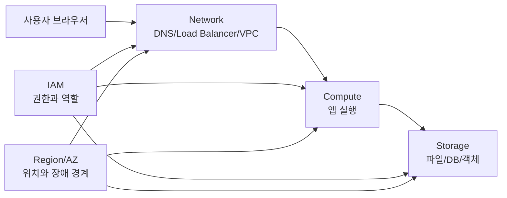

# 1교시: 클라우드 기본 구성 요소 - Region, AZ, Compute, Storage, Network, IAM의 큰 그림

## 수업 목표
- 클라우드 리소스를 위치, 실행, 저장, 통신, 권한의 관점으로 나누어 설명한다.
- Region과 Availability Zone이 장애 격리와 지연 시간에 영향을 준다는 점을 이해한다.
- Compute, Storage, Network, IAM이 3일차의 웹 애플리케이션 구조와 어떻게 연결되는지 설명한다.
- AWS 서비스 이름을 외우기보다 어떤 운영 문제를 해결하는 구성요소인지 구분한다.

## 시작 상황
3일차에는 미니 웹앱을 로컬에서 실행하고, 포트와 로그, README를 확인했다. 이제 같은 앱을 클라우드에 올린다고 생각해 보자. "AWS에 올린다"는 말은 너무 넓다. 어느 지역에 둘 것인지, 어떤 실행 자원에서 돌릴 것인지, 데이터는 어디에 둘 것인지, 외부 사용자는 어떤 네트워크 경로로 들어올 것인지, 누가 설정을 바꿀 수 있는지까지 정해야 한다.

클라우드는 커다란 컴퓨터 한 대가 아니라, 위치와 역할이 나뉜 자원들의 조합이다. 초급자는 서비스 이름을 많이 외우기보다 먼저 지도를 만들어야 한다. 이 지도에서 Region(지리적 리소스 위치), AZ(Availability Zone, 한 Region 안의 분리된 데이터센터 묶음), Compute(실행 자원), Storage(저장 자원), Network(통신 경로), IAM(권한 관리)이 기본 축이 된다.

클라우드를 이해할 때 가장 먼저 버려야 할 생각은 "AWS는 남의 컴퓨터를 빌리는 곳"이라는 단순한 표현이다. 이 말은 절반만 맞다. AWS는 단순히 서버 한 대를 빌려주는 것이 아니라 전 세계 여러 지역에 데이터센터, 네트워크, 스토리지, 보안, 권한 관리, 운영 자동화 기능을 미리 깔아 둔 거대한 실행 공간을 제공한다. 사용자는 그 공간 중 필요한 일부를 선택해 빠르게 배포하고, 테스트하고, 지우고, 다시 만들 수 있다.

데이터센터를 직접 운영하면 물리 장비, 네트워크 장비, 전원, 냉각, 랙, 케이블, 하드웨어 교체, 장애 대응까지 모두 회사가 책임진다. 대신 물리적인 수준까지 직접 손댈 수 있다. 반대로 AWS 같은 클라우드는 물리 인프라 유지보수를 AWS가 책임진다. 사용자는 물리 서버의 램을 직접 꽂거나 네트워크 케이블을 바꾸지는 못한다. 대신 서버 구매와 설치를 기다리지 않고 몇 분 안에 실행 공간을 만들고, 비용과 권한을 통제하면서 빠르게 실험할 수 있다.

## 공식 참고 자료
- AWS Documentation: Regions and Availability Zones  
  https://docs.aws.amazon.com/AWSEC2/latest/UserGuide/using-regions-availability-zones.html
- AWS Documentation: AWS global infrastructure  
  https://docs.aws.amazon.com/whitepapers/latest/aws-overview/global-infrastructure.html
- AWS Documentation: Compute services  
  https://docs.aws.amazon.com/whitepapers/latest/aws-overview/compute-services.html
- AWS Documentation: Storage services  
  https://docs.aws.amazon.com/whitepapers/latest/aws-overview/storage-services.html
- AWS Documentation: Networking services  
  https://docs.aws.amazon.com/whitepapers/latest/aws-overview/networking-services.html
- AWS IAM User Guide: What is IAM?  
  https://docs.aws.amazon.com/IAM/latest/UserGuide/introduction.html
- AWS Savings Plans User Guide
  https://docs.aws.amazon.com/savingsplans/latest/userguide/what-is-savings-plans.html
- AWS Documentation: Reserved Instances
  https://docs.aws.amazon.com/AWSEC2/latest/UserGuide/ec2-reserved-instances.html

## 핵심 개념
| 구성요소 | 쉬운 뜻 | 대표 질문 | 이후 연결 |
|---|---|---|---|
| Region | 리소스를 둘 지리적 지역 | 사용자가 어느 지역에 있는가? | AWS 배포, 비용, 지연 시간 |
| Availability Zone | Region 안의 분리된 장애 경계 | 한 데이터센터 장애를 견딜 것인가? | 고가용성, ALB, RDS Multi-AZ |
| Compute | 프로그램 실행 자원 | 앱이 어디서 실행되는가? | EC2, ECS, EKS, Lambda |
| Storage | 데이터 저장 자원 | 데이터가 재시작 후에도 남아야 하는가? | EBS, S3, RDS |
| Network | 요청과 응답의 길 | 누가 어디로 접속할 수 있는가? | VPC, subnet, route, security group |
| IAM | 사람과 프로그램의 권한 | 누가 무엇을 할 수 있는가? | 최소 권한, 역할, 정책 |

## 쉬운 비유: 전 세계 공유 오피스와 사내 네트워크
출장이나 휴가로 해외에 나갔다고 생각해 보자. 회사의 내부 시스템은 사무실 네트워크에서만 접속할 수 있다. 사무실에는 인증된 네트워크, 보안 장비, 출입 통제, 회의실, 업무용 책상, 프린터가 모두 준비되어 있다. 하지만 내가 노트북만 들고 다른 나라에 있으면 그 환경을 그대로 사용할 수 없다. 노트북 성능이 충분하더라도 회사 네트워크와 인증된 업무 공간이 없으면 내부 시스템에 연결하기 어렵다.

이때 전 세계 주요 도시에 회사가 계약한 공유 오피스가 있다고 생각해 보자. 서울, 도쿄, 싱가포르, 프랑크푸르트, 버지니아에 공유 오피스가 있고, 그곳에 들어가 인증만 하면 회사 업무망과 필요한 장비를 사용할 수 있다. 사용자는 건물 전기, 냉난방, 출입 게이트, 물리 보안, 네트워크 회선 공사를 직접 관리하지 않는다. 공유 오피스 운영사가 그 물리적인 기반을 관리한다. 사용자는 어느 도시의 어느 지점에서 일할지, 어떤 회의실을 예약할지, 누가 출입할 수 있는지, 얼마나 오래 사용할지를 결정한다.

AWS 같은 클라우드는 이 공유 오피스 비유와 닮아 있다. Region은 공유 오피스가 있는 도시와 비슷하다. 서울, 도쿄, 버지니아처럼 사용자가 가까운 지역을 고르면 지연 시간을 줄일 수 있고, 법적 요구사항이나 서비스 지원 여부도 맞출 수 있다. AZ는 같은 도시 안에서도 서로 떨어진 오피스 건물이나 건물 단지와 비슷하다. 한 건물에 전기나 네트워크 문제가 생겨도 다른 건물에서 업무를 계속할 수 있도록 분리된 공간이다.

Compute는 일을 처리하는 사무실, Storage는 문서 보관실, Network는 도로와 출입문, IAM은 출입증과 권한 규칙에 가깝다. 좋은 운영자는 사무실만 크게 빌리지 않는다. 문서가 어디에 저장되는지, 누가 들어올 수 있는지, 도로가 막히면 어떤 우회가 있는지, 출입증이 과하게 발급되어 있지 않은지를 함께 본다.

이 비유에서 중요한 점은 공유 오피스가 회사 사옥보다 항상 싸다는 뜻이 아니라는 점이다. 하루, 일주일, 한 달처럼 짧게 쓰거나 해외에서 빠르게 테스트할 때는 공유 오피스가 유리할 수 있다. 하지만 수백 명이 매일 같은 공간을 장기간 사용한다면 직접 사옥을 갖거나 장기 계약을 맺는 편이 더 나을 수 있다. 클라우드도 마찬가지다. 짧은 실험, 빠른 배포, 변동이 큰 트래픽에는 유리하지만, 장기간 대규모 컴퓨팅을 안정적으로 계속 써야 한다면 직접 데이터센터를 운영하거나 CSP(Cloud Service Provider, 클라우드 서비스 제공자)와 장기 약정, 할인 플랜, 기업 계약을 검토해야 한다.

비유의 한계도 분명하다. 실제 공유 오피스에서는 책상 위치나 회의실 배치를 눈으로 볼 수 있지만, 클라우드 리소스는 API, 콘솔, 로그, 메트릭으로 확인한다. 또한 공유 오피스에서는 건물 벽을 마음대로 뜯어고칠 수 없듯이, AWS에서도 물리 서버와 데이터센터 설비를 직접 유지보수하거나 물리적인 수준의 성능 튜닝을 할 수 없다. 대신 사용자는 더 높은 수준의 선택, 즉 어느 Region에 둘지, 어떤 Compute를 쓸지, 어떤 네트워크를 열지, 어떤 권한을 줄지, 비용을 어디까지 허용할지를 빠르게 결정한다.

## 데이터센터와 클라우드의 책임 경계
데이터센터는 모든 것을 직접 할 수 있는 공간이다. 서버 구매, 랙 장착, 케이블 연결, 스위치 설정, 방화벽 구성, 전원 이중화, 냉각, 물리 보안, 부품 교체까지 회사가 통제할 수 있다. 통제권이 큰 대신 책임도 크다. 장애가 발생하면 하드웨어 벤더, 네트워크 사업자, 건물 관리, 내부 운영팀 사이에서 원인을 찾고 복구해야 한다. 장비가 오래되면 교체 계획도 세워야 하고, 사용량이 줄어도 이미 산 장비 비용은 사라지지 않는다.

AWS 같은 클라우드는 물리적인 기반을 제공자가 관리한다. AWS는 글로벌 인프라, 데이터센터 시설, 물리 서버, 일부 네트워크 기반, 가상화 기반을 운영한다. 사용자는 그 위에서 계정, 권한, 네트워크 공개 범위, 데이터, 애플리케이션, 로그, 비용을 관리한다. 이것이 2교시에서 다룰 Shared Responsibility Model(공유 책임 모델)의 출발점이다.

| 구분 | 직접 데이터센터 | AWS 같은 클라우드 |
|---|---|---|
| 물리 장비 | 직접 구매, 설치, 교체 | AWS가 기반 시설을 관리 |
| 물리 보안 | 회사가 출입과 시설 보안 관리 | AWS가 데이터센터 물리 보안 관리 |
| 네트워크 기반 | 회선, 스위치, 방화벽 직접 설계 | VPC, subnet, security group 같은 논리 설정을 사용 |
| 확장 속도 | 장비 구매와 설치 시간이 필요 | 리소스를 빠르게 생성하고 삭제 가능 |
| 제어권 | 물리 수준까지 직접 제어 가능 | 물리 수준 제어는 제한되고 서비스 옵션 안에서 선택 |
| 책임 | 장애와 유지보수 책임이 회사에 크게 있음 | 물리 인프라는 AWS, 설정과 데이터는 사용자가 책임 |
| 비용 구조 | 초기 투자와 장기 운영비 중심 | 사용량 기반 임대료와 관리형 서비스 비용 중심 |

클라우드는 "책임이 사라지는 곳"이 아니라 "책임의 위치가 바뀌는 곳"이다. 물리 장비 교체와 데이터센터 냉각은 AWS가 맡지만, 공개로 열어 둔 스토리지, 과한 IAM 권한, 삭제하지 않은 리소스, 잘못된 네트워크 규칙은 사용자의 책임이다. 그래서 클라우드를 배우는 첫날부터 Compute, Storage, Network, IAM을 함께 봐야 한다.

## 클라우드가 특히 강한 상황
클라우드는 물리적 성능을 직접 만지는 공간이라기보다 빠르게 배포하고, 테스트하고, 비용을 보며 조정하는 공간에 가깝다. 물론 AWS에는 매우 큰 컴퓨팅 성능을 제공하는 인스턴스와 전문 서비스도 있다. 그러나 초급자가 먼저 이해해야 할 장점은 "원하는 자원을 빠르게 빌리고, 실패하면 지우고, 다른 방식으로 다시 만들 수 있다"는 점이다.

| 상황 | 클라우드가 주는 장점 | 운영 관점 |
|---|---|---|
| 빠른 POC | 서버 구매 없이 몇 시간 안에 실험 가능 | 실패 비용을 작게 만든다 |
| 해외 사용자 테스트 | 가까운 Region을 선택할 수 있음 | 지연 시간과 서비스 지원 여부를 확인한다 |
| 일시적 트래픽 | 필요할 때 늘리고 줄일 수 있음 | 사용량과 비용을 함께 관찰한다 |
| 관리형 기능 사용 | DB, 스토리지, 로드 밸런서, 모니터링을 조합 | 운영 부담은 줄지만 설정 책임은 남는다 |
| 팀 실습 | 같은 문서와 계정 기준으로 재현 가능 | 권한, 비용, 삭제 절차를 표준화한다 |

클라우드는 보안, 네트워크, 일반 컴퓨팅, 스토리지, 권한 관리 같은 기능을 미리 서비스 형태로 제공한다. 개인이나 작은 팀이 직접 데이터센터를 설계하면 놓치기 쉬운 항목들이 클라우드 서비스 안에서는 기본 구성요소로 등장한다. 이 점이 공유의 경제다. 여러 고객이 거대한 인프라 기반을 나누어 쓰기 때문에, 개별 회사가 처음부터 전 세계 데이터센터와 운영 자동화를 만드는 것보다 훨씬 빠르게 시작할 수 있다.

하지만 공유의 경제가 항상 최저 비용을 보장하지는 않는다. 클라우드는 단기 대여가 쉬운 대신 임대료를 지불하는 구조다. 작은 실험을 몇 시간 돌리는 것은 저렴할 수 있지만, 대규모 워크로드를 24시간 365일 계속 돌리면 비용이 커질 수 있다. 이 경우에는 Savings Plans, Reserved Instances, Enterprise Discount Program 같은 할인 모델이나 장기 계약을 검토하거나, 일부 워크로드를 직접 운영하는 전략도 비교한다. 비용 최적화는 "무조건 클라우드"나 "무조건 데이터센터"가 아니라 사용 기간, 규모, 변동성, 운영 인력, 장애 책임을 함께 보는 판단이다.

## 인포그래픽
아래 인포그래픽은 4일차 전체 학습 지도를 보여준다. Region과 AZ 위에 Compute, Storage, Network, IAM을 배치하고, 바깥에 비용과 보안 가드레일을 둔다.

## Mermaid: 로컬 앱을 클라우드 구성요소로 해석하기

이 다이어그램은 서비스 접속을 왼쪽에서 오른쪽으로 읽는다. 사용자는 네트워크 입구를 통해 앱 실행 자원에 도착하고, 앱은 저장 자원에 접근한다. IAM은 모든 접근의 권한 경계이며, Region/AZ는 리소스가 실제로 배치되는 위치와 장애 격리를 결정한다.

## 운영 판단 기준
| 판단 질문 | 확인할 것 | 잘못 판단했을 때의 문제 |
|---|---|---|
| 어떤 Region을 쓸 것인가? | 사용자 위치, 서비스 제공 여부, 비용, 규제 | 지연 시간 증가, 서비스 미지원, 비용 차이 |
| AZ를 몇 개 고려할 것인가? | 장애 허용 수준, 실습 범위 | 단일 장애점 또는 과한 비용 |
| 어떤 Compute가 필요한가? | 실행 시간, 제어 수준, 배포 방식 | 과한 서버 관리 또는 제약 미확인 |
| 어떤 Storage가 필요한가? | 파일, 블록, 객체, 관계형 데이터 | 데이터 손실, 백업 누락, 비용 증가 |
| 어떤 Network 경로가 열려야 하는가? | 외부 공개 여부, 포트, 보안 그룹 | 접속 실패 또는 과도한 노출 |
| 누가 수정할 수 있어야 하는가? | 사용자, 역할, 정책 | root 남용, 권한 과다, 감사 어려움 |

## 데이터센터와 클라우드 선택 질문
아래 질문은 "어디가 더 좋은가"를 정답처럼 고르기 위한 것이 아니다. 워크로드의 성격을 보고 어떤 운영 모델이 맞는지 판단하기 위한 질문이다.

| 질문 | 데이터센터 쪽 판단 | 클라우드 쪽 판단 |
|---|---|---|
| 사용 기간이 짧은가? | 장비 구매가 부담이 될 수 있다 | 짧게 빌리고 삭제하기 좋다 |
| 사용량이 계속 변하는가? | 여유 장비를 미리 확보해야 한다 | 사용량에 맞춰 조정하기 쉽다 |
| 물리 장비를 직접 만져야 하는가? | 직접 운영이 필요할 수 있다 | 물리 수준 제어는 어렵다 |
| 글로벌 지역 테스트가 필요한가? | 해외 거점 구축이 어렵다 | 여러 Region을 선택할 수 있다 |
| 장기 대규모 사용이 확정적인가? | 직접 운영 또는 전용 계약이 유리할 수 있다 | 할인 플랜과 약정 검토가 필요하다 |
| 운영 인력이 충분한가? | 직접 유지보수 가능 | 관리형 서비스로 부담을 줄일 수 있다 |

## 실습: 서비스 이름보다 역할 먼저 분류하기
아래 표를 개인 노트에 채운다. 지금은 리소스를 만들지 않는다.

| 서비스 또는 개념 | 역할 분류 | 사용 조건 | 비용/보안 주의 |
|---|---|---|---|
| EC2 | Compute | 서버처럼 직접 실행 환경을 관리해야 할 때 | 켜져 있는 시간, 공개 포트 |
| S3 | Storage | 정적 파일, 이미지, 백업 객체 저장 | 공개 버킷, 저장량/요청 비용 |
| VPC | Network | 리소스가 통신할 격리 네트워크 필요 | 라우팅, 공개/비공개 subnet |
| IAM Role | IAM | 서비스나 사용자에게 권한 부여 | 과한 정책, 장기 access key |
| RDS | Storage/Database | 관계형 DB를 관리형으로 사용할 때 | 인스턴스 시간, 백업, 공개 접근 |

확인 질문:
- EC2는 "클라우드"인가, 아니면 클라우드 안의 Compute 선택지인가?
- S3는 데이터베이스인가, 객체 저장소인가?
- IAM을 나중에 붙이면 되는 부가기능으로 봐도 되는가?

## 흔한 오해
| 오해 | 바로잡기 |
|---|---|
| Region은 아무 데나 골라도 된다 | 지연 시간, 서비스 지원, 비용, 규제에 영향을 준다 |
| AZ가 많으면 무조건 좋다 | 가용성은 높아질 수 있지만 구조와 비용이 복잡해진다 |
| Compute만 만들면 서비스가 된다 | 네트워크, 저장소, 권한, 로그가 함께 필요하다 |
| IAM은 보안팀만 다룬다 | 인프라/DevOps 엔지니어가 매일 마주치는 운영 경계다 |

## DevOps 원칙 연결
- 비용 절감: 리소스 역할을 먼저 분류하면 필요 없는 관리형 서비스나 과한 서버 생성을 줄인다.
- 개발/배포 효율성: Compute, Network, Storage 경계를 알면 배포 실패가 코드 문제인지 인프라 문제인지 빠르게 나눌 수 있다.
- 관리 효율성: IAM과 Region/AZ 기준을 문서화하면 팀원이 같은 구조로 리소스를 찾고 검토할 수 있다.

## 다음 수업 연결
다음 교시에서는 같은 클라우드 리소스라도 IaaS, PaaS, SaaS, Managed Service에 따라 사용자가 책임지는 범위가 달라진다는 점을 다룬다. 서비스 선택은 기능 선택이 아니라 운영 책임 선택이다.
