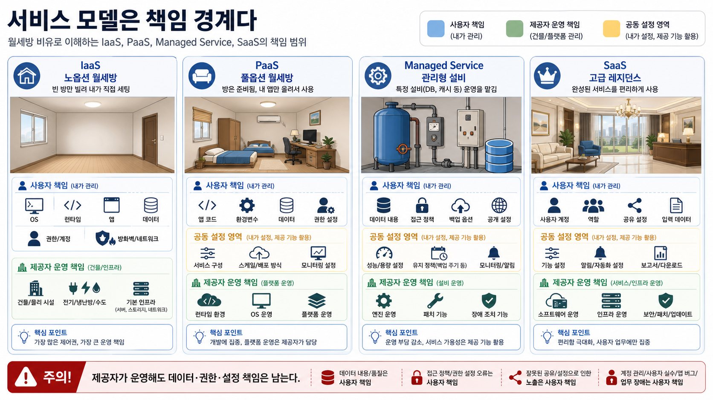
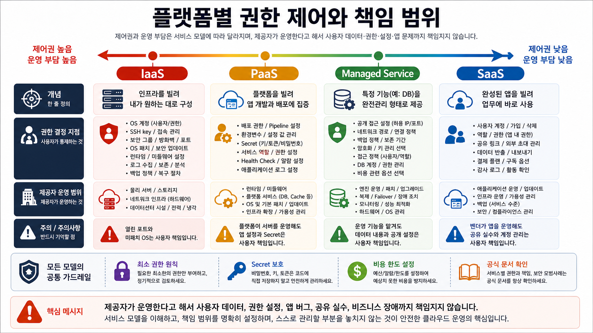
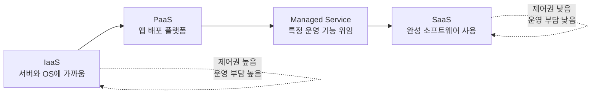

# 2교시: 클라우드 서비스 모델 - IaaS, PaaS, SaaS, Managed Service, Shared Responsibility Model

## 수업 목표
- IaaS, PaaS, SaaS, Managed Service를 각각 따로 설명하고, 학생이 서로 헷갈리지 않게 구분한다.
- 서비스 모델을 "어떤 기능을 쓰는가"가 아니라 "누가 어디까지 책임지는가"라는 관점으로 해석한다.
- 플랫폼별 권한 제어 범위가 달라질 때 보안, 비용, 장애 대응 방식도 달라진다는 점을 이해한다.
- Shared Responsibility Model을 사용해 클라우드 제공자와 사용자의 책임 경계를 설명한다.
- 서비스 선택 시 제어권, 운영 부담, 배포 속도, 비용 구조, 보안 책임을 함께 비교한다.

## 시작 상황
1교시에서는 클라우드를 전 세계 공유 오피스에 비유했다. 2교시에서는 더 생활에 가까운 월세방 비유로 서비스 모델을 나눈다. 어떤 방은 아무 옵션이 없어 침대, 책상, 인터넷 공유기, 청소 도구를 직접 준비해야 한다. 어떤 방은 풀옵션이라 기본 가구와 인터넷이 준비되어 있다. 어떤 곳은 고급 레지던스처럼 청소, 프런트, 보안, 공용 시설까지 제공한다. 또 어떤 설비는 정수기, 세탁실, 보관 창고처럼 특정 기능만 관리형으로 빌려 쓸 수 있다.

클라우드 서비스 모델도 이와 비슷하다. IaaS(Infrastructure as a Service)는 노옵션 월세방처럼 자유도가 높지만 직접 챙길 것이 많다. PaaS(Platform as a Service)는 풀옵션 월세방처럼 앱을 올리기 쉬운 환경이 준비되어 있다. SaaS(Software as a Service)는 고급 레지던스처럼 완성된 서비스를 바로 쓰는 방식이다. Managed Service는 방 전체가 아니라 데이터베이스, 캐시, 백업, 메시지 큐 같은 특정 설비의 운영 부담을 맡기는 방식에 가깝다.

초급자가 가장 많이 헷갈리는 지점은 PaaS와 Managed Service, SaaS를 모두 "관리해 주는 서비스"로 뭉뚱그리는 것이다. 하지만 운영 관점에서는 구분해야 한다. IaaS는 서버와 운영체제에 가까운 제어권을 준다. PaaS는 애플리케이션을 올리는 플랫폼에 가깝다. SaaS는 완성된 소프트웨어를 사용하는 방식이다. Managed Service는 데이터베이스, 캐시, 메시지 큐, 컨테이너 실행 환경처럼 특정 운영 부담을 클라우드 제공자에게 맡기는 선택이다.

서비스 모델을 구분하지 못하면 설계 대화가 흐려진다. "관리형이니까 보안은 AWS가 다 해주나요?", "PaaS를 쓰면 로그와 권한은 누가 보나요?", "SaaS면 비용 관리는 필요 없나요?", "EC2는 클라우드니까 운영체제 패치를 안 해도 되나요?" 같은 질문에 답할 수 없게 된다. 2교시의 핵심은 서비스 이름을 외우는 것이 아니라 책임 경계를 읽는 것이다.

## 공식 참고 자료
- AWS: Types of cloud computing
  https://aws.amazon.com/types-of-cloud-computing/
- AWS: Shared Responsibility Model
  https://aws.amazon.com/compliance/shared-responsibility-model/
- AWS Well-Architected Framework: Security pillar
  https://docs.aws.amazon.com/wellarchitected/latest/security-pillar/welcome.html
- AWS Documentation: Introduction to AWS
  https://docs.aws.amazon.com/whitepapers/latest/aws-overview/introduction.html
- AWS IAM User Guide: Security best practices in IAM
  https://docs.aws.amazon.com/IAM/latest/UserGuide/best-practices.html
- AWS Documentation: What is Amazon EC2?
  https://docs.aws.amazon.com/AWSEC2/latest/UserGuide/concepts.html
- AWS Documentation: What is AWS Elastic Beanstalk?
  https://docs.aws.amazon.com/elasticbeanstalk/latest/dg/Welcome.html
- AWS Documentation: What is Amazon RDS?
  https://docs.aws.amazon.com/AmazonRDS/latest/UserGuide/Welcome.html

## 인포그래픽: 서비스 모델 오버뷰
아래 인포그래픽은 IaaS, PaaS, SaaS, Managed Service를 책임 경계로 비교한다. 같은 클라우드 서비스라도 사용자가 관리하는 계층과 제공자가 관리하는 계층이 다르다.

## 핵심 개념 한눈에 보기
| 모델 | 한 줄 정의 | 학생이 기억할 핵심 | 대표 예시 관점 |
|---|---|---|---|
| IaaS | 서버, 네트워크, 스토리지 같은 인프라 자원을 빌려 쓰는 방식 | 서버를 빌리지만 운영체제 위쪽 책임은 많이 남는다 | EC2 같은 가상 서버 |
| PaaS | 애플리케이션을 올릴 플랫폼을 제공받는 방식 | 코드를 배포하는 데 집중하지만 플랫폼 제약을 따라야 한다 | 앱 배포 플랫폼, 런타임 플랫폼 |
| SaaS | 완성된 소프트웨어를 계정으로 사용하는 방식 | 기능은 바로 쓰지만 내부 구조 제어권은 거의 없다 | 협업 도구, 이메일, CRM |
| Managed Service | 특정 운영 기능을 관리형으로 제공받는 방식 | 운영 부담 일부를 맡기지만 설정과 데이터 책임은 남는다 | RDS, 관리형 캐시, 관리형 큐 |

Managed Service는 PaaS나 SaaS와 같은 축에 완전히 딱 맞게 들어가는 단어가 아니다. "서비스 제공자가 운영 일부를 대신 관리한다"는 성격을 말한다. 예를 들어 RDS는 데이터베이스 설치, 일부 패치, 백업 기능을 관리형으로 제공하지만, 어떤 데이터가 들어가는지, 공개 접근을 막을지, 백업 보관 기간을 어떻게 둘지, 어떤 계정이 접근할지는 사용자가 정한다.

## 쉬운 비유: 월세방을 빌리는 네 가지 방식
IaaS는 노옵션 월세방과 비슷하다. 건물, 전기, 수도, 기본 출입구는 제공되지만 침대, 책상, 냉장고, 인터넷 공유기, 청소, 내부 배치는 직접 준비해야 한다. 자유롭게 꾸밀 수 있지만, 고장이나 관리 문제를 직접 챙길 일이 많다. 클라우드에서는 물리 데이터센터와 가상화 기반은 제공자가 운영하지만, OS, 런타임, 앱, 데이터, 포트, 권한 설정은 사용자가 많이 책임진다.

PaaS는 풀옵션 월세방과 비슷하다. 침대, 책상, 냉장고, 인터넷, 기본 관리 규칙이 준비되어 있어서 입주자는 빠르게 생활을 시작할 수 있다. 대신 집주인이 정한 옵션과 구조 안에서 사용해야 한다. 클라우드에서는 서버와 런타임 운영 부담이 줄어드는 대신, 앱 코드, 환경변수, secret, 배포 설정, health check 같은 사용자의 설정 책임은 남는다.

SaaS는 고급 레지던스와 비슷하다. 가구, 보안, 청소, 프런트, 공용 시설이 갖춰져 있고, 사용자는 계약하고 들어가서 바로 쓸 수 있다. 대신 건물 내부 운영 방식이나 설비 구조를 마음대로 바꿀 수 없다. 클라우드에서는 완성된 소프트웨어를 사용하지만, 사용자 계정, 역할, 공유 링크, 입력 데이터, 결제 플랜 관리는 여전히 사용자의 책임이다.

Managed Service는 방 전체가 아니라 특정 설비를 관리형으로 빌리는 것과 비슷하다. 정수기 관리, 세탁실 관리, 보관 창고, 보안 게이트처럼 특정 기능은 업체가 점검하고 운영한다. 하지만 무엇을 보관할지, 누가 접근할지, 얼마 동안 보관할지, 추가 비용이 나는 옵션을 켤지는 사용자가 정해야 한다. RDS 같은 관리형 데이터베이스도 마찬가지다. 엔진 운영 일부는 AWS가 맡지만, 데이터 내용과 공개 설정, 접근 정책, 백업 옵션은 사용자가 판단한다.

비유의 한계는 실제 클라우드 서비스가 이 네 분류 중 하나로만 깔끔하게 떨어지지 않는 경우가 있다는 점이다. 어떤 서비스는 PaaS처럼 보이지만 내부에 Managed Service 성격이 있고, 어떤 SaaS도 사용자 권한 설정과 데이터 관리 책임은 남긴다. 그래서 모델명보다 책임 경계를 먼저 읽어야 한다. 집주인이 건물을 관리한다고 해서 내가 문을 활짝 열어 둔 책임까지 대신 지지 않는 것처럼, 클라우드 제공자가 플랫폼을 운영한다고 해서 사용자의 데이터, 권한, 공유 설정, 앱 버그까지 모두 책임지는 것은 아니다.

## IaaS 자세히 보기
IaaS는 Infrastructure as a Service다. 가장 대표적인 이미지는 가상 서버를 빌리는 방식이다. AWS에서는 EC2를 떠올리면 이해하기 쉽다. 사용자는 인스턴스 타입, 운영체제 이미지, 디스크, 네트워크, 보안 그룹, 접속 방식 등을 선택한다. 물리 서버와 데이터센터는 AWS가 관리하지만, 운영체제 위에서 벌어지는 많은 일은 사용자가 책임진다.

IaaS를 쓰면 제어권이 크다. 원하는 패키지를 설치하고, 특정 버전의 런타임을 고정하고, 서버 설정을 세밀하게 바꿀 수 있다. 3일차 미니 앱을 EC2에 올린다면 Python 설치, 앱 파일 복사, 포트 설정, systemd 또는 프로세스 관리, 로그 위치, 보안 그룹, 운영체제 업데이트를 직접 챙기게 된다.

| IaaS에서 사용자가 챙길 것 | 설명 |
|---|---|
| OS 패치 | 보안 업데이트와 커널/패키지 업데이트 기준을 정한다 |
| 런타임 설치 | Python, Node.js, Java 같은 실행 환경을 설치하고 버전을 관리한다 |
| 방화벽/보안 그룹 | 어떤 포트를 누구에게 열지 결정한다 |
| 로그 수집 | 서버 안 로그를 어디에 저장하고 어떻게 볼지 정한다 |
| 백업 | 디스크, 설정, 데이터 복구 방법을 준비한다 |
| 접근 권한 | SSH key, 사용자 계정, IAM 권한을 관리한다 |

IaaS가 적합한 경우는 운영체제나 네트워크 설정을 세밀하게 제어해야 하거나, 기존 서버 방식의 애플리케이션을 클라우드로 옮기는 경우다. 반대로 단순 웹앱을 빠르게 배포하고 싶은 초급 프로젝트에서는 운영 부담이 과할 수 있다.

## PaaS 자세히 보기
PaaS는 Platform as a Service다. 사용자는 애플리케이션 코드와 설정을 플랫폼에 올리고, 플랫폼은 런타임 실행, 배포 흐름, 일부 스케일링, 로그 연결 같은 기반을 제공한다. AWS Elastic Beanstalk처럼 애플리케이션 배포를 단순화해 주는 서비스가 PaaS 관점의 예시가 될 수 있다.

PaaS의 장점은 배포 속도다. 서버를 직접 만들고 OS를 설정하는 시간이 줄어든다. 개발자는 앱 코드, 환경변수, 빌드 설정, 배포 설정에 더 집중할 수 있다. 하지만 플랫폼이 정한 방식 안에서 움직여야 한다. 지원하는 런타임, 배포 방식, 로그 구조, 네트워크 옵션, 확장 옵션이 서비스마다 다르다.

| PaaS에서 사용자가 챙길 것 | 설명 |
|---|---|
| 애플리케이션 코드 | 플랫폼이 실행할 앱과 진입점을 명확히 한다 |
| 환경변수 | DB 주소, API endpoint, 실행 모드 같은 설정을 주입한다 |
| 배포 설정 | 어떤 branch 또는 artifact를 배포할지 정한다 |
| 플랫폼 권한 | 플랫폼이 다른 서비스에 접근할 수 있는 IAM 역할을 제한한다 |
| 로그와 health check | 플랫폼이 정상 여부를 판단할 기준을 설정한다 |
| 제약 확인 | 지원 런타임, 리전, 파일 구조, 빌드 제한을 확인한다 |

PaaS는 빠른 실험과 작은 팀에 유리하다. 하지만 문제가 생겼을 때 내부 서버에 직접 들어가 모든 것을 고칠 수 있다고 가정하면 안 된다. 플랫폼이 제공하는 로그, 이벤트, 설정 화면, 공식 문서 안에서 원인을 찾아야 한다.

## SaaS 자세히 보기
SaaS는 Software as a Service다. 사용자는 완성된 소프트웨어를 계정으로 사용한다. Gmail, Slack, Notion, GitHub 같은 협업 도구를 떠올리면 이해하기 쉽다. SaaS에서는 사용자가 운영체제, 서버, 데이터베이스 엔진, 배포 파이프라인을 직접 관리하지 않는다. 대신 사용자 계정, 역할, 데이터 공유 범위, 결제 플랜, 감사 로그, 외부 연동을 관리한다.

SaaS는 가장 빨리 시작할 수 있다. 하지만 내부 구조 제어권이 가장 낮다. 장애가 났을 때 사용자가 서버를 재시작할 수 없고, 데이터 저장 위치나 암호화 방식도 서비스가 제공하는 옵션 안에서 확인해야 한다. 그래서 SaaS를 사용할 때는 서비스 약관, 보안 문서, 데이터 반출 기능, 권한 설정, 관리자 기능을 확인해야 한다.

| SaaS에서 사용자가 챙길 것 | 설명 |
|---|---|
| 사용자 계정 | 퇴사자, 외부 협력자, 학생 계정 접근을 관리한다 |
| 역할과 권한 | 관리자, 편집자, 읽기 전용 권한을 구분한다 |
| 데이터 공유 | 공개 링크, 외부 공유, 다운로드 허용 범위를 정한다 |
| 결제 플랜 | 사용자 수와 기능 제한에 따른 비용을 확인한다 |
| 감사와 로그 | 누가 무엇을 변경했는지 확인 가능한지 본다 |
| 데이터 반출 | 서비스 이전이나 백업을 위한 export 기능을 확인한다 |

SaaS는 인프라 지식이 필요 없다는 뜻이 아니다. 인프라를 직접 운영하지 않을 뿐, 계정 보안과 데이터 관리 책임은 여전히 남는다. 특히 협업 도구는 권한을 잘못 열면 코드, 문서, 고객 정보, 비용 정보가 외부로 나갈 수 있다.

## Managed Service 자세히 보기
Managed Service는 특정 운영 부담을 클라우드 제공자에게 맡기는 방식이다. 데이터베이스를 예로 들면 직접 서버에 MySQL을 설치하고 백업 스크립트를 만들 수도 있지만, RDS를 쓰면 데이터베이스 엔진 운영의 일부를 AWS가 관리한다. 그러나 RDS를 쓴다고 데이터베이스 운영 책임이 사라지는 것은 아니다.

Managed Service의 핵심은 "운영 부담 일부 위임"이다. 패치, 백업, 장애 조치, 모니터링 연결, 확장 옵션 중 일부를 서비스가 제공할 수 있다. 대신 서비스별 설정과 비용 구조를 이해해야 한다. RDS에서는 인스턴스 클래스, 스토리지, 백업 보관 기간, Multi-AZ, 공개 접근, 보안 그룹, 파라미터 그룹 같은 설정이 비용과 안정성에 영향을 준다.

| Managed Service에서 사용자가 챙길 것 | 설명 |
|---|---|
| 서비스 설정 | 인스턴스 크기, 스토리지, 리전, 백업 옵션을 정한다 |
| 접근 제어 | IAM, 보안 그룹, DB 계정 권한을 제한한다 |
| 데이터 책임 | 어떤 데이터가 저장되는지, 암호화와 백업이 필요한지 판단한다 |
| 비용 조건 | 실행 시간, 저장량, 요청 수, 백업, 고가용성 옵션 비용을 확인한다 |
| 장애 대응 | 서비스 이벤트, 로그, metric, failover 조건을 확인한다 |
| 삭제 보호 | 실수로 지우면 안 되는 데이터 보호 설정을 검토한다 |

Managed Service는 PaaS와 헷갈릴 수 있다. PaaS는 앱을 올리는 플랫폼 전체 경험에 가깝고, Managed Service는 DB, 캐시, 큐, 로드 밸런서처럼 특정 운영 기능을 맡기는 성격이 강하다. 하지만 실제 서비스는 두 성격을 함께 가질 수 있으므로, 시험처럼 이름만 맞히기보다 "내가 여전히 설정해야 하는 것은 무엇인가"를 묻는 편이 정확하다.

## 플랫폼별 권한 제어와 책임 범위
아래 인포그래픽은 서비스 모델이 바뀔수록 제어권과 운영 부담이 어떻게 이동하는지 보여준다. 왼쪽으로 갈수록 직접 제어할 수 있는 것이 많지만 직접 책임질 것도 많다. 오른쪽으로 갈수록 빠르게 사용할 수 있지만 내부 구조 제어권은 줄어든다.

| 모델 | 권한 제어의 중심 | 보안 사고 예시 | 비용 사고 예시 |
|---|---|---|---|
| IaaS | OS 계정, SSH key, 보안 그룹, IAM 역할 | SSH 공개, 미패치 서버, 전체 포트 개방 | 켜 둔 인스턴스, 남은 볼륨 |
| PaaS | 배포 권한, 환경변수, 플랫폼 역할 | secret 환경변수 노출, 과한 서비스 역할 | 자동 스케일 설정 오류 |
| SaaS | 사용자 계정, 그룹, 공유 링크, 관리자 설정 | 공개 링크, 퇴사자 계정 방치 | 사용자 수 기반 플랜 증가 |
| Managed Service | 서비스 정책, 네트워크 접근, 데이터 권한 | 공개 DB, 과한 접근 정책, 암호화 누락 | 백업/Multi-AZ/스토리지 비용 증가 |

## Shared Responsibility Model 읽기
Shared Responsibility Model은 "클라우드의 보안"과 "클라우드 안에서의 보안"을 나눈다. AWS는 데이터센터, 물리 장비, 일부 기반 서비스를 보호한다. 사용자는 계정, 권한, 데이터, 네트워크 공개 범위, 애플리케이션 설정을 보호해야 한다.

| 영역 | AWS 책임 예시 | 사용자 책임 예시 |
|---|---|---|
| 물리 데이터센터 | 시설 보안, 하드웨어 관리 | 직접 접근하지 않음 |
| 가상화/기반 인프라 | 기반 서비스 운영 | 서비스별 설정 확인 |
| 계정과 권한 | IAM 기능 제공 | MFA, 최소 권한, access key 관리 |
| 데이터 | 저장 서비스 제공 | 암호화 설정, 공개 범위, 백업 정책 |
| 네트워크 | 글로벌 인프라 제공 | 보안 그룹, 라우팅, 공개 subnet 판단 |
| 애플리케이션 | 실행 기반 제공 | 코드 보안, secret 주입, 로그 관리 |

이 모델은 보안팀만의 문서가 아니다. 인프라/DevOps 엔지니어가 매일 내리는 결정의 기준이다. 예를 들어 EC2를 사용하면 운영체제 패치와 서버 방화벽 책임이 크고, RDS를 사용하면 데이터베이스 엔진 설치 부담은 줄지만 공개 접근, 백업 보관, 계정 권한 책임은 남는다. SaaS를 사용해도 사용자 계정과 데이터 공유 범위는 사용자가 관리한다.

## 모델별 비교표
| 비교 기준 | IaaS | PaaS | SaaS | Managed Service |
|---|---|---|---|---|
| 시작 속도 | 느림 | 빠름 | 가장 빠름 | 서비스에 따라 빠름 |
| 제어권 | 높음 | 중간 | 낮음 | 설정 범위 안에서 중간 |
| 운영 부담 | 높음 | 중간 | 낮음 | 특정 영역은 낮아짐 |
| 비용 구조 | 서버 시간/스토리지 중심 | 플랫폼 사용량/스케일 중심 | 사용자 수/플랜 중심 | 인스턴스, 요청, 저장, 옵션 중심 |
| 장애 대응 | 서버 내부까지 직접 확인 | 플랫폼 로그와 이벤트 중심 | 벤더 상태와 관리자 기능 중심 | 서비스 metric, 이벤트, 설정 중심 |
| 보안 핵심 | OS, 네트워크, 접근키 | 환경변수, 배포 권한 | 사용자/공유 권한 | 데이터 접근, 공개 범위, 암호화 |
| 적합한 상황 | 세밀한 제어, 기존 서버 이전 | 빠른 앱 배포 | 완성 기능 즉시 사용 | DB/캐시/큐 등 운영 부담 감소 |

## Mermaid: 책임 범위가 이동하는 방향

오른쪽으로 갈수록 사용자가 직접 관리하는 범위는 줄어든다. 하지만 책임이 0이 되지는 않는다. 계정, 권한, 데이터 입력, 비용 한도, 계약과 규정 준수는 계속 남는다.

## 실습: 같은 요구사항을 서비스 모델로 나누기
요구사항: "수업용 체크리스트 웹앱을 다른 사람이 접속할 수 있게 공개하고 싶다."

| 선택지 | 모델 관점 | 사용자가 챙길 것 | 이번 주차 판단 |
|---|---|---|---|
| EC2에 직접 배포 | IaaS | OS, 웹서버, 보안 그룹, 로그, 패치 | 1주차에는 생성하지 않음 |
| 앱 배포 플랫폼 사용 | PaaS | 코드, 환경변수, 배포 설정, 플랫폼 권한 | 2~5주차 이후 연결 |
| GitHub Pages 같은 정적 호스팅 | SaaS/Managed에 가까움 | 저장소 공개 범위, 빌드 설정, 도메인 | 비용 없는 발표용 후보 |
| RDS 같은 DB 추가 | Managed Service | DB 접근, 백업, 공개 접근, 비용 | 1주차에서는 더미 JSON으로 대체 |
| 협업 도구에 결과 공유 | SaaS | 사용자 초대, 공유 링크, 권한 | README와 발표 자료 공유에 적합 |

이번 주차에서는 AWS 리소스를 바로 만들기보다 어떤 선택지가 어떤 책임을 가져오는지 분류한다. 책임을 모르면 서비스 선택이 빠른 시작처럼 보이다가 나중에 비용, 권한, 장애 대응에서 막힌다.

## 확인 질문
- EC2를 쓰면 AWS가 운영체제 보안 업데이트까지 모두 책임지는가?
- PaaS를 쓰면 앱 코드와 환경변수 secret 책임도 사라지는가?
- SaaS를 쓰면 사용자의 데이터 공유 설정을 신경 쓰지 않아도 되는가?
- RDS를 쓰면 데이터베이스 백업, 공개 접근, 계정 권한을 확인하지 않아도 되는가?
- 빠른 배포가 중요한 프로젝트와 물리 수준 제어가 중요한 프로젝트는 같은 모델을 선택해야 하는가?

## 흔한 오해
| 오해 | 바로잡기 |
|---|---|
| Managed Service는 보안도 전부 대신해 준다 | 계정, 권한, 데이터, 네트워크 공개 범위는 사용자가 책임진다 |
| SaaS는 인프라 지식이 필요 없다 | 권한, 감사, 데이터 반출, 비용 정책은 여전히 중요하다 |
| PaaS는 항상 SaaS와 같다 | PaaS는 앱을 올리는 플랫폼이고, SaaS는 완성 소프트웨어 사용에 가깝다 |
| IaaS는 클라우드니까 서버 관리를 안 해도 된다 | 물리 장비는 provider 책임이지만 OS와 앱 운영 책임은 많이 남는다 |
| 직접 관리하면 항상 싸다 | 운영 인력, 장애 대응, 패치 시간을 포함하면 비쌀 수 있다 |
| 관리형은 항상 비싸다 | 짧은 실험과 작은 팀에서는 운영 부담 감소가 더 클 수 있다 |

## DevOps 원칙 연결
- 비용 절감: 서비스 모델을 구분하면 직접 관리 비용, 사용자 수 비용, 요청량 비용, 백업 비용을 따로 볼 수 있다.
- 개발/배포 효율성: PaaS와 Managed Service는 반복 운영을 줄여 배포 속도를 높일 수 있지만, 제약을 모르면 장애 대응이 느려진다.
- 관리 효율성: 책임 경계를 문서화하면 보안 사고가 났을 때 "누가 무엇을 확인해야 하는가"가 명확해진다.

## 다음 수업 연결
다음 교시에서는 실제 AWS 계정을 만들기 전에 과금 구조, Free Tier, 결제 수단, root user와 MFA를 확인한다. 서비스 모델을 구분할 수 있어야 계정 생성 후 리소스를 만들 때 "이 선택은 어떤 책임과 비용을 가져오는가"를 판단할 수 있다.
