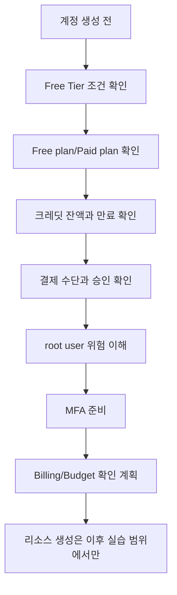

# 3교시: AWS 계정 생성 전 안내 - 과금 구조, Free Tier, 결제 수단, MFA, root 계정 주의사항

## 수업 목표
- AWS 계정이 실제 비용 청구와 연결되는 운영 계정임을 이해한다.
- 2025년 7월 이후 AWS Free Tier가 신규 고객 크레딧 중심 구조로 바뀌었고, 일부 서비스는 별도의 무료 사용량을 제공한다는 점을 설명한다.
- root user의 위험과 MFA 필요성을 계정 보안 관점에서 설명한다.
- 계정 생성 전 결제 수단, 이메일, 휴대폰, MFA, 비용 알림, 리소스 크기 선택 기준을 점검한다.

## 시작 상황
클라우드 실습에서 가장 위험한 문장은 "무료니까 그냥 만들어도 된다"이다. AWS에는 Free Tier가 있지만, 현재 Free Tier는 예전처럼 단순히 "12개월 동안 일부 서비스가 무료"라고만 설명하면 부족하다. 2025년 7월 15일 이후 생성되는 신규 AWS 계정은 Free plan 또는 Paid plan을 선택할 수 있고, 신규 고객은 가입 시 100 USD 크레딧을 받고 활동을 완료하면 추가로 최대 100 USD를 더 받을 수 있다. 즉 신규 고객은 최대 200 USD 크레딧을 받을 수 있지만, 이 크레딧은 현금이 아니고 모든 실수를 무제한으로 막아 주는 안전망도 아니다.

AWS 공식 Free Tier 페이지와 Billing 문서는 Free plan이 6개월 또는 크레딧 소진 중 먼저 도달하는 시점에 끝난다고 설명한다. 또한 일부 서비스는 monthly free usage limit, always free, short-term trial 같은 무료 사용량을 제공한다. 따라서 학생에게는 "Free Tier는 200달러까지 무조건 무료"라고 말하면 안 된다. 더 정확한 표현은 "신규 고객은 최대 200 USD 크레딧을 받을 수 있고, 일부 서비스는 별도의 무료 사용량을 제공하지만, 서비스·계정 플랜·사용량·기간·paid-only 서비스 여부를 반드시 확인해야 한다"이다.

AWS 계정은 단순 웹사이트 회원가입이 아니다. 결제 수단과 연결되고, root user는 계정 전체를 통제할 수 있다. 그래서 계정 생성 전에는 실습 범위, 비용 확인 방법, MFA 설정, root user 사용 제한을 먼저 이해해야 한다.

## 공식 참고 자료
- AWS Free Tier  
  https://aws.amazon.com/free/
- AWS Billing: AWS Free Tier FAQs
  https://docs.aws.amazon.com/awsaccountbilling/latest/aboutv2/free-tier-FAQ.html
- AWS Billing: Choosing an AWS Free Tier plan
  https://docs.aws.amazon.com/awsaccountbilling/latest/aboutv2/free-tier-plans.html
- AWS Billing and Cost Management User Guide  
  https://docs.aws.amazon.com/awsaccountbilling/latest/aboutv2/billing-what-is.html
- AWS Account Management: Create an AWS account  
  https://docs.aws.amazon.com/accounts/latest/reference/manage-acct-creating.html
- AWS IAM User Guide: AWS account root user  
  https://docs.aws.amazon.com/IAM/latest/UserGuide/id_root-user.html
- AWS IAM User Guide: Multi-factor authentication in IAM  
  https://docs.aws.amazon.com/IAM/latest/UserGuide/id_credentials_mfa.html
- AWS Support: Security checks
  https://docs.aws.amazon.com/awssupport/latest/user/security-checks.html
- AWS Security Blog: What to do if you inadvertently expose an AWS access key
  https://aws.amazon.com/blogs/security/what-to-do-if-you-inadvertently-expose-an-aws-access-key/

## 핵심 개념
| 용어 | 뜻 | 확인할 질문 |
|---|---|---|
| AWS Account | AWS 리소스와 비용, 권한이 묶이는 최상위 단위 | 이 계정을 누가 관리하고 비용을 확인하는가? |
| Root User | 계정 생성 이메일로 로그인하는 최고 권한 사용자 | 일상 작업에 쓰지 않도록 보호했는가? |
| MFA | 비밀번호 외 추가 인증 요소 | 분실 시 복구 방법을 알고 있는가? |
| Free Tier Credits | 신규 고객에게 제공될 수 있는 AWS 사용 크레딧 | 크레딧 잔액, 만료, 계정 plan을 확인했는가? |
| Always Free | 일부 서비스가 매월 제공하는 무료 사용량 | 월별 제한을 넘으면 어떻게 되는가? |
| Billing | 비용과 청구를 확인하는 영역 | 접근 권한과 알림 기준을 확인했는가? |

## 2026년 기준 AWS Free Tier 읽는 법
2026년 6월 1일 기준으로 수업에서 사용할 표현은 다음과 같이 정리한다.

| 항목 | 설명 | 수업에서 강조할 점 |
|---|---|---|
| 신규 고객 크레딧 | 신규 고객은 100 USD 크레딧을 받고, 활동을 완료하면 추가로 최대 100 USD를 더 받을 수 있다 | "최대 200 USD"이지 모든 계정이 무조건 200 USD를 즉시 현금처럼 받는 것은 아니다 |
| Free plan | 비용 없이 실험할 수 있는 plan이며, 6개월 또는 크레딧 소진 중 먼저 오는 시점에 끝난다 | Free plan에서 접근 가능한 서비스가 제한될 수 있다 |
| Paid plan | 사용량 기반 과금 계정이며, 크레딧 초과분이나 크레딧이 적용되지 않는 사용량은 결제될 수 있다 | 실습 계정이 Paid plan인지 반드시 확인한다 |
| 일부 무료 사용량 | 30개 이상의 서비스가 monthly free usage 또는 always free 성격의 무료 사용량을 제공한다 | 서비스별 월 한도, 요청 수, GB, 시간 조건을 확인한다 |
| 기존 계정 | 2025년 7월 15일 이전 생성 계정은 기존 12개월 Free Tier 문서 조건이 적용될 수 있다 | 계정 생성일에 따라 문서가 다르다 |

Free Tier 문서에서 확인할 것은 "무료"라는 단어가 아니라 조건이다.

| 확인 항목 | 왜 필요한가 |
|---|---|
| 서비스명 | 모든 AWS 서비스가 Free Tier에 포함되는 것은 아니다 |
| 계정 생성일 | 2025년 7월 15일 전후로 Free Tier 설명이 달라질 수 있다 |
| 계정 plan | Free plan인지 Paid plan인지에 따라 접근 가능 서비스와 과금 방식이 다르다 |
| 크레딧 잔액 | 100~200 USD 크레딧이 얼마나 남았는지 확인해야 한다 |
| 기간 조건 | 6개월 Free plan, always free, short-term trial, 기존 12개월 조건이 다를 수 있다 |
| 사용량 단위 | 시간, GB, 요청 수, 데이터 전송량 등 기준이 다르다 |
| 리전 차이 | 서비스 제공 여부와 가격이 리전에 따라 다를 수 있다 |
| paid-only 서비스 | Free plan에서 제한되거나 크레딧을 빠르게 소진할 수 있는 서비스가 있을 수 있다 |
| 초과 시 비용 | Paid plan에서는 크레딧 초과분이나 적용 제외 사용량이 청구될 수 있다 |

1주차에는 비용이 발생하는 리소스를 만들지 않는다. 오늘 계정 생성이 진행되더라도 핵심은 로그인, MFA, Billing 접근 확인이다. EC2, RDS, NAT Gateway, 고정 IP, 대용량 스토리지 같은 리소스는 이후 주차에서 명확한 실습 범위와 정리 절차가 있을 때 다룬다.

## 쉬운 비유: 무료 체험 헬스장
Free Tier는 "헬스장 무료 체험권과 포인트 쿠폰"이 함께 있는 것과 비슷하다. 새 회원에게 운동 시설을 체험할 수 있는 쿠폰을 주고, 몇 가지 활동을 완료하면 추가 포인트를 주는 구조라고 생각하면 된다. 하지만 무료 체험권이 있다고 해서 모든 PT, 사물함, 운동복 대여, 주차, 추가 프로그램이 무료라는 뜻은 아니다. 체험 기간과 제공 범위 안에서만 무료다. 범위를 넘거나 유료 전용 프로그램을 신청하면 결제가 시작될 수 있다.

AWS에서도 "계정 생성은 무료"와 "리소스 사용이 무료"는 다른 말이다. 어떤 서비스는 크레딧으로 비용이 상쇄될 수 있고, 어떤 서비스는 monthly free usage limit이 있으며, 어떤 서비스는 Free Tier가 없거나 Free plan에서 접근이 제한될 수 있다. 비유의 한계는 클라우드 비용이 사용량에 따라 자동으로 계속 증가할 수 있다는 점이다. 그래서 콘솔에서 Cost and Usage, Credits, Billing 알림, Budget을 함께 봐야 한다.

## 계정 생성 전 체크리스트
| 항목 | 확인 | 메모 |
|---|---|---|
| 사용할 이메일을 정했다 |  |  |
| 이메일 접근 권한을 잃지 않는다 |  |  |
| 휴대폰 인증을 받을 수 있다 |  |  |
| 결제 수단 사용 승인을 받았다 |  |  |
| MFA 앱 또는 passkey 준비가 되었다 |  |  |
| root user를 일상 작업에 쓰지 않는 이유를 안다 |  |  |
| Billing 화면 접근이 필요함을 이해했다 |  |  |
| Free plan/Paid plan 차이를 확인했다 |  |  |
| 크레딧 잔액과 만료 확인 위치를 안다 |  |  |
| 실습 후 리소스 정리 원칙을 이해했다 |  |  |

## 비용 발생 위험이 큰 초급자 실수
| 실수 | 왜 위험한가 | 예방 기준 |
|---|---|---|
| 리소스를 만들고 끄지 않음 | 시간당 비용이 계속 발생할 수 있다 | 실습 종료 체크리스트 작성 |
| Free Tier를 예전 12개월 무료로만 이해함 | 신규 계정은 최대 200 USD 크레딧과 6개월 Free plan 구조일 수 있다 | 공식 Free Tier와 Billing FAQ 확인 |
| 일부 서비스의 무료 사용량을 전체 무료로 착각함 | 월별 요청 수, GB, 시간 제한을 넘으면 비용이 발생할 수 있다 | 서비스별 Free Tier detail 확인 |
| 작은 테스트에 큰 인스턴스 선택 | 몇 시간만 켜도 크레딧을 빠르게 소진하거나 비용이 커질 수 있다 | 가장 작은 실습 가능 크기에서 시작 |
| GPU, 대형 DB, OpenSearch, NAT Gateway 같은 비싼 서비스 선택 | 초급 실습 목적보다 비용 위험이 크다 | 아키텍처를 축소하거나 더미 데이터/로컬 대체 사용 |
| 리전을 잘못 선택 | 다른 리전에 만든 리소스를 놓치고 계속 비용이 날 수 있다 | 수업 리전 고정, 전체 리전 확인 |
| 스토리지와 snapshot을 남김 | 서버를 삭제해도 EBS volume, snapshot, backup은 남아 비용이 날 수 있다 | 삭제 후 관련 스토리지까지 확인 |
| 고정 IP나 load balancer를 방치 | 연결되지 않은 IP, ALB/NLB, target group 등이 계속 비용을 만들 수 있다 | 실습 후 네트워크 리소스 확인 |
| 로그를 과하게 남기고 오래 보관 | CloudWatch Logs 저장량과 보관 기간이 비용으로 이어질 수 있다 | 로그 레벨과 retention 설정 |
| root user로 계속 작업 | 실수의 영향 범위가 계정 전체가 된다 | MFA 설정 후 일상 작업 제한 |
| access key를 GitHub public repository에 올림 | 외부인이 키를 사용할 수 있고, AWS가 노출을 감지하면 경고나 보안 조치가 발생할 수 있다 | access key를 만들지 않거나 즉시 비활성화/삭제, secret scan 사용 |

## access key 노출 사례와 대응
초급자가 가장 조심해야 할 보안 사고 중 하나는 access key와 secret access key를 코드, `.env`, README, 노트, 스크린샷에 넣고 GitHub에 올리는 일이다. 특히 public repository에 올라가면 자동 스캐너가 몇 분 안에 찾아낼 수 있다. 공격자는 노출된 key로 EC2를 만들거나, SES를 악용하거나, 데이터를 읽거나, 비용이 큰 서비스를 실행할 수 있다. 권한이 넓을수록 피해 범위도 커진다.

AWS Support의 보안 점검은 인기 있는 코드 repository에서 공개된 access key와 비정상 EC2 사용을 확인할 수 있다고 설명한다. AWS는 노출된 key 또는 비정상 활동이 의심되면 계정 소유자에게 알림을 보낼 수 있고, 환경에 따라 key 비활성화 또는 격리 정책 같은 자동 조치가 붙을 수도 있다. 하지만 이런 자동 탐지에 기대면 안 된다. 노출된 순간부터 이미 사용되었을 가능성을 전제로 대응해야 한다.

| 상황 | 나타날 수 있는 현상 | 즉시 할 일 |
|---|---|---|
| public GitHub에 access key commit | GitHub/AWS 경고, AWS Health 또는 Support 알림, key 사용 이상 징후 | key 비활성화 또는 삭제, 새 key 발급 금지 또는 최소 권한으로 재발급 |
| 이미 누군가 key를 사용 | 갑작스러운 EC2, SES, S3, IAM, CloudTrail 이벤트 | CloudTrail 확인, 의심 리소스 중지, AWS Support 문의 |
| repository에서 key 파일만 삭제 | Git history에는 여전히 남을 수 있음 | key 자체를 폐기하고 history 정리 여부 검토 |
| root user access key 노출 | 계정 전체 피해 가능성 | root key 삭제, root MFA 확인, 모든 리소스와 IAM 점검 |

수업 기준:
- 1주차에는 access key를 만들지 않는다.
- AWS CLI 인증이 필요해지는 주차에는 장기 access key보다 임시 자격 증명, IAM role, SSO 같은 대안을 우선 검토한다.
- `.env.example`에는 변수 이름만 넣고 실제 secret은 넣지 않는다.
- GitHub에 올리기 전 `password`, `token`, `secret`, `AWS_ACCESS_KEY` 같은 키워드를 검색한다.

```bash
grep -R "AWS_ACCESS_KEY\\|AWS_SECRET_ACCESS_KEY\\|secret\\|token\\|password" .
```

검색 결과가 나오면 실제 민감정보인지 예시 문구인지 확인한다. 민감정보가 한 번이라도 commit되었다면 파일에서 지우는 것만으로 충분하지 않다. key를 폐기하고, 사용 흔적과 비용을 확인해야 한다.

## 비용을 줄이는 설계 습관
비용을 줄이는 가장 좋은 방법은 만든 뒤 삭제하는 것만이 아니다. 만들기 전에 작게 설계하는 것이다.

| 설계 판단 | 초급 실습 기준 | 이유 |
|---|---|---|
| 인스턴스 크기 | 가능한 작은 타입에서 시작 | 성능보다 접속 흐름과 배포 흐름 검증이 목표다 |
| 데이터베이스 | 1주차는 더미 JSON, 이후도 작은 단일 인스턴스부터 | DB는 실행 시간, 스토리지, 백업 비용이 함께 생긴다 |
| 고가용성 | 처음부터 Multi-AZ를 켜지 않음 | 운영 안정성 실습 전에는 비용이 과할 수 있다 |
| NAT Gateway | 초급 실습에서는 가능하면 피함 | 켜져 있는 시간과 데이터 처리량이 비용이 될 수 있다 |
| 로그 | 필요한 로그만, 보관 기간 짧게 | 디버깅에 필요한 증거와 저장 비용을 균형 있게 본다 |
| 외부 API/AI API | 더미 응답 또는 무료 quota 확인 후 선택 | 호출량이 비용으로 바로 연결될 수 있다 |
| 리전 | 수업 기준 리전 하나로 고정 | 리소스가 흩어지면 삭제 누락이 생긴다 |

아키텍처가 비싸 보이면 기능을 줄인다. 예를 들어 로그인, DB, 파일 업로드, AI API, 실시간 알림을 모두 붙인 프로젝트는 초급 실습에 과하다. 1주차에서는 정적 프론트엔드와 더미 JSON으로 줄이고, 5주차 AWS 실습에서도 작은 compute, 작은 storage, 짧은 실행 시간, 명확한 삭제 절차를 기준으로 시작한다.

## Mermaid: 계정 생성 전 안전 흐름


## 교육용 계산 예제
다음 숫자는 교육용 가정값이다. 실제 가격은 서비스, 리전, 날짜에 따라 달라지므로 AWS Pricing Calculator와 공식 pricing 문서를 확인해야 한다. 환율 기준은 2026년 6월 1일 수업 계산용으로 1 USD = 1,500 KRW를 사용한다.

가정:
- 어떤 리소스가 시간당 0.02 USD라고 가정한다.
- 실수로 24시간 켜 두면 `0.02 x 24 = 0.48 USD`다.
- 한 달 30일 동안 켜 두면 `0.02 x 24 x 30 = 14.40 USD`다.
- 환율을 1 USD = 1,500 KRW로 가정하면 `14.40 x 1,500 = 21,600 KRW`다.

이 계산은 큰 비용처럼 보이지 않을 수 있다. 하지만 실제 계정에는 여러 리소스가 동시에 만들어질 수 있고, 데이터 전송, 스토리지, 로그, 백업, 고정 IP, NAT Gateway처럼 별도 비용 항목이 붙을 수 있다. 200 USD 크레딧이 있다고 가정해도 200 USD는 `200 x 1,500 = 300,000 KRW`에 해당하는 실습 예산일 뿐이다. 대형 인스턴스, 관리형 DB, GPU, NAT Gateway, 긴 로그 보관을 조합하면 빠르게 줄어들 수 있다.

추가 예제:
```text
리소스 B가 시간당 0.50 USD라고 가정한다.
하루 8시간만 쓰면 0.50 x 8 = 4 USD = 6,000 KRW
7일 동안 매일 8시간 쓰면 4 x 7 = 28 USD = 42,000 KRW
한 달 24시간 켜 두면 0.50 x 24 x 30 = 360 USD = 540,000 KRW
```

같은 리소스라도 "하루 실습 후 삭제"와 "한 달 방치"는 완전히 다른 비용이 된다. 그래서 초급 실습은 작게 만들고, 짧게 켜고, 바로 삭제하고, Billing에서 증거를 확인하는 순서로 진행한다.

## DevOps 원칙 연결
- 비용 절감: 계정 생성 전 비용 조건을 확인하면 실습 비용 사고를 예방한다.
- 개발/배포 효율성: 안전한 계정 기준이 있어야 이후 AWS 배포 실습을 지연 없이 진행할 수 있다.
- 관리 효율성: root user, MFA, Billing 접근 기준을 문서화하면 개인별 환경 차이를 빠르게 파악할 수 있다.

## 다음 수업 연결
다음 교시에서는 계정 생성과 MFA 설정, 콘솔 로그인, Billing 알림 확인 흐름을 실제 체크리스트로 진행한다. 완료하지 못한 학생은 막힌 지점과 다음 조치를 기록한다.
