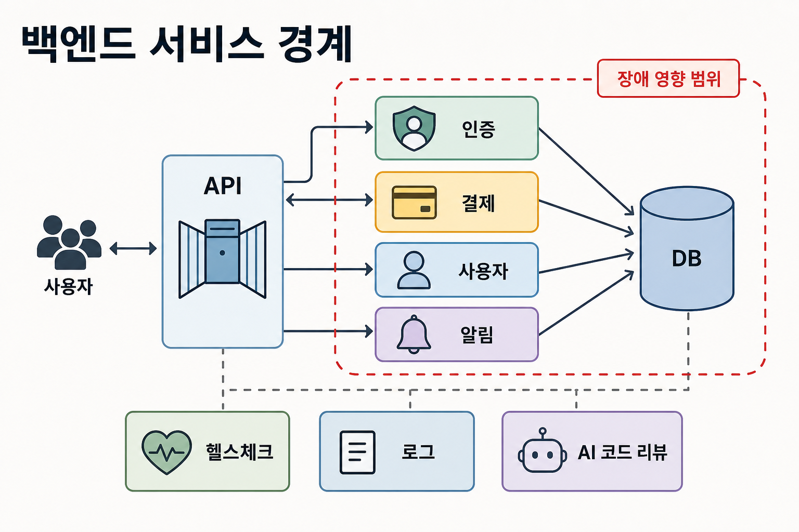
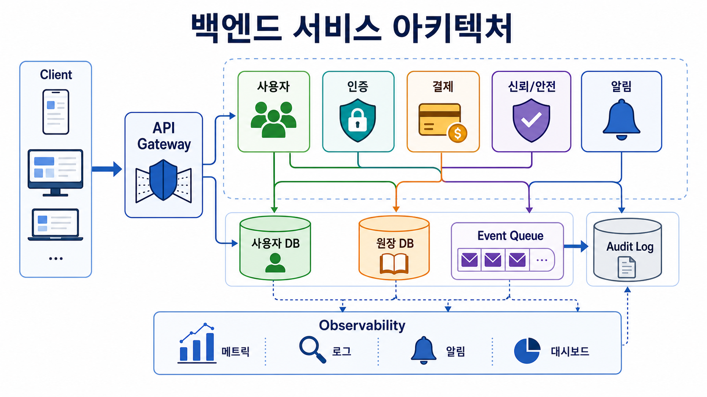
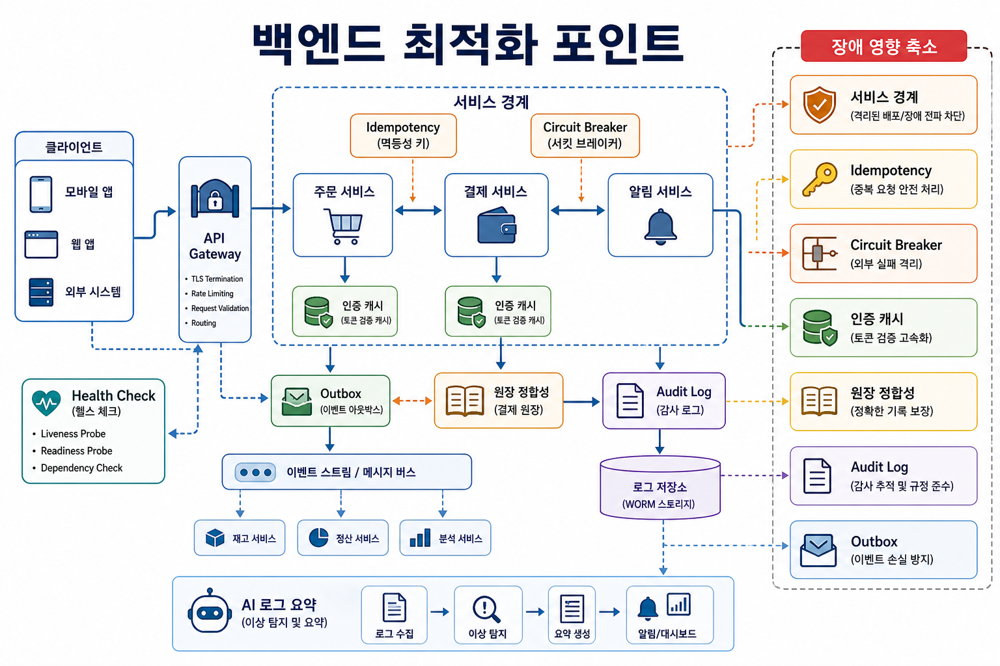

# 3교시: 당근 - 백엔드와 서비스 경계

## 수업 목표
- 백엔드를 business logic, dependency boundary, operational contract로 이해한다.
- 인증, 결제, 공통 도메인 서비스가 커질 때 생기는 위험을 설명한다.
- backend service contract를 run command, port, dependency, config, health check로 정리한다.

## 참고 자료
- Danggeun Tech Blog: https://medium.com/daangn/development/home
- 당근페이 백엔드 아키텍처가 걸어온 여정: https://medium.com/daangn/%EB%8B%B9%EA%B7%BC%ED%8E%98%EC%9D%B4-%EB%B0%B1%EC%97%94%EB%93%9C-%EC%95%84%ED%82%A4%ED%85%8D%EC%B2%98%EA%B0%80-%EA%B1%B8%EC%96%B4%EC%98%A8-%EC%97%AC%EC%A0%95-98615d5a6b06

## 50분 운영
| 시간 | 활동 | 강사 초점 | 학생 산출 |
|---|---|---|---|
| 0-5분 | 지역 서비스 hook | 신뢰와 사용자 상태가 중요함을 설명한다. | service note |
| 5-15분 | 백엔드 책임 | API, validation, auth, payment, transaction | backend map |
| 15-25분 | 당근 사례 읽기 | 빠른 기능 증가가 의존성 복잡도를 만든다. | architecture note |
| 25-35분 | 경계 실습 | 무엇을 한 서비스로 두고 무엇을 나눌지 토론한다. | boundary table |
| 35-45분 | 로컬 실행 매핑 | port, env, DB, logs, health check | service contract |
| 45-50분 | Docker 연결 | 여러 service runtime을 격리하고 반복 실행해야 한다. | Docker 필요성 |

## 핵심 설명
백엔드는 요청을 받고, 규칙을 검사하고, 데이터를 읽거나 쓰고, 다른 시스템을 호출하고, 응답을 돌려준다. 규모가 작을 때는 한 서버가 많은 일을 할 수 있다. 하지만 인증, 결제, 알림, 사기 탐지, 사용자 신뢰 같은 기능이 커지면 경계가 필요하다.

중요한 것은 "MSA가 항상 정답"이 아니라, 비즈니스 책임과 운영 위험에 맞게 경계를 잡아야 한다는 점이다.

## 시각 자료






## 서비스 특장점과 채용 동기 연결
- 당근형 지역 서비스의 강점은 사용자 신뢰, 동네 기반 맥락, 결제/인증 같은 공통 기능이 자연스럽게 이어지는 점이다.
- 학생 입장에서는 백엔드가 "CRUD API"를 넘어서 권한, 결제, 장애 영향 범위, 배포 단위까지 다룬다는 것을 볼 수 있다.
- 공통 서비스가 많아질수록 API 계약, 장애 격리, 로그 추적 역량이 중요해진다.

## AI 엔지니어링 연결
- 백엔드에서는 AI 코드 리뷰, 장애 로그 요약, API 문서 생성, 이상 거래 탐지, 고객 문의 분류 같은 방식으로 AI가 붙는다.
- AI가 내부 API를 호출하려면 권한, 입력 검증, audit log가 더 중요해진다.
- LLM 기능을 붙이는 백엔드는 prompt, model endpoint, token 비용, rate limit도 실행 조건으로 관리해야 한다.

## 백엔드 경계 질문
| 질문 | 중요한 이유 |
|---|---|
| 이 데이터는 누가 소유하는가? | 아무 서비스나 중요한 상태를 바꾸지 못하게 한다. |
| 누가 이 API를 호출할 수 있는가? | 권한과 신뢰 경계를 보호한다. |
| 실패하면 무엇이 멈추는가? | 장애 영향 범위를 파악한다. |
| 독립 배포가 가능한가? | release coupling을 줄인다. |
| 정상 상태를 어떻게 확인하는가? | 운영자가 볼 health check를 만든다. |

## Backend service contract
```text
Service name:
Purpose:
Run command:
Port:
Required environment variables:
Required database or file:
Health check URL:
Log location:
What breaks if this service is down:
```

## 체크포인트
- backend service contract를 하나 작성한다.
- 공통 서비스가 위험해지는 이유 1개를 설명한다.
- service boundary와 runtime boundary를 연결한다.

## 다음 연결
4교시는 데이터로 이동한다. 질문은 "상태는 어디에 남고, 왜 정확하고 빠르게 유지하기 어려운가?"이다.
