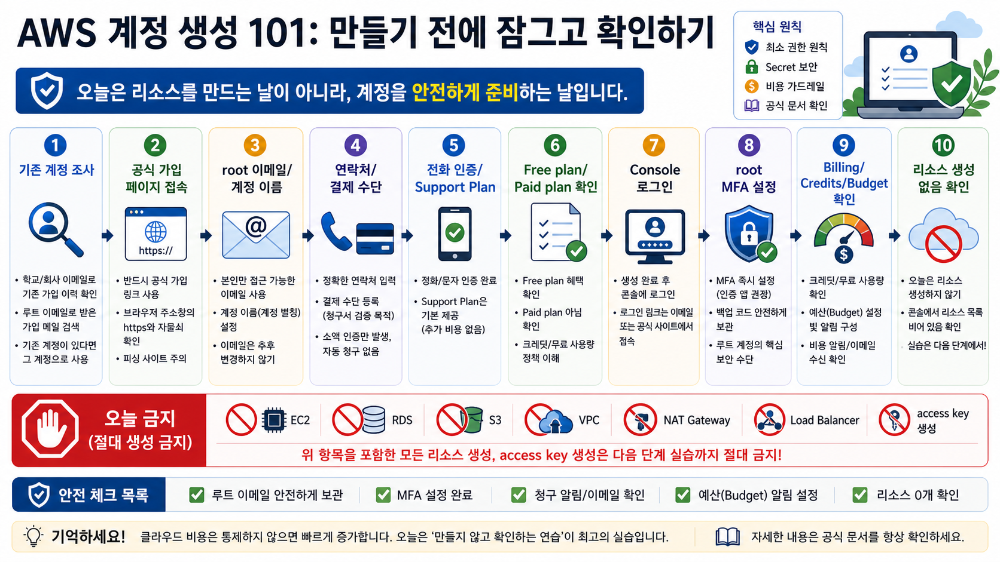
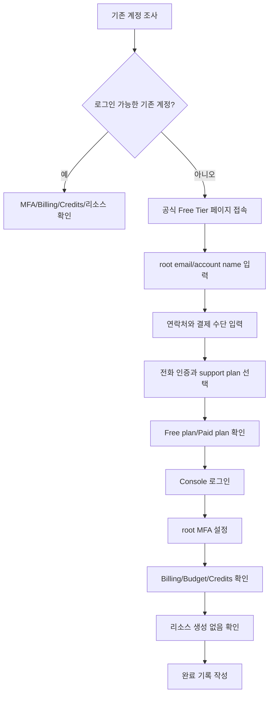

# 4교시: AWS 계정 생성 101 가이드 - 기존 계정 조사, Free/Paid plan, MFA, Billing, Budget, 리소스 생성 금지

## 수업 목표
- 학생별로 이미 AWS 계정이 있는지 먼저 조사하고, 신규 생성이 필요한지 판단한다.
- AWS 공식 가입 URL에서 계정 생성 절차를 처음부터 끝까지 따라간다.
- 가입 과정에서 입력하는 이메일, 계정 이름, 연락처, 결제 수단, 인증, support plan 선택의 의미를 이해한다.
- 가입 후 root user MFA, Free plan/Paid plan, Credits, Billing, Budget 메뉴를 확인한다.
- 오늘은 계정 안전장치만 설정하고 EC2, RDS, S3, VPC 같은 리소스는 생성하지 않는다는 기준을 지킨다.

## 핵심 메시지
오늘은 AWS 리소스를 쓰기 시작하는 날이 아니다. AWS를 안전하게 쓸 수 있도록 계정을 만들고, 잠그고, 비용 계기판을 켜는 날이다.

계정 생성은 실습 당일에 하면 결제 수단, 휴대폰 인증, 이메일 인증, MFA 앱, 보호자 또는 회사 승인에서 막힐 수 있다. 2~3주 뒤 AWS 실습을 안정적으로 진행하려면 지금 계정을 만들고 안전장치를 설정해 두는 편이 낫다. 다만 계정 생성 이후 학생이 혼자 리소스를 만들어 비용을 쓰지 않도록 오늘의 금지선을 분명히 해야 한다.

## 인포그래픽: AWS 계정 생성 101 흐름
아래 인포그래픽은 오늘 진행할 계정 생성과 안전장치 설정 순서를 보여준다. 핵심은 가입 자체보다 기존 계정 조사, MFA, Billing/Credits/Budget, 리소스 0개 확인이다.



## 오늘 절대 하지 않는 것
다음 작업은 4교시 범위가 아니다.

| 금지 작업 | 이유 |
|---|---|
| EC2 인스턴스 생성 | 시간당 비용과 보안 그룹 노출 위험이 있다 |
| RDS 데이터베이스 생성 | 인스턴스, 스토리지, 백업, Multi-AZ 비용이 생길 수 있다 |
| S3 버킷 생성 | 공개 설정과 저장 비용을 실수할 수 있다 |
| VPC, NAT Gateway, Load Balancer 생성 | 네트워크 리소스는 방치 비용이 생기기 쉽다 |
| IAM 사용자/정책 실습 | 최소 권한을 배우기 전 과한 권한을 줄 수 있다 |
| access key 생성 | GitHub 노출과 비용 사고의 대표 원인이다 |
| Marketplace 또는 유료 구독 클릭 | 별도 구독 비용이 생길 수 있다 |

콘솔에서 `Create`, `Launch`, `Start`, `Subscribe`, `Buy`, `Purchase`, `Upgrade` 버튼이 보이면 오늘 수업 범위인지 먼저 확인한다.

## 공식 참고 자료
- AWS Account Management: Create an AWS account
  https://docs.aws.amazon.com/accounts/latest/reference/manage-acct-creating.html
- AWS Free Tier
  https://aws.amazon.com/free/
- AWS Billing: Choosing an AWS Free Tier plan
  https://docs.aws.amazon.com/awsaccountbilling/latest/aboutv2/free-tier-plans.html
- AWS Billing: AWS Free Tier FAQs
  https://docs.aws.amazon.com/awsaccountbilling/latest/aboutv2/free-tier-FAQ.html
- AWS IAM User Guide: AWS account root user
  https://docs.aws.amazon.com/IAM/latest/UserGuide/id_root-user.html
- AWS IAM User Guide: Enable MFA devices for users in AWS
  https://docs.aws.amazon.com/IAM/latest/UserGuide/id_credentials_mfa_enable.html
- AWS Billing and Cost Management User Guide
  https://docs.aws.amazon.com/awsaccountbilling/latest/aboutv2/billing-what-is.html
- AWS Budgets User Guide
  https://docs.aws.amazon.com/cost-management/latest/userguide/budgets-managing-costs.html

## 준비물
| 준비물 | 확인 이유 |
|---|---|
| 개인 이메일 또는 교육용 이메일 | root user 이메일로 사용한다. 수업 기간 동안 계속 접근 가능해야 한다 |
| 이메일 인증 가능 상태 | 가입 중 verification code를 받을 수 있다 |
| 휴대폰 | SMS 또는 전화 인증이 필요할 수 있다 |
| 결제 수단 | AWS 계정 생성에는 결제 수단 등록이 요구될 수 있다 |
| MFA 앱 또는 passkey 가능 장치 | root user 보호를 위해 필요하다 |
| 보호자/회사 승인 | 미성년자, 회사 PC, 회사 카드, 교육장 정책이 있는 경우 필요하다 |
| 비밀번호 관리자 또는 안전한 기록 방식 | root 비밀번호와 복구 정보를 안전하게 보관한다 |

비밀번호, MFA QR 코드, 결제 정보, 인증 코드, 복구 코드는 화면 공유나 GitHub에 올리지 않는다.

## 1단계: 기존 AWS 계정 보유 여부 조사
계정을 새로 만들기 전에 이미 계정이 있는지 확인한다. 이미 만든 계정이 있는데 새 계정을 또 만들면 비용 확인, 크레딧, 결제 수단, 실습 계정 관리가 복잡해진다.

| 조사 질문 | 답변 |
|---|---|
| AWS 콘솔에 로그인해 본 적이 있는가? |  |
| `https://console.aws.amazon.com/`에서 로그인 가능한가? |  |
| root user 이메일을 기억하는가? |  |
| 해당 이메일 받은편지함에 AWS 메일이 있는가? |  |
| 결제 수단이 본인 또는 승인된 수단인가? |  |
| MFA가 설정되어 있는가? |  |
| Free plan인지 Paid plan인지 확인 가능한가? |  |
| Credits 잔액을 확인할 수 있는가? |  |
| 기존에 만든 리소스가 있는가? |  |

확인 방법:
1. 브라우저에서 `https://console.aws.amazon.com/`에 접속한다.
2. `Root user` 또는 `IAM user` 선택 화면이 나오면, 본인이 아는 이메일로 root user 로그인을 시도한다.
3. 비밀번호를 모르면 무리해서 여러 번 시도하지 말고 password reset 절차를 확인한다.
4. 이메일 받은편지함에서 `Amazon Web Services`, `AWS`, `Billing`, `Free Tier`, `Credits` 키워드를 검색한다.
5. 로그인에 성공하면 오늘은 리소스를 만들지 말고 계정 상태만 확인한다.

판단:
| 상태 | 오늘 할 일 |
|---|---|
| 기존 계정 있고 로그인 가능 | MFA, Billing, Credits, 리소스 유무 확인 |
| 기존 계정 있으나 로그인 불가 | 이메일/비밀번호/MFA 복구 절차 기록 |
| 기존 계정이 회사/가족/타인 결제 수단과 연결 | 사용 승인 여부 확인 전 리소스 생성 금지 |
| 기존 계정이 없거나 사용 불가 | 신규 계정 생성 절차 진행 |

## 2단계: 공식 가입 페이지 접속
신규 계정이 필요한 경우 공식 경로로 시작한다.

접속 주소:
```text
https://aws.amazon.com/free/
```

진행:
1. 브라우저에서 위 주소를 연다.
2. 페이지에서 `Create a Free Account`, `Get started for free`, `Sign up` 같은 가입 버튼을 찾는다.
3. 가입 버튼을 누르면 AWS 계정 생성 흐름으로 이동한다.
4. 화면 구성은 바뀔 수 있으므로, 버튼 이름이 다르면 공식 문서의 create account 절차와 비교한다.

주의:
- 광고나 비공식 블로그의 가입 링크보다 AWS 공식 사이트를 우선한다.
- 가입 중 유료 지원, Marketplace, 별도 SaaS 구독으로 이동하지 않는다.

## 3단계: root user 이메일과 계정 이름 입력
처음 입력하는 정보는 보통 root user email address와 account name이다.

입력 필드:
| 필드 | 입력 기준 | 주의 |
|---|---|---|
| Root user email address | 수업 기간 동안 계속 접근 가능한 이메일 | 학교/회사 이메일은 졸업/퇴사 후 접근 불가 가능성 확인 |
| AWS account name | 본인이 식별 가능한 계정 이름 | 비밀번호나 개인정보를 넣지 않는다 |
| Verification code | 이메일로 받은 코드 | 화면 공유하지 않는다 |

권장 계정 이름 예시:
```text
kdt-devops-yourname-2026
```

피해야 할 계정 이름:
```text
my-password-1234
company-card-secret
personal-id-number
```

확인:
- 이메일 인증 코드가 도착했는가?
- 스팸함이나 프로모션함으로 들어가지 않았는가?
- 같은 이메일로 이미 AWS 계정이 있다는 안내가 나오지 않는가?

## 4단계: root user 비밀번호 설정
root user는 계정의 최상위 권한이다. 일상 작업에 계속 쓰면 안 되지만, 계정 생성과 초기 보안 설정에는 필요하다.

비밀번호 기준:
- 다른 사이트에서 쓰지 않은 비밀번호
- 이름, 생일, 전화번호, 과정명만 조합한 비밀번호 금지
- 가능하면 비밀번호 관리자 사용
- 화면 공유, 메신저, GitHub, README에 기록 금지

기록 방식:
```text
root user email: 직접 기록하되 공개 문서에 쓰지 않음
root password: 비밀번호 관리자 또는 개인 보안 저장소에 저장
MFA recovery: 개인 장치 분실 시 복구 절차 확인
```

## 5단계: 연락처 정보 입력
AWS 가입 중 account type과 연락처 정보를 입력한다. 화면명은 바뀔 수 있지만 보통 다음 항목을 요구한다.

| 필드 | 입력 기준 | 주의 |
|---|---|---|
| Account type | 개인이면 Personal, 조직 계정이면 Business | 회사 계정은 관리자/회사 승인 필요 |
| Full name | 실제 이름 또는 승인된 조직 담당자명 | 결제 수단 정보와 불일치하면 인증이 막힐 수 있음 |
| Phone number | 인증 가능한 휴대폰 번호 | 국가 코드 확인 |
| Country/Region | 실제 거주 또는 결제 정보와 맞는 국가 | 세금/결제/인증에 영향 |
| Address | 결제 수단과 일치하는 주소 | 임의 주소 사용 금지 |
| City/State/Postal code | 실제 주소 기준 | 오류 시 결제 인증 실패 가능 |

주의:
- 개인정보가 포함된 화면은 캡처해서 공유하지 않는다.
- 회사 카드나 회사 주소를 쓰는 경우 회사 정책을 확인한다.
- 미성년자 또는 보호자 결제가 필요한 학생은 독단적으로 진행하지 않는다.

## 6단계: 결제 수단 입력
AWS 계정 생성에는 결제 수단 등록이 필요할 수 있다. Free plan 또는 크레딧이 있어도 결제 수단은 계정 확인과 초과 사용량 청구를 위해 요구될 수 있다.

확인할 것:
| 항목 | 확인 질문 |
|---|---|
| 카드 소유자 | 본인 또는 사용 승인을 받은 카드인가? |
| 해외 결제 | 해외 결제 또는 온라인 결제가 가능한가? |
| 소액 인증 | 카드 인증을 위한 임시 승인/확인이 있을 수 있는가? |
| 알림 | 카드사 사용 알림을 받을 수 있는가? |
| 한도 | 실습 사고를 막기 위한 결제 알림이나 한도를 설정할 수 있는가? |

수업 기준:
- 결제 수단이 없거나 승인이 불명확하면 가입을 멈추고 상태를 기록한다.
- 다른 사람의 카드 정보를 빌려 입력하지 않는다.
- 결제 정보가 보이는 화면은 공유하지 않는다.

## 7단계: 전화번호 인증
가입 중 휴대폰 인증을 진행할 수 있다. SMS 또는 음성 전화 방식이 제공될 수 있다.

확인할 것:
- 국가 코드가 맞는가?
- 전화번호 앞자리 0 처리 방식이 맞는가?
- SMS가 오지 않으면 음성 인증 또는 잠시 후 재시도 가능한가?
- 여러 번 실패하면 무리해서 반복하지 않고 오류 메시지를 기록했는가?

기록 예시:
```text
전화 인증 방식: SMS / 음성
인증 완료 여부:
막힌 오류 메시지:
다음 조치:
```

## 8단계: Support plan 선택
가입 중 support plan을 선택하는 단계가 나올 수 있다. 실습용 개인 계정은 유료 지원 플랜을 선택하지 않는다.

선택 기준:
| 선택지 | 수업 기준 |
|---|---|
| Basic support 또는 무료 지원 | 실습용 계정의 기본 선택 |
| Developer / Business / Enterprise support | 유료일 수 있으므로 선택하지 않음 |

주의:
- Support plan은 AWS 리소스 비용과 별개로 지원 비용이 발생할 수 있다.
- 버튼 이름이나 화면 구성은 바뀔 수 있으므로 가격이 표시되면 멈추고 확인한다.

## 9단계: Free plan / Paid plan 확인
2025년 7월 이후 신규 고객은 Free plan과 Paid plan 흐름을 확인해야 한다. 화면에서 plan 선택 또는 전환 안내가 나오면 다음 기준으로 기록한다.

| 항목 | 확인 |
|---|---|
| 현재 plan | Free plan / Paid plan / 확인 필요 |
| 크레딧 시작 금액 | 100 USD / 기타 / 확인 필요 |
| 추가 크레딧 조건 | 활동 완료 시 최대 100 USD 추가 / 확인 필요 |
| Free plan 종료 조건 | 6개월 또는 크레딧 소진 / 확인 필요 |
| Paid plan 전환 여부 | 전환함 / 전환하지 않음 / 이미 전환됨 |

중요:
- Paid plan으로 전환했다고 해서 무조건 문제가 생긴 것은 아니다.
- 다만 Paid plan에서는 크레딧 초과분 또는 크레딧 적용 제외 사용량이 청구될 수 있으므로 Budget과 알림을 반드시 확인한다.
- 이미 Paid plan인 학생은 오늘 리소스 유무와 비용 알림 상태를 더 꼼꼼히 확인한다.

## 10단계: AWS Console 로그인 확인
가입이 끝나면 콘솔에 로그인한다.

접속 주소:
```text
https://console.aws.amazon.com/
```

확인할 것:
- root user 이메일로 로그인 가능한가?
- MFA 설정 전이라면 보안 설정을 바로 진행할 수 있는가?
- 콘솔 홈 화면에 들어왔는가?
- 오른쪽 위 계정 메뉴에서 Account ID 또는 계정 별칭을 확인할 수 있는가?

주의:
- 콘솔에 들어왔다고 해서 리소스를 만들지 않는다.
- 검색창에 EC2, RDS, S3를 입력해 구경하다가 Create 버튼을 누르지 않는다.

## 11단계: root user MFA 설정
root user에 MFA를 설정한다. MFA 방식은 화면과 계정 상태에 따라 passkey, authenticator app, hardware key 등으로 보일 수 있다.

일반 흐름:
1. 콘솔 오른쪽 위 계정 메뉴를 연다.
2. `Security credentials` 또는 보안 자격 증명 메뉴로 이동한다.
3. MFA 섹션을 찾는다.
4. `Assign MFA device` 또는 유사 버튼을 누른다.
5. 가능한 MFA 방식을 선택한다.
6. Authenticator app 방식이면 QR 코드를 앱으로 스캔한다.
7. 앱에 표시되는 연속된 MFA code를 입력한다.
8. MFA 등록 완료 메시지를 확인한다.

확인할 것:
| 항목 | 확인 |
|---|---|
| root user MFA 등록 완료 |  |
| MFA 장치 이름 |  |
| 복구 방법 확인 |  |
| QR 코드/복구 코드 노출 없음 |  |

주의:
- MFA QR 코드를 사진으로 공유하지 않는다.
- MFA 앱을 삭제하거나 휴대폰을 바꾸면 로그인 복구가 어려울 수 있다.
- 가능하면 복구 절차를 공식 문서에서 확인한다.

## 12단계: Billing and Cost Management 접근 확인
비용을 볼 수 없는 계정은 안전하게 실습할 수 없다. Billing 화면 접근 가능 여부를 확인한다.

접속 방법:
1. 콘솔 상단 검색창에 `Billing` 또는 `Billing and Cost Management`를 입력한다.
2. Billing 대시보드로 이동한다.
3. 현재 비용, Credits, Free Tier, Budgets 메뉴 위치를 확인한다.

확인할 것:
| 항목 | 상태 |
|---|---|
| Billing dashboard 접근 가능 |  |
| Credits 메뉴 또는 크레딧 잔액 위치 확인 |  |
| Free Tier 사용량 또는 Free plan 상태 확인 |  |
| Cost Explorer 메뉴 위치 확인 |  |
| Budgets 메뉴 위치 확인 |  |

접근이 안 되면:
- root user로 로그인했는지 확인한다.
- 조직 계정이면 관리자 권한이 제한되었는지 확인한다.
- 오류 메시지를 기록한다.

## 13단계: Budget 또는 비용 알림 위치 확인
오늘 반드시 복잡한 Budget을 완성하지 못해도, 어디서 설정하는지는 확인한다. 가능하면 작은 금액 기준의 Budget을 만든다.

기본 흐름:
1. Billing and Cost Management에서 `Budgets`를 연다.
2. `Create budget` 또는 유사 버튼을 확인한다.
3. Cost budget을 선택한다.
4. 예산 기간은 monthly 기준으로 확인한다.
5. 알림 받을 이메일을 확인한다.
6. 설정 완료 전 비용 발생 여부와 입력값을 다시 본다.

교육용 예시:
```text
Budget name: kdt-devops-practice-budget
Period: Monthly
Budget amount: 수업 기준에 맞게 작은 금액
Alert threshold: 50%, 80%, 100%
Email recipients: 본인 이메일
```

주의:
- Budget은 비용을 막아 주는 차단기가 아니라 알림 장치다.
- 알림을 설정해도 리소스가 자동으로 삭제되지는 않는다.
- 카드사 알림, AWS Budget, 수업 체크리스트를 함께 사용한다.

## 14단계: Region 확인
콘솔 오른쪽 위에서 현재 Region을 확인한다. 오늘은 리소스를 만들지 않지만, 이후 실습에서 리전이 흩어지면 삭제 누락이 생길 수 있다.

기록:
```text
현재 표시 Region:
수업 기본 Region:
다른 Region에 리소스가 있는지 확인 필요:
```

수업 기준:
- 이후 수업에서 사용할 Region은 하나로 고정한다.
- 리소스를 만들 때마다 Region을 기록한다.
- 비용 점검 시 여러 Region을 확인해야 한다.

## 15단계: 기존 리소스 유무 확인
이미 계정이 있던 학생은 기존 리소스가 있는지 확인해야 한다. 신규 생성 학생도 실수로 만든 리소스가 없는지 확인한다.

오늘은 모든 서비스를 깊게 보지 않는다. 다음 항목만 빠르게 확인한다.

| 확인 대상 | 확인 질문 |
|---|---|
| EC2 | running instance가 있는가? |
| EBS | unattached volume이나 snapshot이 있는가? |
| Elastic IP | 연결되지 않은 고정 IP가 있는가? |
| RDS | 실행 중인 DB instance가 있는가? |
| Load Balancer | ALB/NLB가 있는가? |
| NAT Gateway | 생성된 NAT Gateway가 있는가? |
| S3 | 공개 bucket이나 불필요한 bucket이 있는가? |
| CloudWatch Logs | 과한 로그 그룹이나 긴 보관 기간이 있는가? |
| IAM access key | root 또는 사용자 access key가 있는가? |

리소스가 발견되면 삭제부터 하지 말고 기록한다. 개인이 만든 것인지, 회사/팀에서 쓰는 것인지, 삭제해도 되는지 확인해야 한다.

## 완료 기록 양식
```text
이름:
기존 AWS 계정 여부:
신규 생성 여부:
root user 이메일 접근 가능 여부:
Free plan/Paid plan 상태:
Credits 잔액 확인 여부:
MFA 설정 상태:
Billing 접근 상태:
Budget/알림 설정 또는 메뉴 확인 여부:
현재 Region:
기존 리소스 발견 여부:
오늘 생성한 리소스:
막힌 지점:
다음 조치:
```

오늘 생성한 리소스는 원칙적으로 `없음`이어야 한다.

## 흔한 오류와 대응
| 증상 | 가능한 원인 | 대응 |
|---|---|---|
| 같은 이메일로 이미 계정이 있다고 나옴 | 과거 가입 이력 | 기존 계정 복구 또는 다른 승인된 이메일 사용 |
| 이메일 인증 코드가 오지 않음 | 스팸함, 메일 차단, 오타 | 주소 재확인, 스팸함 확인, 재전송 |
| 결제 수단 오류 | 해외 결제 차단, 한도, 주소 불일치 | 카드사 알림 확인, 승인된 결제 수단 사용 |
| 휴대폰 인증 실패 | 국가 코드, 번호 형식, 통신 문제 | 번호 형식 확인, 음성 인증 또는 잠시 후 재시도 |
| Support plan에서 유료 옵션이 보임 | 유료 지원 플랜 선택 화면 | Basic/free 옵션 외 선택 금지 |
| MFA 등록 실패 | 시간 동기화, QR 인식 실패 | 앱 시간 동기화, 수동 코드 입력 |
| Billing 접근 불가 | 로그인 방식 또는 권한 문제 | root user 여부 확인, 오류 기록 |
| 이미 Paid plan으로 전환됨 | 이전 가입 또는 plan 전환 | Credits, Budget, 기존 리소스 유무 확인 |

## Mermaid: AWS 계정 생성 101 흐름


## DevOps 원칙 연결
- 비용 절감: 계정 생성 직후 Billing, Credits, Budget을 확인하면 비용 사고를 초기에 발견할 수 있다.
- 개발/배포 효율성: 계정 생성과 인증 문제를 미리 해결하면 실제 AWS 실습 시간을 보존할 수 있다.
- 관리 효율성: 기존 계정 여부, plan 상태, 리소스 유무를 기록하면 학생별 위험 상태를 빠르게 분류할 수 있다.

## 다음 수업 연결
다음 교시에서는 클라우드 비용 구조를 더 깊게 계산한다. 오늘 만든 계정과 Billing 화면은 5교시의 비용 계산, 5주차 AWS 리소스 실습, 6주차 Terraform 비용 검토의 기준점이 된다.
