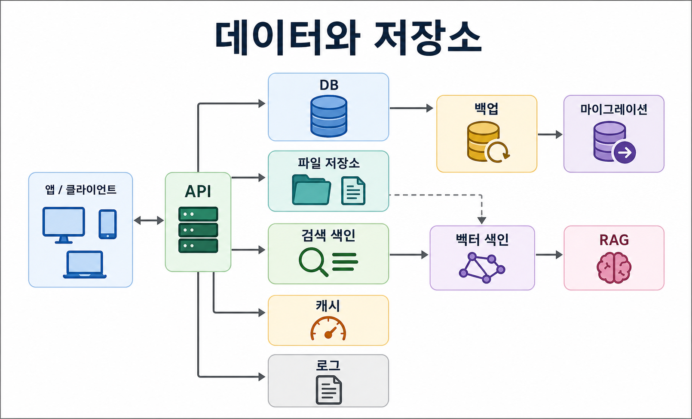
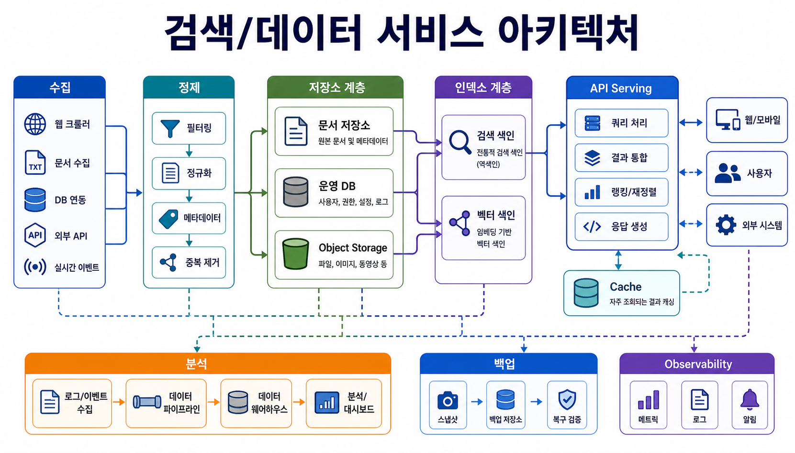
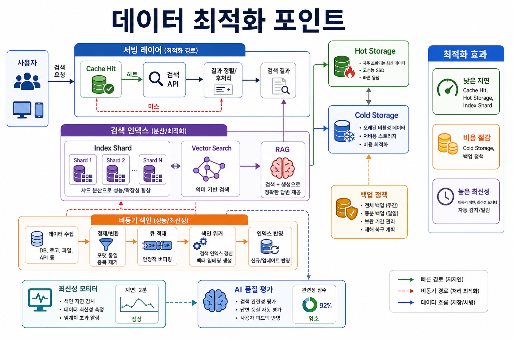

# 4교시: 네이버 - 데이터베이스, 저장소, 검색, 서빙

## 수업 목표
- persistent data를 application code와 분리된 책임으로 이해한다.
- storage, index, serving, freshness, latency를 구분한다.
- 데이터 증가가 비용, 성능, 운영 유지보수로 이어지는 이유를 설명한다.
- Docker DB 실습 전에 version, port, data path, lifecycle을 말할 수 있게 한다.

## 참고 자료
- NAVER D2: https://d2.naver.com/
- HDFS 이종 저장장치 도입과 비용 효율화: https://d2.naver.com/helloworld/7702933
- Kudu 기반 빅데이터 분석 시스템: https://d2.naver.com/helloworld/9099561
- 분산 고속 저장소 nStore: https://d2.naver.com/helloworld/1042

## 50분 운영
| 시간 | 활동 | 강사 초점 | 학생 산출 |
|---|---|---|---|
| 0-5분 | 검색 hook | 검색은 즉시 보이지만 뒤에는 저장과 색인이 있다. | search note |
| 5-15분 | 데이터 책임 | store, index, query, backup, freshness | data map |
| 15-25분 | NAVER D2 사례 | 규모와 비용에 따라 저장 시스템이 달라진다. | source note |
| 25-35분 | challenge 토론 | correctness, latency, storage cost, migration risk | challenge table |
| 35-45분 | 로컬 DB 매핑 | version, port, data directory, seed data, cleanup | database contract |
| 45-50분 | Docker 연결 | DB 설치 고통은 Docker 동기의 핵심이다. | Docker 필요성 |

## 핵심 설명
데이터는 process가 꺼져도 남아야 하는 부분이다. frontend는 다시 build할 수 있고 backend process는 재시작할 수 있지만, 사용자 데이터와 검색 문서, 주문 기록, 로그는 사라지면 안 된다. 그래서 데이터 시스템은 저장, 색인, 백업, migration, freshness, latency를 함께 고민한다.

## 시각 자료






## 서비스 특장점과 채용 동기 연결
- 네이버형 검색/콘텐츠 서비스의 강점은 많은 문서와 사용자의 질문을 빠르게 연결하는 것이다.
- 학생 입장에서는 데이터베이스가 단순 저장소가 아니라 검색 색인, 파일 저장소, 로그, 백업, 분석 시스템과 연결된다는 점을 볼 수 있다.
- 데이터가 커질수록 비용, 최신성, 정합성, 장애 복구가 모두 어려워진다.

## AI 엔지니어링 연결
- 최근 AI 서비스는 RAG를 위해 문서 저장소, 임베딩, 벡터 색인, 검색 품질 평가가 필요하다.
- "AI에게 문서를 넣는다"는 말은 실제로는 수집, 정제, chunking, embedding, vector index, retrieval, monitoring의 파이프라인이다.
- Docker 관점에서는 vector DB, embedding worker, API 서버를 같은 조건으로 실행하고 초기화할 수 있어야 한다.

## 데이터 책임 지도
| 책임 | 의미 | 로컬 버전 |
|---|---|---|
| Persistence | 재시작 후에도 남는 데이터 | file 또는 database volume |
| Schema | 데이터 구조 | table 또는 JSON shape |
| Index | 빠른 조회 경로 | DB index 또는 search index |
| Backup | 손실 후 복구 | copied file 또는 dump |
| Migration | 구조 변경 절차 | SQL migration 또는 script |
| Freshness | 얼마나 최신 데이터를 보여주는가 | reload 또는 cache invalidation |

## Database contract
```text
Database type:
Version:
Port:
Data path:
Seed data:
Reset command:
Backup method:
What must not be deleted:
```

## 강사용 문장
"DB 설치는 한 번이면 끝나는 것처럼 보입니다. 하지만 두 번째 프로젝트가 다른 버전이나 다른 포트를 요구하면 바로 문제가 됩니다. DB에는 생명주기가 있고, 그래서 Docker volume, port, initialization script가 중요해집니다."

## 체크포인트
- 데이터가 코드와 다른 이유를 설명한다.
- DB 실행 조건으로 port, version, data path를 말한다.
- 데이터 비용 또는 신뢰성 challenge 1개를 설명한다.

## 다음 연결
5교시는 저장된 데이터가 아니라 이동하는 이벤트로 넘어간다.
