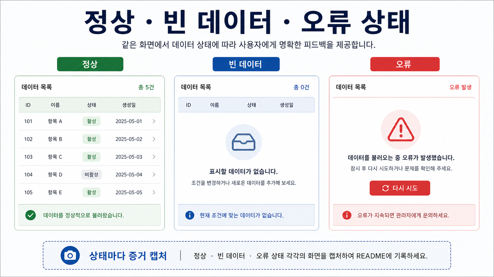
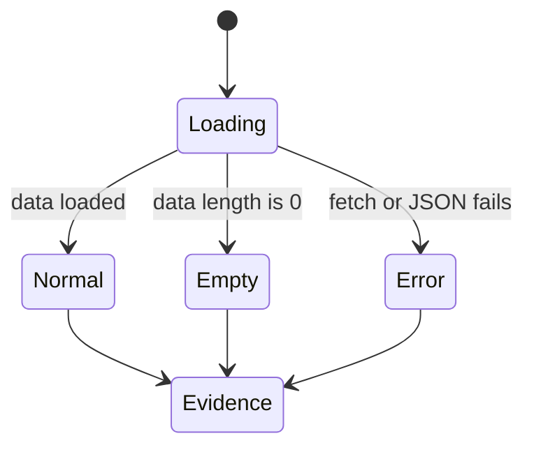

# 4교시: 미니 앱 구현 2 - 사용자 흐름, data rendering, error state

## 수업 목표
- 하나의 사용자 흐름을 완성한다.
- 정상 상태, 빈 상태, 오류 상태를 구분해 표시한다.
- 구현 범위를 늘리지 않고 사용자가 확인할 수 있는 결과를 만든다.

## 50분 운영
| 시간 | 활동 | 학습 초점 | 학생 산출 |
|---|---|---|---|
| 0-5분 | 구현 1 결과 확인 | data rendering이 되는 학생부터 확장한다. | 현재 화면 |
| 5-15분 | 사용자 흐름 선택 | 버튼/필터/상태표시 중 하나로 제한한다. | flow note |
| 15-30분 | 흐름 구현 | 이벤트와 DOM update를 연결한다. | 동작 UI |
| 30-40분 | empty/error state | 데이터 없음과 fetch 실패 메시지를 만든다. | 상태 메시지 |
| 40-50분 | 짝 테스트 | 의도적으로 경로를 바꾸어 오류를 관찰한다. | 테스트 메모 |

## 0-5분 구현 1 결과 확인

- 진행: 구현 1 결과 확인

- 초점: data rendering이 되는 학생부터 확장한다.

- 학생 산출: 현재 화면

- 완료 조건: 아래 자료를 사용해 이 시간 블록의 산출물을 만든다.


### 핵심 설명
현업 서비스는 정상 화면만으로 운영되지 않는다. 데이터가 비어 있거나 파일 경로가 틀렸을 때 사용자가 무엇을 보는지까지 앱의 일부다. Week1에서는 복잡한 예외 처리가 아니라 관찰 가능한 상태 메시지를 만든다.


### Visual 1: 구조 다이어그램


이 이미지는 성공 화면 하나만 확인하는 습관을 피하게 한다. 정상, 빈 데이터, 오류 상태가 각각 어떤 evidence를 남겨야 하는지 비교하면서 UI 상태 설계의 최소 기준을 잡는다.



## 5-15분 사용자 흐름 선택

- 진행: 사용자 흐름 선택

- 초점: 버튼/필터/상태표시 중 하나로 제한한다.

- 학생 산출: flow note

- 완료 조건: 아래 자료를 사용해 이 시간 블록의 산출물을 만든다.


### Visual 2: 상태별 화면 증거
| 상태 | 사용자가 보는 것 | 캡처할 증거 |
|---|---|---|
| 정상 | item 목록 또는 카드 | 데이터가 화면에 보이는 browser 화면 |
| 빈 상태 | "No items found" 같은 안내 | 빈 결과 메시지 |
| 오류 | "Unable to load data" 같은 안내 | 변경한 경로, console, 화면 메시지 |

## 15-30분 흐름 구현

- 진행: 흐름 구현

- 초점: 이벤트와 DOM update를 연결한다.

- 학생 산출: 동작 UI

- 완료 조건: 아래 자료를 사용해 이 시간 블록의 산출물을 만든다.


### Visual 3: 실패 경로 판단 카드
| 실패 증상 | 먼저 볼 곳 | 기록할 evidence |
|---|---|---|
| 목록이 비어 있음 | JSON 내용 | data length |
| 오류 메시지 표시 | fetch 경로 | console message |
| 화면이 멈춤 | JS syntax | browser console |


### 활동 절차
1. 사용자가 누르거나 선택할 컨트롤을 하나만 만든다.
2. 컨트롤 동작이 `data.json`의 특정 값과 연결되게 한다.
3. 필터 결과가 0개일 때 빈 상태 메시지를 표시한다.
4. `try/catch`로 fetch 실패 메시지를 표시한다.
5. 정상, 빈 상태, 오류 상태를 각각 evidence로 기록한다.


### 오류 상태 예시
```javascript
async function loadItems() {
  const app = document.querySelector("#app");
  try {
    const response = await fetch("data.json");
    if (!response.ok) throw new Error(`HTTP ${response.status}`);
    const items = await response.json();
    if (items.length === 0) {
      app.textContent = "No items found.";
      return;
    }
    renderItems(items);
  } catch (error) {
    app.textContent = `Unable to load data: ${error.message}`;
  }
}
```

## 30-40분 empty/error state

- 진행: empty/error state

- 초점: 데이터 없음과 fetch 실패 메시지를 만든다.

- 학생 산출: 상태 메시지

- 완료 조건: 아래 자료를 사용해 이 시간 블록의 산출물을 만든다.


### 흔한 오해
| 오해 | 교정 |
|---|---|
| 산출물이 있으면 evidence는 나중에 채워도 된다. | evidence는 산출물의 일부다. command, path, status, log, note가 함께 있어야 평가 가능하다. |
| Week1에서 모든 기술을 깊게 익혀야 한다. | Week1은 컴퓨팅 spine과 운영 증거를 만드는 주차이며, 깊은 hands-on은 각 기술 주차에서 진행한다. |
| 막힌 내용을 숨기는 것이 좋다. | blocker를 증상, 시도한 일, 다음 조치로 기록하는 것이 현업식 진행 관리다. |

## 40-50분 짝 테스트

- 진행: 짝 테스트

- 초점: 의도적으로 경로를 바꾸어 오류를 관찰한다.

- 학생 산출: 테스트 메모

- 완료 조건: 아래 자료를 사용해 이 시간 블록의 산출물을 만든다.


### 산출물
- 사용자 흐름 1개
- 정상/빈/오류 상태 evidence
- 테스트 중 발견한 문제와 수정 기록


### 평가 기준
| 기준 | 충족 |
|---|---|
| 사용자 흐름이 1개로 유지된다. | |
| 정상 상태가 동작한다. | |
| 빈 상태가 사용자에게 보인다. | |
| fetch 실패가 화면 메시지로 드러난다. | |


### 현업 DevOps insight
운영 가능한 UI는 실패를 숨기지 않는다. 작은 앱에서도 error state를 명시하면 장애 보고, 재현, handoff가 쉬워진다. 이는 Week1의 RCA와 직접 연결된다.


### 학술 근거
- Formative assessment: 짝 테스트로 즉시 피드백을 받고 수정한다.
- Error-based learning: 의도적인 실패 관찰로 원인과 증상을 구분한다.
- ABET-style design constraint: 제한된 범위 안에서 사용자와 운영 조건을 동시에 고려한다.


### 다음 주차 연결
Docker에서 파일 경로나 서버 설정이 틀리면 비슷한 오류가 난다. 오늘의 error state는 Week2 컨테이너 디버깅의 기초가 된다.


### 다음 연결
다음 교시는 실행 증거를 README에 남긴다.


### 공식/학술 근거 링크
- OWASP Secrets Management Cheat Sheet, https://cheatsheetseries.owasp.org/cheatsheets/Secrets_Management_Cheat_Sheet.html - secret, credential, key를 코드와 공개 문서에서 분리하는 기준이다.
- GitHub Secret Scanning, https://docs.github.com/en/code-security/secret-scanning/enabling-secret-scanning-features - repository에 secret이 노출될 때의 탐지와 보호 기준이다.
- NIST AI Risk Management Framework, https://www.nist.gov/itl/ai-risk-management-framework - AI 도움을 받을 때도 정보 노출과 권한 위험을 검토해야 하는 기준이다.
