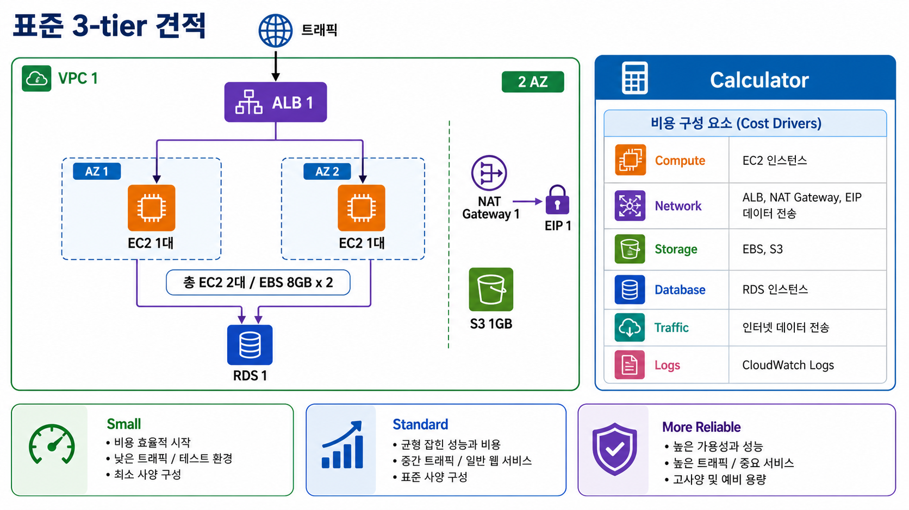
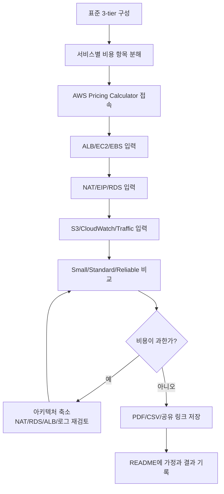

# 5교시: AWS Pricing Calculator 실습 - 표준 3-tier 아키텍처 월 비용 계산

## 수업 목표
- 표준 3-tier 아키텍처를 AWS 서비스와 비용 항목으로 분해한다.
- AWS Pricing Calculator에서 ALB, EC2, EBS, NAT Gateway, Elastic IP, RDS, S3, CloudWatch Logs, data transfer를 견적에 넣는다.
- 2 AZ, 2 EC2, 1 RDS, 1 NAT Gateway 같은 운영형 기본 구성이 왜 무료 실습 구성보다 비싼지 설명한다.
- 트래픽, 데이터 전송, 로그, 백업, 스토리지 가정이 월 비용에 어떤 영향을 주는지 확인한다.
- Small, Standard, More Reliable 시나리오를 비교하고 비싸면 아키텍처를 줄이는 판단을 한다.

## 시작 상황
3강에서는 AWS Free Tier/Credits와 비용 사고를 배웠고, 4강에서는 계정 생성과 Billing/Budget 확인을 했다. 5강에서는 실제 AWS 리소스를 만들지 않는다. 대신 AWS Pricing Calculator로 “표준 3-tier 아키텍처를 AWS에 올리면 어떤 비용 항목이 생길까?”를 계산한다.

이번 시간에는 개인 프로젝트마다 다른 서비스 후보를 바로 계산하지 않는다. 먼저 공통 예시를 사용한다. 표준 예시는 ALB 1개, VPC 1개, 2 AZ, EC2 2대, NAT Gateway 1개, Elastic IP 1개, RDS 1개, EBS 8GB 2개, S3 1GB, CloudWatch Logs, 낮은 트래픽을 포함한다. 이 정도면 초급자가 “웹 서비스 하나를 운영형 구조로 올리면 서버 비용만 보는 게 아니구나”를 체감할 수 있다.

오늘의 핵심은 정확한 청구 금액을 맞히는 것이 아니다. AWS Pricing Calculator는 견적 도구이며 실제 청구서가 아니다. 실제 비용은 리전, 사용량, Free Tier/Credits, 할인, 데이터 전송, 로그, 백업, 서비스 설정, 환율, 날짜에 따라 달라진다. 그래도 계산기를 써 보면 어떤 기능이 비용을 키우는지, 어떤 서비스를 빼면 비용이 줄어드는지, 왜 작은 아키텍처부터 시작해야 하는지 빠르게 볼 수 있다.

## 공식 참고 자료
- AWS Pricing Calculator
  https://calculator.aws/
- AWS Pricing Calculator User Guide
  https://docs.aws.amazon.com/pricing-calculator/latest/userguide/what-is-pricing-calculator.html
- AWS Pricing Calculator: Generate estimates
  https://docs.aws.amazon.com/pricing-calculator/latest/userguide/generate-estimates.html
- AWS Pricing Calculator: Export estimates
  https://docs.aws.amazon.com/pricing-calculator/latest/userguide/export-estimates.html
- AWS Pricing Calculator: Sharing your estimate
  https://docs.aws.amazon.com/pricing-calculator/latest/userguide/sharing-estimates.html
- AWS Elastic Load Balancing pricing
  https://aws.amazon.com/elasticloadbalancing/pricing/
- Amazon EC2 pricing
  https://aws.amazon.com/ec2/pricing/
- Amazon RDS pricing
  https://aws.amazon.com/rds/pricing/
- Amazon VPC pricing
  https://aws.amazon.com/vpc/pricing/
- Amazon EBS pricing
  https://aws.amazon.com/ebs/pricing/
- Amazon S3 pricing
  https://aws.amazon.com/s3/pricing/
- Amazon CloudWatch pricing
  https://aws.amazon.com/cloudwatch/pricing/

## 인포그래픽: AWS Pricing Calculator 실습 흐름
아래 인포그래픽은 표준 3-tier 아키텍처를 AWS Pricing Calculator 입력 항목으로 바꾸는 흐름을 보여준다. 핵심은 `서버 2대`만 계산하는 것이 아니라 ALB, NAT Gateway, EIP, EBS, RDS, S3, 트래픽, 로그까지 비용 항목으로 분해하는 것이다.



## 핵심 개념
| 용어 | 한 줄 뜻 | 오늘의 사용 방식 |
|---|---|---|
| Estimate | 예상 비용 견적 | 표준 3-tier 아키텍처의 월 비용을 계산한다 |
| Usage assumption | 사용량 가정 | 시간, 요청 수, GB, 전송량, 로그량을 적는다 |
| Scenario | 비교용 설계안 | Small, Standard, More Reliable로 나누어 비교한다 |
| Monthly cost | 월 예상 비용 | 730시간 또는 한 달 기준으로 본다 |
| Data transfer out | AWS 밖으로 나가는 데이터 전송량 | 트래픽 비용의 핵심 가정이다 |
| LCU | Load Balancer Capacity Unit | ALB 사용량 비용을 설명할 때 등장한다 |
| Storage | 저장 공간 | EBS, RDS storage, S3, log storage를 나누어 본다 |
| Cost driver | 비용을 크게 만드는 항목 | NAT, RDS, ALB, 데이터 전송, 로그, 백업을 찾는다 |

## 오늘 사용할 환율 기준
오늘의 계산 연습은 고정 환율을 사용한다.

```text
1 USD = 1,500 KRW
```

예시:
```text
10 USD = 15,000 KRW
50 USD = 75,000 KRW
100 USD = 150,000 KRW
200 USD = 300,000 KRW
```

실제 환율은 변동된다. 수업에서는 학생들이 계산을 비교하기 쉽도록 1,500원을 고정 기준으로 사용한다.

## 표준 예시: Standard 3-Tier Estimate
오늘 계산할 표준 예시는 다음과 같다.

| 계층 | 구성 | 수량/가정 |
|---|---|---|
| Network | VPC | 1개 |
| Network | Availability Zone | 2개 |
| Network | Public subnet | 2개 |
| Network | Private subnet | 2개 |
| Entry | Application Load Balancer | 1개 |
| Compute | EC2 | 2대, AZ별 1대 |
| Storage | EBS root volume | 8GB x 2 |
| Network egress | NAT Gateway | 1개 |
| Network egress | Elastic IP | 1개, NAT Gateway용 |
| Database | RDS | 1개, 단일 인스턴스, Multi-AZ 아님 |
| Object storage | S3 | 1GB |
| Observability | CloudWatch Logs | 1~5GB 수준 |
| Traffic | 외부 사용자 트래픽 | 낮은 트래픽 가정 |

이 구성은 “가장 싼 구성”이 아니다. 운영형 3-tier 구조가 어떤 비용 항목을 만드는지 보기 위한 표준 예시다. 특히 NAT Gateway, ALB, RDS는 초급자가 놓치기 쉬운 비용 항목이다.

## 아키텍처 비용 항목 읽기
| 구성요소 | Calculator에서 볼 서비스 | 비용 항목 | 주의 |
|---|---|---|---|
| VPC | VPC 자체 또는 관련 서비스 | VPC 자체보다 NAT, public IPv4, endpoint, traffic 비용이 중요 | VPC는 무료처럼 보여도 붙는 리소스가 비용을 만든다 |
| ALB | Elastic Load Balancing | load balancer hour, LCU, data processed | 트래픽이 적어도 기본 시간 비용이 생길 수 있다 |
| EC2 2대 | Amazon EC2 | instance hour, OS, purchase option | 2대면 compute 비용도 2배 기준으로 본다 |
| EBS 8GB x 2 | Amazon EBS 또는 EC2 storage | volume GB-month, snapshot | EC2 삭제 후 volume/snapshot이 남을 수 있다 |
| NAT Gateway 1개 | Amazon VPC NAT Gateway | gateway hour, data processing GB | 초급자가 가장 자주 놀라는 비용 항목이다 |
| Elastic IP 1개 | Amazon VPC public IPv4 | public IPv4 또는 EIP 관련 비용 | 연결 상태와 정책에 따라 비용 확인이 필요하다 |
| RDS 1개 | Amazon RDS | DB instance hour, storage, backup, I/O | Multi-AZ를 끄고 시작해도 기본 실행 비용이 있다 |
| S3 1GB | Amazon S3 | storage, request, data transfer | 저장량보다 요청/전송이 커질 수 있다 |
| CloudWatch Logs | Amazon CloudWatch | log ingestion, storage, retention | 로그가 많거나 오래 보관하면 비용이 커진다 |
| Data transfer | EC2, ALB, NAT, S3 등 | internet egress, cross-AZ 가능성 | IN은 무료인 경우가 많지만 OUT은 비용 확인 필요 |

## 트래픽 가정 세우기
트래픽은 비용 계산에서 자주 빠진다. 서버와 DB만 계산하면 실제 비용보다 낮게 나온다.

오늘은 낮은 트래픽 예시를 사용한다.

| 항목 | 낮은 트래픽 가정 | 왜 필요한가 |
|---|---:|---|
| 월 방문자 | 1,000명 | 요청 수와 데이터 전송량의 기준 |
| 방문자당 페이지뷰 | 5 page views | ALB 요청과 정적 파일 요청 추정 |
| 페이지당 HTML/CSS/JS | 500KB | 앱 화면 전송량 |
| 페이지당 이미지/정적 파일 | 1MB | S3/CloudFront/ALB data transfer 가정 |
| API 응답 | 100KB x 5회 | 앱 서버와 ALB 처리량 가정 |
| 월 업로드 파일 | 1GB 이하 | S3 storage와 request 가정 |
| 월 로그 생성 | 1~5GB | CloudWatch Logs 가정 |
| NAT 처리량 | 1~5GB | private EC2가 외부 업데이트/API 호출 시 가정 |

단순 계산:
```text
월 페이지뷰 = 1,000명 x 5 = 5,000 page views
정적 파일 전송량 = 5,000 x 1MB = 약 5GB
HTML/CSS/JS 전송량 = 5,000 x 0.5MB = 약 2.5GB
API 응답 전송량 = 1,000명 x 5회 x 0.1MB = 약 0.5GB
대략적인 외부 전송량 후보 = 8GB + 여유분
```

Calculator에는 서비스별 입력 항목이 다르므로, 이 계산을 그대로 넣기보다 `data transfer out`, `processed bytes`, `requests`, `storage` 항목을 찾을 때 참고한다.

트래픽은 하나의 숫자로 끝나지 않는다. 다음처럼 “어디를 지나는 데이터인가”를 나누어야 한다.

| 트래픽 경로 | Standard 입력 후보 | Calculator에서 확인할 위치 |
|---|---:|---|
| 사용자 -> ALB | 요청 수 기준 | ALB request/LCU 입력을 찾을 때 참고 |
| ALB -> 사용자 | 10GB/월 | internet data transfer out 또는 ALB processed bytes |
| ALB -> EC2 | 10GB/월 이하 | 같은 AZ/다른 AZ 통신 가능성 확인 |
| EC2 -> 외부 인터넷 | 1~5GB/월 | NAT Gateway data processing |
| S3 -> 사용자 | 1~5GB/월 | S3 data transfer out 또는 Data Transfer 항목 |
| CloudWatch Logs | 1~5GB/월 | log ingestion, log storage |
| RDS backup/snapshot | 최소 보관 | RDS backup storage |

트래픽 비교용 세트:

| 세트 | 외부 응답 전송량 | S3 다운로드 | NAT 처리량 | 로그 수집 | 사용 목적 |
|---|---:|---:|---:|---:|---|
| Tiny | 1GB/월 | 1GB/월 | 1GB/월 | 0.5GB/월 | 개인 발표/테스트 |
| Class Demo | 10GB/월 | 5GB/월 | 5GB/월 | 1GB/월 | 오늘 Standard 기본값 |
| Growing | 100GB/월 | 50GB/월 | 50GB/월 | 10GB/월 | 트래픽 증가 민감도 확인 |

`Class Demo`로 먼저 계산하고, 같은 estimate를 복제해 `Growing` 값으로 바꾸어 본다. 비용이 크게 바뀌는 항목이 ALB인지, NAT Gateway인지, S3 전송인지, CloudWatch Logs인지 확인하는 것이 목표다.

## 전체 실습 흐름
1. 표준 3-tier 구성요소를 확인한다.
2. Calculator에 새 estimate를 만든다.
3. Region을 수업 기준 리전으로 맞춘다.
4. ALB 비용 항목을 추가한다.
5. EC2 2대와 EBS 8GB x 2를 추가한다.
6. NAT Gateway 1개와 Elastic IP/public IPv4 관련 항목을 확인한다.
7. RDS single instance와 storage를 추가한다.
8. S3 1GB와 요청/전송량을 추가한다.
9. CloudWatch Logs 1~5GB를 추가한다.
10. Data transfer 가정을 입력하거나 별도 항목으로 기록한다.
11. Small, Standard, More Reliable 시나리오를 비교한다.
12. PDF/CSV 또는 공유 링크로 저장하고 README에 가정을 기록한다.

## 실습 1: AWS Pricing Calculator 접속
접속 주소:
```text
https://calculator.aws/
```

기본 흐름:
1. 브라우저에서 `https://calculator.aws/`를 연다.
2. `Create estimate` 또는 견적 생성 버튼을 찾는다.
3. Region을 수업 기준 리전으로 맞춘다.
4. estimate 이름을 입력한다.

Estimate 이름 예시:
```text
kdt-standard-3tier-estimate
```

주의:
- Pricing Calculator는 리소스를 생성하지 않는다.
- 계산 결과는 실제 청구 금액과 다를 수 있다.
- 실제 가격은 서비스, 리전, 날짜에 따라 바뀔 수 있다.

## 실습 2: ALB 추가
검색할 서비스:
```text
Elastic Load Balancing
```

입력 가정:
| 항목 | Standard 가정 |
|---|---|
| Load balancer type | Application Load Balancer |
| 수량 | 1 |
| 사용 시간 | 730시간/월 |
| 트래픽 | 낮은 트래픽 |
| LCU | 기본 또는 낮은 사용량 가정 |

확인 질문:
- 트래픽이 거의 없어도 load balancer hour 비용이 생기는가?
- 요청 수나 처리량이 증가하면 LCU 비용이 커지는가?
- 작은 실습에서는 ALB를 꼭 써야 하는가?

## 실습 3: EC2 2대와 EBS 8GB x 2 추가
검색할 서비스:
```text
Amazon EC2
```

입력 가정:
| 항목 | Standard 가정 |
|---|---|
| 인스턴스 수 | 2 |
| 배치 | 2 AZ에 각 1대 |
| 사용 시간 | 730시간/월 |
| 인스턴스 크기 | 수업 기준 작은 instance |
| OS | Linux 기준 |
| EBS root volume | 8GB x 2 |
| 구매 옵션 | On-Demand |

EBS 계산:
```text
EBS root volume = 8GB x 2 = 16GB
```

확인 질문:
- EC2 1대가 아니라 2대를 두면 compute 비용이 어떻게 달라지는가?
- EC2를 삭제해도 EBS volume이나 snapshot이 남으면 어떻게 되는가?
- 730시간은 “한 달 내내 켜 둠”을 의미한다. 실습 시간만 켜면 비용 가정은 어떻게 달라지는가?

## 실습 4: NAT Gateway 1개와 Elastic IP 1개 추가
검색할 서비스:
```text
Amazon VPC
NAT Gateway
```

입력 가정:
| 항목 | Standard 가정 |
|---|---|
| NAT Gateway 수 | 1 |
| 사용 시간 | 730시간/월 |
| Data processing | 1~5GB |
| Elastic IP | NAT Gateway용 1개 |

확인 질문:
- NAT Gateway는 왜 private subnet의 EC2가 인터넷 업데이트나 외부 API에 나갈 때 필요할 수 있는가?
- NAT Gateway는 시간 비용과 처리량 비용이 모두 있는가?
- 2 AZ인데 NAT Gateway를 1개만 두면 비용은 줄지만 장애 경계는 어떻게 되는가?
- Elastic IP 또는 public IPv4 비용 정책을 별도로 확인해야 하는가?

초급 실습에서 NAT Gateway는 비용을 키우는 대표 항목이다. 실제 운영 구조를 이해하기 위해 Standard에는 넣지만, Small 시나리오에서는 제외하거나 더 단순한 네트워크로 줄일 수 있다.

## 실습 5: RDS 1개 추가
검색할 서비스:
```text
Amazon RDS
```

입력 가정:
| 항목 | Standard 가정 |
|---|---|
| DB engine | 수업에서 선택한 엔진 |
| DB instance | 작은 instance |
| 수량 | 1 |
| 사용 시간 | 730시간/월 |
| Multi-AZ | 끔 |
| Storage | 최소 실습 수준 |
| Backup | 짧은 보관 기간 |

확인 질문:
- RDS는 앱 서버보다 비용이 크게 보일 수 있는가?
- Multi-AZ를 켜면 비용과 안정성은 어떻게 달라지는가?
- backup retention과 snapshot은 비용에 어떤 영향을 주는가?
- 1주차 또는 초기 POC에서는 RDS 대신 더미 JSON이나 로컬 DB로 줄일 수 있는가?

## 실습 6: S3 1GB 추가
검색할 서비스:
```text
Amazon S3
```

입력 가정:
| 항목 | Standard 가정 |
|---|---|
| Storage class | Standard |
| 저장량 | 1GB |
| PUT 요청 | 낮은 수량 |
| GET 요청 | 낮은 수량 |
| Data transfer out | 트래픽 가정에 따라 입력 |

확인 질문:
- S3는 저장량이 작아도 요청 수와 전송량이 비용 항목이 되는가?
- 이미지 파일이 많아지면 storage보다 data transfer가 커질 수 있는가?
- 파일 업로드 기능을 첫 버전에서 제외하면 비용 항목이 어떻게 줄어드는가?

## 실습 7: CloudWatch Logs 추가
검색할 서비스:
```text
Amazon CloudWatch
```

입력 가정:
| 항목 | Standard 가정 |
|---|---|
| Log ingestion | 1~5GB/월 |
| Log storage | 1~5GB/월 |
| Retention | 짧은 보관 기간 |
| Alarm | 최소 또는 제외 |

확인 질문:
- 로그가 많을수록 비용이 어떻게 달라지는가?
- DEBUG 로그를 운영에 계속 켜 두면 어떤 문제가 생기는가?
- 로그를 너무 줄이면 장애 분석에는 어떤 문제가 생기는가?

로그 비용은 “없어도 되는 비용”이 아니다. 장애 분석에 필요한 증거이므로 필요한 만큼 남기되, 보관 기간과 로그 레벨을 관리해야 한다.

## 실습 8: Data Transfer 항목 점검
트래픽 비용은 여러 서비스에 흩어져 나타날 수 있다. ALB, EC2, NAT Gateway, S3, CloudFront, RDS cross-AZ 등에서 전송량을 확인해야 한다.

점검할 트래픽:
| 트래픽 | 비용 관점 |
|---|---|
| Internet to AWS | 들어오는 트래픽은 무료인 경우가 많지만 서비스별 확인 필요 |
| AWS to Internet | 외부로 나가는 data transfer out은 비용 핵심 |
| ALB to client | 응답 크기와 요청량이 커지면 처리량 비용에 영향 |
| EC2 outbound | 서버가 외부 API나 사용자에게 보내는 데이터 |
| NAT Gateway processing | private subnet에서 외부로 나가는 데이터 처리량 |
| S3 outbound | 이미지/파일 다운로드량 |
| Cross-AZ traffic | 2 AZ 구성에서 서비스 간 통신 비용 가능성 확인 |

입력 가정 예시:
```text
외부 사용자 응답 전송량: 10GB/월
S3 파일 다운로드: 5GB/월
NAT Gateway 처리량: 5GB/월
CloudWatch Logs: 1GB/월
EBS root volume: 8GB x 2 = 16GB
S3 storage: 1GB
```

처음 계산할 때는 낮은 수치로 시작하되, 어떤 입력값이 비용을 크게 바꾸는지 확인하기 위해 10배로 늘린 값도 비교한다.

트래픽 입력 체크리스트:
- `0GB`로 남겨 둔 데이터 전송 항목이 없는지 확인한다.
- NAT Gateway의 `hour` 비용과 `data processing` 비용을 따로 본다.
- ALB의 `hour` 비용과 `LCU/processed bytes` 계열 비용을 따로 본다.
- S3는 `storage 1GB`만 넣고 끝내지 말고, GET/PUT 요청과 다운로드 전송량도 확인한다.
- 2 AZ 구성이므로 cross-AZ 통신 가능성을 메모한다. Calculator에서 정확히 넣지 못했으면 README의 가정에 남긴다.

## 실습 9: 시나리오 비교
같은 서비스를 모두 넣고 끝내지 않는다. 반드시 Small, Standard, More Reliable을 비교한다.

| 시나리오 | 구성 | 목적 |
|---|---|---|
| Small | ALB 없음, EC2 1대, EBS 8GB 1개, NAT 없음, RDS 없음, S3 1GB | 발표/POC용 최소 비용 감각 |
| Standard | ALB 1, 2 AZ, EC2 2대, EBS 8GB x 2, NAT 1, EIP 1, RDS 1, S3 1GB | 오늘의 표준 3-tier 운영형 예시 |
| More Reliable | ALB 1, EC2 2대 이상, NAT 2, RDS Multi-AZ, 더 긴 backup, 로그 증가 | 안정성 강화 시 비용 증가 확인 |

비교할 질문:
- Small에서 Standard로 갈 때 가장 크게 늘어난 항목은 무엇인가?
- NAT Gateway와 RDS 중 어떤 항목이 더 비용을 키우는가?
- 2 AZ가 꼭 필요한 요구사항인가?
- RDS Multi-AZ는 언제 필요한가?
- ALB 없이 시작할 수 있는 단계인가?
- S3 1GB보다 데이터 전송량이 더 큰 비용 항목이 되는가?
- 로그 보관 기간을 줄이면 비용이 얼마나 줄어드는가?

## 실습 10: 비싸면 아키텍처 줄이기
비용이 예상보다 크면 기능을 포기하는 것이 아니라 첫 버전을 줄인다.

| 비싼 항목 | 줄이는 방법 |
|---|---|
| ALB | 초기 POC에서는 단일 EC2 접속으로 단순화 |
| EC2 2대 | 1대에서 시작하고 고가용성은 이후 실습으로 이동 |
| NAT Gateway | private subnet 구조를 뒤로 미루거나 외부 연결을 줄임 |
| RDS | 1주차는 더미 JSON, 이후 작은 단일 DB로 시작 |
| RDS Multi-AZ | 운영 안정성 요구가 생길 때 비용과 함께 검토 |
| EBS/snapshot | 필요한 용량만 잡고 snapshot 보관 기간 관리 |
| S3 data transfer | 이미지 압축, 캐시, 파일 수 제한 |
| CloudWatch Logs | 로그 레벨과 retention을 줄임 |

초급 실습에서 구조가 과하면 장애가 났을 때 원인을 찾기 어렵다. 작은 아키텍처는 비용도 줄이고 학습 속도도 높인다.

## 실습 11: 결과 저장
Pricing Calculator에서 가능한 방식으로 결과를 저장한다.

저장 후보:
- PDF export
- CSV export
- share link
- 화면 캡처
- README에 비용 요약 표 작성

README 기록 양식:
```markdown
## Standard 3-Tier Cost Estimate

계산 도구: AWS Pricing Calculator
계산 날짜:
환율 기준: 1 USD = 1,500 KRW
Region:

### Architecture
- VPC: 1
- AZ: 2
- ALB: 1
- EC2: 2
- EBS: 8GB x 2
- NAT Gateway: 1
- Elastic IP: 1
- RDS: 1, Single-AZ
- S3: 1GB
- CloudWatch Logs: 1~5GB
- Data transfer out: 10GB/월
- NAT data processing: 5GB/월
- S3 download: 5GB/월

### Scenario Summary
| Scenario | 월 예상 비용(USD) | 월 예상 비용(KRW) | 주요 비용 항목 |
|---|---:|---:|---|
| Small | | | |
| Standard | | | |
| More Reliable | | | |

### Assumptions
- 사용 시간:
- 저장량:
- 데이터 전송량:
- 로그 보관:
- 백업:

### Cost Drivers
- 가장 큰 비용 항목:
- 줄일 수 있는 항목:
- 이번 실습에서 제외할 항목:

### Calculator Evidence
- 공유 링크 또는 파일명:
- 계산기는 견적이며 실제 청구 금액과 다를 수 있음:
```

## Mermaid: 표준 3-tier 비용 견적 흐름


## 흔한 실수
| 실수 | 문제 | 예방 |
|---|---|---|
| Calculator 결과를 실제 청구서로 믿음 | 실제 사용량, 할인, Free Tier, 환율과 다를 수 있다 | Billing에서 실제 비용 확인 필요 |
| VPC 자체만 보고 네트워크 비용을 놓침 | NAT, public IPv4, data transfer 비용을 빼먹는다 | VPC 관련 비용 항목 확인 |
| 데이터 전송을 0으로 둠 | 외부 응답과 S3 다운로드 비용을 놓친다 | OUT 트래픽 가정 입력 |
| EBS를 빼먹음 | EC2 root volume 비용을 과소 추정한다 | 8GB x 2처럼 명시 |
| RDS backup을 빼먹음 | DB 비용이 과소 추정된다 | backup retention과 storage 확인 |
| 로그 비용을 빼먹음 | 운영 중 로그 저장 비용이 늦게 보인다 | CloudWatch Logs 후보 추가 |
| Standard부터 실제 생성 | 초급 실습에 과한 구조가 된다 | Calculator로만 비교하고 실제 생성 금지 |

## DevOps 원칙 연결
- 비용 절감: 리소스를 만들기 전에 비용 항목을 보면 비싼 설계를 초기에 줄일 수 있다.
- 개발/배포 효율성: 작게 계산한 아키텍처는 실제 배포 실습에서 문제 원인을 찾기 쉽다.
- 관리 효율성: estimate, 가정, 제외한 기능을 README에 남기면 팀원이 비용 판단을 검토할 수 있다.

## 다음 수업 연결
다음 교시에서는 보안 기본 원칙과 공식 Documentation 읽는 법을 다룬다. Pricing Calculator로 비용을 예측했다면, 이제 같은 서비스 후보를 보안 관점에서 다시 검토해야 한다. 비용이 낮아도 권한이 과하거나 secret이 노출되면 안전한 설계가 아니다.
