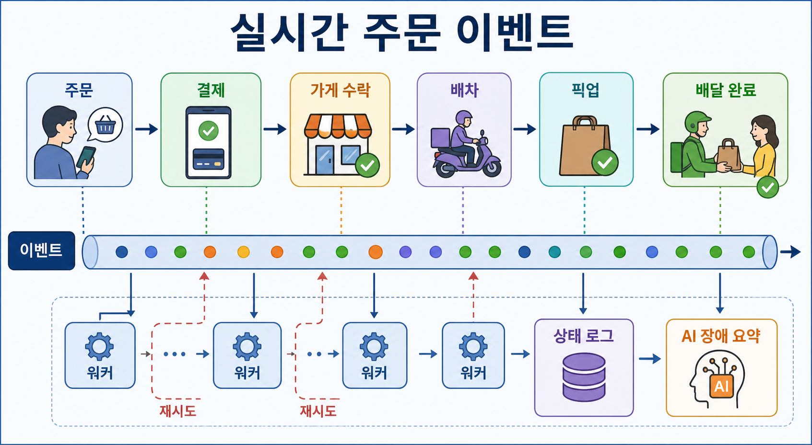
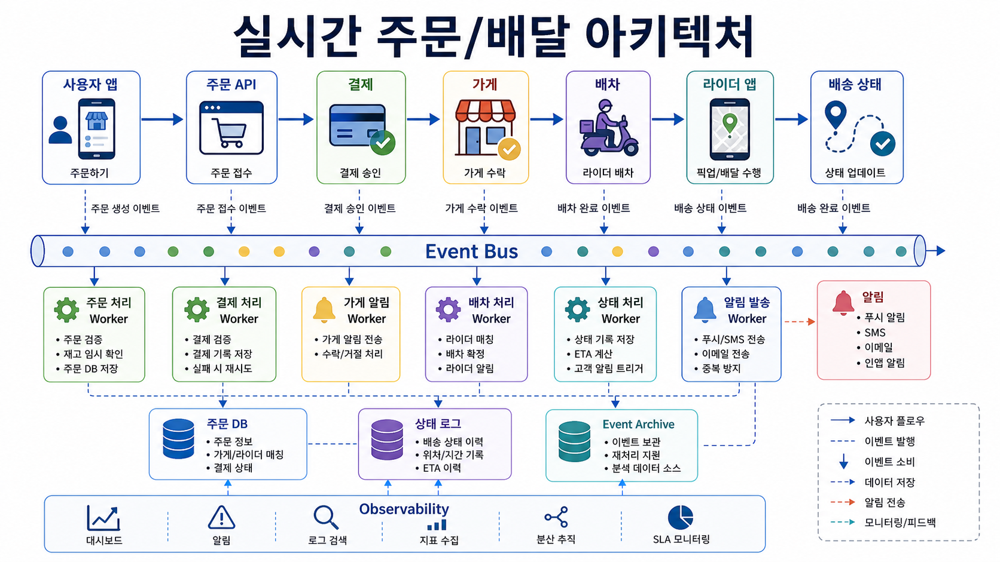
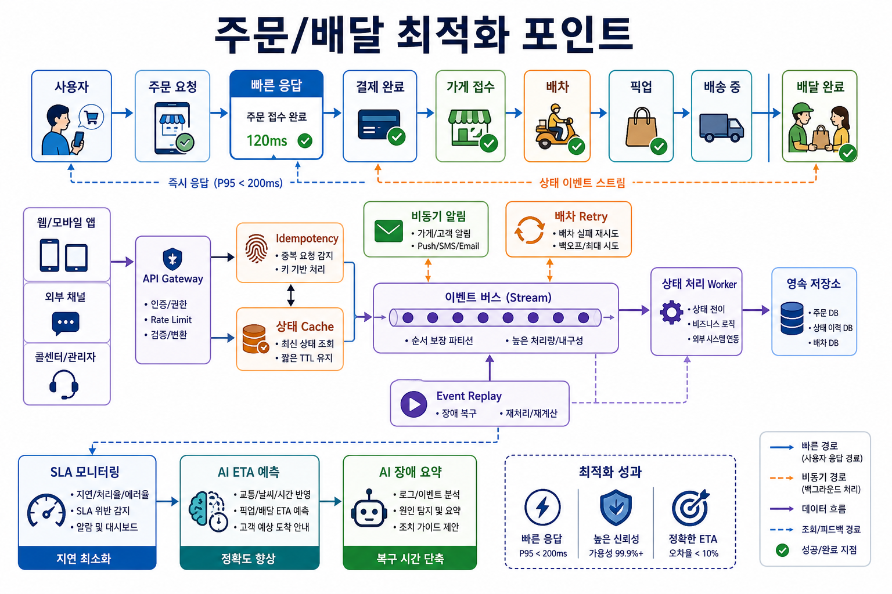

# 6교시: 우아한형제들 - 실시간 주문/배달 이벤트와 재처리

## 수업 목표
- 주문과 배달 상태 변화를 통해 실시간 이벤트 처리를 이해한다.
- retry, ordering, logs, monitoring이 왜 필요한지 설명한다.
- 빠른 사용자 피드백과 안정적인 background processing을 구분한다.

## 참고 자료
- 우아한형제들 기술블로그: https://techblog.woowahan.com/
- 우리 팀은 카프카를 어떻게 사용하고 있을까: https://techblog.woowahan.com/17386/

## 50분 운영
| 시간 | 활동 | 강사 초점 | 학생 산출 |
|---|---|---|---|
| 0-5분 | 배달 상태 hook | 학생이 익숙한 주문 상태로 시작한다. | status list |
| 5-15분 | 이벤트 순서 | 주문 생성, 결제 확인, 조리, 픽업, 배달 | event timeline |
| 15-25분 | Kafka 사례 읽기 | 대량 실시간 데이터 흐름을 처리한다. | source note |
| 25-35분 | 실패 시나리오 | 결제 성공 후 downstream event 실패 | retry note |
| 35-45분 | 로컬 실행 매핑 | API, worker, broker, logs, status page | runtime map |
| 45-50분 | Docker 연결 | Compose가 여러 서비스를 함께 실행하게 된다. | Docker 필요성 |

## 핵심 설명
배달 서비스는 상태 변화가 눈에 보이기 때문에 이해하기 쉽다. 주문 생성, 결제 승인, 가게 수락, 라이더 배정, 픽업, 배달 완료가 각각 이벤트가 될 수 있다. 중요한 것은 모든 일을 한 요청 안에서 끝내는 것이 아니라, 사용자에게 빠르게 알려줄 일과 뒤에서 안정적으로 처리할 일을 나누는 것이다.

## 시각 자료






## 서비스 특장점과 채용 동기 연결
- 우아한형제들형 배달 서비스의 강점은 주문, 가게, 라이더, 사용자 상태를 실시간에 가깝게 연결하는 것이다.
- 학생 입장에서는 "상태 변경"이 곧 이벤트이며, 이벤트가 많아지면 로그와 재처리가 핵심 운영 능력이 된다는 점을 볼 수 있다.
- 실시간 서비스는 빠른 응답과 정확한 최종 상태를 동시에 요구한다.

## AI 엔지니어링 연결
- AI는 배달 시간 예측, 수요 예측, 이상 주문 탐지, 장애 로그 요약, 고객 문의 자동 분류에 붙을 수 있다.
- 실시간 데이터가 AI 입력이 되면 event stream 품질과 지연시간이 곧 모델 품질과 사용자 경험에 영향을 준다.
- AI가 추천하거나 예측해도 최종 운영 책임은 로그, 모니터링, rollback, 수동 개입 절차에 남는다.

## 배달 이벤트 타임라인
| 이벤트 | 사용자에게 필요한 것 | 백그라운드 시스템이 해야 할 것 |
|---|---|---|
| order created | 주문 접수 표시 | 주문 저장 |
| payment confirmed | 결제 성공 표시 | 가게 서비스 알림 |
| store accepted | 조리 상태 표시 | 예상 시간 계산 |
| rider assigned | 배달 진행 표시 | 배차 상태 갱신 |
| delivered | 완료 표시 | 주문 종료와 분석 |

## 실패 시나리오 실습
```text
상황: 결제는 성공했지만 가게 알림 이벤트가 실패했다.

사용자에게 즉시 보여줄 것은?
재시도해야 할 이벤트는?
운영자가 먼저 볼 곳은?
잃어버리면 안 되는 데이터는?
어떤 component의 log가 필요한가?
```

## 체크포인트
- 5단계 이벤트 타임라인을 작성한다.
- retry 대상 1개를 찾는다.
- 이벤트 처리에서 log가 필요한 이유를 설명한다.

## 다음 연결
7교시는 모두가 동시에 클릭하는 폭주 트래픽으로 압력을 높인다.
