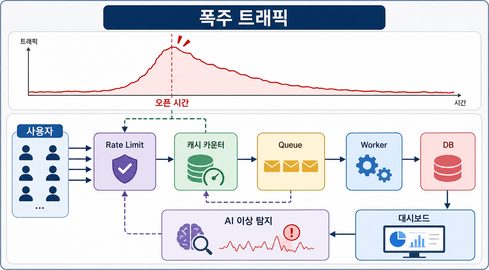
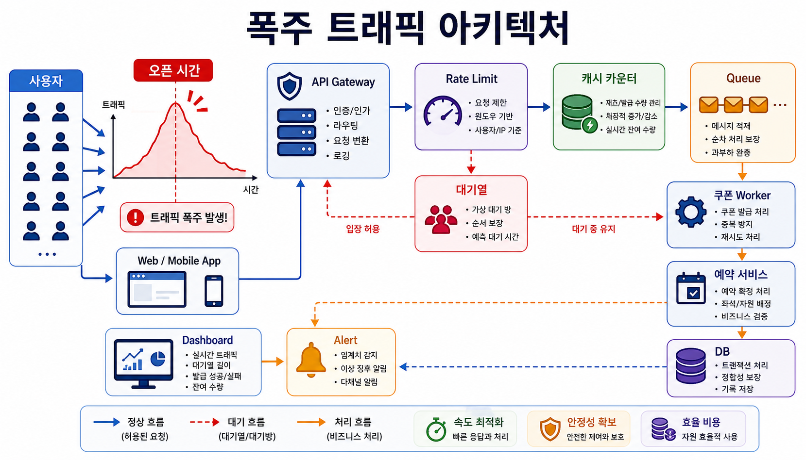
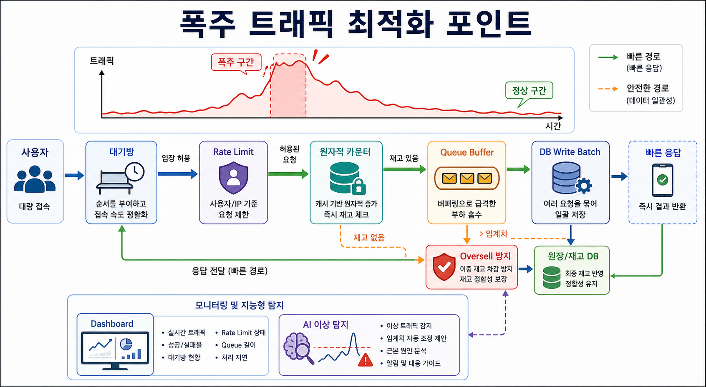

# 7교시: 여기어때 - 폭주 트래픽, 쿠폰, Redis, Kafka

## 수업 목표
- burst traffic이 평소 traffic과 왜 다른지 설명한다.
- cache, queue, rate control, dashboard가 사용자 경험을 보호하는 방식을 이해한다.
- 이벤트성 트래픽 테스트에는 반복 가능하고 지울 수 있는 환경이 필요함을 Docker와 연결한다.

## 참고 자료
- 여기어때 기술블로그: https://techblog.gccompany.co.kr/
- Redis & Kafka를 활용한 선착순 쿠폰 이벤트 개발기: https://techblog.gccompany.co.kr/redis-kafka%EB%A5%BC-%ED%99%9C%EC%9A%A9%ED%95%9C-%EC%84%A0%EC%B0%A9%EC%88%9C-%EC%BF%A0%ED%8F%B0-%EC%9D%B4%EB%B2%A4%ED%8A%B8-%EA%B0%9C%EB%B0%9C%EA%B8%B0-feat-%EB%84%A4%EA%B3%A0%EC%99%95-ec6682e39731
- 유저를 위한 시스템 개선기: https://techblog.gccompany.co.kr/%EC%9C%A0%EC%A0%80%EB%A5%BC-%EC%9C%84%ED%95%9C-%EC%8B%9C%EC%8A%A4%ED%85%9C-%EA%B0%9C%EC%84%A0%EA%B8%B0-2588880fbf12

## 50분 운영
| 시간 | 활동 | 강사 초점 | 학생 산출 |
|---|---|---|---|
| 0-5분 | 선착순 이벤트 hook | 모두가 경험해 본 스트레스 상황으로 시작한다. | event note |
| 5-15분 | 평시 traffic vs burst traffic | 평균 traffic은 피크 위험을 숨긴다. | traffic comparison |
| 15-25분 | 사례 읽기 | Redis와 Kafka가 쿠폰 발급 흐름을 보호한다. | source note |
| 25-35분 | 시스템 스케치 | request, limit check, queue, issue, dashboard | burst diagram |
| 35-45분 | 로컬 테스트 매핑 | disposable Redis/queue/test data가 필요하다. | test plan |
| 45-50분 | Docker 연결 | 테스트 환경을 반복 생성/정리할 수 있어야 한다. | Docker 필요성 |

## 핵심 설명
평균 traffic만 보면 이벤트 실패를 예측하기 어렵다. 하루 종일 안정적인 서비스도 쿠폰 오픈 1분 동안 무너질 수 있다. 폭주 traffic은 API 서버, DB write, cache consistency, queue lag, dashboard에 동시에 압력을 준다.

## 시각 자료






## 서비스 특장점과 채용 동기 연결
- 여기어때형 예약/이벤트 서비스의 강점은 짧은 시간 안에 많은 사용자가 몰리는 이벤트를 상품 경험으로 바꾸는 것이다.
- 학생 입장에서는 "사용자 이벤트"가 곧 트래픽 피크, 공정성, 데이터 정합성, 장애 대응 문제로 바뀐다는 것을 볼 수 있다.
- 선착순, 쿠폰, 예약은 단순 기능이 아니라 시스템 안정성과 비즈니스 신뢰가 걸린 기능이다.

## AI 엔지니어링 연결
- AI는 비정상 트래픽 탐지, 이벤트 성공률 예측, 장애 알림 우선순위화, 사용자 행동 분석에 붙을 수 있다.
- 폭주 상황에서는 AI 판단보다 먼저 rate limit, queue, cache counter 같은 deterministic control이 필요하다.
- AI 이상 탐지는 운영자를 돕는 보조 장치이며, 실제 방어선은 명시적인 제한과 재처리 구조다.

## traffic 비교
| traffic 유형 | 주요 위험 | 시스템 대응 |
|---|---|---|
| 평시 traffic | 완만한 증가 | 점진적 scale |
| 캠페인 traffic | 짧은 spike | rate control, queue |
| 선착순 traffic | 공정성, oversell | atomic count, lock |
| 예약 traffic | 중복 action | idempotency, validation |
| 결제 traffic | 데이터 손실 | transaction, retry |

## Burst event 설계
```text
Event:
Open time:
Maximum winners:
User action:
Fast check:
Queue message:
Final write:
Dashboard metric:
Failure to prevent:
```

## 체크포인트
- peak traffic이 average traffic과 다른 이유를 설명한다.
- 선착순 이벤트에서 cache와 queue 위치를 말한다.
- disposable environment가 필요한 이유 1개를 쓴다.

## 다음 연결
8교시는 AI/GPU 고성능 컴퓨팅으로 마무리한다.
